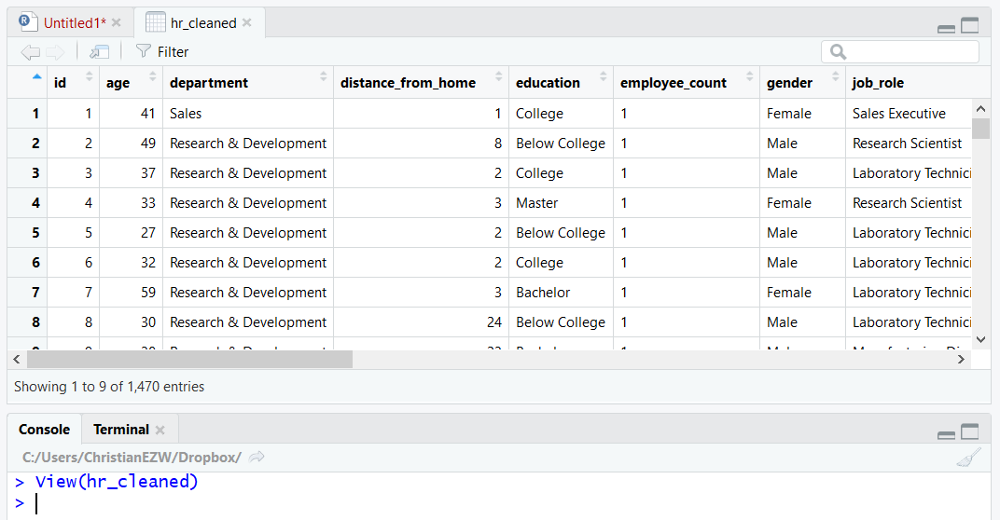
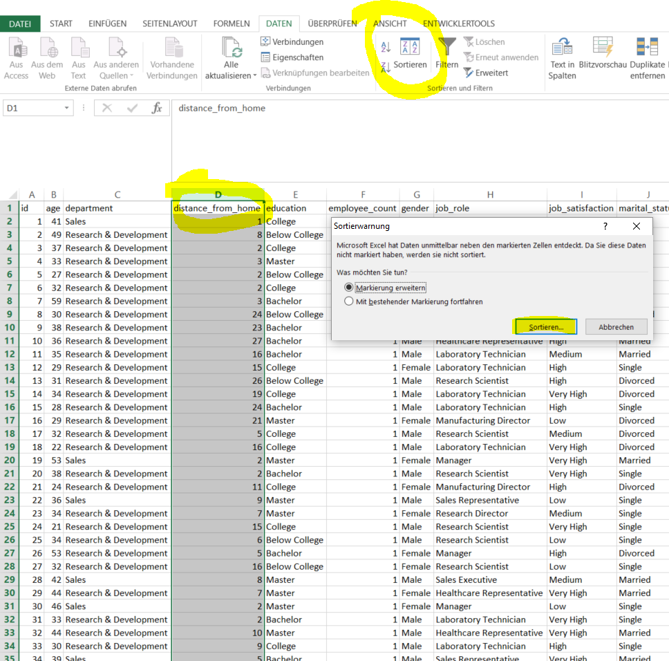
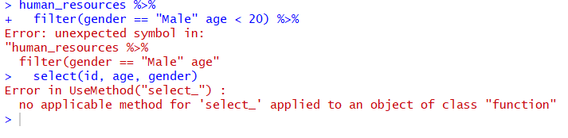
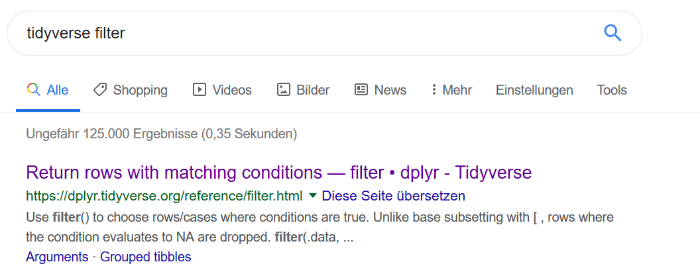
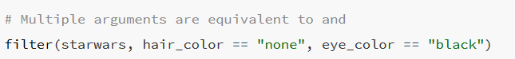

# Software

## Überblick der Software

Du wirst in diesem Kurs mit drei kostenfreien Softwares arbeiten:

* [R](https://www.r-project.org/): R ist eine statistische Programmiersprache zur Analyse von Daten
* [R-Studio](https://www.rstudio.com/): R-Studio ist eine Entwicklungsumgebung für die Programmiersprache R. Sie umfasst eine grafische Benutzeroberfläche und vereinfacht die Arbeit mit R.
* [Jamovi](https://www.jamovi.org/): Jamovi ist eine Software, mit der man die gängigsten statistischen Verfahrend in einer grafischen Benutzeroberfläche umsetzen kann. In diesem Kurs verwenden wir Jamovi zur Berechnung der Verfahren und werden [die Ergebnisse in R überführen](https://www.jamovi.org/jmv/). 

In der empirischen Forschung wird häufig [https://www.ibm.com/de-de/analytics/spss-statistics-software] zur Datenanalyse eingesetzt. SPSS ist allerdings kostenpflichtig und umfasst viele Verfahren, die wir zu Beginn nicht benötigen. Wird werden daher Jamovi für die Analysen verwenden. Zum einen, da Jamovi kostenlos ist und eine ähnliche Oberfläche wie SPSS hat. Zudem lässt sich Jamovi sehr einfach mit R integrieren. 

R verwenden wir in diesem Kurs für drei Zwecke:

1. Durch R werden wir Daten bereinigen, umstrukturieren und neu speichern. Häufig müssen Daten weiter verarbeitet werden, bevor damit statistische Verfahren berechnet werden können.

2. Durch R werden wir Daten visualisieren. Datenvisualisierung ist ein zentraler Bestandteil der Datenanalyse, da wir durch Visualisierungen Muster in Daten erkennen können, die aus den Rohdaten schwer zu entnehmen sind.

3. Durch R können wir unsere Datenanalyse dokumentieren. Die Dokumentation ist wichtig, da wir auch Jahre nach unserer Analyse verstehen möchten, wie wir die Daten ausgewertet haben. In SPSS oder Jamovi ist dies deutlich schwerer

### Weitere Informationen

* [Hadley Wickam - "You can't do data science in a GUI"](https://www.youtube.com/watch?v=cpbtcsGE0OA).
* [RopenSci - Reproducibility](https://ropensci.github.io/reproducibility-guide/sections/introduction/)

## Download der Software

* [R > 3.6.1](https://ftp.gwdg.de/pub/misc/cran/): Lade zunächst R in der Version 3.61 oder größer herunter.
* [R-Studio](https://www.rstudio.com/products/rstudio/download/): Lade anschließend die neueste Version von R-Studio herunter.
* [Jamovi 1.0.5 solid](https://www.jamovi.org/download.html). Zuletzt brauchen wir die neueste Version von Jamovi. Lade bitte die Version *1.0.5 solid* herunter.

## Weitere Informationen

* [Using Jamovi: Introduction](https://tysonbarrett.com//jekyll/update/2018/03/28/jamovi/)
* 


## Warum so viele Softwares?

Es ist heutzutage nicht mehr möglich, Statistik ohne Software zu betreiben. In diesem Kurs verwenden wir diejenigen Softwares, mit denen du am einfachsten statistische Verfahren berechnen und Daten auswerten kannst. 

* **Warum nicht alles in R?**: R hat zu Beginn häufig eine steile Lernkurve. Aus diesem Grund werden wir uns die ersten zwei Wochen intensiv mit R befassen. Viele statistische Verfahren lassen sich auch mit R berechnen (z.B. [psych](https://cran.r-project.org/web/packages/psych/index.html), [car](https://cran.r-project.org/web/packages/car/index.html)). Um ein einfaches Verfahren zu berechnen, muss man häufig mehrere Pakete installieren und diese kennen lernen. Wir vermeiden dies in diesem Kurs, indem wir die Analysen mit Jamovi umsetzen.
* **Warum nicht alles in SPSS?**: SPSS eignet sich sehr gut dafür, statistische Verfahren zu rechnen. SPSS ist allerdings kostenpflichtig. Da es kostenfreie Alternativen gibt, die alle Verfahren dieses Kurses abdecken, rechnen wir mit Jamovi. Wenn man Jamovi verstanden hat, ist der Transfer zu SPSS sehr einfach.
* **Warum überhaupt R?**: Keine Datenanalyse kommt ohne die Reinigung und die Veränderung von Daten aus. Stell dir beispielsweise vor, du möchtest statt `weiblich`, `female` in einem Datensatz schreiben. Solche Datenveränderungen lassen sich in R sehr elegant mit dem Paket [tidyverse](https://www.tidyverse.org/) lösen, welches wir umfassend in diesem Kurs verwenden werden. Zudem ermöglicht uns das Paket [ggplot2](https://ggplot2.tidyverse.org/), welches Teil des Paketes tidyverse ist, die Visualisierung von Daten. In Excel oder SPSS haben wir häufig nicht die volle Kontrolle, wie unsere Datenvisualisierungen aussehen sollen. Mit Hilfe von ggplot2 lassen sich [schöne Visualisierungen](http://r-statistics.co/Top50-Ggplot2-Visualizations-MasterList-R-Code.html) erstellen, die du beispielsweise in deiner Bachelorarbeit erstellen kannst. 


# Arbeiten mit R-Studio

## Überblick

R-Studio ist eine Entwicklungsumgebung für die Programmiersprache R. 


* **Skript (links oben)**: R umfasst vier zentrale Fenster. Links oben finden sich die Skripte. Dort wird der R-Code gespeichert, der für eine Analyse verwendet wird.
* **Konsole (links unten)**: In der Konsole werden Befehle ausgeführt. Du kannst dir die Konsole wie einen Übersetzer vorstellen. Im Skript schreibst du einen Text in einer Sprache auf (hier R), die Konsole übersetzt den Code und gibt das Ergebnis der Berechnungen aus. 
* **Environment/History/Connections (rechts oben)**: Diesen Bereich werden wir in diesem Kurs kaum benutzen. Im *Environment* siehst du, welche Variablen und Daten momentan aktiviert sind.
* **Output (rechts unten)**: Hier ist der Panel *Plots* am wichtisten. Dort werden dir die Visualisierungen angezeigt, die du in R schreiben wirst.


## Befehle in R ausführen

Befehle lassen sich sowohl in die Konsole als auch in Skripten notieren. Als Faustregel: Die Konsole dient dem *Herumspielen* mit den Daten, im Skript schreibst du alle Befehle auf, die du gerne behalten möchtest. 

### Befehle in der Konsole ausführen

Nehmen wir an, du möchtest die Zahl 5 mit der Zahl 8 addieren:


Um den Befehl auszuführen, drückst du anschließend die **ENTER-Taste**:


Anschließend erhältst du das Ergebnis der Berechnung. Der Output wird in schwarz angezeigt.

Um den Output wieder zu entfernen, kannst du die Tastenkombination **STRG+L* verwenden. Hierdurch verschwindet der Output:


Wenn du eine Grafik erstellst (den Code musst du an dieser Stelle nicht verstehen), wird der Output in dem **Plots Panel** angezeigt, ohne, dass du in der Konsole einen Output erhälst:


### Befehle in einem Skript ausführen

Genau die gleichen Befehle kannst du in einem Skript ausführen:


Um diesen Befehl auszuführen, musst du deinen Cursor auf diese Zeile legen und **STRG+ENTER** drücken:


Wenn du nicht die ENTER-Taste drückst, springt der Cursor einfach in die nächste Zeile, ohne, dass der Befehl ausgeführt wird. 

Alternativ kannst du die Zeile ausführen, indem die den Button **Run** drückst:


Um mehrere Zeilen ausführen, musst die alle Zeilen selektieren und dann erneut **STRG+ENTER** drücken:


## Pakete installieren und laden

### Pakete Überblick

Pakete sind eine Sammlung an Funktionen und Code, welche gebündet  herunter geladen werden können, um die Funktionalität von R zu erweitern. R hat bereits viele Funktionen, die wir für die Datenanalyse verwenden können. Beispielsweise umfasst R die Funktion [mean](https://www.rdocumentation.org/packages/base/versions/3.6.1/topics/mean), mit der wir Mittelwerte aus einer Variablen berechnen können. Selbst wenn R hunderte Funktionen hat, die mit R [mitgeliefert werden](https://stat.ethz.ch/R-manual/R-devel/library/base/html/00Index.html), brauchen wir häufig weitere Funktionen, um unsere Daten zu analysieren. Wir verwenden in diesem Seminar folgende Pakete:

* [tidyverse](https://www.tidyverse.org/): Tidyverse umfasst eine Vielzahl an Paketen zur Analyse und Verarbeitung von Daten. Die Pakete haben eine einheitliche Philosophy und arbeite daher sehr gut miteinander.
* [janitor](https://github.com/sfirke/janitor): Viele Daten, die wir erhalten sind unstrukturiert und haben seltsame Variablennamen. Mit dem Paket janitor können wir diese bereinigen.
* [jmv >= 0.9.6.1](https://cran.r-project.org/web/packages/jmv/index.html): jmv ist ein Paket, welches gut mit Jamovi zusammen arbeitet und uns ermöglicht, die Analysen, die wir in Jamovi umgesetzt haben, in R zu übertragen.

Du kannst zu jeder Zeit in R-Studio sehen, welche Pakete installiert sind, indem du dir den **Package Panel** anschaust (rechts unten):


### Pakete installieren

Um Pakete zu installieren, kannst du das in R-Studio integrierte Graphical User Interface (GUI) ausführen:


Trage zunächst das Paket unter Packages ein und drücke anschließend **Install**. Installiere sowohl *tidyverse*, *janitor*, und *jmv*.

Alternativ kannst du direkt den Befehl in die Konsole eingeben, um die Pakete zu installieren:

```R
install.packages("tidyverse")
# Dann
install.packages("janitor")
# Dann
install.packags("jmv")
```

Prüfe anschließend, ob alle Pakete installiert wurden. Suche hierfür die Pakete in dem Panel **Packages**:


Sollte das Paket nicht auftauchen, wurde das Paket nicht installiert. Suche dir in diesem Fall Hilfe bei unseren Tutoren.

### Weitere Informationen

* [R-Packages](https://www.statmethods.net/interface/packages.html)
* [How to Install, Load, and Unload Packages in R](https://www.dummies.com/programming/r/how-to-install-load-and-unload-packages-in-r/)

### Pakete laden

Um die Funktionalität eines Paketes verwenden zu können, müssen wir diese Pakete zunächst laden (am besten fügst du das Laden der Pakete immer am Anfang deines R-Skripts an):

```R
library(tidyverse)
```

Um zu prüfen, welche Pakete gerade geladen sind, kannst du den Befehl `sessionInfo()` ausführen:

```R
sessionInfo()
```

```
R version 3.5.1 (2018-07-02)
Platform: x86_64-w64-mingw32/x64 (64-bit)
Running under: Windows >= 8 x64 (build 9200)

Matrix products: default

locale:
[1] LC_COLLATE=German_Germany.1252  LC_CTYPE=German_Germany.1252   
[3] LC_MONETARY=German_Germany.1252 LC_NUMERIC=C                   
[5] LC_TIME=German_Germany.1252    

attached base packages:
[1] stats     graphics  grDevices utils     datasets  methods   base     

loaded via a namespace (and not attached):
[1] compiler_3.5.1 tools_3.5.1    yaml_2.2.0 
```

Unter loaded via namespace kannst du erkennen, welche Pakete gerade geladen sind. Nachdem du ein Paket ladest, ändert sich der Output:

```R
library(jmv)
```

```
R version 3.5.1 (2018-07-02)
Platform: x86_64-w64-mingw32/x64 (64-bit)
Running under: Windows >= 8 x64 (build 9200)

Matrix products: default

locale:
[1] LC_COLLATE=German_Germany.1252  LC_CTYPE=German_Germany.1252   
[3] LC_MONETARY=German_Germany.1252 LC_NUMERIC=C                   
[5] LC_TIME=German_Germany.1252    

attached base packages:
[1] stats     graphics  grDevices utils     datasets  methods   base     

other attached packages:
[1] jmv_0.9.6.1

loaded via a namespace (and not attached):
 [1] Rcpp_1.0.1       rstudioapi_0.8   bindr_0.1.1      magrittr_1.5    
 [5] tidyselect_0.2.5 munsell_0.5.0    colorspace_1.4-0 rjson_0.2.20    
 [9] R6_2.4.0         rlang_0.3.4      plyr_1.8.4       dplyr_0.7.8     
[13] tools_3.5.1      grid_3.5.1       jmvcore_1.0.0    gtable_0.2.0    
[17] yaml_2.2.0       lazyeval_0.2.1   assertthat_0.2.1 tibble_1.4.2    
[21] crayon_1.3.4     bindrcpp_0.2.2   purrr_0.2.5      ggplot2_3.1.0   
[25] glue_1.3.1       compiler_3.5.1   pillar_1.3.1     scales_1.0.0    
[29] pkgconfig_2.0.2  
```

Unter `other attached packages` siehst du nun `jmv`. Jmv lädt gleichzeitig viele andere Pakete (unter `loaded via a namespace`). 

Erst nachdem ein Paket geladen ist, kannst du die Funktionen der Pakete verwenden. Wenn du R-Studio neu startest, muss jedes Paket neu geladen werden. 

Um zu prüfen, aus welchem Paket eine Funktion stammt, setze ein Fragezeichen vor die Funktion. Anschließend siehst du die Dokumentation dieses Befehls in dem Panel **Help**:


## Daten importieren

### CSV-Dateien

In diesem Kurs arbeiten wir mit Daten, die in Tabellen angeordnet sind. Häufig liegen Daten als Excel-Dateien vor. Ein gängiges Format, um Daten zu speichern sind [CSV Dateien](https://de.wikipedia.org/wiki/CSV_(Dateiformat)). CSV steht für *Comma Seperated Values**. Dies bedeutet, dass Werte werden in CSV Dateien entweder durch ein Komma oder ein Semikolon getrennt sind:

```
id,variable1,variable2
ku22su99,2,3
nn08se21,5,6
```

CSV-Dateien lassen sich sowohl in Excel, Jamovi, SPSS oder R importieren:

* [Importieren oder Exportieren von Textdateien (TXT oder CSV)](https://support.office.com/de-de/article/importieren-oder-exportieren-von-textdateien-txt-oder-csv-5250ac4c-663c-47ce-937b-339e391393ba)
* [Daten aus .txt. und .csv in SPSS importieren](https://www.youtube.com/watch?v=-imCiECplPo)
* [Importing data - jamovi](https://www.youtube.com/watch?v=R0uE4LlHeac)

### CSV-Dateien in R importieren

Eine csv-Datei können wir in R einfügen, indem wir die Datei in dem Panel **Files** suchen und auf die Datei klicken:


Anschließend erhalten wir ein Fenster, in welchem der Code angezeigt wird, mit dem wir die Daten importieren können:


Wir benötigen nur die zweite Zeile des Codes (im Foto oben gelb markiert). Diesen fügst du in dein R-Skript ein. Achte darauf, dass du vorher das Paket tidyverse geladen hast:


Im nächsten Schritt liest du den Datensatz ein, indem du den Befehl ausführst:


Die rote Schrift hat keine Bedeutung. Sie zeigt an, welche Variablen der Datensatz umfasst. 

Um zu prüfen, ob der Datensatz in der Variable gespeichert wurde, gebe dir die Variable in der Konsole aus:


Gleichzeitig kannst du im Panel **Environment** sehen, ob dein Datensatz geladen wurde:


Der Output zeigt uns an, dass der Datensatz 1470 Reihen und 17 Variablen hat. 

> Der Name des Datensatzes ist im Übrigen willkürlich. Wir haben in diesem Fall den Datensatz `human_resources` genannt, er hätte genausogut `h_resources` oder `hr` heißen können.

# R

## Basics

### Grundlegende Operatoren

Lass uns ein grundlegende Operatoren kennen lernen. Du kannst in R einfache Berechnungen durch folgende Befehle durchführen:

Werte voneinander teilen:

```R
3 / 9 # 3
```

Das Produkt zweier Werte berechnen:

```R
3 * 4 # 12
```

Zwei Werte miteinander addieren:

```R
3 + 4 # 7
```

Mehrere Operatoren miteinander verschachteln:

```R
(3 / 9) * 4 + 3 # 4.3333
```

In R gelten die gleichen Rechenregeln, die wir in der Schule gelernt haben. Das Produkt wird vor der Summe berechnet.


### Variablen kreieren und benennen

Wir können Werte in Variablen speichern. Variablen kannst du dir wie Boxen bei einem Umzug vorstellen, die etwas enthalten. Jede Box bekommt ein Label, hier einen Variablennamen. Was in der Box steckt, kannst du erfahren, indem du die Box aufmachst, bzw. dir die Variable in R ausgeben lässt:

```R
sum_score <- 3 + 4
```

Jede Variable umfasst drei Elemente: 

1. **Den Variablennamen**: `sum_score`
2. **Den Zuordnungsoperator**: `<-`. Achte darauf, dass vor dem `<` und hinter dem `-` ein Leerzeichen steht. Ebenso sollte zwischen Operatoren ein Leerzeichen stehen. Falsch: `sum_score<-3+4`, falsch: `sum_score <- 3+4`, richtig: `sum_score <- 3 + 4`.
3. **Der Inhalt der Variable**: `3 + 4`. Der Inhalt kann im Prinzip alles sein: Text: `"Hallo"`, ein Datensatz: `read_csv(...)` oder der Output einer Funktion: `mean(c(1, 3, 4))`. 

Wenn du diesen Befehl ausführst, passiert zunächst nichts. Dir wird nicht das Ergebnis angezeigt, sondern R speichert intern das Produkt in der Variable `sum_score`. Um das Ergebnis der Berechnung zu sehen, führe die Variable in R aus:

```R
> sum_score
[1] 7
```

Variablennamen sollten immer verständlich geschrieben sein.

Schlecht:

```R
x <- 3 + 2
```

Besser:

```R
summe_zahlen <- 3 + 2
```

Trenne einzelne Wörter in der Variable mit einem Unterstrich:

```R
human_resources <- "Human Resources"
```

Nicht:

```R
human.resources <- "Human Resources"
# oder
human-resources <- "Human Resources"
# oder
human/resources <- "Human Resources"
```

Schreibe Variablen am besten alle in Kleinschreibung:

```R
human_resources <- "Human Resources"
# nicht:
Human_resources <- "Human Resources"
```

Variablen sollten exakt angegeben werden. Kleinste Fehler führen zu Fehlern:

```R
> human_resources <- "Human Resources"
> Human_resources
Error: object 'Human_resources' not found
```


### Funktionen ausführen

R hat eine Fülle an Funktionen, die immer den gleichen Aufbau haben:

```R
function_name(argument1 = value1, argument2 = value2)
```

* `function_name`: Dies ist der Name der Funktion.
* `argument1`: Funktionen haben immer Argumente. Ein Argument besagt, welche Daten in eine Funktion gespeist werden. Stell dir Funktionen wie eine Fabrik vor, die etwas herstellen. Jede Fabrik benötigt Rohmaterial, mit der Produkte erzeugt werden. Argumente sind äuqivalent zu Rohmateralien. Sie werden in die Funktion gespeist und in der Funktion verarbeitet.
* `value1`: Jedes dieser Rohmateralien hat bestimmte Werte. Beispielsweise kann `value1` eine Zahl (`3`) oder ein Text sein (`"Hallo"`). Wir werden später andere **Datentypen** kennen lernen, die ebenso in Funktionen gespeist werden können (z.B. Vektoren oder Dataframes - mehr dazu gleich). 

Beispielsweise umfasst R die Funktion `sqrt`, mit der wir das Quadrat einer Zahl berechnen können:

```R
sqrt(9) # 3
```

Mit Hilfe des `?` Zeichens können wir die Funktion näher betrachten uns uns ansehen, welche Argumente eine Funktion annimmt:


Die Funktion `sqrt` hat demnach nur ein Argument (hier eine Zahl - numeric).

Achte darauf, dass die jede Funktion mit einer Klammer schließt. Tust du dies nicht, denkt R, dass dein Befehl noch nicht zu Ende ist und zeigt dir dies mit einem `+` an:

```R
> sqrt(9
+ 
```

### Syntax

Code sollte immer leserlich geschrieben werden. Ein paar grundlegende Regeln solltest du beachten:

Verwende Leerzeichen zwischen Operatoren:

```R
3 + 3 # richtig
3+3   # falsch

my_data<-4 # falsch
my_data <- 4 # richtig

sqrt(x=9) # falsch
sqrt(x = 9) # richtig
```

Gebe Variablenen einen sinnvollen Namen und trenne Wörter in Variablen mit einem Unterstrich:

```R
meineVariable <- 3 # falsch
meine_variable <- 3 # richtig

00_variable <- 3 # falsch -> Variablen dürfen nicht mit einer Zahl beginnen
variable_null <- 3 # richtig

x <- "Mein Text" # falsch -> Was bedeutet x?
text_probanden <- "Mein Text" # richtig
```

Variablennamen sollten nicht zu lang sein:

```R
meine_ganz_lange_variable_mit_inhalt <- 3 # falsch
punktzahl <- 3 # richtig
```

Zeilen sollten nicht länger als 80 Zeichen haben. Sind die Zeilen zu lang, wird der Code unleserlich:

```R
4 * 3 + 3 + 5 + 7 + 2 + 3 + 4 * 3 + 3 + 5 + 7 + 2 + 3 + 3 + 3 + 5 + 7 + 2 + 3 -2 + 3 + 3 + 3 + 5 + 7 + 2 + 3 # falsch

4 * 3 + 3 + 5 + 7 + 2 + 3 + 4 * 3 + 3 + 
  5 + 7 + 2 + 3 + 3 + 3 + 5 + 7 + 2 + 
  3 -2 + 3 + 3 + 3 + 5 + 7 + 2 + 3  # besser
```

#### Weitere Informationen

* [The tidyverse style guide](https://style.tidyverse.org/)


## Grundlegende Befehle

Es gibt ein paar wenige Befehle, die du immer wieder in R benötigst. Gehen wir sie einzeln durch:

Mit [View](https://www.rdocumentation.org/packages/utils/versions/3.6.1/topics/View) kannst du dir den Datensatz in einem Excel-ähnlichen Format betrachten:

```R
View(human_resources)
```



Datensätze lassen sich ebenso mit der Funktion [glimpse]() betrachten. Glimpse stammt aus dem Paket **tidyverse**. Um diese Funktion auszuführen, solltest du zunächst tidyverse geladen haben:

```R
> glimpse(human_resources)
```

```
Observations: 1,470
Variables: 17
$ id                         <dbl> 1, 2, 3, 4, 5, 6, 7, 8, 9, 10, 11, 12, 13, 14, 15...
$ age                        <dbl> 41, 49, 37, 33, 27, 32, 59, 30, 38, 36, 35, 29, 3...
$ department                 <chr> "Sales", "Research & Development", "Research & De...
$ distance_from_home         <dbl> 1, 8, 2, 3, 2, 2, 3, 24, 23, 27, 16, 15, 26, 19, ...
$ education                  <chr> "College", "Below College", "College", "Master", ...
$ employee_count             <dbl> 1, 1, 1, 1, 1, 1, 1, 1, 1, 1, 1, 1, 1, 1, 1, 1, 1...
$ gender                     <chr> "Female", "Male", "Male", "Female", "Male", "Male...
$ job_role                   <chr> "Sales Executive", "Research Scientist", "Laborat...
$ job_satisfaction           <chr> "Very High", "Medium", "High", "High", "Medium", ...
$ marital_status             <chr> "Single", "Married", "Single", "Married", "Marrie...
$ monthly_income             <dbl> 5993, 5130, 2090, 2909, 3468, 3068, 2670, 2693, 9...
$ num_companies_worked       <dbl> 8, 1, 6, 1, 9, 0, 4, 1, 0, 6, 0, 0, 1, 0, 5, 1, 0...
$ performance_rating         <chr> "Excellent", "Outstanding", "Excellent", "Excelle...
$ total_working_years        <dbl> 8, 10, 7, 8, 6, 8, 12, 1, 10, 17, 6, 10, 5, 3, 6,...
$ work_life_balance          <chr> "Bad", "Better", "Better", "Better", "Better", "G...
$ years_at_company           <dbl> 6, 10, 0, 8, 2, 7, 1, 1, 9, 7, 5, 9, 5, 2, 4, 10,...
$ years_since_last_promotion <dbl> 0, 1, 0, 3, 2, 3, 0, 0, 1, 7, 0, 0, 4, 1, 0, 8, 0...
> 
```

Links siehst du die Variablen, rechts, die ersten Werte der einzelnen Variablen des Datensatzes.

Du kannst dir genausogut die Variablennamen mit der Funktion [colnames](https://stat.ethz.ch/R-manual/R-devel/library/base/html/colnames.html) ausgeben lassen:

```R
colnames(human_resources)
```

```
 [1] "id"                         "age"                       
 [3] "department"                 "distance_from_home"        
 [5] "education"                  "employee_count"            
 [7] "gender"                     "job_role"                  
 [9] "job_satisfaction"           "marital_status"            
[11] "monthly_income"             "num_companies_worked"      
[13] "performance_rating"         "total_working_years"       
[15] "work_life_balance"          "years_at_company"          
[17] "years_since_last_promotion"
```

Manchmal möchte man wissen, wie viele Reihen in einem Datensatz stecken. Hierfür kannst du die Funktion [nrow](https://www.rdocumentation.org/packages/base/versions/3.6.1/topics/nrow) verwenden:

```R
nrow(human_resources) # [1] 1470
```

Genausogut lassen sich die Anzahl der Variablen (bzw. Spalten) in einem Datensatz mit der Funktion [ncol](https://www.rdocumentation.org/packages/base/versions/3.6.1/topics/nrow) ausgeben lassen:

```R
ncol(human_resources) # [1] 17
```

Zuletzt benötigen wir noch die Funktion [head](https://www.rdocumentation.org/packages/utils/versions/3.6.1/topics/head). Mit Hilfe von `head` können wir uns die ersten Reihen eines Datensatzes ansehen:

```R
head(human_resources)
```

```
# A tibble: 6 x 17
     id   age department distance_from_h~ education employee_count gender job_role job_satisfaction
  <dbl> <dbl> <chr>                 <dbl> <chr>              <dbl> <chr>  <chr>    <chr>           
1     1    41 Sales                     1 College                1 Female Sales E~ Very High       
2     2    49 Research ~                8 Below Co~              1 Male   Researc~ Medium          
3     3    37 Research ~                2 College                1 Male   Laborat~ High            
4     4    33 Research ~                3 Master                 1 Female Researc~ High            
5     5    27 Research ~                2 Below Co~              1 Male   Laborat~ Medium          
6     6    32 Research ~                2 College                1 Male   Laborat~ Very High       
# ... with 8 more variables: marital_status <chr>, monthly_income <dbl>, num_companies_worked <dbl>,
#   performance_rating <chr>, total_working_years <dbl>, work_life_balance <chr>, years_at_company <dbl>,
#   years_since_last_promotion <dbl>
```

## Datentypen in R

### Vektoren

Datentypen sind ein seltsames Konzept, wenn man noch nicht programmiert hat. Datentypen sagen, in welcher Art Daten vorliegen. Hier ein Beispiel: R hat den Datentyp [Vector](https://www.statmethods.net/input/datatypes.html). Vektoren sind eine Sammlung mehrerer Werte, die miteinander gespeichert werden:

```R
c(3, 4, 5)
# oder
c(3, "hallo", 3.5)
# oder
c(9)
```

Wir sind vorhin bereits Vektoren begegnet als wir die Wurzel aus 9 berechnet haben:

```R
sqrt(c(9)) # 3
```
Jede einzelne Zahl ist bereit ein Vektor, eben ein Vektor mit nur einem Element. Vektoren enthalten gewöhnlich die gleiche Art von Daten:

```R
c(3, 3, 4) # atomarer numerischer Vektor
c(3, "hallo") # nicht-atomarer gemischter Vektor - werden wir nicht verwenden in diesem Kurs
```

Die Werte in Vektoren können in unterschiedlichen Formen vorliegen:

```R
c("Ich", "bin", "ein", "Berliner") # character vector (char) Textabschnitte mit " umrundet
c(3, 4, 5, 6) # numeric integer vector (dbl) - Zahlen
c(4.1, 4, 6.8) # numeric double vector (dbl) -  Zahlen mit Nachkommastellen
c(TRUE, FALSE, TRUE) # logical vector (lgl)
```

Diese verschiedenen Vektorformen siehst du, wenn du dir einen Datensatz mit der Funktion `glimpse` betrachtest:

```R
> glimpse(human_resources)
```

```
Observations: 1,470
Variables: 17
$ id                         <dbl> 1, 2, 3, 4, 5, 6, 7, 8, 9, 10, 11, 12, 13, 14, 15...
$ age                        <dbl> 41, 49, 37, 33, 27, 32, 59, 30, 38, 36, 35, 29, 3...
$ department                 <chr> "Sales", "Research & Development", "Research & De...
$ distance_from_home         <dbl> 1, 8, 2, 3, 2, 2, 3, 24, 23, 27, 16, 15, 26, 19, ...
$ education                  <chr> "College", "Below College", "College", "Master", ...
$ employee_count             <dbl> 1, 1, 1, 1, 1, 1, 1, 1, 1, 1, 1, 1, 1, 1, 1, 1, 1...
$ gender                     <chr> "Female", "Male", "Male", "Female", "Male", "Male...
$ job_role                   <chr> "Sales Executive", "Research Scientist", "Laborat...
$ job_satisfaction           <chr> "Very High", "Medium", "High", "High", "Medium", ...
$ marital_status             <chr> "Single", "Married", "Single", "Married", "Marrie...
$ monthly_income             <dbl> 5993, 5130, 2090, 2909, 3468, 3068, 2670, 2693, 9...
$ num_companies_worked       <dbl> 8, 1, 6, 1, 9, 0, 4, 1, 0, 6, 0, 0, 1, 0, 5, 1, 0...
$ performance_rating         <chr> "Excellent", "Outstanding", "Excellent", "Excelle...
$ total_working_years        <dbl> 8, 10, 7, 8, 6, 8, 12, 1, 10, 17, 6, 10, 5, 3, 6,...
$ work_life_balance          <chr> "Bad", "Better", "Better", "Better", "Better", "G...
$ years_at_company           <dbl> 6, 10, 0, 8, 2, 7, 1, 1, 9, 7, 5, 9, 5, 2, 4, 10,...
$ years_since_last_promotion <dbl> 0, 1, 0, 3, 2, 3, 0, 0, 1, 7, 0, 0, 4, 1, 0, 8, 0...
> 
```

Du siehst beispielsweise, dass die Variable `education` als **chr**, das bedeutet als Text gespeichert ist.

Vektoren sind der grundlegende Datentyp aus dem andere Datentypen entstehen. Beispielsweise sind Dataframes nur besondere Arten von Vektoren.

### Dataframes

Dataframes sind diejenigen Datentypen mit denen wir uns am meisten beschäftigen werden. Dataframes sind Daten, welche in einem Excel-ähnlichem Format vorliegen:

```R
my_data_frame <- data.frame(x = c(1, 3, 4),
                            y = c(4, 5, 6))
```

Wir können auf einzelne Variablen eines Dataframes zugreifen, indem wir den `$`-Operator verwenden:

```R
human_resources$age # [1] 41 49 37 33 27 32 ...
```

Dieser Operator ist wichtig, um beispielsweise den Mittelwert einer Variblen zu berechnen:

```R
mean(human_resources$age) # 36.92381
```

Oder auch um die Standardabweichung einer Variable zu berechnen:

```R
sd(human_resources$age) # 9.135373
```

### Weitere Informationen

* [Quick-R Data Types](https://www.statmethods.net/input/datatypes.html)
* [R for Data Science - Vectors](https://r4ds.had.co.nz/vectors.html)


## Pipe-Operator

Häufig führen wir nur eine Funktion aus. Was passiert allerdings, wenn wir mehrere Funktionen gleichzeitig ausführen müssen. Hier ein Beispiel: Stell dir vor, du möchtest aus einem Vektor den Mittelwert berechnen, aus dem Mittelwert anschließend die Wurzel ziehen und diesen Wert mit der Zahl 5 addieren. Dies wäre ein möglicher Lösungsweg:

```R
sum(sqrt(mean(c(4, 5, 6))), 5) # 7.236068
```

Das sieht nicht nur kompliziert aus, es ist auch kompliziert. Es ist nur schwer zu erkennen, welche Klammer zu welcher Funktion gehört. Alternativ könnten wir die Daten in Variablen speichern:

```R
mittelwert <- mean(c(4, 5, 6))
wurzel <- sqrt(mittelwert)
sum(wurzel, 5)
```

Die Lösung ist bereits eleganter, aber immer noch perfekt, da wir Variablen einführen, die wir später gar nicht mehr benötigen. Wir möchten nur das Ergebnis wissen. Eine Alternative, dieses Problem zu lösen, ist der [Pipe-Operator](https://r4ds.had.co.nz/pipes.html). Das Problem von eben können wir durch diesen Operator folgendermaßen lösen:

```R
mean(c(4, 5, 6)) %>%
  sqrt(.) %>%
  sum(., 5)
```

Was passiert hier? Die Idee ist folgende: Jede Funktion nimmt Daten auf, verarbeitet diese und gibt diese weiter. Eine Analogie wären erneut Fabriken. Die erste Fabrik fällt Holz und fertigt aus diesem Holz Bretter an. Holz ist der Input der Fabrik, Bretter der Output. Diese Bretter werden nun an die nächste Fabrik geschickt, welche anschließend die Bretter schleift. Diese geschliiffenen Bretter gehen anschließen an den Gitarrenbauer, der aus den geschliffenen Brettern eine Gitarre baut. Das Prinzip ist folgendes: Es gibt eine serielle Verarbeitung der Produkte. 

Genauso funktioniert der Pipe-Operator. Er übergibt den Output einer Funktion in die nächste Funktion. Hier ein einfaches Beispiel:

```R
mean(c(9, 10, 8)) %>%
  sqrt(.) # 3
```

Die Funktion `mean(c(9, 10, 8))` berechnet den Mittelwert aus dem Vektor mit den Zahlen 9, 10, 8 (= 9). Diese Zahl 9 wird an die Funktion `sqrt` übergeben. Du siehst, dass in der Funktion `sqrt(.)` ein Punkt notiert ist. Dieser Punkt steht für den Output der vorherigen Funktion (hier `mean`). Wir könnten diesen Punkt auch weglassen:

```R
mean(c(9, 10, 8)) %>%
  sqrt() # 3
```

Ein anderes Beispiel: Wir berechnen die Summe aus zwei Zahlen mit der Funktion `sum`. Die erste Zahl der Summe übergeben wir allerdings mit Hilfe des Pipe-Operators:

```R
3 %>% sum(., 3) # 6
# oder
3 %>% sum(3) # 6
```

Dies ist äquivalent zu:

```R
sum(3, 3) # 6
```

Der Vorteil des Pipe-Operators wird erst im Verlaufe des Kurses deutlich, wenn wir mehrere Manipulationen an Daten vornehmen. Hier nur ein komplexeres Beispiel, welches wir mit unserem aktuellen Wissen lösen können:

```R
human_resources %>%
  head %>%
  glimpse
```

Folgendes passiert in diesem Beispiel: Wir geben uns den Output unseres Datensatzes aus (`human_resources`). Diesen Output überführen wir in die Funktion `head`, welche uns nur die ersten Reihen des Datensatzes anzeigt. Für diesen verkürzten Datensatz führen wir anschließend die Funktion `glimpse` aus, um uns die Variablen des Datensatzes anzusehen.

> Der Pipe Operator ist häufig schwierig mit der Tastatur zu schreiben. In R-Studio gibt es einen Shortcut: **STRG + Umschalt + M**. Dies ist ein Shortcut, den es sich lohnt zu lernen.

### Weiteführende Informationen

* [Magrittr - Pipe](https://magrittr.tidyverse.org/reference/pipe.html)
* [Pipes in R Tutorial For Beginners](https://www.datacamp.com/community/tutorials/pipe-r-tutorial)


## Tidyverse

### Was ist tidyverse?

Tidyverse ist eine Vielzahl an Paketen, welche vor allem von [Hadley Wickam](http://hadley.nz/) entwickelt wurde. Hadley Wickam ist der Chief Data Scientist bei R-Studio und hat sich zur Aufgabe gemacht, die Analyse von Daten in R zu vereinfachen. Alle Pakete haben eine einheitliche Philosophie und arbeiten sehr gut miteinander. Hierdurch kannst du sehr schnell Daten analysieren und verarbeiten. 

Hier ein kurzes Beispiel, welches du am Ende dieser Einheit verstehen wirst:

```R
human_resources %>% 
  filter(gender == "Female") %>% 
  arrange(desc(monthly_income)) %>% 
  select(id, age, monthly_income, job_satisfaction) %>% 
  head
```

```
# A tibble: 6 x 4
     id   age monthly_income job_satisfaction
  <dbl> <dbl>          <dbl> <chr>           
1   747    41          19973 High            
2   852    56          19943 Low             
3   166    50          19926 Medium          
4   750    52          19845 Very High       
5  1010    58          19701 Low             
6  1155    47          19658 High   
```

Hier haben wir folgendes gemacht: Zunächst haben wir den Datensatz gefiltert, so dass nur Frauen im Datensatz sind. Danach haben wir alle Frauen nach ihrem monatlichen Einkommen absteigend sortiert. Im Anschluss haben wir ein paar Variablen aus dem Datensatz entnommen und nur die ersten Werte dieses Datensatzes angezeigt.

Du siehst, dass die Vokabeln der Funktion genau das tun, was wir uns ausdenken. Du siehst auch, dass wir viel Gebrauch vom Pipe-Operator machen, um die Daten zu analysieren. 

tidyverse umfasst unter anderem folgende Pakete:

* [ggplot2](https://ggplot2.tidyverse.org/): ggplot2 dient der Visualisierung von Daten.
* [dplyr](https://dplyr.tidyverse.org/): Mit Hilfe von dplyr können wir Daten umstrukturieren.
* [tidyr](https://tidyr.tidyverse.org/): Mit Hilfe von tidyr können wir Daten bereinigen. 


Gehen wir als nächstes die grundlegenden Funktionen durch.

### Count

Mit Hilfe von [count](https://dplyr.tidyverse.org/reference/tally.html) können wir das Aufkommen von nominalskalierten Daten zählen. Beispielsweise: Wie viele Frauen und Männer sind im Datensatz? 

```R
human_resources %>% 
  count(gender)
```

```
# A tibble: 2 x 2
  gender     n
  <chr>  <int>
1 Female   588
2 Male     882
```

Oder: Wie viele Frauen und Männer sind in der jeweiligen Abteilung? 

```R
human_resources %>% 
  count(gender, department)
```

```
# A tibble: 6 x 3
  gender department                 n
  <chr>  <chr>                  <int>
1 Female Human Resources           20
2 Female Research & Development   379
3 Female Sales                    189
4 Male   Human Resources           43
5 Male   Research & Development   582
6 Male   Sales                    257
```

Oder: Wie werden die Mitarbeiter von ihren Vorgesetzten bewertet? 

```R
human_resources %>% 
  count(performance_rating)
```

```
# A tibble: 2 x 2
  performance_rating     n
  <chr>              <int>
1 Excellent           1244
2 Outstanding          226
```

### arrange

Mit der [arrange Funktion](https://dplyr.tidyverse.org/reference/arrange.html) können wir Daten sortieren. Die Funktion ähnelt der Sortierungsfunktion bei Excel:



Bei Excel weiß man nur nicht immer so recht, was *Markierung erweitern* bedeutet und ob die Sortierung auch geklappt hat. Das gleiche funktioniert durch die `arrange` Funktion folgendermaßen:

```R
human_resources %>% 
  arrange(age)
```

```
# A tibble: 1,470 x 17
      id   age department distance_from_h~ education employee_count gender job_role job_satisfaction
   <dbl> <dbl> <chr>                 <dbl> <chr>              <dbl> <chr>  <chr>    <chr>           
 1   297    18 Research ~                3 Bachelor               1 Male   Laborat~ High            
 2   302    18 Sales                    10 Bachelor               1 Female Sales R~ High            
 3   458    18 Sales                     5 Bachelor               1 Male   Sales R~ Medium          
 4   728    18 Research ~                5 College                1 Male   Researc~ Very High       
 5   829    18 Research ~                8 Below Co~              1 Male   Laborat~ High            
 6   973    18 Research ~                1 Bachelor               1 Female Laborat~ Very High       
 7  1154    18 Sales                     3 College                1 Female Sales R~ Very High       
 8  1312    18 Research ~               14 Bachelor               1 Female Researc~ High            
 9   128    19 Sales                    22 Below Co~              1 Male   Sales R~ High            
10   150    19 Research ~                3 Below Co~              1 Female Laborat~ Medium          
# ... with 1,460 more rows, and 8 more variables: marital_status <chr>, monthly_income <dbl>,
#   num_companies_worked <dbl>, performance_rating <chr>, total_working_years <dbl>, work_life_balance <chr>,
#   years_at_company <dbl>, years_since_last_promotion <dbl>
```

In diesem Fall sind die Werte von klein nach groß angeordnet. Wir können dies umdrehen, indem wir den Variablennamen in die Funktion `desc` packen:

```R
human_resources %>% 
  arrange(desc(age))
```

```
# A tibble: 1,470 x 17
      id   age department distance_from_h~ education employee_count gender job_role job_satisfaction
   <dbl> <dbl> <chr>                 <dbl> <chr>              <dbl> <chr>  <chr>    <chr>           
 1   412    60 Research ~                7 Bachelor               1 Female Manager  Low             
 2   428    60 Sales                    28 Bachelor               1 Female Sales E~ Low             
 3   537    60 Sales                    16 Master                 1 Male   Sales E~ Low             
 4   880    60 Sales                     7 Master                 1 Male   Sales E~ Very High       
 5  1210    60 Research ~                1 Master                 1 Male   Healthc~ Very High       
 6     7    59 Research ~                3 Bachelor               1 Female Laborat~ Low             
 7    64    59 Sales                    25 Bachelor               1 Female Sales E~ Low             
 8    71    59 Sales                     1 Below Co~              1 Female Sales E~ High            
 9   106    59 Human Res~                2 Master                 1 Female Manager  Very High       
10   226    59 Research ~                3 Bachelor               1 Male   Researc~ Very High       
# ... with 1,460 more rows, and 8 more variables: marital_status <chr>, monthly_income <dbl>,
#   num_companies_worked <dbl>, performance_rating <chr>, total_working_years <dbl>, work_life_balance <chr>,
#   years_at_company <dbl>, years_since_last_promotion <dbl>
```

Nun siehst du, dass die Variable `age` von groß nach klein geordnet ist. Wir können auch mehrere Variablen sortieren:


```R
human_resources %>% 
  arrange(age, distance_from_home)
```

```
# A tibble: 1,470 x 17
      id   age department distance_from_h~ education employee_count gender job_role job_satisfaction
   <dbl> <dbl> <chr>                 <dbl> <chr>              <dbl> <chr>  <chr>    <chr>           
 1   973    18 Research ~                1 Bachelor               1 Female Laborat~ Very High       
 2   297    18 Research ~                3 Bachelor               1 Male   Laborat~ High            
 3  1154    18 Sales                     3 College                1 Female Sales R~ Very High       
 4   458    18 Sales                     5 Bachelor               1 Male   Sales R~ Medium          
 5   728    18 Research ~                5 College                1 Male   Researc~ Very High       
 6   829    18 Research ~                8 Below Co~              1 Male   Laborat~ High            
 7   302    18 Sales                    10 Bachelor               1 Female Sales R~ High            
 8  1312    18 Research ~               14 Bachelor               1 Female Researc~ High            
 9   172    19 Sales                     1 Below Co~              1 Female Sales R~ Low             
10   178    19 Research ~                2 Bachelor               1 Male   Laborat~ Very High       
# ... with 1,460 more rows, and 8 more variables: marital_status <chr>, monthly_income <dbl>,
#   num_companies_worked <dbl>, performance_rating <chr>, total_working_years <dbl>, work_life_balance <chr>,
#   years_at_company <dbl>, years_since_last_promotion <dbl>
```

Du siehst nun, dass innerhalb eines Alters auch die Variable `distance_from_home` von klein nach groß angeordnet wurde.

### select

Viele Datensätze haben viele Variablen. Manchmal möchten wir den Überblick behalten und uns nur ein paar wenige Variablen ansehen. Hierfür benutzen wir die [select Funktion](https://dplyr.tidyverse.org/reference/select.html).

Selektieren wir beispielsweise aus unserem Datensatz nur die Variblen `id` und `age`:

```R
human_resources %>% 
  select(id, age)
```

```
# A tibble: 1,470 x 2
      id   age
   <dbl> <dbl>
 1     1    41
 2     2    49
 3     3    37
 4     4    33
 5     5    27
 6     6    32
 7     7    59
 8     8    30
 9     9    38
10    10    36
# ... with 1,460 more rows
```

Wir können ebenso manche Variablen aus einem Datensatz entfernen, indem wir ein `-` vor die Variable setzen:

```R
human_resources %>% 
  select(id, age, gender) %>%
  select(-gender)
```

```
# A tibble: 1,470 x 2
      id   age
   <dbl> <dbl>
 1 human_resources %>% 
  filter(gender == "Male") %>% 
  select(id, gender)    1    41
 2     2    49
 3     3    37
 4     4    33
 5     5    27
 6     6    32
 7     7    59
 8     8    30
 9     9    38
10    10    36
# ... with 1,460 more rows
```

Hierdurch wird der gleiche Output generiert. Der Unterschied zum vorherigen Beispiel besteht darin, dass wir zunächst drei Variablen selektieren und danach die dritte Variable wieder aus dem Datensatz entfernen. 

Wir können ebenso mehrere Variablenen, die nebeneinander liegen verbinden, indem wir die erste Variable und die letzte Variable angeben und dazwischen ein `:` setzen:

```R
human_resources %>% 
  select(id:education)
```

```
# A tibble: 1,470 x 5
      id   age department             distance_from_home education    
   <dbl> <dbl> <chr>                               <dbl> <chr>        
 1     1    41 Sales                                   1 College      
 2     2    49 Research & Development                  8 Below College
 3     3    37 Research & Development                  2 College      
 4     4    33 Research & Development                  3 Master       
 5     5    27 Research & Development                  2 Below College
 6     6    32 Research & Development                  2 College      
 7     7    59 Research & Development                  3 Bachelor     
 8     8    30 Research & Development                 24 Below College
 9     9    38 Research & Development                 23 Bachelor     
10    10    36 Research & Development                 27 Bachelor     
# ... with 1,460 more rows
```

Wenn du die Daten so selektieren möchtest, hilft es, zunächst mit `colnames` zu schauen, welche Variablen nebeneinander liegen:

```R
colnames(human_resources)
```

```
[1] "id"                         "age"                        "department"                
 [4] "distance_from_home"         "education"                  "employee_count"            
 [7] "gender"                     "job_role"                   "job_satisfaction"          
[10] "marital_status"             "monthly_income"             "num_companies_worked"      
[13] "performance_rating"         "total_working_years"        "work_life_balance"         
[16] "years_at_company"           "years_since_last_promotion"
```


### filter

Mit [filter](https://dplyr.tidyverse.org/reference/filter.html) können wir einzelne Reihen filtern. Beispielsweise können wir mit `filter` einen Datensatz um alle Personen filtern, die männlich sind:

```R
human_resources %>% 
  filter(gender == "Male") %>% 
  select(id, gender)
```

```
# A tibble: 882 x 2
      id gender
   <dbl> <chr> 
 1     2 Male  
 2     3 Male  
 3     5 Male  
 4     6 Male  
 5     8 Male  
 6     9 Male  
 7    10 Male  
 8    11 Male  
 9    13 Male  
10    14 Male  
# ... with 872 more rows
```

> Wenn du nach exakten Werte filterst wie beipsielsweise das Geschlecht, musst du zwei `==` verwenden.

Oder wir filtern den Datensatz um alle Personen, die mindestens 28 Jahre alt sind:

```R
human_resources %>% 
  filter(age > 28) %>% 
  select(id, age)
```

```
# A tibble: 1,212 x 2
      id   age
   <dbl> <dbl>
 1     1    41
 2     2    49
 3     3    37
 4     4    33
 5     6    32
 6     7    59
 7     8    30
 8     9    38
 9    10    36
10    11    35
# ... with 1,202 more rows
```

Wir können ebenso nach mehreren Werten filtern, indem wir die Filterkritieren mit einem `,` trennen:

```R
human_resources %>% 
  filter(gender == "Male", age < 20) %>% 
  select(id, age, gender)
# oder
human_resources %>% 
  filter(gender == "Male" & age < 20) %>% 
  select(id, age, gender)
```

```
# A tibble: 9 x 3
     id   age gender
  <dbl> <dbl> <chr> 
1   128    19 Male  
2   178    19 Male  
3   297    18 Male  
4   423    19 Male  
5   458    18 Male  
6   689    19 Male  
7   728    18 Male  
8   829    18 Male  
9   854    19 Male 
```

### mutate

Mit [mutate](https://dplyr.tidyverse.org/reference/mutate.html) erstellen wir neue Variablen in einem Datensatz:

```R
human_resources %>% 
  mutate(
    yearly_income = monthly_income * 12
  ) %>% 
  select(id, monthly_income, yearly_income)
```


```
# A tibble: 1,470 x 3
      id monthly_income yearly_income
   <dbl>          <dbl>         <dbl>
 1     1           5993         71916
 2     2           5130         61560
 3     3           2090         25080
 4     4           2909         34908
 5     5           3468         41616
 6     6           3068         36816
 7     7           2670         32040
 8     8           2693         32316
 9     9           9526        114312
10    10           5237         62844
# ... with 1,460 more rows
```

Zunächst muss der Name der neuen Variable benannt werden (`yearly_income`). Anschließend folgt ein `=`. Hinter dem `=` kann die neue Variable berechnet werden. Möchte man mehrere neue Variablen einfügen, kann man die Befehle mit einem Komma trennen:

```R
human_resources %>% 
  mutate(
    yearly_income        = monthly_income * 12,
    salary_above_average = yearly_income > mean(yearly_income)
  ) %>% 
  select(id, monthly_income, yearly_income,
         salary_above_average)
```

```
# A tibble: 1,470 x 4
      id monthly_income yearly_income salary_above_average
   <dbl>          <dbl>         <dbl> <lgl>               
 1     1           5993         71916 FALSE               
 2     2           5130         61560 FALSE               
 3     3           2090         25080 FALSE               
 4     4           2909         34908 FALSE               
 5     5           3468         41616 FALSE               
 6     6           3068         36816 FALSE               
 7     7           2670         32040 FALSE               
 8     8           2693         32316 FALSE               
 9     9           9526        114312 TRUE                
10    10           5237         62844 FALSE               
# ... with 1,460 more rows
```

## Daten exportieren

Wir werden in diesem Kurs mehrmals Daten bereinigen und verändern und möchten diese Daten anschließend wieder in einer CSV-Datei speichern. Hierfür benutzen wir die [write_csv](https://readr.tidyverse.org/reference/write_delim.html) Funktion. Stell dir vor, wir wählen lediglich drei Variablen aus dem Datensatz aus und filtern die Daten um alle Frauen im Datensatz. Anschließend möchten wir diese Daten in einer CSV-Datei speichern:

```R
human_resources %>% 
  filter(gender == "Female") %>% 
  select(id, age, monthly_income) %>% 
  write_csv("hr_updated.csv")
```

Die Funktion `write_csv` hat zwei wichtige Argumente:

```
write_csv(x, path)
```

* x steht für den Datensatz, den wir der Funktion überführen
* path steht für den Dateinamen in denen wir die Datei speichern. Achte darauf, diesen Pfad immer mit Anführungsstrichen `"` zu umrunden.

Wir hätten ebenso das Ergebnis der Berechnung zwischenspeichern und diesen anschließend in die Datei schreiben können. Hierdurch hätten wir allerdings unnötig eine neue Variable erzeugt:

```R
unnoetige_variable <- human_resources %>% 
  filter(gender == "Female") %>% 
  select(id, age, monthly_income) 

write_csv(unnoetige_variable, "hr_updated.csv")
```

> R speichert die Datei immer in das aktuelle Arbeitsverzeichnis. Dieses kannst du verändern, indem du mit dem Shortcut STRG + Umschalt + H das Arbeitsverzeichnis wechselst. In diesen Ordner wird die Datei anschließend gespeichert.


### Weiterführende Informationen

* [Haven - Export von Daten in SPSS](https://haven.tidyverse.org/)

## Mit Fehlern in R umgehen

Fehler werden passieren, wenn du mit R arbeitest. 

### Beispiel Fehler tidyverse

Stell dir vor, dir gibt R folgenden Fehler aus:



Zunächst ist es wichtig zu erkennen, in welcher Zeile der Fehler auftritt. Der erste Fehler (`Error: unexpected symbol in:`) erscheint nach der Funktion `filter`. Im nächsten Schritt hilft es häufig, die Dokumentation der Funktion anzuschauen. Für alle Probleme, die mit Tidyverse zu tun, haben, hilft es diese direkt zu googlen:



Im Anschluss suchst du dir ein Beispiel, welches ähnlich wie deines ist:



Um den Fehler zu sehen, muss man genau hinschauen. Der Fehler wird erzeugt, da ein `,` nach der ersten Filterbedingung fehlt:

```R
human_resources %>% 
  filter(gender == "Male" age < 20) %>%
  select(id, age, gender) # falsch

human_resources %>% 
  filter(gender == "Male", age < 20) %>%
  select(id, age, gender) # richtig
```

### Generelle Regeln

Fehler können nervenaufreibend sein, insbesondere wenn die Lösung nach Stunden noch nicht zu finden ist. Achte bei Fehler immer auf Folgendes:

* Für fasst alle Fehler gibt es eine Lösung. Irgendeine Person hat sich mit dem Fehler bereits auseinander gesetzt und eine Lösung online gestellt.
* Google ist dein Freund. Versuche die Fehlermeldung zu kopieren und den Fehler über Google zu suchen. Starte die Suche immer mit einem `r` (damit Google weiß, dass es sich um die Programmiersprache R handelt). 
* Schaue den Code nochmal genau an. Häufig sind es Kleinigkeiten, die Fehler produzieren (Komma nicht gesetzt, etwas groß geschrieben, was klein geschrieben sein sollte).

### Weiterführende Informationen

* [What can we expect from tidyverse in 2019? - Hadley Wickham (ab 05:18)](https://www.youtube.com/watch?v=Uxdf8evD6pQ)


## Modeling Example

> Ziel: Einen Datensatz in R einlesen, betrachten, verändern und in eine CSV-Datei exportieren. Anschließend den Datensatz in Jamovi anschauen. 

```R
library(tidyverse)
library(jmv)

human_resources <- read_csv("C:/Users/ChristianEZW/repositories/statistik_2_online_kurs/data/markdown/hr_cleaned.csv")

# Datensatz betrachten
glimpse(human_resources)
nrow(human_resources)

human_resources %>% 
  count(job_satisfaction)

human_resources %>% 
  count(work_life_balance)

# Mittelwerte berechnen
mean(human_resources$age)
human_resources$age %>% mean

mean(human_resources$monthly_income)

# Daten bereinigen
unhappy_employees <- human_resources %>% 
  # Nur Mitarbeiter, die eine schlechte Work-Life Balance haben
  filter(work_life_balance == "Bad") %>% 
  # Nur die Variablen, id, age, work_life_balance, distance_from_home,
  # monthly income
  select(id, age, work_life_balance, distance_from_home,
         monthly_income)

# Korrelation berechnen
cor(unhappy_employees$monthly_income, unhappy_employees$age)


# Datensatz speichern
write_csv(unhappy_employees, "human_resources_cleaned.csv")


# Deskriptive Statistik
jmv::descriptives(
  data = unhappy_employees,
  vars = vars(age, monthly_income),
  hist = TRUE,
  sd = TRUE)
```