# Datenanalyse mit R

# Workflow

## Datenanalyse mit R und Jamovi

In diesem Kurs verwenden wir einen pragmatischen Ansatz zur Analyse von Daten. Folgende Funktionen erfüllen die einzelnen Technologien:

* **R**: Bereinigung von Daten; Erstellung von Visualisierungen; Dokumentation der Datenanalyse
* **Jamovi**: Berechnung der [inferenzstatistischen Verfahren](https://en.wikipedia.org/wiki/Statistical_inference).

Der Workflow sieht später folgendermaßen aus:

<!-- https://www.gatsbyjs.org/packages/gatsby-remark-mermaid/ -->

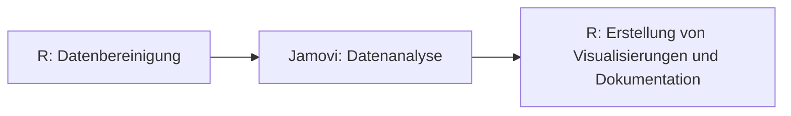

## Experimente organisieren

Wissenschaftler sind damit vertraut, Manuskripte verständlich und organisiert zu schreiben. Das gleiche kann allerdings selten für die Organization der Datenanalyse behauptet werden. Dieser Teil eines Experiments ist häufig für Leser nicht sichtbar und wird daher stiefmütterlich behandelt. 

Die Organisation eines Forschungsprojektes ist allerdings wichtig. Häufig möchten wir nach Jahren Daten neu auswerten oder eine Analyse aus einem früheren Experiement wiederholen. Diese Aufgabe ist ungleich schwierigier, wenn die Daten damals nicht gut organisiert wurden.  

Gleichzeitig gibt es in der psychologischen Forschung einen immer stärkere Bewegung, Datenanalysen zu veröffentlichen. Die [OSF](https://osf.io/) beispielsweise ist eine Plattform, in der viele Datenenalysen verschiedenster Studien veröffentlicht werden. Insbesondere im Zuge der [Replikationsbewegung in der psychologischen Forschung](https://journals.sagepub.com/doi/full/10.1177/1745691612462588) (siehe auch [hier](https://journals.plos.org/plosone/article?id=10.1371/journal.pone.0149794)), in der bekannte Studie wiederholt werden, um zu untersuchen, ob ähnliche Ergebnisse auftreten, wurde die Veröffentlichung von Daten wichtiger. Beispielsweise finden sich alle Datenanalysen des Reproducibilty Projektes der Psychologie auf [OSF](https://osf.io/ezcuj/).

> Du fragst dich vielleicht, weshalb es nötig ist, dass wir uns schon so früh mit der Organisation von Experimenten beschäftigen, schließlich haben wir noch nicht mal Daten inferenzstatistisch ausgewertet. Weil du das bald tun wirst. Dieser Kurs beeinhaltet 3 Projekte, die du im Verlaufe des Seminars umsetzt. Jedes Projekt ist eine vollkommene Datenanalyse wie sie auch in experimentellen Studien durchgeführt wird. Wir werden gleich zu Beginn des ersten Projektes darauf achten, dass deine Untersuchung organisiert ist, so dass du im Hinblick auf deine späteren Arbeiten einen Workflow hast, auf den du dich verlassen kannst. 

## Ordner anlegen

Die erste wichtige Entscheidung ist die Organisation der Ordnerstruktur: 

```
protocol.docx: Protokoll der Untersuchung (Störungen, Besonderheiten)
variablen.docx: Ein Dokument der Variablennamen
|___daten
|   |___rohdaten: Diese Daten dürfen nie verändert werden
|       |   z.B. row.csv
|   |___export: Export der gereinigten Daten für SPSS Jamovi
|       |   z.B. data_cleaned.sav
|   |___cleaned
|       |   z.B. daten_cleaned.csv
|
|___analyse
|   |   data_cleaning.R: Bereinigung der Daten; export in daten/cleaned
|   |   hypothese_one.R: R-File für jede Hypothese
|   |   hypothese_one.omv: Äquivalente Jamovi-Datei
|   |   hypothese_one.sav: Äquivalente SPSS-Syntax-Datei
|   |   exploratory.R: Explorative Datenanalyse
|
|___manuskript
|   |___literatur: Literatur, die für das Manuskript verwendet wird
|   |___tables: Tabellen für das Manuskript
|   |___figures: Bilder und Visualisierungen für das Manuskript
|   |   manuscript_20191012.docx
|   |   manuscript_20191014.docx
|
|___administration
|   |   teilnehmerliste.jpg
|   |   p80_probandengelder.pdf
```

### Wichtige Leitlinien

* Die Daten in dem Ordner daten/rohdaten dürfen **nicht** verändert werden.
* Für jede Hypothese gibt es in analyse/ eine eigene R-Datei
* Keine R-Datei sollte länger als ~ 400 Zeilen sein.
* Keine Datenbereinigung in den analyse/*.R Dateien.
* Die Manuskripte in manuskript/ sollten bei jeder größeren Veränderung kopiert werden und mit einem Datum versehen werden.
* Im Dokument *protocol.docx* werden alle Besonderheiten *während* der Durchführung eines Experimentes aufgeschrieben. Später findet man beispielsweise Ausreißer und möchte wissen, ob es etwas besonderes während dem Experiment passiert ist (z.B. Lärm).

Im Zuge deiner ersten Datenanalyse wirst du einen Ordner mit genau dieser Datenstruktur bekommen. Es ist daher an dieser Stelle nicht nötig, dass du *lernst* wie die Ordner aufgebaut sind. Später wirst du ohnehin mit dieser Ordnerstruktur arbeiten.


## Weiterführende Tipps

Wenn du später deine Daten noch besser organisieren möchtest und einen Hang zur Programmierung hast, kannst du dir ebenso folgende Technologien anschauen. Diese Technologien sind in keinster Wiese Inhalte dieses Kurses und werden auch nicht weiter behandelt:

* [git](https://git-scm.com/): Git ist ein Versionskontrollsystem, welches die Rückverfolgung von Veränderungen in Code ermöglicht (siehe auch [How to Use Git and GitHub](https://eu.udacity.com/course/how-to-use-git-and-github--ud775))
* [drake](https://github.com/ropensci/drake): Sobald die Projekte in R komplexer werden, hilft es, die Datenbereinigung über ein System laufen zu lassen, dass potentielle Fehler reduziert. Drake hat sich in R dafür bewährt.
* [R-Studio Projekte](https://r4ds.had.co.nz/workflow-projects.html): Wir arbeiten zu Beginn mit Arbeitsverzeichnissen. Später ist es durchaus sinnvoll, Projekte in R-Studio anzulegen (mehr Informationen [hier](https://support.rstudio.com/hc/en-us/articles/200526207-Using-Projects)).

## Beispiel einer Datenanalyse

TODO: Mit dem Human Resources Dataset umsetzen

# ggplot2 Grundlagen

## Warum Datenvisualisierungen?

Datenvisualisierungen sind eine Form der Kommunikation. Schau dir beispielsweise die berühmte Datenvisualisierung von [Hans Rosling](https://www.gapminder.org/tools/#$chart-type=bubbles), in der Hans Rosling dargstellt hat, wie sich die Lebenserwartung der Menschen weltweilt in den letzten zwei Jahrhunderten verändert hat. Kein Maß der zentralen Tendenz oder der Streuung kann diese Botschauft der Visualisierung so gut kommunizieren.

Datenvisualisierung ist zudem eine Kunst. Schau dir die Visualisierungen von [Nadieh Bremer](https://www.visualcinnamon.com/) an. [Hier](https://nbremer.github.io/planet-globe/) hat sie visuell dargestellt, wie Sateliten die Erde tagtäglich abfotografieren, um eine Karte der Welt zu erstellen.

In der Statistik fertigen wir Visualisierungen an, um Daten explorativ zu untersuchen (siehe [Tukey](https://www.abebooks.de/Exploratory-Data-Analysis-John-W-Tukey/22854246229/bd)) und um zentrale Befunde unserer Forschung zu kommunizieren. Zur Kommunikation der Befunde verwenden wir in der Regel gängige Visualisierungen wie Histogramme, Boxplots oder Streudiagramme (siehe [hier](https://de.wikipedia.org/wiki/Explorative_Datenanalyse)). Viele Wissenschaftler verwenden Excel, um Daten zu visualisieren. Excel ist eine gute Ressource, um [Daten zu visualisieren](https://www.optimizesmart.com/how-to-select-best-excel-charts-for-your-data-analysis-reporting/). Wir verwenden in diesem Kurs das Paket [ggplot2](https://ggplot2.tidyverse.org/), welches in [tidyverse](https://www.tidyverse.org/) integriert ist. Mit ggplot2 lassen sich alle gängigen Visualisierungen erstellen. ggplot2 ist sehr beliebt in der wissenschaftlichen Community und wird ebenso von Anbietern wie der [BBC](https://medium.com/bbc-visual-and-data-journalism/how-the-bbc-visual-and-data-journalism-team-works-with-graphics-in-r-ed0b35693535) verwendet. 

In dieser Modul wirst du lernen, erste Visualisierungen in ggplot2 zu erstellen. Wir werden hierfür erneut den Human Resources Datensatz des bisherigen Moduls verewnden.


## Erste Visualisierungen

Bevor wir eine Visualisierung erstellen, müssen wir zunächst tidyverse laden und unseren Datensatz einlesen (Beachte, dass deine Datei in einem anderne Ordner liegt als hier angezeigt ist): 

```R
library(tidyverse)

human_resources <- read_csv("C:/Users/ChristianEZW/repositories/statistik_2_online_kurs/data/markdown/hr_cleaned.csv")
```

Schauen wir uns vorab nochmal die Variablen im Datensatz an:

```R
glimpse(human_resources)
```

```
Observations: 1,470
Variables: 17
$ id                         <dbl> 1, 2, 3, 4, 5, 6, 7, 8, 9, 10, 11, 12, 13, 14, 15, 16, 17, 18, 19, 20, 21, 22, 23, 24, 25, 26, 27, 28, 29, 30, 31, 32, 33, 34, 35, ...
$ age                        <dbl> 41, 49, 37, 33, 27, 32, 59, 30, 38, 36, 35, 29, 31, 34, 28, 29, 32, 22, 53, 38, 24, 36, 34, 21, 34, 53, 32, 42, 44, 46, 33, 44, 30,...
$ department                 <chr> "Sales", "Research & Development", "Research & Development", "Research & Development", "Research & Development", "Research & Develo...
$ distance_from_home         <dbl> 1, 8, 2, 3, 2, 2, 3, 24, 23, 27, 16, 15, 26, 19, 24, 21, 5, 16, 2, 2, 11, 9, 7, 15, 6, 5, 16, 8, 7, 2, 2, 10, 9, 5, 1, 2, 3, 2, 5, ...
$ education                  <chr> "College", "Below College", "College", "Master", "Below College", "College", "Bachelor", "Below College", "Bachelor", "Bachelor", "...
$ employee_count             <dbl> 1, 1, 1, 1, 1, 1, 1, 1, 1, 1, 1, 1, 1, 1, 1, 1, 1, 1, 1, 1, 1, 1, 1, 1, 1, 1, 1, 1, 1, 1, 1, 1, 1, 1, 1, 1, 1, 1, 1, 1, 1, 1, 1, 1,...
$ gender                     <chr> "Female", "Male", "Male", "Female", "Male", "Male", "Female", "Male", "Male", "Male", "Male", "Female", "Male", "Male", "Male", "Fe...
$ job_role                   <chr> "Sales Executive", "Research Scientist", "Laboratory Technician", "Research Scientist", "Laboratory Technician", "Laboratory Techni...
$ job_satisfaction           <chr> "Very High", "Medium", "High", "High", "Medium", "Very High", "Low", "High", "High", "High", "Medium", "High", "High", "Very High",...
$ marital_status             <chr> "Single", "Married", "Single", "Married", "Married", "Single", "Married", "Divorced", "Single", "Married", "Married", "Single", "Di...
$ monthly_income             <dbl> 5993, 5130, 2090, 2909, 3468, 3068, 2670, 2693, 9526, 5237, 2426, 4193, 2911, 2661, 2028, 9980, 3298, 2935, 15427, 3944, 4011, 3407...
$ num_companies_worked       <dbl> 8, 1, 6, 1, 9, 0, 4, 1, 0, 6, 0, 0, 1, 0, 5, 1, 0, 1, 2, 5, 0, 7, 0, 1, 2, 4, 1, 0, 3, 3, 4, 2, 1, 3, 2, 1, 1, 1, 9, 2, 1, 1, 1, 1,...
$ performance_rating         <chr> "Excellent", "Outstanding", "Excellent", "Excellent", "Excellent", "Excellent", "Outstanding", "Outstanding", "Outstanding", "Excel...
$ total_working_years        <dbl> 8, 10, 7, 8, 6, 8, 12, 1, 10, 17, 6, 10, 5, 3, 6, 10, 7, 1, 31, 6, 5, 10, 13, 0, 8, 26, 10, 10, 24, 22, 7, 9, 10, 19, 6, 6, 3, 2, 6...
$ work_life_balance          <chr> "Bad", "Better", "Better", "Better", "Better", "Good", "Good", "Better", "Better", "Good", "Better", "Better", "Good", "Better", "B...
$ years_at_company           <dbl> 6, 10, 0, 8, 2, 7, 1, 1, 9, 7, 5, 9, 5, 2, 4, 10, 6, 1, 25, 3, 4, 5, 12, 0, 4, 14, 10, 9, 22, 2, 1, 4, 10, 1, 2, 5, 3, 2, 1, 5, 1, ...
$ years_since_last_promotion <dbl> 0, 1, 0, 3, 2, 3, 0, 0, 1, 7, 0, 0, 4, 1, 0, 8, 0, 0, 3, 1, 1, 0, 2, 0, 1, 4, 6, 4, 5, 2, 0, 1, 1, 0, 2, 1, 0, 2, 0, 1, 0, 0, 0, 1,...
```

Ok, es sind 17 Variablen im Datensatz. Insgesamt gibt es 1470 Reihen. 

> Wir werden im nächsten Schritt einige Visualisierungen erstellen. Du musst an dieser Stell nocht nicht alles im Detail verstehen. Versuche aber herauszufinden, wie Visualisierungen mit ggplot2 grob erstellt werden.

Zunächst möchte ich wissen, wie sich das Einkommen der Mitarbeiter dieses Unternehmens verteilt:

```R
ggplot(human_resources, aes(x = monthly_income)) +
  geom_histogram()
```

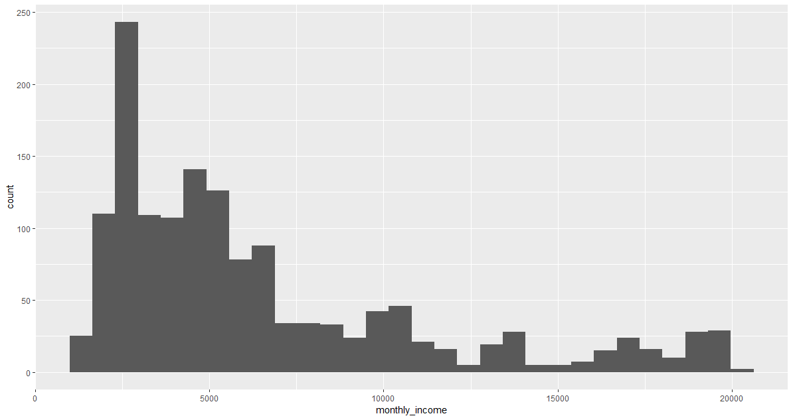

Ein paar wenige Mitarbeiter verdienen sher viel Geld im Monat, die meisten allerdings umdie 3000 Dollar (brutto wahrscheinlich).

Verdienen Mitarbeiter, die älter sind eigentlich mehr als junge Mitarbeiter?

```R
ggplot(human_resources, aes(x = age, y = monthly_income)) +
  geom_point()
```

Die Tendenz besteht, allerdings gibt es auch manche ältere Mitarbeiter, die nicht sehr viel verdienen. 

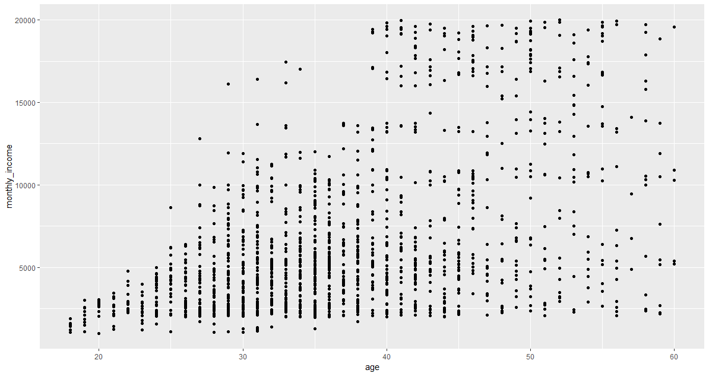

Schauen wir uns kurz die Korrelation dazu an:

```R
cor(human_resources$age, human_resources$monthly_income) # 0.4978546
```

Tatsächlich, es gibt einen mittleren positiven Zusammenhang zwischen dem Alter der Mitarbeiter ihrem monatlichen Gehalt. Je älter die Mitarbeiter, desto mehr verdienen sie. 

Zuletzt interessiert es mich noch, wie sich die Bildungsgrade bei den Mitarbeitern unterschieden? 

```R
ggplot(human_resources, aes(x = education)) +
  geom_bar()
```


Im nächsten Schritt lernst du, wie ggplot2 konzeptuell funktioniert. 


## Grammar of Graphics

ggplot2 setzt die Idee der [Grammar of Graphics](http://vita.had.co.nz/papers/layered-grammar.pdf) um. Die Grundidee ist folgende: 

### Aesthetics

Bei jeder Visualisierung müssen Werte in Visualisierungen umgewandelt werden. Schau dir nochmal das Balkendiagramm von gerade eben an:


Hier wurde die Häufigkeit als Wert (z.B. 540) zum Beispiel der Höhe auf der Y-Achse zugeordnet. Wir könnten ebenso die Fläche eines Kreises einer Variable zuordnen, beispielsweise der Anzahl der in der Firma gearbeiteten Jahre:

```R
ggplot(human_resources, aes(x = age, y = monthly_income)) +
  geom_point(aes(size = total_working_years))
```

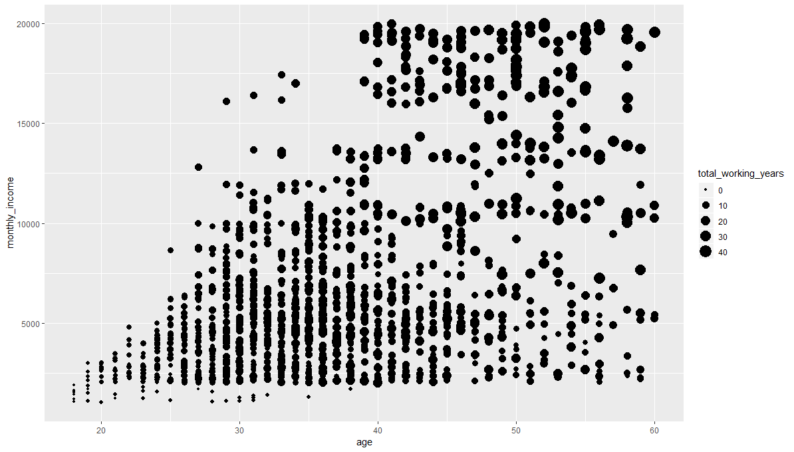

Diese Zuordnung ist eine Aesthetic. Die Zahl der Arbeitsjahre wird der Fläche eines Kreises zugeordnet. Wir können genausogut verschiedene Balken, die für kategoriale Variablen stehen (z.B. Bildungsabschluss) einer Farbe zuordnen:

```R
ggplot(human_resources, aes(x = education)) +
  geom_bar(aes(fill = education))
```

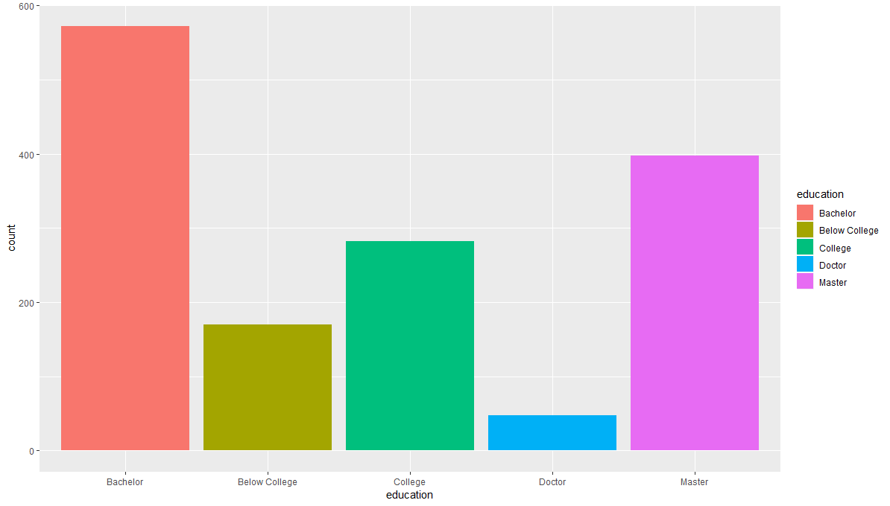


### Layering

Visualisierungen haben unterschiedliche Layer. Jeder Plot in ggplot2 beispielsweise fängt mit einem leeren Canvas an:

```R
ggplot()
```


Dies ist tatsächlich eine Visualisierung, nur dass wir der Visualisierungen keine Layer zugordnet haben. Fügen wir die Achsen hinzu:

```R
ggplot(human_resources, aes(x = education, y = monthly_income))
```

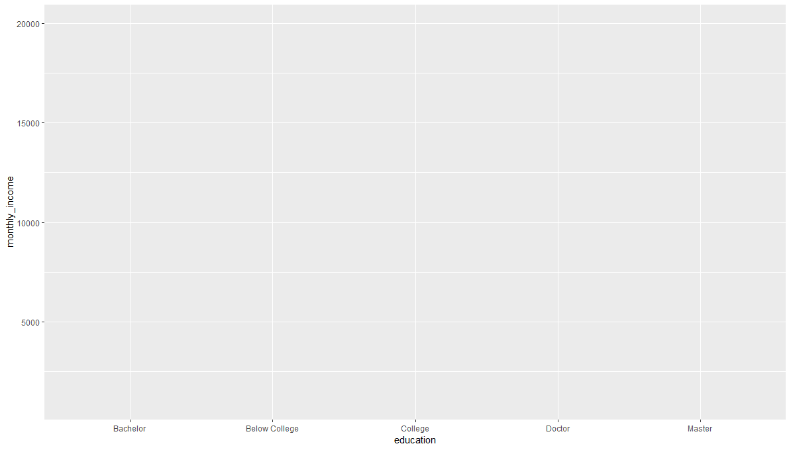

Als nächstes fügen wir Boxplots hinzu:

```R
ggplot(human_resources, aes(x = education, y = monthly_income)) +
  geom_boxplot()
````

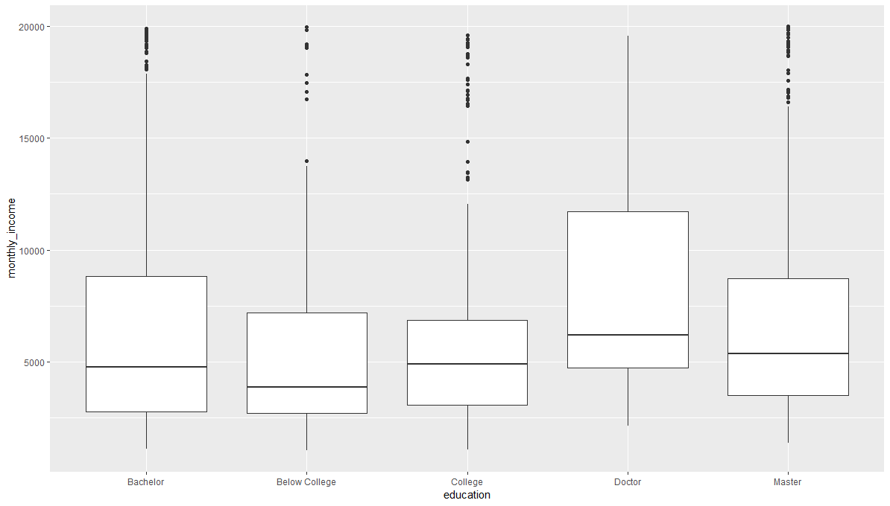

Im nächsten Schritt möchten wir die einzelnen Werte der Mitarbeiter über dem Boxplot sehen:

```R
ggplot(human_resources, aes(x = education, y = monthly_income)) +
  geom_boxplot() +
  geom_jitter()
```

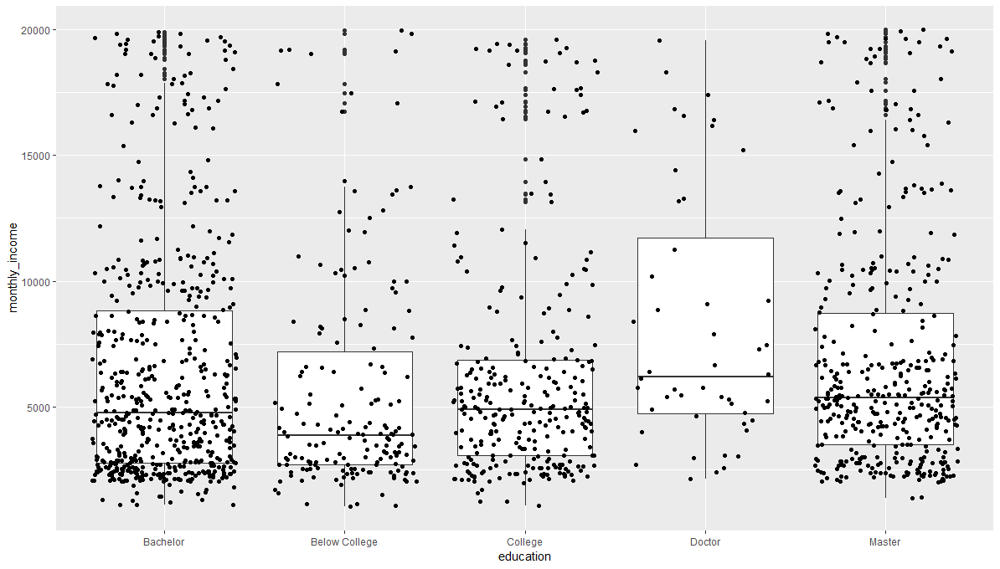


Visualisierungen werden in der Idee der Grammar of Graphics daher durch verschiedene Layer erstellt, die wir aufeinander schichten. Das meinen wir auch ganz wörtlich. Schau dir nur einmal folgende Visualisierung an und achte darauf, dass der Befehl `geom_jitter` früher eingefügt wurde als der Befehl `geom_boxplot`:

```
ggplot(human_resources, aes(x = education, y = monthly_income)) +
  geom_jitter() +
  geom_boxplot()
```

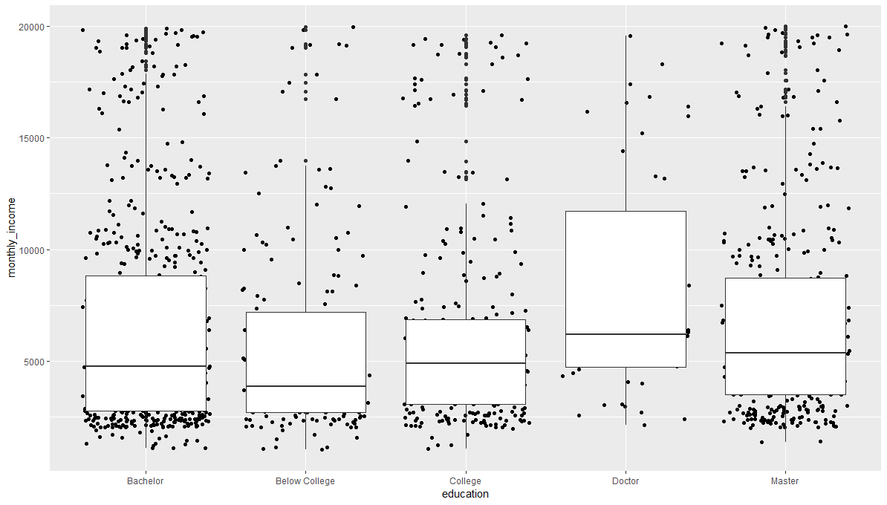

Die Punkte sind nun hinter den Boxplots, da dieses Layer vorher hinzugefügt wurde.


## Die Funktion ggplot2

Schauen wir uns nochmal einen der Visualisierungen von vorhin an:

```R
ggplot(human_resources, aes(x = age, y = monthly_income)) +
  geom_point()
```


Jeder Plot beginnt mit der Funktion `ggplot()`. `ggplot()` erstellt eine leere Visualisierung. Das erste Argument der Visualisierung ist der Datensatz, aus welchem wir die Variablen ziehen:

```R
ggplot(data = human_resources) # 1. Argument data
ggplot(human_resources) # data können wir auch weglassen
```


Im nächsten Schritt bestimmen wir die Achsen des Datensatzes. Achsen sind eine Aesthetics, da wir Werte einer Visualisierung zuordnen. In diesem Fall berechnet ggplot2 den [Range](https://en.wikipedia.org/wiki/Range_(statistics)) der Daten und fertigt davon die Achsen an:

```R
ggplot(human_resources, aes(x = education, y = monthly_income))
```


Überlege dir gleich zu Beginn, welche Achsen du in ggplot benennen musst. Für Histogramme und Balkendiagramme berechnet ggplot2 beispielsweise im Hintergrund die Häufigkeiten, ohne, dass du diese Y-Werte angeben musst: 

```R
ggplot(human_resources, aes(x = education)) +
  geom_bar()
```


Im nächsten Schritt benötigst du sogenannte [geoms](https://ggplot2.tidyverse.org/reference/index.html). Geoms sind vorgefertigte Visualisierungen, die du als Layer auf die Plots legen kannst. In diesem Seminar sind für uns folgende geoms relevant:

* [geom_bar](https://ggplot2.tidyverse.org/reference/geom_bar.html): Erstellung von Balkendiagrammen.
* [geom_col](https://ggplot2.tidyverse.org/reference/geom_bar.html): Erstellung von Balkendiagrammen für die wir die Y-Werte bereits wissen.
* [geom_point](https://ggplot2.tidyverse.org/reference/geom_point.html): Erstellung von Streudiagrammen.
* [geom_boxplot](https://ggplot2.tidyverse.org/reference/geom_boxplot.html): Erstellung von Boxplots.
*  [geom_line](https://ggplot2.tidyverse.org/reference/geom_path.html): Erstellung von Liniendiagramme.
* [geom_histogram](https://ggplot2.tidyverse.org/reference/geom_histogram.html): Erstellung von Histogrammen

Um einen geom anzufügen, muss man ein `+` nach der ggplot Funktion einfügen und danach den geom anfügen:

```R
ggplot(human_resources, aes(x = education)) +
  geom_bar()
```


Jeder weitere Layer wird durch ein weiteres `+` angefügt. 

Die ggplot Funktion können wir folgendermaßen generalisieren:

```R
ggplot(data = <DATA>, mapping = aes(<MAPPINGS>)) + 
  <GEOM_FUNCTION>()
```

Die Funktion hat zwei Argumente: (1) `data`, dass ist der Datensatz, den wir visualisieren möchten, (2) `mapping`, dass sind die Aesthetics, welche wir bestimmen möchten. Diese können wir genausogut in den einzelnen geoms unterbringen:


```R
ggplot(data = <DATA>) + 
  <GEOM_FUNCTION>(mapping = aes(<MAPPINGS>))
```

## Aestethics

Aesthetics sind Verbindungen von Daten zu visuellen Komponenten. Ein paar Beispiele:

* Nominalskaliserte Daten werden Farben zugeordnet: `aes(fill = education)`
* Intervallskalierten Daten wird die Fläche eines Kreises zugeordnet: `aes(size = monthly_income)`
* Balkendiagrammen werden unabhängig der Variablen transparent gemacht: `geom_bar(alpha = .4, aes(fill = education))`
* Die Punkte aller Mitarbeiter mit einem exzellenten Rating sollen farbig hervorgehoben werden: `aes(color = performance_rating == "Excellent")`.

Aesthetics können sowohl in der ggplot Funktion als auch innnerhalb eines geoms aufgeschrieben werden:

```R
ggplot(human_resources, aes(x = education)) +
  geom_bar(aes(fill = education))
```


```R
ggplot(human_resources, aes(x = education, 
                            fill = education)) +
  geom_bar()
```


Beides ist legitim. Als generelle Regel ist es dennoch ratsam, Aesthetics, die nur für ein geom gelten auch in diesem aufzuschreiben. 

Erstellen wir mit unserem Wissen eine komplexere Visualisierung mit verschiedenen Aesthetics:


```R
ggplot(human_resources, aes(x = job_role, y = monthly_income)) +
  geom_jitter(alpha = .4, aes(color = work_life_balance)) +
  geom_boxplot(alpha = .2, aes(fill = job_role))
```

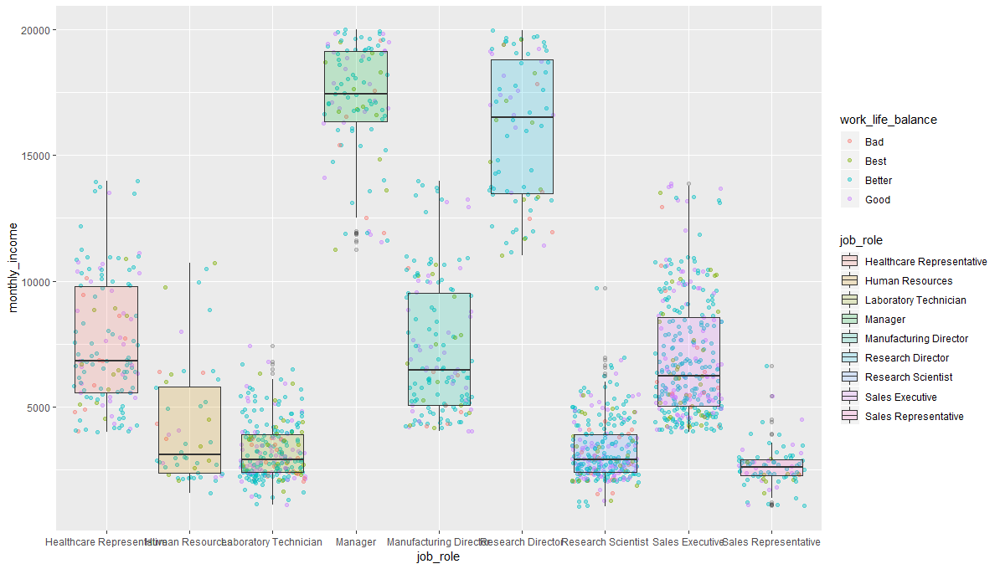

Diese Visualisieurng würden wir zwar nicht veröffentlichen, sie zeigt aber bereits, welche Möglichkeiten wir mit ggplot haben. Folgende Aesthetics werden bei dieser Visualisierung hinzugefügt:

* Die Balken erhalten abhängig der Variable `job_role` eine eigenen Farbe
* Die Balken erhalten eine Transparenz durch `alpha` (Werte von 0 bis 1)
* Die Punkte erhalten eine Transparenz durch `alpha`
* Die Punkte erhalten eine Farbe abhängig der nominalskalierten Variable `work_life_balance`

Am Ende dieser Einheit lernst du, wie du solche Visualisierungen noch verschönern kannst.


# ggplot2 Visualisierungen


## Histogramme

In einer explorativen Datenanalyse möchten wir häufig die Verteilung einer Variable betrachten. Hierfür eignen sich Histogramme. Histogramme werden in ggplot mit dem geom [geom_histogram](https://ggplot2.tidyverse.org/reference/geom_histogram.html) umgesetzt. Histogramme benötigen lediglich die Aesthetics `aes(x = VARIABLENNAMEN)`:

```R
ggplot(human_resources, aes(x = age)) +
  geom_histogram()
```

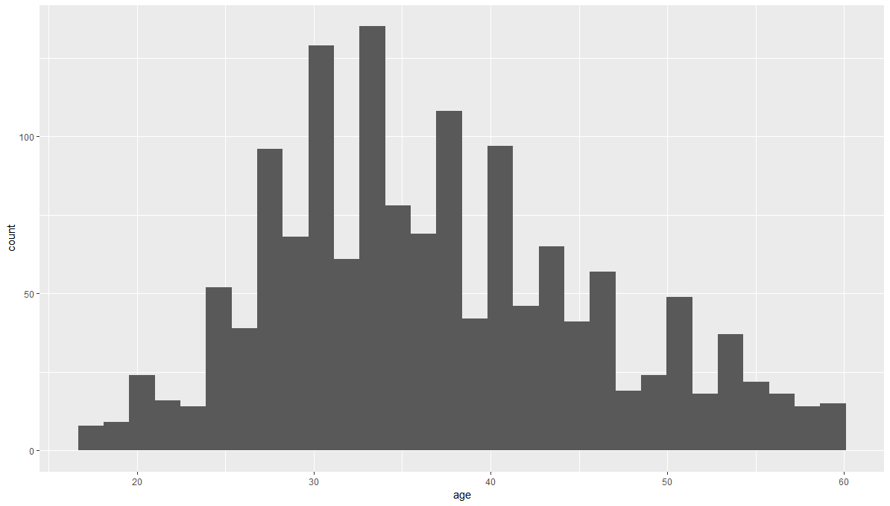

Erneut können wir die Aesthetics verwenden, um die Visualisierung verständlicher zu machen:

```R
ggplot(human_resources, aes(x = age)) +
  geom_histogram(fill = "steelblue", color = "black")
```

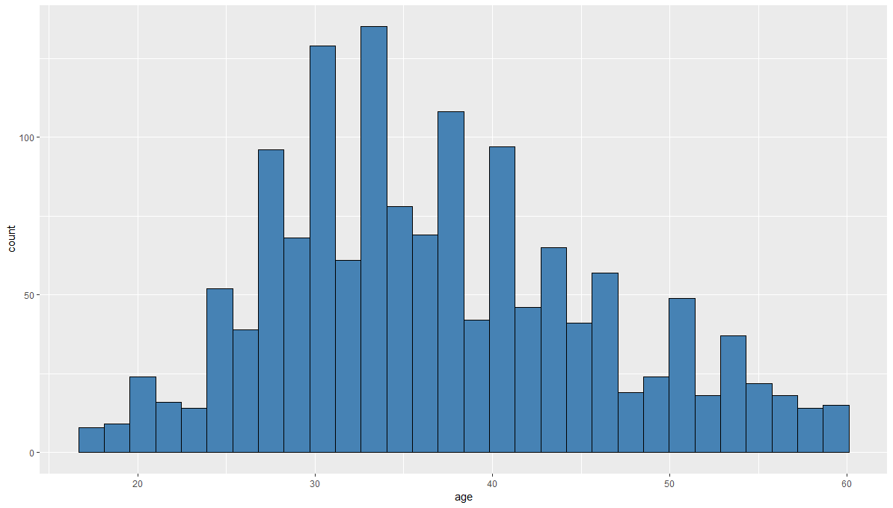

`geom_histogram` hat zudem ein Argument, um die Breite der Balken anzupassen:

```R
ggplot(human_resources, aes(x = age)) +
  geom_histogram(fill = "steelblue", 
                 color = "black",
                 binwidth = 5)
```

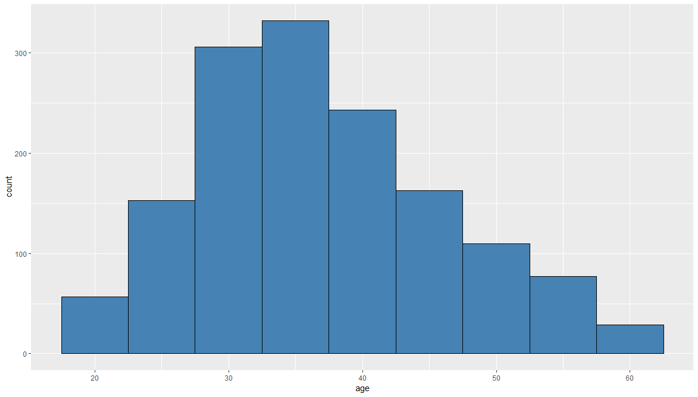

Die breite der Balken kann einen großen Einfluss auf die Darstellung der Daten machen:

```R
ggplot(human_resources, aes(x = age)) +
  geom_histogram(fill = "steelblue", 
                 color = "black",
                 binwidth = 1)
```

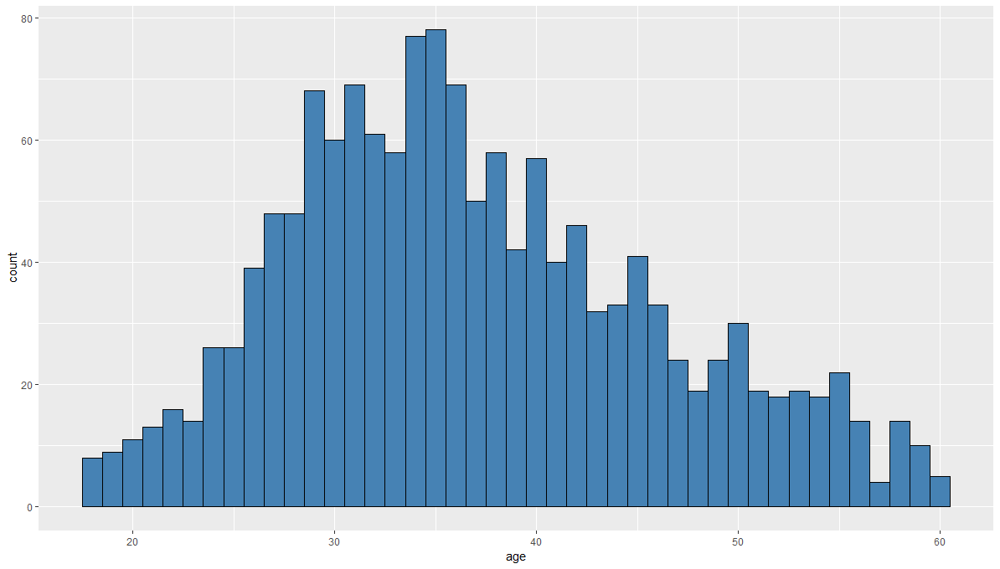

Überlege dir daher immer gut, wie du die Balken in einem Histogram machst (siehe auch [Choose bin Sizes](https://www.statisticshowto.datasciencecentral.com/choose-bin-sizes-statistics/)). 

## Boxplots

Boxplots eignen sich immer gut dafür, Ausreißer in einem Datensatz zu erkennen. Boxplots werden in ggplot durch das geom [geom_boxplot](https://ggplot2.tidyverse.org/reference/geom_boxplot.html) erstellt: 

```R
ggplot(human_resources, aes(x = job_role, y = monthly_income)) +
  geom_boxplot(aes()) 
```


## Balkendiagramme

## Liniendiagramme

## Streudiagramme

# ggplot2 Vertiefung

## ggplot und der Pipe Operator

## facets

## labs

## guides

## coord_flip

## themes

## Nominalskalierte Daten ordnen


# Modeling Example

## Daten aufbereiten

## Boxplot erstellen

## Histogram erstellen