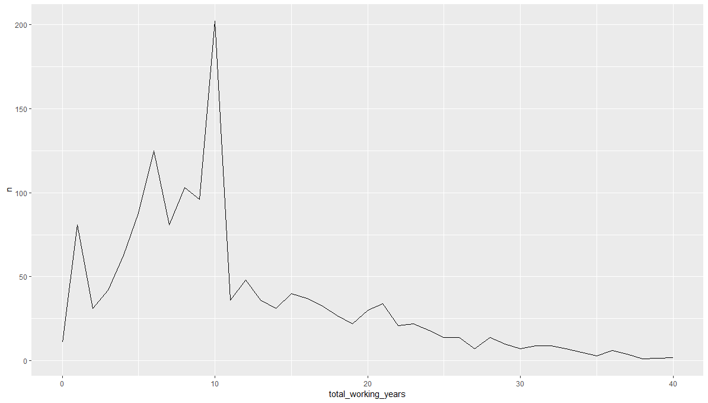

# Datenanalyse mit R

# Workflow

## Datenanalyse mit R und Jamovi

In diesem Kurs verwenden wir einen pragmatischen Ansatz zur Analyse von Daten. Folgende Funktionen erfüllen die einzelnen Technologien:

* **R**: Bereinigung von Daten; Erstellung von Visualisierungen; Dokumentation der Datenanalyse
* **Jamovi**: Berechnung der [inferenzstatistischen Verfahren](https://en.wikipedia.org/wiki/Statistical_inference).

Der Workflow sieht später folgendermaßen aus:

<!-- https://www.gatsbyjs.org/packages/gatsby-remark-mermaid/ -->


## Experimente organisieren

Wissenschaftler sind damit vertraut, Manuskripte verständlich und organisiert zu schreiben. Das gleiche kann allerdings selten für die Organization der Datenanalyse behauptet werden. Dieser Teil eines Experiments ist häufig für Leser nicht sichtbar und wird daher stiefmütterlich behandelt. 

Die Organisation eines Forschungsprojektes ist allerdings wichtig. Häufig möchten wir nach Jahren Daten neu auswerten oder eine Analyse aus einem früheren Experiement wiederholen. Diese Aufgabe ist ungleich schwierigier, wenn die Daten damals nicht gut organisiert wurden.  

Gleichzeitig gibt es in der psychologischen Forschung einen immer stärkere Bewegung, Datenanalysen zu veröffentlichen. Die [OSF](https://osf.io/) beispielsweise ist eine Plattform, in der viele Datenenalysen verschiedenster Studien veröffentlicht werden. Insbesondere im Zuge der [Replikationsbewegung in der psychologischen Forschung](https://journals.sagepub.com/doi/full/10.1177/1745691612462588) (siehe auch [hier](https://journals.plos.org/plosone/article?id=10.1371/journal.pone.0149794)), in der bekannte Studie wiederholt werden, um zu untersuchen, ob ähnliche Ergebnisse auftreten, wurde die Veröffentlichung von Daten wichtiger. Beispielsweise finden sich alle Datenanalysen des Reproducibilty Projektes der Psychologie auf [OSF](https://osf.io/ezcuj/).

> Du fragst dich vielleicht, weshalb es nötig ist, dass wir uns schon so früh mit der Organisation von Experimenten beschäftigen, schließlich haben wir noch nicht mal Daten inferenzstatistisch ausgewertet. Weil du das bald tun wirst. Dieser Kurs beeinhaltet 3 Projekte, die du im Verlaufe des Seminars umsetzt. Jedes Projekt ist eine vollkommene Datenanalyse wie sie auch in experimentellen Studien durchgeführt wird. Wir werden gleich zu Beginn des ersten Projektes darauf achten, dass deine Untersuchung organisiert ist, so dass du im Hinblick auf deine späteren Arbeiten einen Workflow hast, auf den du dich verlassen kannst. 

## Ordner anlegen

Die erste wichtige Entscheidung ist die Organisation der Ordnerstruktur: 

```
|   protocol.docx: Protokoll der Untersuchung (Störungen, Besonderheiten)
|   variablen.docx: Ein Dokument der Variablennamen
|
|___daten
|   |___rohdaten: Diese Daten dürfen nie verändert werden
|       |   z.B. row.csv
|   |___export: Export der gereinigten Daten für SPSS Jamovi
|       |   z.B. data_cleaned.sav
|   |___cleaned
|       |   z.B. daten_cleaned.csv
|
|___analyse
|   |   data_cleaning.R: Bereinigung der Daten; export in daten/cleaned
|   |   hypothese_one.R: R-File für jede Hypothese
|   |   hypothese_one.omv: Äquivalente Jamovi-Datei
|   |   hypothese_one.sav: Äquivalente SPSS-Syntax-Datei
|   |   exploratory.R: Explorative Datenanalyse
|
|___manuskript
|   |___literatur: Literatur, die für das Manuskript verwendet wird
|   |___tables: Tabellen für das Manuskript
|   |___figures: Bilder und Visualisierungen für das Manuskript
|   |   manuscript_20191012.docx
|   |   manuscript_20191014.docx
|
|___administration
|   |   teilnehmerliste.jpg
|   |   p80_probandengelder.pdf
```

### Wichtige Leitlinien

* Die Daten in dem Ordner daten/rohdaten dürfen **nicht** verändert werden.
* Für jede Hypothese gibt es in analyse/ eine eigene R-Datei
* Keine R-Datei sollte länger als ~ 400 Zeilen sein.
* Keine Datenbereinigung in den analyse/*.R Dateien.
* Die Manuskripte in manuskript/ sollten bei jeder größeren Veränderung kopiert werden und mit einem Datum versehen werden.
* Im Dokument *protocol.docx* werden alle Besonderheiten *während* der Durchführung eines Experimentes aufgeschrieben. Später findet man beispielsweise Ausreißer und möchte wissen, ob es etwas besonderes während dem Experiment passiert ist (z.B. Lärm).

Im Zuge deiner ersten Datenanalyse wirst du einen Ordner mit genau dieser Datenstruktur bekommen. Es ist daher an dieser Stelle nicht nötig, dass du *lernst* wie die Ordner aufgebaut sind. Später wirst du ohnehin mit dieser Ordnerstruktur arbeiten.


## Weiterführende Tipps

Wenn du später deine Daten noch besser organisieren möchtest und einen Hang zur Programmierung hast, kannst du dir ebenso folgende Technologien anschauen. Diese Technologien sind in keinster Wiese Inhalte dieses Kurses und werden auch nicht weiter behandelt:

* [git](https://git-scm.com/): Git ist ein Versionskontrollsystem, welches die Rückverfolgung von Veränderungen in Code ermöglicht (siehe auch [How to Use Git and GitHub](https://eu.udacity.com/course/how-to-use-git-and-github--ud775))
* [drake](https://github.com/ropensci/drake): Sobald die Projekte in R komplexer werden, hilft es, die Datenbereinigung über ein System laufen zu lassen, dass potentielle Fehler reduziert. Drake hat sich in R dafür bewährt.
* [R-Studio Projekte](https://r4ds.had.co.nz/workflow-projects.html): Wir arbeiten zu Beginn mit Arbeitsverzeichnissen. Später ist es durchaus sinnvoll, Projekte in R-Studio anzulegen (mehr Informationen [hier](https://support.rstudio.com/hc/en-us/articles/200526207-Using-Projects)).

## Beispiel einer Datenanalyse

TODO: Mit dem Human Resources Dataset umsetzen

# ggplot2 Grundlagen

## Warum Datenvisualisierungen?

Datenvisualisierungen sind eine Form der Kommunikation. Schau dir beispielsweise die berühmte Datenvisualisierung von [Hans Rosling](https://www.gapminder.org/tools/#$chart-type=bubbles), in der Hans Rosling dargstellt hat, wie sich die Lebenserwartung der Menschen weltweilt in den letzten zwei Jahrhunderten verändert hat. Kein Maß der zentralen Tendenz oder der Streuung kann diese Botschauft der Visualisierung so gut kommunizieren.

Datenvisualisierung ist zudem eine Kunst. Schau dir die Visualisierungen von [Nadieh Bremer](https://www.visualcinnamon.com/) an. [Hier](https://nbremer.github.io/planet-globe/) hat sie visuell dargestellt, wie Sateliten die Erde tagtäglich abfotografieren, um eine Karte der Welt zu erstellen.

In der Statistik fertigen wir Visualisierungen an, um Daten explorativ zu untersuchen (siehe [Tukey](https://www.abebooks.de/Exploratory-Data-Analysis-John-W-Tukey/22854246229/bd)) und um zentrale Befunde unserer Forschung zu kommunizieren. Zur Kommunikation der Befunde verwenden wir in der Regel gängige Visualisierungen wie Histogramme, Boxplots oder Streudiagramme (siehe [hier](https://de.wikipedia.org/wiki/Explorative_Datenanalyse)). Viele Wissenschaftler verwenden Excel, um Daten zu visualisieren. Excel ist eine gute Ressource, um [Daten zu visualisieren](https://www.optimizesmart.com/how-to-select-best-excel-charts-for-your-data-analysis-reporting/). Wir verwenden in diesem Kurs das Paket [ggplot2](https://ggplot2.tidyverse.org/), welches in [tidyverse](https://www.tidyverse.org/) integriert ist. Mit ggplot2 lassen sich alle gängigen Visualisierungen erstellen. ggplot2 ist sehr beliebt in der wissenschaftlichen Community und wird ebenso von Anbietern wie der [BBC](https://medium.com/bbc-visual-and-data-journalism/how-the-bbc-visual-and-data-journalism-team-works-with-graphics-in-r-ed0b35693535) verwendet. 

In dieser Modul wirst du lernen, erste Visualisierungen in ggplot2 zu erstellen. Wir werden hierfür erneut den Human Resources Datensatz des bisherigen Moduls verewnden.


## Erste Visualisierungen

Bevor wir eine Visualisierung erstellen, müssen wir zunächst tidyverse laden und unseren Datensatz einlesen (Beachte, dass deine Datei in einem anderne Ordner liegt als hier angezeigt ist): 

```R
library(tidyverse)

human_resources <- read_csv("C:/Users/ChristianEZW/repositories/statistik_2_online_kurs/data/markdown/hr_cleaned.csv")
```

Schauen wir uns vorab nochmal die Variablen im Datensatz an:

```R
glimpse(human_resources)
```

```
Observations: 1,470
Variables: 17
$ id                         <dbl> 1, 2, 3, 4, 5, 6, 7, 8, 9, 10, 11, 12, 13, 14, 15, 16, 17, 18, 19, 20, 21, 22, 23, 24, 25, 26, 27, 28, 29, 30, 31, 32, 33, 34, 35, ...
$ age                        <dbl> 41, 49, 37, 33, 27, 32, 59, 30, 38, 36, 35, 29, 31, 34, 28, 29, 32, 22, 53, 38, 24, 36, 34, 21, 34, 53, 32, 42, 44, 46, 33, 44, 30,...
$ department                 <chr> "Sales", "Research & Development", "Research & Development", "Research & Development", "Research & Development", "Research & Develo...
$ distance_from_home         <dbl> 1, 8, 2, 3, 2, 2, 3, 24, 23, 27, 16, 15, 26, 19, 24, 21, 5, 16, 2, 2, 11, 9, 7, 15, 6, 5, 16, 8, 7, 2, 2, 10, 9, 5, 1, 2, 3, 2, 5, ...
$ education                  <chr> "College", "Below College", "College", "Master", "Below College", "College", "Bachelor", "Below College", "Bachelor", "Bachelor", "...
$ employee_count             <dbl> 1, 1, 1, 1, 1, 1, 1, 1, 1, 1, 1, 1, 1, 1, 1, 1, 1, 1, 1, 1, 1, 1, 1, 1, 1, 1, 1, 1, 1, 1, 1, 1, 1, 1, 1, 1, 1, 1, 1, 1, 1, 1, 1, 1,...
$ gender                     <chr> "Female", "Male", "Male", "Female", "Male", "Male", "Female", "Male", "Male", "Male", "Male", "Female", "Male", "Male", "Male", "Fe...
$ job_role                   <chr> "Sales Executive", "Research Scientist", "Laboratory Technician", "Research Scientist", "Laboratory Technician", "Laboratory Techni...
$ job_satisfaction           <chr> "Very High", "Medium", "High", "High", "Medium", "Very High", "Low", "High", "High", "High", "Medium", "High", "High", "Very High",...
$ marital_status             <chr> "Single", "Married", "Single", "Married", "Married", "Single", "Married", "Divorced", "Single", "Married", "Married", "Single", "Di...
$ monthly_income             <dbl> 5993, 5130, 2090, 2909, 3468, 3068, 2670, 2693, 9526, 5237, 2426, 4193, 2911, 2661, 2028, 9980, 3298, 2935, 15427, 3944, 4011, 3407...
$ num_companies_worked       <dbl> 8, 1, 6, 1, 9, 0, 4, 1, 0, 6, 0, 0, 1, 0, 5, 1, 0, 1, 2, 5, 0, 7, 0, 1, 2, 4, 1, 0, 3, 3, 4, 2, 1, 3, 2, 1, 1, 1, 9, 2, 1, 1, 1, 1,...
$ performance_rating         <chr> "Excellent", "Outstanding", "Excellent", "Excellent", "Excellent", "Excellent", "Outstanding", "Outstanding", "Outstanding", "Excel...
$ total_working_years        <dbl> 8, 10, 7, 8, 6, 8, 12, 1, 10, 17, 6, 10, 5, 3, 6, 10, 7, 1, 31, 6, 5, 10, 13, 0, 8, 26, 10, 10, 24, 22, 7, 9, 10, 19, 6, 6, 3, 2, 6...
$ work_life_balance          <chr> "Bad", "Better", "Better", "Better", "Better", "Good", "Good", "Better", "Better", "Good", "Better", "Better", "Good", "Better", "B...
$ years_at_company           <dbl> 6, 10, 0, 8, 2, 7, 1, 1, 9, 7, 5, 9, 5, 2, 4, 10, 6, 1, 25, 3, 4, 5, 12, 0, 4, 14, 10, 9, 22, 2, 1, 4, 10, 1, 2, 5, 3, 2, 1, 5, 1, ...
$ years_since_last_promotion <dbl> 0, 1, 0, 3, 2, 3, 0, 0, 1, 7, 0, 0, 4, 1, 0, 8, 0, 0, 3, 1, 1, 0, 2, 0, 1, 4, 6, 4, 5, 2, 0, 1, 1, 0, 2, 1, 0, 2, 0, 1, 0, 0, 0, 1,...
```

Ok, es sind 17 Variablen im Datensatz. Insgesamt gibt es 1470 Reihen. 

> Wir werden im nächsten Schritt einige Visualisierungen erstellen. Du musst an dieser Stell nocht nicht alles im Detail verstehen. Versuche aber herauszufinden, wie Visualisierungen mit ggplot2 grob erstellt werden.

Zunächst möchte ich wissen, wie sich das Einkommen der Mitarbeiter dieses Unternehmens verteilt:

```R
ggplot(human_resources, aes(x = monthly_income)) +
  geom_histogram()
```


Ein paar wenige Mitarbeiter verdienen sher viel Geld im Monat, die meisten allerdings umdie 3000 Dollar (brutto wahrscheinlich).

Verdienen Mitarbeiter, die älter sind eigentlich mehr als junge Mitarbeiter?

```R
ggplot(human_resources, aes(x = age, y = monthly_income)) +
  geom_point()
```

Die Tendenz besteht, allerdings gibt es auch manche ältere Mitarbeiter, die nicht sehr viel verdienen. 


Schauen wir uns kurz die Korrelation dazu an:

```R
cor(human_resources$age, human_resources$monthly_income) # 0.4978546
```

Tatsächlich, es gibt einen mittleren positiven Zusammenhang zwischen dem Alter der Mitarbeiter ihrem monatlichen Gehalt. Je älter die Mitarbeiter, desto mehr verdienen sie. 

Zuletzt interessiert es mich noch, wie sich die Bildungsgrade bei den Mitarbeitern unterschieden? 

```R
ggplot(human_resources, aes(x = education)) +
  geom_bar()
```


Im nächsten Schritt lernst du, wie ggplot2 konzeptuell funktioniert. 


## Grammar of Graphics

ggplot2 setzt die Idee der [Grammar of Graphics](http://vita.had.co.nz/papers/layered-grammar.pdf) um. Die Grundidee ist folgende: 

### Aesthetics

Bei jeder Visualisierung müssen Werte in Visualisierungen umgewandelt werden. Schau dir nochmal das Balkendiagramm von gerade eben an:


Hier wurde die Häufigkeit als Wert (z.B. 540) zum Beispiel der Höhe auf der Y-Achse zugeordnet. Wir könnten ebenso die Fläche eines Kreises einer Variable zuordnen, beispielsweise der Anzahl der in der Firma gearbeiteten Jahre:

```R
ggplot(human_resources, aes(x = age, y = monthly_income)) +
  geom_point(aes(size = total_working_years))
```


Diese Zuordnung ist eine Aesthetic. Die Zahl der Arbeitsjahre wird der Fläche eines Kreises zugeordnet. Wir können genausogut verschiedene Balken, die für kategoriale Variablen stehen (z.B. Bildungsabschluss) einer Farbe zuordnen:

```R
ggplot(human_resources, aes(x = education)) +
  geom_bar(aes(fill = education))
```


### Layering

Visualisierungen haben unterschiedliche Layer. Jeder Plot in ggplot2 beispielsweise fängt mit einem leeren Canvas an:

```R
ggplot()
```


Dies ist tatsächlich eine Visualisierung, nur dass wir der Visualisierungen keine Layer zugordnet haben. Fügen wir die Achsen hinzu:

```R
ggplot(human_resources, aes(x = education, y = monthly_income))
```


Als nächstes fügen wir Boxplots hinzu:

```R
ggplot(human_resources, aes(x = education, y = monthly_income)) +
  geom_boxplot()
````


Im nächsten Schritt möchten wir die einzelnen Werte der Mitarbeiter über dem Boxplot sehen:

```R
ggplot(human_resources, aes(x = education, y = monthly_income)) +
  geom_boxplot() +
  geom_jitter()
```


Visualisierungen werden in der Idee der Grammar of Graphics daher durch verschiedene Layer erstellt, die wir aufeinander schichten. Das meinen wir auch ganz wörtlich. Schau dir nur einmal folgende Visualisierung an und achte darauf, dass der Befehl `geom_jitter` früher eingefügt wurde als der Befehl `geom_boxplot`:

```
ggplot(human_resources, aes(x = education, y = monthly_income)) +
  geom_jitter() +
  geom_boxplot()
```


Die Punkte sind nun hinter den Boxplots, da dieses Layer vorher hinzugefügt wurde.


## Die Funktion ggplot2

Schauen wir uns nochmal einen der Visualisierungen von vorhin an:

```R
ggplot(human_resources, aes(x = age, y = monthly_income)) +
  geom_point()
```


Jeder Plot beginnt mit der Funktion `ggplot()`. `ggplot()` erstellt eine leere Visualisierung. Das erste Argument der Visualisierung ist der Datensatz, aus welchem wir die Variablen ziehen:

```R
ggplot(data = human_resources) # 1. Argument data
ggplot(human_resources) # data können wir auch weglassen
```


Im nächsten Schritt bestimmen wir die Achsen des Datensatzes. Achsen sind eine Aesthetics, da wir Werte einer Visualisierung zuordnen. In diesem Fall berechnet ggplot2 den [Range](https://en.wikipedia.org/wiki/Range_(statistics)) der Daten und fertigt davon die Achsen an:

```R
ggplot(human_resources, aes(x = education, y = monthly_income))
```


Überlege dir gleich zu Beginn, welche Achsen du in ggplot benennen musst. Für Histogramme und Balkendiagramme berechnet ggplot2 beispielsweise im Hintergrund die Häufigkeiten, ohne, dass du diese Y-Werte angeben musst: 

```R
ggplot(human_resources, aes(x = education)) +
  geom_bar()
```


Im nächsten Schritt benötigst du sogenannte [geoms](https://ggplot2.tidyverse.org/reference/index.html). Geoms sind vorgefertigte Visualisierungen, die du als Layer auf die Plots legen kannst. In diesem Seminar sind für uns folgende geoms relevant:

* [geom_bar](https://ggplot2.tidyverse.org/reference/geom_bar.html): Erstellung von Balkendiagrammen.
* [geom_col](https://ggplot2.tidyverse.org/reference/geom_bar.html): Erstellung von Balkendiagrammen für die wir die Y-Werte bereits wissen.
* [geom_point](https://ggplot2.tidyverse.org/reference/geom_point.html): Erstellung von Streudiagrammen.
* [geom_boxplot](https://ggplot2.tidyverse.org/reference/geom_boxplot.html): Erstellung von Boxplots.
*  [geom_line](https://ggplot2.tidyverse.org/reference/geom_path.html): Erstellung von Liniendiagramme.
* [geom_histogram](https://ggplot2.tidyverse.org/reference/geom_histogram.html): Erstellung von Histogrammen

Um einen geom anzufügen, muss man ein `+` nach der ggplot Funktion einfügen und danach den geom anfügen:

```R
ggplot(human_resources, aes(x = education)) +
  geom_bar()
```


Jeder weitere Layer wird durch ein weiteres `+` angefügt. 

Die ggplot Funktion können wir folgendermaßen generalisieren:

```R
ggplot(data = <DATA>, mapping = aes(<MAPPINGS>)) + 
  <GEOM_FUNCTION>()
```

Die Funktion hat zwei Argumente: (1) `data`, dass ist der Datensatz, den wir visualisieren möchten, (2) `mapping`, dass sind die Aesthetics, welche wir bestimmen möchten. Diese können wir genausogut in den einzelnen geoms unterbringen:


```R
ggplot(data = <DATA>) + 
  <GEOM_FUNCTION>(mapping = aes(<MAPPINGS>))
```

## Aestethics

Aesthetics sind Verbindungen von Daten zu visuellen Komponenten. Ein paar Beispiele:

* Nominalskaliserte Daten werden Farben zugeordnet: `aes(fill = education)`
* Intervallskalierten Daten wird die Fläche eines Kreises zugeordnet: `aes(size = monthly_income)`
* Balkendiagrammen werden unabhängig der Variablen transparent gemacht: `geom_bar(alpha = .4, aes(fill = education))`
* Die Punkte aller Mitarbeiter mit einem exzellenten Rating sollen farbig hervorgehoben werden: `aes(color = performance_rating == "Excellent")`.

Aesthetics können sowohl in der ggplot Funktion als auch innnerhalb eines geoms aufgeschrieben werden:

```R
ggplot(human_resources, aes(x = education)) +
  geom_bar(aes(fill = education))
```


```R
ggplot(human_resources, aes(x = education, 
                            fill = education)) +
  geom_bar()
```


Beides ist legitim. Als generelle Regel ist es dennoch ratsam, Aesthetics, die nur für ein geom gelten auch in diesem aufzuschreiben. 

Erstellen wir mit unserem Wissen eine komplexere Visualisierung mit verschiedenen Aesthetics:


```R
ggplot(human_resources, aes(x = job_role, y = monthly_income)) +
  geom_jitter(alpha = .4, aes(color = work_life_balance)) +
  geom_boxplot(alpha = .2, aes(fill = job_role))
```


Diese Visualisieurng würden wir zwar nicht veröffentlichen, sie zeigt aber bereits, welche Möglichkeiten wir mit ggplot haben. Folgende Aesthetics werden bei dieser Visualisierung hinzugefügt:

* Die Balken erhalten abhängig der Variable `job_role` eine eigenen Farbe
* Die Balken erhalten eine Transparenz durch `alpha` (Werte von 0 bis 1)
* Die Punkte erhalten eine Transparenz durch `alpha`
* Die Punkte erhalten eine Farbe abhängig der nominalskalierten Variable `work_life_balance`

Am Ende dieser Einheit lernst du, wie du solche Visualisierungen noch verschönern kannst.


# ggplot2 Visualisierungen


## Histogramme

In einer explorativen Datenanalyse möchten wir häufig die Verteilung einer Variable betrachten. Hierfür eignen sich Histogramme. Histogramme werden in ggplot mit dem geom [geom_histogram](https://ggplot2.tidyverse.org/reference/geom_histogram.html) umgesetzt. Histogramme benötigen lediglich die Aesthetics `aes(x = VARIABLENNAMEN)`:

```R
ggplot(human_resources, aes(x = age)) +
  geom_histogram()
```


Erneut können wir die Aesthetics verwenden, um die Visualisierung verständlicher zu machen:

```R
ggplot(human_resources, aes(x = age)) +
  geom_histogram(fill = "steelblue", color = "black")
```


`geom_histogram` hat zudem ein Argument, um die Breite der Balken anzupassen:

```R
ggplot(human_resources, aes(x = age)) +
  geom_histogram(fill = "steelblue", 
                 color = "black",
                 binwidth = 5)
```


Die breite der Balken kann einen großen Einfluss auf die Darstellung der Daten machen:

```R
ggplot(human_resources, aes(x = age)) +
  geom_histogram(fill = "steelblue", 
                 color = "black",
                 binwidth = 1)
```


Überlege dir daher immer gut, wie du die Balken in einem Histogram machst (siehe auch [Choose bin Sizes](https://www.statisticshowto.datasciencecentral.com/choose-bin-sizes-statistics/)). 

## Boxplots

Boxplots eignen sich immer gut dafür, Ausreißer in einem Datensatz zu erkennen. Boxplots werden in ggplot durch das geom [geom_boxplot](https://ggplot2.tidyverse.org/reference/geom_boxplot.html) erstellt: 

```R
ggplot(human_resources, aes(x = job_role, y = monthly_income)) +
  geom_boxplot() 
```


Um die einzelnen Werte in dem Datensatz zu sehen, hilft es zusätzlich das geom 
[geom_jitter](https://ggplot2.tidyverse.org/reference/geom_jitter.html): 

```R
ggplot(human_resources, aes(x = job_role, y = monthly_income)) +
  geom_jitter() +
  geom_boxplot(alpha = .5)
```


Der Lesbarkeit willen, kann man die Visualisierung umdrehen (siehe [coord_flip](https://ggplot2.tidyverse.org/reference/coord_flip.html)), um die Werte besser zu lesen (mehr dazu im nächsten Teil):

```R
ggplot(human_resources, aes(x = job_role, y = monthly_income)) +
  geom_jitter() +
  geom_boxplot(alpha = .5) +
  coord_flip()
```


## Balkendiagramme

Balkendiagramme werden häufig in Manuskripten eingesetzt, um die Unterschiede zwischen Gruppen in einer abhängigen Variable anzuzeigen. Balkendiagramme werden in ggplot durch das geom [geom_bar und geom_col](https://ggplot2.tidyverse.org/reference/geom_bar.html) erstellt. Bei `geom_bar` muss die Y-Achse nicht angegeben werden, da ggplot intern die Häufigkeit der Variablen berechnet. Bei `geom_col` muss die Y-Achse angegeben werden.

Beispielsweise können wir durch `geom_bar` anzeigen, wie zufrieden die Mitarbeiter sind:

```R
ggplot(human_resources, aes(x = job_satisfaction)) +
  geom_bar()
```


Die Y-Achse stellt nun die Häufigkeit des Aufkommens der Ausprägungen der Variable `job_satisfaction` dar. Beispielsweise geben über 400 Mitarbeiter an, sehr zufrieden mit ihrem Job zu sein (e.g. "High"). Wir können diese Werte auch mit der Funktion [count]() berechnen:

```R
human_resources %>% count(job_satisfaction)
```

```
# A tibble: 4 x 2
  job_satisfaction     n
  <chr>            <int>
1 High               442
2 Low                289
3 Medium             280
4 Very High          459`
```

Die gleiche Visualisierung können wir mit `geom_col` umsetzen, mit dem Unterschied, dass wir explizit die Werte der Y-Achse angeben:

```R
job_satisfaction_count <- human_resources %>% count(job_satisfaction)

ggplot(job_satisfaction_count, aes(x = job_satisfaction, y = n)) +
  geom_col()
```


Eine beliebte Darstellung von Balkendiagrammen ist die Aneinanderreihung mehrerer Balkendiagramme. Dies können wir umsetzen, in wir eine `fill` Aesthetic hinzufügen:

```R
ggplot(human_resources, aes(x = job_satisfaction, fill = gender)) +
  geom_bar()
```


Aufeinandergestapelt sind Balkendiagramme allerdings schwierig zu interpretieren. Mit `position=dodge` können wir diese nebeneinander reihen:


```R
ggplot(human_resources, aes(x = job_satisfaction, fill = gender)) +
  geom_bar(position = "dodge")
```


## Streudiagramme

Streudiagramme dienen der Visualisierungen von Beziehungen zwischen zwei Variablen. Streudiagramme werden in ggplot mit dem geom [geom_point](https://ggplot2.tidyverse.org/reference/geom_point.html) umgesetzt. Zum Beispiel: Verdienen Menschen die länger gearbeitet haben mehr Geld pro Monat?

```R
ggplot(human_resources, aes(x = total_working_years, monthly_income)) + 
  geom_point()
```


Um die Lesbarkeit zu erhöhen, können wir den Punkten Farben zuordnen:

```R
ggplot(human_resources, aes(x = total_working_years, monthly_income)) + 
  geom_point(color = "steelblue") 
```


Manchmal ist die Lesbarkeit eingeschränkt, wenn eine Variable [ordinalskaliert]() ist. Dies können wir mit `geom_jitter` lösen (achte bitte darauf, dass hierdurch die Werte verzerrt dargestellt werden!):

```R
ggplot(human_resources, aes(x = total_working_years, monthly_income)) + 
  geom_jitter(color = "steelblue") 
```


Wir können zusätzlich eine dritte Variable visualisieren, indem wir die Punkte abhängig einer anderen Variable farblich kodieren:

```R
ggplot(human_resources, aes(x = total_working_years, monthly_income)) + 
  geom_jitter(aes(color = job_role)) 
```


In dieser Visualisierung wird beispielsweise deutlich, dass Manager und Research Directors in der Regel eine hohe Berufserfahrung haben und deutlich mehr verdienen als die Mitarbeiter in anderen Jobs.

## Liniendiagramme

Liniendiagramme eignen sich, um Beziehungen über die Zeit anzugeben. Beispielsweise können wir visualisieren, wie viele Mitarbeiter wie viele Jahre bereits gearbeitet haben:

```R
(working_years_count <- human_resources %>% count(total_working_years))
```

```
# A tibble: 40 x 2
   total_working_years     n
                 <dbl> <int>
 1                   0    11
 2                   1    81
 3                   2    31
 4                   3    42
 5                   4    63
 6                   5    88
 7                   6   125
 8                   7    81
 9                   8   103
10                   9    96
# ... with 30 more rows
```

Durch die Klammer am Anfang und am Ende der Variable `working_years_count` können wir das Ergebnis der Berechnung direkt anzeigen lassen.

```R
ggplot(working_years_count, aes(x = total_working_years, n)) +
  geom_line()
```



Zusätzlich können wir Punkte hinzufügen, um die Lesbarkeit zu steigern:

```R
ggplot(working_years_count, aes(x = total_working_years, n)) +
  geom_line() +
  geom_point()
```


Um mehrere Linien abhängig einer anderen Variable zu visualisieren verwenden wir die Aesthetic `color`:

```R
(working_years_count_gender <- human_resources %>% 
   count(total_working_years, gender))
```

```
# A tibble: 79 x 3
   total_working_years gender     n
                 <dbl> <chr>  <int>
 1                   0 Female     4
 2                   0 Male       7
 3                   1 Female    32
 4                   1 Male      49
 5                   2 Female    15
 6                   2 Male      16
 7                   3 Female    14
 8                   3 Male      28
 9                   4 Female    22
10                   4 Male      41
# ... with 69 more rows
```

```R
ggplot(working_years_count_gender, aes(x = total_working_years, n)) +
  geom_line(aes(color = gender)) +
  geom_point()
```


## Weitere Visualisierungen

Ggplot2 bietet [unzählige weitere Visualisierungen](https://ggplot2.tidyverse.org/reference/index.html). Bei Bedarf werden wir in diesem Kurs weitere Visualisierungen verwenden.

# ggplot2 Vertiefung

## ggplot und der Pipe Operator

ggplot arbeitet sehr gut zusammen mit dem Pipe-Operator, den wir das letzte Mal kennen gelernt haben. Der herkömmliche Weg ist es, den Datensatz direkt in die Funktion `ggplot` einzutragen:

```R
job_satisfaction_count <- human_resources %>% count(job_satisfaction)

ggplot(job_satisfaction_count, aes(x = job_satisfaction, y = n)) +
  geom_col()
```


Genausogut können wir allerdings einen Datensatz durch den Pipe-Operator in ggplot übergeben:

```R
human_resources %>% 
  count(job_satisfaction) %>% 
  ggplot(job_satisfaction_count, aes(x = job_satisfaction, y = n)) +
  geom_col()
```


Durch den Pipe-Operator müssen wir nicht eine neue Variable erstellen, die wir später ohnehin nicht mehr benötigen. Dieser Code ist äquivalent zu:


```R
human_resources %>% 
  count(job_satisfaction) %>% 
  ggplot(., job_satisfaction_count, aes(x = job_satisfaction, y = n)) +
  geom_col()
```

Ebenso könnten wir auch schreiben:

```R
human_resources %>% 
  count(job_satisfaction) %>% 
  ggplot(data = ., job_satisfaction_count, aes(x = job_satisfaction, y = n)) +
  geom_col()
```

## facets

Manchmal möchten wir mehrere Visualisieren auf einmal abhängig einer nominalskalierten Variable erstellen. Dies können wir in ggplot durch die Funktion [facet_wrap](https://ggplot2.tidyverse.org/reference/facet_wrap.html) erreichen:

```R
ggplot(human_resources, aes(x = total_working_years, monthly_income)) + 
  geom_point() +
  facet_wrap(~ education)
```


Zu Beginn von `facet_wrap` tragen wir eine Tilde `~` ein. Anschließend kennzeichen wir die nominalskalierte Variable (Achtung wichtig. Bei einer intervallskallierten Variable würden wir zu viele Visualisieren erhalten): `facet_wrap(~ NOMINALSKALIERTE_VARIABLE)`.

Durch facets können wir unterschiede zwischen Gruppen deutlicher machen. Beispielsweise könnten wir untersuchen, ob sich die Gehaltsverteilung zwischen Männern und Frauen unterscheidet? 

```R
ggplot(human_resources, aes(x = monthly_income)) + 
  geom_histogram(fill = "steelblue", color = "black") +
  facet_wrap(~ gender)
```


## labs

Visualisieren brauchen einen Titel und eine vernünftige Achsenbeschriftung. Dies können wir durch [labs](https://ggplot2.tidyverse.org/reference/labs.html) umsetzen:

```R
ggplot(human_resources, aes(x = age)) +
  geom_histogram() +
```


```R
ggplot(human_resources, aes(x = age)) +
  geom_histogram() +
  labs(
    title = "Histogram der Variable Alter",
    subtitle = "Das Alter ist leicht rechtsschief. Wenige Mitarbeiter sind älter als 50 Jahre, weniger jünger als 20 Jahre",
    x     = "Alter der Mitarbeiter",
    y     = "Häufigkeit",
    caption = "source: https://www.kaggle.com/rhuebner/human-resources-data-set"
  )
```


Verschiedene Labels (`labs`) sind in der Regel wichtig:

* `title`: Damit geben wir die Überschrift der Visualisierung an
* `subtitle`: Der Untertitel der Visualisierung
* `x`: Damit geben wir die Beschriftung der X-Achse an
* `y`: Damit geben wir die Beschriftung der Y-Achse an
* `caption`: Damit geben wir zusätzliche Informationen an, die wichtig für das Verständnis der Visualisierung sind.


Nicht immer haben die Legenden in Variablen den richtigen Namen. Diesse können wir genausogut mit `labs` ändern:

```R
ggplot(human_resources, aes(x = job_satisfaction)) +
  geom_bar(aes(fill = job_satisfaction)) +
  labs(
    fill = "Zufriedenheit im Job"
  )
```


## guides

Manchmal benötigen wir nicht einmal Legenden, beispielsweise, wenn wir Balkendiagrammen Farben zuweisen. Mit [guides](https://ggplot2.tidyverse.org/reference/guides.html) können wir Legenden entfernen:

```R
ggplot(human_resources, aes(x = job_satisfaction)) +
  geom_bar(aes(fill = job_satisfaction)) 
```


Verglichen mit:

```R
ggplot(human_resources, aes(x = job_satisfaction)) +
  geom_bar(aes(fill = job_satisfaction)) +
  guides(
    fill = FALSE
  )
```


## coord_flip

Mit [coord_flip](https://ggplot2.tidyverse.org/reference/coord_flip.html) können wir die Achsen in einer Visualisierung tauschen. Das ist immer hilfreich, wenn sich die Werte auf der X-Achse überschneiden:

```R
ggplot(human_resources, aes(x = job_role, y = monthly_income)) +
  geom_boxplot() 
```


Mit `coord_flip` wird die Lesbarkeit einfacher:

```R
ggplot(human_resources, aes(x = job_role, y = monthly_income)) +
  geom_boxplot() +
  coord_flip()
```


## themes

Visualisierungen, die mit ggplot erstellt werden, haben einen typischen Stil. Genausogut sind Visualisierungen, die mit Excel erstellt werden, sehr schnell zu erkennen. Mit Hilfe von [themes](https://ggplot2.tidyverse.org/reference/ggtheme.html) können wir allerdings das Aussehen von Visualisierungen einfach ändern:

### theme_minimal

```R
ggplot(human_resources, aes(x = age)) +
  geom_histogram(fill = "steelblue", color = "black") +
  theme_minimal()
```


### theme_classic

```R
ggplot(human_resources, aes(x = age)) +
  geom_histogram(fill = "steelblue", color = "black") +
  theme_classic()
```


### theme_bw

```R
ggplot(human_resources, aes(x = age)) +
  geom_histogram(fill = "steelblue", color = "black") +
  theme_bw()
```


### ggthemes

Wer noch ausgefallener werden möchte, kann sich auch das Paket [ggthemes](https://yutannihilation.github.io/allYourFigureAreBelongToUs/ggthemes/) herunter laden:

```R
install.packages("ggthemes")
# danach
library(ggthemes)
```

> Diese Pakete sind nicht teil des Kurses und sollen dir die Möglichkeiten aufzeigen.

```R
ggplot(human_resources, aes(x = age)) +
  geom_histogram(fill = "steelblue", color = "black") +
  theme_economist()
```


```R
ggplot(human_resources, aes(x = age)) +
  geom_histogram(fill = "steelblue", color = "black") +
  theme_wsj() +
  labs(
    title = "Histogram des Alters der Probanden"
  )
```


### hrbthemes

Ein weiteres Paket ist [hrbthemes](https://github.com/hrbrmstr/hrbrthemes): 

```R
install.packages("hrbthemes")
library(hrbthemes)
```

```R
ggplot(human_resources, aes(x = age)) +
  geom_histogram(fill = "steelblue", color = "black") +
  theme_ipsum_rc() +
  labs(
    title = "Histogram des Alters der Probanden"
  )
```


```R
ggplot(human_resources, aes(x = age)) +
  geom_histogram(fill = "coral", color = "black") +
  theme_ft_rc() +
  labs(
    title = "Histogram des Alters der Probanden"
  )
```


## Visualisierungen speichern

Um Visualisierungen zu speichern können wir entweder über die Buttons in R-Studio verfahren oder einen Befehl ausführen:

### Visualisierungen über die grafische Benutzeroberfläche in R-Studio speichern


Anschließend gibst du den Ordner an, in den du die Visualisierung speichern möchtest. Zudem musst du den Namen der Datei unter `File name:` angeben:


Drucke auf `Save` und die Grafik wird gespeichert.

### ggsave

Visualisierungen können auch durch den Befehl [ggsave](https://ggplot2.tidyverse.org/reference/ggsave.html) gespeichert werden. Achte bitte darauf, dass du vorab weiß, wo dein aktuelles Arbeitsverzeichnis liegt. Dieses kannst du in R-Studio mit der Tastenkürzel STRG + UMSCHALT + H ändern. In R kannst du dir das Arbeitsverzeichnis durch den Befehl `getwd()` ausgeben lassen.

Führe einfach direkt nachdem du einen Visualisierung erstellt hast, den Befehl aus:

```R
ggplot(human_resources, aes(x = age)) +
  geom_histogram()

ggsave("mein_histogram.png", width = 20, height = 10, units = "cm")
```

# Daten bereinigen

## Daten bereinigen ABC

Selten liegen uns Daten so vor, wie wir sie für die Analyse benötigen. Variablennamen stimmen nicht, die Werte in Variablen müssen geändert werden und es liegen mehrere Dateien vor, in denen die Daten stecken. Es ist daher immer ratsam vor jeder Analyse die Daten zu bereinigen. Dies umfasst:

* Variablen umbennennen
* Mehrere Datenblätter zusammen führen
* Zellen in Variablen ändern (z.B. weiblich statt 0)
* Aus einer Variable eine Spalte machen

Die Datenbereinigung machst du am besten in der Datei `data_cleaning.R`. Achte darauf, dass du **nie** die Originaldaten überschreibst und änderst. Machst du hier einen Fehler, kannst du diesen Fehler evtl. nicht wieder rückgängig machen. Wir speichern die gereinigten Daten daher immer in dem Ordner daten/cleaned. 

Stell dir vor, du hast arbeitest in einem Unternehmen und bekommst von einem Mitarbeiter folgende Datei:

```R
glimpse(ugly_dataframe)
```
```
Observations: 1,470
Variables: 4
$ Probandennummer                               <dbl> 1, 2, 3, 4, 5, 6, 7, 8, 9, 10, 11, 12, 13, 14, 15, 16, 17, 18, 19, 20, 21...
$ `Ausbildung der Mitarbeiter`                  <chr> "College", "Below College", "College", "Master", "Below College", "Colleg...
$ `Geschlächt (0 == weiblich, 1 = männlich)`    <dbl> 1, 0, 0, 1, 0, 0, 1, 0, 0, 0, 0, 1, 0, 0, 0, 1, 0, 0, 1, 0, 1, 0, 1, 0, 0...
$ `Monatliches Einkommen (in Dollar berechnet)` <dbl> 5993, 5130, 2090, 2909, 3468, 3068, 2670, 2693, 9526, 5237, 2426, 4193, 2...
```

Die Variablennamen sind zu lange, enthalten Leerzeichen und Umlaute und die Variable `Geschlächt (0 == weiblich, 1 = männlich)` beinhaltet die Erklärung der Variablen (besser: Schreibe die Erklärung der Variablen in die Datei `variablen.docx`). 

Gleichzeitig gibt dir ein Kollege nun ein weiteres Datenblatt mit den Daten der Zufriedenheit der Mitarbeiter:

```R
glimpse(satisfaction)
```

```
Observations: 1,470
Variables: 2
$ id               <dbl> 1, 2, 3, 4, 5, 6, 7, 8, 9, 10, 11, 12, 13, 14, 15, 16, 17, 18, 19, 20, 21, 22, 23, 24, 25, 26, 27, 28,...
$ job_satisfaction <chr> "Very High", "Medium", "High", "High", "Medium", "Very High", "Low", "High", "High", "High", "Medium",...
```

Beide Datenblätter musst du irgendwie zusammen fügen. Beginnen wir im nächsten Abschnitt mit den Variablennamen.

## Variablennamen reinigen

Mit Hilfe des Paketes [janitor](https://github.com/sfirke/janitor) können wir die Variablennamen säubern, so dass wir sie auch einfach in R verwenden können:

```R
dataframe_names_cleaned <- ugly_dataframe %>% 
  clean_names() 

glimpse(dataframe_names_cleaned)
```

```
Observations: 1,470
Variables: 4
$ probandennummer                           <dbl> 1, 2, 3, 4, 5, 6, 7, 8, 9, 10, 11, 12, 13, 14, 15, 16, 17, 18, 19, 20, 21, 22...
$ ausbildung_der_mitarbeiter                <chr> "College", "Below College", "College", "Master", "Below College", "College", ...
$ geschlacht_0_weiblich_1_mannlich          <dbl> 1, 0, 0, 1, 0, 0, 1, 0, 0, 0, 0, 1, 0, 0, 0, 1, 0, 0, 1, 0, 1, 0, 1, 0, 0, 1,...
$ monatliches_einkommen_in_dollar_berechnet <dbl> 5993, 5130, 2090, 2909, 3468, 3068, 2670, 2693, 9526, 5237, 2426, 4193, 2911,...
```

Janitor entfernt die Leerzeichen, Sonderzeichen und die Umlaute aus den Variablennamen. Wir könnten mit diesen Variablen bereits arbeiten, allerdings möchten wir die Variablennamen nun ändern. Hierfür verwenden wir [rename](https://dplyr.tidyverse.org/reference/select.html):


```R
dataframe_variables_renamed <- dataframe_names_cleaned %>% 
  rename(
    id = probandennummer,
    education = ausbildung_der_mitarbeiter,
    gender = geschlacht_0_weiblich_1_mannlich,
    income = monatliches_einkommen_in_dollar_berechnet
  )
glimpse(dataframe_variables_renamed)
```

```
Observations: 1,470
Variables: 4
$ id        <dbl> 1, 2, 3, 4, 5, 6, 7, 8, 9, 10, 11, 12, 13, 14, 15, 16, 17, 18, 19, 20, 21, 22, 23, 24, 25, 26, 27, 28, 29, 30...
$ education <chr> "College", "Below College", "College", "Master", "Below College", "College", "Bachelor", "Below College", "Ba...
$ gender    <dbl> 1, 0, 0, 1, 0, 0, 1, 0, 0, 0, 0, 1, 0, 0, 0, 1, 0, 0, 1, 0, 1, 0, 1, 0, 0, 1, 1, 0, 1, 1, 0, 0, 0, 0, 0, 1, 0...
$ income    <dbl> 5993, 5130, 2090, 2909, 3468, 3068, 2670, 2693, 9526, 5237, 2426, 4193, 2911, 2661, 2028, 9980, 3298, 2935, 1...
```

Rename funktioniert folgendermaßen:

```R
dataframe %>%
  rename(
    NEUER_VARIABLENNAME  = ALTERVARIABLENNAME,
    NEUER_VARIABLENNAME2 = ALTERVARIABLENNAME2
  )
```

Zunächst schreibst du den neuen Variablennamen auf, danach den alten Variablennamen. Den alten Variablennamen kannst du dir auch mit Hilfe von `colnames` ausgeben lassen. 

Beide Befehle können wir ebensogut mit Hilfe des Pipe-Operators zusammen fügen:

```R
dataframe_cleaned <- ugly_dataframe %>% 
  clean_names() %>% 
  rename(
    id = probandennummer,
    education = ausbildung_der_mitarbeiter,
    gender = geschlacht_0_weiblich_1_mannlich,
    income = monatliches_einkommen_in_dollar_berechnet
  )

glimpse(dataframe_cleaned)
```

```Observations: 1,470
Variables: 4
$ id        <dbl> 1, 2, 3, 4, 5, 6, 7, 8, 9, 10, 11, 12, 13, 14, 15, 16, 17, 18, 19, 20, 21, 22, 23, 24, 25, 26, 27, 28, 29, 30...
$ education <chr> "College", "Below College", "College", "Master", "Below College", "College", "Bachelor", "Below College", "Ba...
$ gender    <dbl> 1, 0, 0, 1, 0, 0, 1, 0, 0, 0, 0, 1, 0, 0, 0, 1, 0, 0, 1, 0, 1, 0, 1, 0, 0, 1, 1, 0, 1, 1, 0, 0, 0, 0, 0, 1, 0...
$ income    <dbl> 5993, 5130, 2090, 2909, 3468, 3068, 2670, 2693, 9526, 5237, 2426, 4193, 2911, 2661, 2028, 9980, 3298, 2935, 1...
```

## Zellen in Variablen umbenennen 

Mit [mutate](https://dplyr.tidyverse.org/reference/mutate.html) können wir neue Variablen erstellen, wie können wir allerdings neue Variablen abhängig bestimmter Kriterien schreiben? Dies geht mit der Funktion [case_when](https://dplyr.tidyverse.org/reference/case_when.html). Stell dir vor, du möchtest die Variable `gender` ändern, indem du statt 0 weiblich schreibst und statt der 1 männlich schreibst:

```R
dataframe_cleaned %>% 
  mutate(
    gender = case_when(
      gender == 0 ~ "weiblich",
      gender == 1 ~ "männlich"
    )
  )
```

```
# A tibble: 1,470 x 4
      id education     gender   income
   <dbl> <chr>         <chr>     <dbl>
 1     1 College       männlich   5993
 2     2 Below College weiblich   5130
 3     3 College       weiblich   2090
 4     4 Master        männlich   2909
 5     5 Below College weiblich   3468
 6     6 College       weiblich   3068
 7     7 Bachelor      männlich   2670
 8     8 Below College weiblich   2693
 9     9 Bachelor      weiblich   9526
10    10 Bachelor      weiblich   5237
# ... with 1,460 more rows
```

`case_when` wird immer im Zusammenhang mit `mutate` angewandt. Zunächst musst du den Namen der neuen Variablen angeben. Danach folgt ein `=` und danach die Funktion `case_when`:

```R
dataframe_cleaned %>% 
  mutate(
    NAME_DER_NEUEN_VARIABLE = case_when(...)
  )
```

Innerhalb der Funktion `case_when` gibst du die Bedingungen an. Danach folgt eine Tilde `~` und den Wert, den du dieser Bedingung übergibst:

```R
dataframe_cleaned %>% 
  mutate(
    NAME_DER_NEUEN_VARIABLE = case_when(
      BEDINGUNG_1 ~ WERT_DER_NEUEN_ZELLE
    )
  )
```

Mehrere Bedingungen werden mit einem Komma getrennt:

```R
dataframe_cleaned %>% 
  mutate(
    NAME_DER_NEUEN_VARIABLE = case_when(
      BEDINGUNG_1 ~ WERT_DER_NEUEN_ZELLE,
      BEDINGUNG_2 ~ WERT_DER_NEUEN_ZELLE
    )
  )
```

Ein anderes Beispiel. Stell dir vor, du möchtest Mitarbeiter die mehr als 6000 Dollar brutto verdienen, den Wert "rich_people" zuordnen. Mitarbeiter, die weniger verdienen sollen den Wert "not_so_rich_people" bekommen. Hierfür legen wir eine neue Variable mit dem Namen `rich_people` an:

```R
dataframe_cleaned %>% 
  mutate(
    rich_people = case_when(
      income > 6000 ~ "rich_people",
      income < 6000 ~ "not_so_rich_people"
    )
  )
```

```
# A tibble: 1,470 x 5
      id education     gender income rich_people       
   <dbl> <chr>          <dbl>  <dbl> <chr>             
 1     1 College            1   5993 not_so_rich_people
 2     2 Below College      0   5130 not_so_rich_people
 3     3 College            0   2090 not_so_rich_people
 4     4 Master             1   2909 not_so_rich_people
 5     5 Below College      0   3468 not_so_rich_people
 6     6 College            0   3068 not_so_rich_people
 7     7 Bachelor           1   2670 not_so_rich_people
 8     8 Below College      0   2693 not_so_rich_people
 9     9 Bachelor           0   9526 rich_people       
10    10 Bachelor           0   5237 not_so_rich_people
# ... with 1,460 more rows
```

Beide `case_when` Angaben können wir zudem miteinander verschachteln:


```R
dataframe_cleaned %>% 
  mutate(
    rich_people = case_when(
      income > 6000 ~ "rich_people",
      income < 6000 ~ "not_so_rich_people"
    ),
    gender = case_when(
      gender == 0 ~ "weiblich",
      gender == 1 ~ "männlich"
    )
  )
```

```
# A tibble: 1,470 x 5
      id education     gender   income rich_people       
   <dbl> <chr>         <chr>     <dbl> <chr>             
 1     1 College       männlich   5993 not_so_rich_people
 2     2 Below College weiblich   5130 not_so_rich_people
 3     3 College       weiblich   2090 not_so_rich_people
 4     4 Master        männlich   2909 not_so_rich_people
 5     5 Below College weiblich   3468 not_so_rich_people
 6     6 College       weiblich   3068 not_so_rich_people
 7     7 Bachelor      männlich   2670 not_so_rich_people
 8     8 Below College weiblich   2693 not_so_rich_people
 9     9 Bachelor      weiblich   9526 rich_people       
10    10 Bachelor      weiblich   5237 not_so_rich_people
# ... with 1,460 more rows
```

## Datenblätter zusammen führen

Mehrere Datenblätter zusammen zu führen, ist häufig eine äußerst schwierige Aufgabe, die schnell zu Fehlern führen kann, wenn man die Daten händisch zusammen führt. Einfacher geht es mit der Funktion [left_join](https://dplyr.tidyverse.org/reference/join.html). 

> Dieser Teil ist ein wenig schwierig. Solltest du an dieser Stelle die Inhalte noch nicht verstehen, kein Problem. Du wirst noch ein paar Wochen Zeit haben, bis du diese Befehle anwenden musst. Wenn du an dieser Stelle die zu Grunde liegende Idee verstehst, hast du schon einen großen Schritt gemacht.

Wir haben nun zwei Datenblätter: 

```R
dataframe_cleaned
```

```
# A tibble: 1,470 x 4
      id education     gender income
   <dbl> <chr>          <dbl>  <dbl>
 1     1 College            1   5993
 2     2 Below College      0   5130
 3     3 College            0   2090
 4     4 Master             1   2909
 5     5 Below College      0   3468
 6     6 College            0   3068
 7     7 Bachelor           1   2670
 8     8 Below College      0   2693
 9     9 Bachelor           0   9526
10    10 Bachelor           0   5237
# ... with 1,460 more rows
```

Und:


```R
satisfaction
```

```
# A tibble: 1,470 x 2
      id job_satisfaction
   <dbl> <chr>           
 1     1 Very High       
 2     2 Medium          
 3     3 High            
 4     4 High            
 5     5 Medium          
 6     6 Very High       
 7     7 Low             
 8     8 High            
 9     9 High            
10    10 High            
# ... with 1,460 more rows
```

Wir wissen, dass beide Datenblätter eine gleiche Variable haben (`id`). Durch diese Information können wir beide Datenblätter zusammen führen. Es gibt verschiedene Wege, Datenblätter zusammen zu führen. Eine ausführliche Beschribung findest du [hier](https://r4ds.had.co.nz/relational-data.html). An dieser Stelle beschäftigen wir uns mit einer Zusammenführung von Daten, bei denen die Variable, welche sich beide Datenblätter teilen die gleichen Werte haben. Es könnte ebenso sein, dass der eine Datensatz einen Probanden mehr hat als der andere Datensatz. In diesem Fall muss man sich gut überlegen, ob man `left_join`, `right_join` oder `full_join` verwendet.

Die Funktion `left_join` hat drei Argumente:

```R
left_join(x = DATENSATZ1_ALLE_REIHEN_BLEIBEN_BESTEHEN,
          y = DATENSATZ2_NUR_REIHEN_DIE_AUCH_IN_X_BLEIBEN_BESTEHEN,
          by = "VARIABLENNAME_DEN_BEIDE_DATENSÄTZE_TEILEN")
```

Zunächst prüfen wir, wie viele Reihen der erste Datensatz hat:

```R
nrow(dataframe_cleaned) # 1470
``` 

Fügen wir als nächstes die Datensätze zusammen:

```R
(dataframe_joined <- dataframe_cleaned %>% 
  left_join(satisfaction, by = "id"))
```

```
# A tibble: 1,470 x 5
      id education     gender income job_satisfaction
   <dbl> <chr>          <dbl>  <dbl> <chr>           
 1     1 College            1   5993 Very High       
 2     2 Below College      0   5130 Medium          
 3     3 College            0   2090 High            
 4     4 Master             1   2909 High            
 5     5 Below College      0   3468 Medium          
 6     6 College            0   3068 Very High       
 7     7 Bachelor           1   2670 Low             
 8     8 Below College      0   2693 High            
 9     9 Bachelor           0   9526 High            
10    10 Bachelor           0   5237 High            
# ... with 1,460 more rows
```

Der Datensatz hat erneut 1470 Reihen und zusätzlich taucht nun die Variable `job_satisfaction` auf, die aus dem Datensatz `satisfaction` kommt.

## Weitere Techniken

Diese Techniken sind nur der Anfang, es gibt eine Reihe andere Funktionen mit denen gereinigt werden können. Im Verlaufe des Kurses werden wir ad hoch Funktionen lernen, wenn wir sie brauchen. Die eben beschriebenen wirst du allerdings häufiger benutzen, es ist daher sinnvoll, diese zu lernen. Weitere nützliche Ressourcen findest du hier:

* [Dealing with dirty data: useful functions for data cleaning in R](https://medium.com/grinding-gears/dealing-with-dirty-data-useful-functions-for-data-cleaning-in-r-bcead6fd6ee6)
* [Tidy data](https://tidyr.tidyverse.org/articles/tidy-data.html)
* [Tidy data - R for Data Science](https://r4ds.had.co.nz/tidy-data.html)

# Modeling Example

## Ordner anlegen und Daten anschauen

* Ordner für die Datenanalyse zeigen
* Daten in der datei data_cleaning bereinigen (die zwei dreckigen Datensätze nehmen)
* Daten exportieren in daten/cleaned
* Daten importieren in Datei explorativy_analysis.R
* Visualisierung 1 Boxplots erstellen
* Visualisierung 2 Facets erstellen
* Visualisierungen speichern

## Daten bereinigen und exportieren

## Visualiserung 1

```R
ggplot(human_resources, aes(x = reorder(job_role, monthly_income), y = monthly_income)) +
  geom_boxplot(aes(fill = job_role)) +
  guides(fill = FALSE) +
  coord_flip() +
  labs(
    title = "Durchschnittlicher Verdienst der Mitarbeiter",
    subtitle = "Manager und Research Directors verdienen am meisten.",
    x = "Berufsbezeichnung",
    y = "Monatliches Einkommen",
    caption = "source: https://www.kaggle.com/rhuebner/human-resources-data-set"
  ) +
  theme_fivethirtyeight()
```

## Visualiserung 2

```R
ggplot(human_resources, aes(x = monthly_income)) + 
  geom_histogram(color = "black", binwidth = 500, aes(fill = education)) +
  facet_wrap(~ education) +
  guides(fill = FALSE) +
  labs(
    title = "Verteilung des Einkommens abhängig des akademischen Grades",
    subtitle = "Unabhängig des akademischen Grades ist die Verteilung des Einkommens rechtssschief",
    x = "Einkommen pro Monat",
    y = "Häufigkeit",
    caption = "source: https://www.kaggle.com/rhuebner/human-resources-data-set"
  ) +
  theme_economist()
```

## Visualiserung 3

```R
library(scales)

ggplot(human_resources, aes(x = age, y = monthly_income)) + 
  geom_jitter()+
  theme_bw() +
  labs(
    title = "Zusammenhang des Alters und des monatlichen Einkommens abhängig des Berufs er Mitarbeiter",
    subtitle = "Manager verdienen unabhängig des Alters viel Geld, Sales Representatives verdienen wenig",
    x = "Alter",
    y = "Monatliches Einkommen",
    caption = "source: https://www.kaggle.com/rhuebner/human-resources-data-set"
  ) +
  scale_y_continuous(labels = dollar_format()) +
  facet_wrap(~ job_role)
```