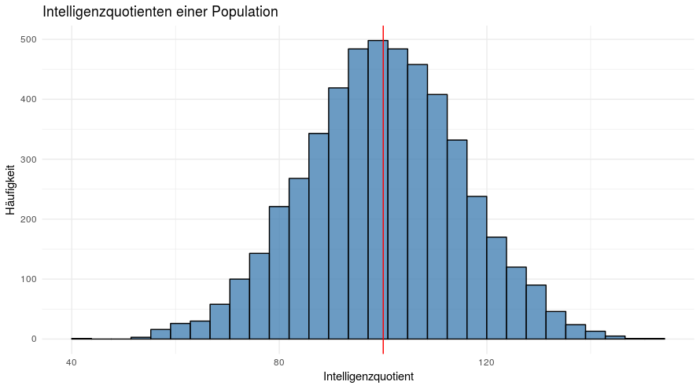

Der ganze Inhalt dieses Kurses lässt sich in einer Gleichung zusammen fassen:

$$
DATA = MODEL + ERROR
$$

## DATA

*DATA* sind die Werte, welche wir in der Regel untersuchen. Beispielsweise untersuchen wir, wie gut Lernende in einem Test abschneiden oder wir möchten wissen, wie alt Menschen werden. In der Statistik wird *DATA* häufig auch als *abhängige Variable* bezeichnet. 

Als Beispiel können wir die Intelligenz einer Person nehmen. Der Intelligenzquotient einer Person ist *DATA*. Unser Ziel ist es, ein Modell zu bilden, welches diesen Wert gut hervorsagt.

## MODEL

*MODEL* bezeichnet ein mathematisches Modell, welches wir benutzen, um *DATA* hervorzusagen. In der Regel versuchen wir eine Vielzahl an Daten in einer verständlichen Form zusammen zu fassen. In einem Zeitungsbericht findest du selten lange Tabellen mit allen Daten eines Experiments. Vielmehr werden in der Regel einzelne Kennwerte vermittelt: 70% der Personen stimmten für Politiker X; Menschen haben im Schnitt einen Intelligenzquotienten von 100. Diese Werte sind nichts anderes als statistische Modelle, auch wenn diese sehr einfach sind. 

Hier ein Beispiel. In der nächsten Visualisierung siehst du eine willkürliche Verteilung der Intelligenz von 5000 Personen. Der rote Strich kennzeichnet den Mittelwert der Verteilung. 

<!-- ```python
library(tidyverse)

# Population
pop <- rnorm(5000, mean = 100, sd = 15)

ggplot(NULL, aes(x = pop)) + 
  geom_histogram(fill = "steelblue", color = "black", alpha = .8) +
  geom_vline(xintercept = mean(pop), color = "red") +
  labs(
    title = "Intelligenzquotienten einer Population",
    x = "Intelligenzquotient",
    y = "Häufigkeit"
  ) +
  theme_minimal()
``` -->



Unser *MODEL* ist in diesem Fall der rote Strich, sprich der Mittelwert. Dieses einfache Modell sagt für jede Person den gleichen Wert voraus. Zudem fasst das Modell alle Werte in einem Kennwert zusammen. Später im Kurs werden wir noch komplexere Modelle kennen lernen.

## ERROR

*ERROR* bezeichnet die Tatsache, dass unser Modell nicht immer die Wirklichkeit richtig abbildet. Du siehst an der Verteilung der Intelligenz der Personen bereits, dass nur wenige Personen tatsächlich einen Intelligenzquotienten haben, der dem Mittelwert ähnlich ist. Vielmehr streuen die Werte sehr weit um den Mittelwert. Den Fehler für jede einzelne Person können wir folgendermaßen berechnen:

$$
ERROR = DATA - MODEL
$$

Nehmen wir beispielsweise an, eine Person hat einen Intelligenzquotient von 90. Unser Modell sagt einen Intelligenzquotienten von 100 voraus: 

$$
ERROR  = 90 - 100 \\
ERROR  = -10
$$

Bei dieser Person ist unser Fehler bei *-10*, das heißt wir überschätzen die Intelligenz dieser Person um 10 Punkte mit unserem einfachen Modell. 