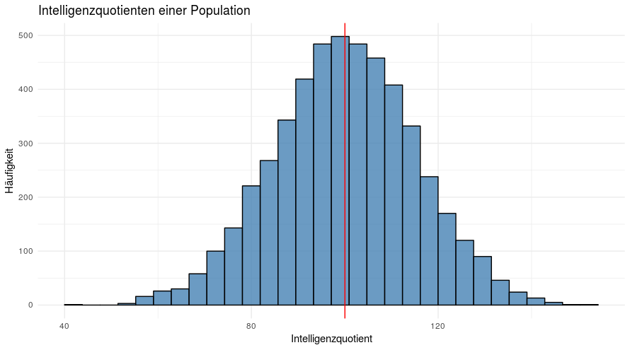

Ein gutes statistisches Modell ist ein Modell, welches die Fehler klein hält und gleichzeitig nicht zu komplex ist. In der Sozialforschung haben wir fast nie Modelle, bei denen wir Fehler von 0 erhalten. Dennoch möchten wir versuchen, diesen Fehler so klein wie möglich zu halten. 

Es ist offensichtlich, dass ein einfaches Modell wie der Mittelwert einer Verteilung in der Regel denkbar schlecht ist, um den Fehler klein zu halten. Schauen wir nochmal die Verteilung von gerade eben an: 

Offensichtlich brauchen wir mehr Informationen als den Mittelwert, um zu berechnen, was der Intelligenzquotient einer Person ist. Man könnte sich zum Beispiel vorstellen, dass der höchste akademische Abschluss ein guter Parameter ist, um die Intelligenz einer Person besser hervorzusagen. 