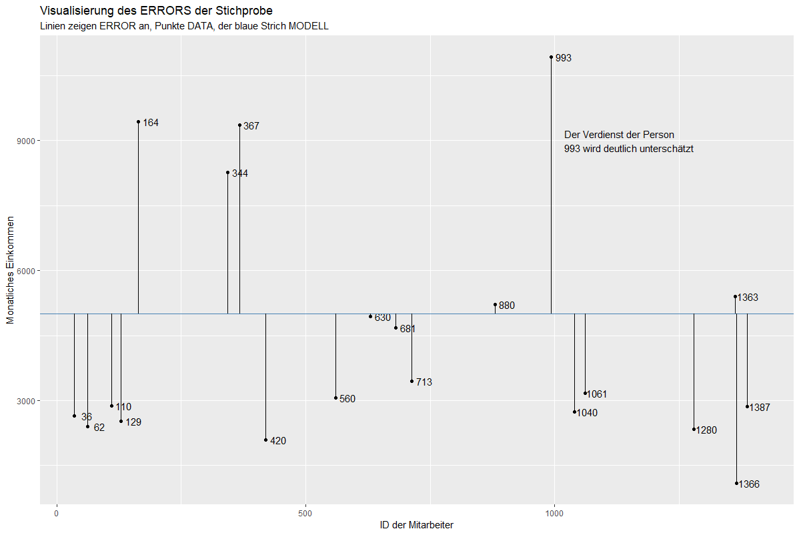
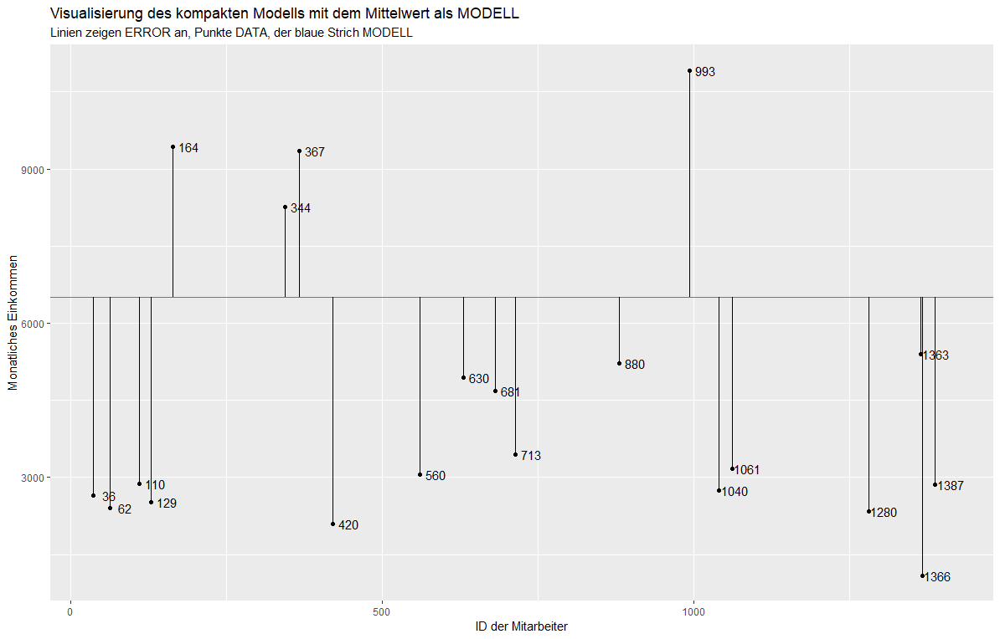
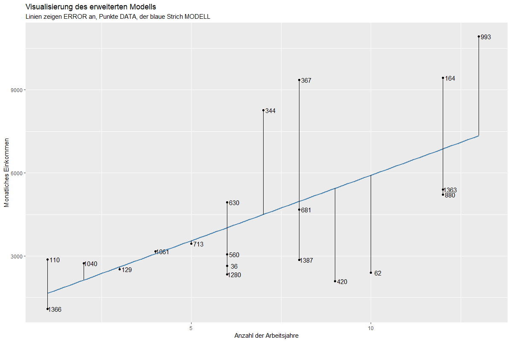
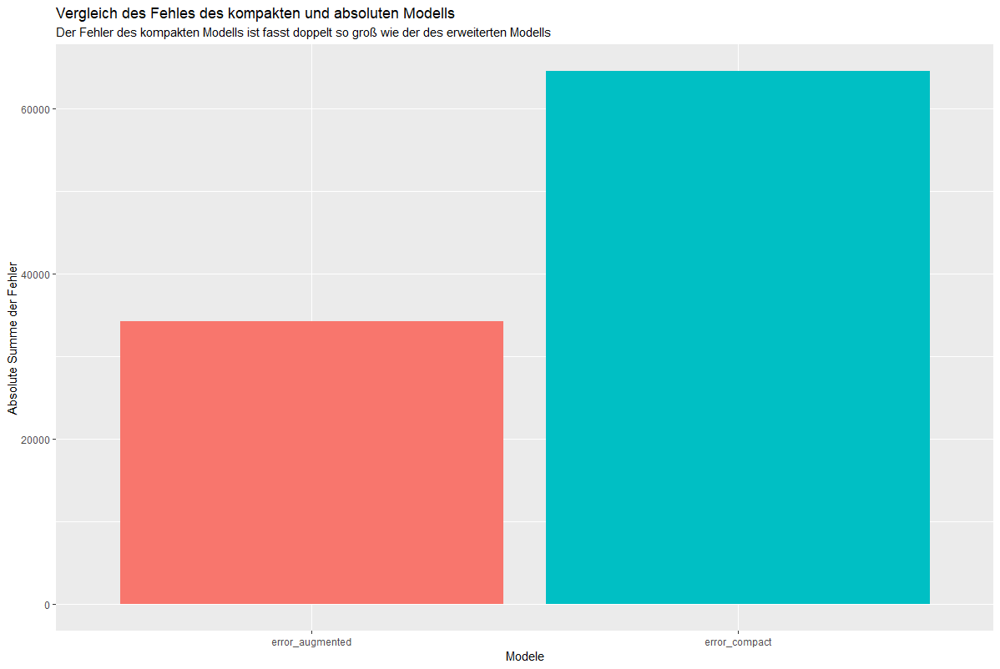
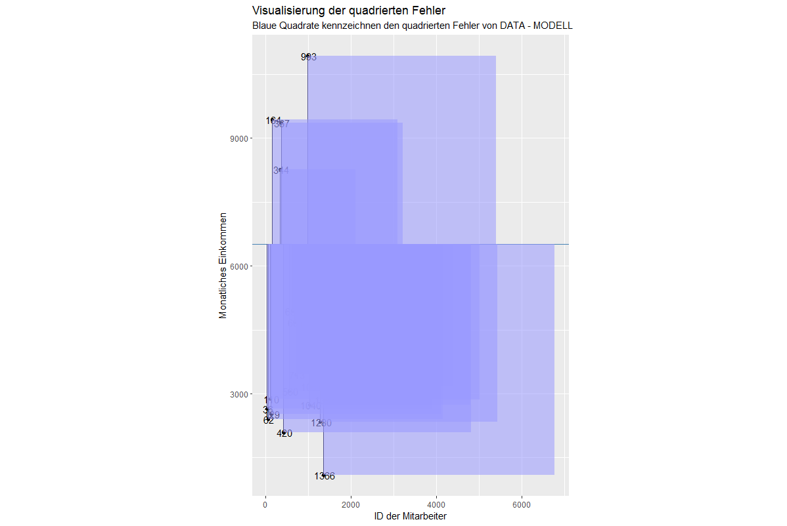

# Data = Model + Error

## Idee

Die deskriptive Statistik dient der Beschreibung von Daten. Durch sie können wir Daten veranschaulichen und übersichtlich darstellen. Die **Inferenzstatistik** dient der Überprüfung von Forschungsfragen und schließlich der Prüfung von Hypothesen: 

* Steigt der Intelligenzquotient über die Schuljahre? 
* Sind Menschen die Kaugumiikauen aufmerksamer als Menschen, die kein Kaugummi kauen? 
* Ist der freie Abruf von Wissen lernförderlicher als das wiederholte Lesen des Lernstoffes? 

Solche Forschungsfragen beantworten wir in der Inferenzstatistik durch statistische Modelle. In anderen Worten ist der tatsächliche Wert einer Variable, die wir schätzen möchten (abhängige Variable) immer die Kombination aus dem mathematischen Modell (z.B. Mittelwert) und dem Fehler, den wir mit diesem Modell machen:

$$
DATA = MODEL + ERROR
$$

$$
ERROR = DATA - MODEL
$$

Stell dir vor, unser Modell nimmt an, dass jeder Mitarbeiter / jede Mitarbeiterin 5000 Dollar pro Monat verdient. Wir nehmen weiterhin an, dass die Mitarbeiter der Firma unsere Population sind. Da wir selten alle Mitarbeiter befragen können, ziehen wir eine Stichprobe von 20 Perosnen (diese ziehen wir mit der Funktion [sample_n](https://dplyr.tidyverse.org/reference/sample.html)). Nachdem wir die Stichprobe gezogen haben, berechnen wir die Abweichungen der tatsächlichen Werte von den geschätzten Werten:


```R
sample_n(human_resources, 20) %>% 
  mutate(
    error = monthly_income - 5000,
    model = 5000
  ) %>% 
  rename(data = monthly_income) %>%
  select(id, data, error, model)
```

```
# A tibble: 20 x 4
      id  data  error model
   <dbl> <dbl>  <dbl> <dbl>
 1  1458  2001  -2999  5000
 2   374  3816  -1184  5000
 3   202  6804   1804  5000
 4   426 17046  12046  5000
 5   239  3931  -1069  5000
 6    34  2086  -2914  5000
 7  1220  2974  -2026  5000
 8   398  4487   -513  5000
 9  1066  4035   -965  5000
10  1070  1563  -3437  5000
11  1439  1790  -3210  5000
12   261  2794  -2206  5000
13  1076 11244   6244  5000
14   619  3424  -1576  5000
15   673  6244   1244  5000
16   866  4115   -885  5000
17  1301  6799   1799  5000
18   913  2875  -2125  5000
19   614  3737  -1263  5000
20   506  2659  -2341  5000
```

In dem Output erkennen wir sehr schnell, dass das Modell keinen einzigen DATA-Wert korrekt hervorgesagt hat. Dies erwarten wir allerdings auch nicht, da es immer einen ERROR geben wird, wenn wir mathematische Modelle berechnen, die Frage ist vielmehr, wie groß die Fehler sind, die wir mit diesen Modellen machen.

> Die zentrale Frage dieses Kurses ist, ob ein von uns angenommenes Modell (unsere Alternativhypothese) diese Fehler stärker reduziert als ein einfacheres Modell (unsere Nullhypothese). 

## Data, Modell, Error

### DATA 

*DATA* sind die Werte, welche wir empirisch erheben. Beispielsweise untersuchen wir, wie gut Lernende in einem Test abschneiden oder wir erheben wie Personen einen Kurs bewerten. In der Statistik wird *DATA* häufig auch als [abhängige Variable](https://de.statista.com/statistik/lexikon/definition/15/abhaengige_variable/) bezeichnet.

Als Beispiel können den Verdienst der Mitarbeiter in unserem Unternehmen nehmen. Der reale Verdienst der Mitarbeiter *DATA*. Unser Ziel ist es, ein mathematisches Modell danach zu testen (unsere Alternativhypothese), ob es die Fehler (ERROR) stärker reduziert als ein einfacheres Modell (unsere Nullhypothese).

### MODEL

*MODEL* bezeichnet ein mathematisches Modell, welches wir benutzen, um *DATA* hervorzusagen. In der Regel versuchen wir eine Vielzahl an Daten in einer verständlichen Form zusammen zu fassen. In einem Zeitungsbericht findest du selten lange Tabellen mit allen Daten eines Experiments. Vielmehr werden in der Regel einzelne Kennwerte vermittelt: 70% der Personen stimmten für Politiker X; Menschen haben im Schnitt einen Intelligenzquotienten von 100. Diese Werte sind nichts anderes als statistische Modelle, auch wenn diese sehr einfach sind. Das einfachste statistische Modell ist beispielsweise der Mittelwert einer Variable. Modelle werden wir in diesem Kurs anhand von Gleichungen darstellen. Beispielsweise nehmen wir in folgendem Modell an, dass der monatliche Verdienst der Mitarbeiter imm 5000 Dollar ist:

$$
\hat{Y} = 5000
$$

### ERROR

Die Werte, welche unsere Modelle schätzen werden in der Regel nicht DATA entsprechen. Die Abweichungen zwischen dem tatsächlichen Wert (DATA) und dem geschätzem Wert nennen wir ERROR oder auch *Residuum*. Die Mitarbeiterin mit der id 7 beispielsweise hat einen ERROR von -2026 Dollar. Dies bedeutet, dass das Modell das tatsächliche monatliche Gehalt der Person um 2026 überschätzt hat.

```
# A tibble: 20 x 4
      id  data  error model
   <dbl> <dbl>  <dbl> <dbl>
 7  1220  2974  -2026  5000
```

## Ein Beispiel

Stell dir erneut vor, wir ziehen 20 Mitarbeiter aus unserer Population aller Mitarbeiter des Unternehmens. Wir nehmen erneut an, dass das durchschnittliche Einkommen 5000 Dollar beträgt:

```R
set.seed(245)
(my_sample <- sample_n(human_resources, 20) %>% 
  mutate(
    error = monthly_income - 5000,
    model       =  5000
  ) %>% 
  rename(data = monthly_income) %>%
  select(id, total_working_years, data, error, model))
```

```
# A tibble: 20 x 4
      id  data error model
   <dbl> <dbl> <dbl> <dbl>
 1  1363  5399   399  5000
 2   713  3452 -1548  5000
 3   344  8268  3268  5000
 4   993 10920  5920  5000
 5    36  2645 -2355  5000
 6   420  2097 -2903  5000
 7  1366  1091 -3909  5000
 8  1061  3172 -1828  5000
 9   129  2523 -2477  5000
10   367  9355  4355  5000
11   681  4678  -322  5000
12  1280  2342 -2658  5000
13   164  9439  4439  5000
14    62  2406 -2594  5000
15  1387  2867 -2133  5000
16  1040  2742 -2258  5000
17   560  3057 -1943  5000
18   110  2871 -2129  5000
19   630  4936   -64  5000
20   880  5220   220  5000
```

In der folgenden Grafik sehen wir die Abweichungen der einzelnen Punkte:

<!-- ```R
ggplot(my_sample, aes(x = id, y = data)) + 
  geom_point() +
  geom_text(aes(label = id), nudge_x = 25) +
  geom_hline(yintercept = 5000, color = "steelblue") +
  geom_segment(
    aes(x = id,
        xend = id,
        y = data,
        yend = 5000
    )
  ) +
  annotate(
    "text", x = 1020, y = 9000,
    hjust = 0,
    label = "Der Verdienst der Person\n993 wird deutlich unterschätzt"
  ) +
  labs(
    title = "Visualisierung des ERRORS der Stichprobe",
    subtitle = "Linien zeigen ERROR an, Punkte DATA, der blaue Strich MODELL",
    x = "ID der Mitarbeiter",
    y = "Monatliches Einkommen"
  ) 
``` -->




Die einzelnen Punkte repräsentieren DATA, also die tatsächlichen Einkommen der Personen. Der blaue horizontale Strich repräsentiert MODELL, unser statistisches Modell. Die vertikalen Striche repräsentieren ERROR, unseren Fehler zwischen den tatsächlichen Werte und dem Modell.


# Kurzfrage

Stell dir folgendes Szenario vor: Du schätzt, wie alt Menschen in Deutschland werden, die im Jahr 2015 geboren sind. Du schätzt, dass Personen, die im Jahr 2015 geboren sind, im Schnitt 86 Jahre alt werden (dein Modell). Nach 105 Jahren liegen Daten zu deiner Schätzung vor. Mareike, welche im Jahr 2015 geboren ist, wurde 84 Jahre alt.

```
- question: Wie groß ist der Fehler (ERROR) für Mareike?
  answers:
    - answer: "-2"
      correct: True
      hint: Sehr gut. Der Fehler ist ERROR = DATA - MODEL. Also ERROR = 84 - 86 = -2
    - answer: "2"
      correct: False
      hint: Nicht ganz. Erinnere dich daran das der Fehler ERROR = DATA - MODEL ist
    - answer: "19"
      correct: False
      hint: Nicht ganz. Erinnere dich daran das der Fehler ERROR = DATA - MODEL ist
    - answer: "-19"
      correct: False
      hint: Nicht ganz. Erinnere dich daran das der Fehler ERROR = DATA - MODEL ist
    - answer: "4"
      correct: False
      hint: Nicht ganz. Erinnere dich daran das der Fehler ERROR = DATA - MODEL ist
```

# Frage 2

```
- question: Welches dieser Beispiele ist kein statistisches Modell? Eine Antwort ist richtig.
  hint: Überlege dir, welches dieser Kennwerte mehrere Daten nicht zusammen fasst. 
  answers:
    - answer: Der Mittelwert einer Verteilung
      correct: False
    - answer: Der Modus einer Verteilung
      correct: False
    - answer: Die Einzelwerte einer Verteilung
      correct: True
    - answer: Die Standardabweichung einer Verteilung
      correct: False
```

## Ziele von Modellen

Ein gutes statistisches Modell ist ein Modell, welches die Fehler (ERROR) klein hält und gleichzeitig nicht zu komplex ist. In der Sozialforschung haben wir fast nie Modelle, bei denen wir Fehler von 0 erhalten. Dennoch möchten wir versuchen, diesen Fehler so klein wie möglich zu halten.

Es ist offensichtlich, dass ein einfaches Modell wie der Mittelwert einer Verteilung in der Regel denkbar schlecht ist, um den Fehler klein zu halten. Schauen wir nochmal die Verteilung von gerade eben an:


Offensichtlich brauchen wir mehr Informationen als den Mittelwert, um zu berechnen, wie viel Geld die Mitarbeiter pro Monat verdienen. Man könnte sich zum Beispiel vorstellen, dass die Anzahl der Arbeitsjahre ein guter Parameter sind, um das monatliche Gehalt der Mitarbeiter genauer hervorzusagen.

> Statistische Modelle sollten die Fehler so klein wie möglich haben und gleichzeitg so sparsam wie möglich sein, d.h. so wenige Parameter wie nötig umfassen.

## Fehlerreduzierung

Es gibt verschiedene Möglichkeiten, den Fehler bei statistischen Modellen zu reduzieren:

### Qualität der Daten verbessern

Zunächst können wir dafür sorgen, dass die Daten ohne Fehler erhoben und eingetragen wurden. Manche Menschen machen Fehler, wenn sie Daten in Excel-Tabellen eintragen, manchmal ist ein Verfahren aber auch unreliabel und zeigt inkonsistente Werte an. Beispielsweise kann eine Waage unreliabel sein, wenn sie beim gleichen Gewicht schwankende Werte angibt.

### Hinzufügen von mehr Parametern

Je mehr Parameter man in ein statistisches Modell hinzufügt, desto geringer wird der Fehler. Wir könnten bei unserem Modell, bei welchem wir das monatliche Gehalt der Mitarbeiter schätzen beispielsweise folgende Parameter hinzunehmen:

* die Anzahl der Berufsjahre. Menschen die länger arbeiten, sollten mehr Geld bekommen
* die Tätigkeit im Unternehmen. Manager sollten mehr verdienen als Sales Executives.
* die Ausbildung der Mitarbeiter. Mitarbeiter mit einem Master sollten in der Regel mehr verdienen als Mitarbeiter, die keinen Hochschulabschluss haben.

Mit jedem Paramater reduziert sich der Fehler. Man könnte daher intuitiv annehmen, dass es sinnvoll wäre, möglichst viele Parameter in ein Modell hinzuzunehmen. Dem ist allerdings nicht so.

### Die Gefahr beim Hinzufügen von Parametern

Es ist nicht sinnvoll, Modelle um beliebig viele Parameter zu erweitern, da nicht jeder Parameter die Fehler substantiell verkleinert. Der monatliche Verdienst der Mitarbeiter sollte beispielsweise unabhängig davon sein, welchen Sport die Mitarbeiter in der Freizeit machen. Genausogut sollte der monatliche Verdienst unabhängig von der politischen Orientierung der Mitarbeiter sein.

> Unser Ziel ist es, so wenige Parameter wie möglich zu verwenden und den Fehler so klein wie möglich zu halten.

Als Folge haben wir ein Problem: Einerseits sollen die Fehler klein gehalten werden, andererseits sollen so wenig Parameter wie möglich verwendet werden!? Deine Aufgabe ist es, die richtige **Balance** der beiden Ansprüche zu finden. Für jeden Parameter müssen wir uns daher die Frage stellen, ob der Parameter *gut genug ist*, um den Fehler substantiell zu reduzieren. Beispielsweise haben wir starke Annahmen, dass die Anzahl der Berufsjahre ein guter Parameter sind, um die Fehler im Vergleich zu unserem einfachen Mittelwertmodell substantielle zu reduzieren.

## Kurzfrage

Stell dir vor, du möchtest ein statistisches Modell erstellen, um die Größe von Personen hervorzusagen. 

```
- question: Welche der folgenden Parameter würden den Fehler vermutlich substantiell reduzieren und wären es daher Wert, in das Modell aufgenommen zu werden?
  hint: Denke nochmal genauer nach. Überlege dir, was ein schlechter Parameter wäre. Sind die vorliegenden Parameter schlecht? 
  answers:
    - answer: Die Größe des Vaters
      correct: True
    - answer: Die Größe der Partnerin/des Partners
      correct: False
    - answer: Unterernährung während der Kinder- und Jugendzeit
      correct: True
```

# Kompakte und erweiterte Modelle

## Zwei Modellarten

Wir hatten gerade gesagt, dass wir den Fehler reduzieren möchten und gleichzeitig Parameter in das Modell aufnehmen möchten, die es wert sind, aufgenommen zu werden, sprich, die den Fehler substantiell reduzieren. Wie können wir allerdings bestimmen, ob ein Parameter nun *gut genug ist*, um aufgenommen zu werden? 

> Um die Güte von Parameter einzuschätzen, vergleichen wir zwei Modelle miteinander, das kompakte Modell (C - compact) und das erweiterte Modell (A - augmented).

### Das kompakte Modell (C)

Das kompakte Modell ist in der Regel das einfachste Modell, welches wir uns vorstellen können. Wir haben bereits kompakte Modelle kennen gelernt: z.B. den Mittelwert einer Verteilung.

> Das kompakte Model nehmen wir immer als **Referenz**, um heraus zu finden, ob Parameter gut genug sind, um den Fehler substantiell zu reduzieren.

### Das erweiterte Modell (A)

Das erweiterte Modell hat immer mehr Parameter als das kompakte Modell; daher erweitert. Wir wissen, dass der Fehler eines Modells kleiner wird, je mehr Parameter wir in ein Modell hinzu nehmen. Daher gilt:

$$
ERROR(A) \leq ERROR(C)
$$


## Beispiel kompaktes und erweitertes Modell

Nehmen wir an unser kompaktes Modell schätzt für jeden Mitarbeiter den Mittelwert aller Mitarbeiter des Unternehmens:

<!-- ```R
mean_income <-  mean(human_resources$monthly_income)
ggplot(my_sample, aes(x = id, y = data)) + 
  geom_point() +
  geom_text(aes(label = id), nudge_x = 25) +
  geom_hline(yintercept = mean_income, color = "steelblue") +
  geom_segment(
    aes(x = id,
        xend = id,
        y = data,
        yend = mean_income
    )
  ) +
  labs(
    title = "Visualisierung des kompakten Modells mit dem Mittelwert als MODELL",
    subtitle = "Linien zeigen ERROR an, Punkte DATA, der blaue Strich MODELL",
    x = "ID der Mitarbeiter",
    y = "Monatliches Einkommen"
  ) 
``` -->




Alternativ vergleichen wir dieses kompakte Modell mit einem Modell, bei dem wir das Einkommen der Mitarbeiter abhängig der Anzahl der Arbeitsjahre der Mitarbeiter vergleichen. Dieses Modell nennen wir erweitertes Modell (an dieser Stelle ist es unerheblich wie dieses Modell berechnet wird, wir kommen im Modul Einfache Regression darauf zurück):

<!-- ```R
set.seed(245)
mean_income <-  mean(human_resources$monthly_income)
(my_sample <- sample_n(human_resources, 20) %>% 
  mutate(
    error = monthly_income - mean_income,
    model       = mean_income
  ) %>% 
  rename(data = monthly_income) %>%
  select(id, total_working_years, data, error, model))

mod <- lm(data ~ total_working_years, data = my_sample)
my_sample_reg <- my_sample %>% 
  add_predictions(mod)
  
ggplot(my_sample_reg, aes(total_working_years, data)) + 
  geom_point() +
  geom_text(aes(label = id), nudge_x = 0.2) +
  geom_smooth(method = lm, se = FALSE, color = "steelblue") +
  geom_segment(
    aes(x = total_working_years,
        xend = total_working_years,
        y = pred,
        yend = data
    )
  ) +
  labs(
    title = "Visualisierung des erweiterten Modells",
    subtitle = "Linien zeigen ERROR an, Punkte DATA, der blaue Strich MODELL",
    x = "Anzahl der Arbeitsjahre",
    y = "Monatliches Einkommen"
  ) 
``` -->



Das Modell besagt, dass das monatliche Einkommen mit steigenden Arbeitsjahren steigt. Erneut sind in der Grafik die gleichen Mitarbeiter dargestellt. 

Vergleichen wir die Fehler beider Modelle miteinander:




Der Fehler des kompakten Modells scheint deutlich höher zu sein, als der Fehler des erweiterten Modells. Dies bedeutet, dass unser erweitertes Modell die Fehler stärker reduzieren kann als das kompakte Modell.

<!-- ```R
my_sample_reg %>% 
mutate(
  error_compact = abs(data - model),
  error_augmented = abs(data - pred)
) %>% 
select(id, error_compact, error_augmented) %>% 
gather(variable, value, -id) %>% 
ggplot(aes(x = variable, y = value)) +
geom_col(aes(fill = variable)) +
guides(fill = FALSE) +
labs(
  title = "Vergleich des Fehles des kompakten und absoluten Modells",
  subtitle = "Der Fehler des kompakten Modells ist fasst doppelt so groß wie der des erweiterten Modells",
  x = "Modele",
  y = "Absolute Summe der Fehler"
)
``` -->


## Null- und Alternativhypothese

In Statistikbüchern liest man selten von kompakten und erweiterten Modellen. Viel gebräuchlicher sind die Begriffe Null- und Alternativhypothese:

* Nullhypothese = kompaktes Modell
* Alternativhypothese = erweitertes Modell

Genauer müssten wir sagen, dass die Nullhypothese das Modell ist, bei welchem alle Parameter, die zusätzlich in dem erweiterten Modell sind, auf Null gesetzt werden. Deswegen heißt das kompakte Modell auch Nullyhypothese. Oder anders gesagt gehen wir bei einer Nullhypothese davon aus, dass es keine Unterschiede zwischen Gruppen gibt. Beispielsweise, indem wir annehmen, dass das monatliche Einkommen der Mitarbeiter unaghängig davon ist, welchen akademischen Abschluss die Mitarbeiter haben.

## Statistisches Hypothesentesten

Wenn nun mein erweitertes Modell den Fehler des kompakten Modells substantiell minimiert (wir kommen später im Kurs darauf, was das bedeutet), *lehne ich die Nullhypothese zu Gunsten der Alternativhypothese ab*. Ist der Fehler *nicht* substantiell kleiner als in der Nullhypothese, gehe ich weiter von der Nullhypothese aus, sage also, dass die Nullhypothese das beste und sparsamste Modell ist, um meine abhängige Variable hervorzusagen.


# Kurzfrage

```
- question: Warum ist der Fehler beim erweiterten Modell kleiner als beim kompakten Modell? 
  answers:
    - answer: Da jeder weitere Parameter DATA besser erklären kann, unabhängig von der Größe des Einflusses.
      hint: Sehr gut. Das ist richtig.
      correct: True
    - answer: Da das erweiterte Modell Parameter hat, die Fehler stärker reduzieren als beim kompakten Modell.
      hint: Nicht ganz. Es ist möglich, dass der Mittelwert beim kompakten Modell den Fehler bereits sehr klein hält und ein weiterer Parameter den Fehler nur minimal verkleinert.
      correct: False
    - answer: Da die Parameter im erweiterten Modell den Fehler substantiell reduzieren.
      hint: Nein. Die Größe der Fehlerreduzierung ist irrelevant für die Frage. Entscheidend ist, warum der Fehler beim erweiterten Modell immer kleiner ist, da er mehrere Parameter hat.
      correct: False
```

# PRE

## PRE berechnen

Um entscheiden zu können, ob die Reduzierung des Fehlers durch das erweiterte Modell groß genug ist, müssen wir einen Weg finden, die Reduzierung des Fehlers zu bestimmen. Wir werden im Verlaufe des Kurses mehrere dieser Wege aufzeichnen: Unter anderem *PRE* und *F*. Zunächst beschäftigen wir uns mit *PRE*.

> PRE lässt sich wie folgt definieren: Wie viel Prozent des Fehlers im kompakten Model wird durch das erweiterte Modell reduziert?

Beispielsweise könnte PRE den Wert .80 annehmen. Das würde bedeutet, dass das erweiterte Modell 80% der Fehler des kompakten Modells reduziert. Berechnet wird PRE folgendermaßen:

$$
PRE = \frac{ERROR(C) - ERROR(A)}{ERROR(C)}
$$

Zwei Dinge sind hierbei wichtig:

1. Wir müssen ERROR(A) von ERROR(A) abziehen und nicht umgekehrt, da wir wissen, dass der Fehler des erweiterten Modells immer kleiner ist als der Fehler des kompakten Modells. Ansonsten würden wir einen negativen Wert erhalten.
2. Wir teilen das Resultat aus der Subtraktion von ERROR(C) - ERROR(A), um ein *relatives* Maß zu erhalten. Relativ abhängig vom kompakten Modell.

Eine alternative Schreibweise für PRE ist:

$$
PRE = 1 - \frac{ERROR(A)}{ERROR(C)}
$$

## Beispiel PRE in R

Nehmen wir an, du entwickest ein kompaktes Modell mit einem Fehler von 30 und ein erweitertes Modell mit einem Fehler von 10. Wie groß wäre die prozentualle Reduzierung des Fehlers abhängig des kompakten Modells?

$$
PRE = \frac{ERROR(C) - ERROR(A)}{ERROR(C)}
$$


```R
(pre <- (30 - 10) / 30) # 0.6666667
# ODER
(pre <- 1 - (10 / 30)) # 0.6666667
```

Mit `pre` geben wir an, dass wir das Ergebnis der Gleichung `(30 - 10) / 30` in einer Variable speichern. Durch die Klammer um den Befehl wird der Output der Variable direkt in R angezeigt. Alternativ können man schreiben:

```R
pre <- (30 - 10) / 30
pre # 0.6666667
```

Das erweiterte Modell reduziert also den Fehler des kompakten Modells um 67% Prozent.

## Übung PRE

Dein kompaktes Modell hat einen Fehler von 80. Dein erweitertes Modell hat einen Fehler von 60. Wie groß ist PRE in diesem Fall? 

```
- question: Dein kompaktes Modell hat einen Fehler von 80. Dein erweitertes Modell hat einen Fehler von 60. Wie groß ist PRE in diesem Fall?  
  answers:
    - answer: 0.33
      hint: Sehr gut. Das ist richtig.
      correct: True
    - answer: 0.25
      hint: Leider nicht. Rechne es nochmal durch.
      correct: False
    - answer: -0.25
      hint: Leider nicht. Rechne es nochmal durch.
      correct: False
    - answer: -0.33
      hint: Leider nicht. Rechne es nochmal durch.
      correct: False
```


# Werte von PRE

Nicht jedes PRE ist gleich beeindruckend. Nehmen wir an, du erhältst ein PRE von .02. Das erweiterte Modell hat fünf Parameter mehr als das kompakte Modell. Welches Modell ist nun besser? Wir gehen davon aus, dass das Modell, welches mit den *wenigsten* Parametern ähnliche Ergebnisse erzielt und daher *sparsamer* ist, besser ist. Aus diesem Grund würden wir in diesem Beispiel sagen, dass das kompakte Modell besser ist, schließlich hat es weniger Parameter als das erweitertes Modell und ein geringes PRE.

Die Werte von PRE können zwischen 0 und 1 annehmen. 1 würde bedeuten, dass das erweiterte Modell alle Fehler des kompakten Modells erklärt. Je höher PRE ist, desto eher sollten wir die zusätzlichen Parameter in ein Modell einfügen, um eine abhängige Variable hervorzusagen. Je kleiner PRE ist, desto eher sollten wir das kompakte Modell behalten.

Nur, ab welchem Wert ist PRE groß genug oder klein genug? Dies hängt von mehreren Faktoren ab. Wenn PRE substantiell durch nur einen Parameter reduziert wird, ist dies besser, als wenn PRE durch mehrere Parameter reduziert wird. Schließlich suchen wir sparsame Modelle mit wenigen Parametern. Im nächsten Modul werden wir diese Fragen genauer beantworten.

# Notation

## Glossar

Wir werden in den nächsten Wochen immer wieder statistische Modelle anschauen und analysieren. Um zu wissen, wovon wir sprechen, ist es wichtig, dass wir die Notation der Begriffe vorab definieren:

* $Y_i$ steht für den Einzelwert von *DATA*, den Werten, welche wir hervorsagen, beziehungsweise den Werte unserer abhängigen Variable. Das kleine $i$ steht für das Untersuchungsobjekt, welches wir gerade betrachten. In der Regel sind das einzelne Menschen.
* $\hat{Y}_i$ steht für unseren auf Grundlage des Modells hervorgesagten Werte. Der reale Wert setzt sich aus der Schätzung und dem Fehler zusammen: $Y_i = \hat{Y}_i + e_i$
* $X_{ij}$ steht für die Variablen, welche wir in unser Modell hinzufügen. $i$ steht für das Untersuchungsobject, $j$ steht für die Nummer der Variable (wir werden später mehrere dieser Variablen in unseren Modellen haben)
* $\beta_{0}, \beta_{1}, ...$ steht für die Parameter unseres Modells, welche wir finden möchten. Wir werden diese Werte allerdings **nie** exakt bestimmen können, da wir nie Daten von ganzen Populationen haben. Als Faustregel gilt: Sobald ein $\epsilon$ in der Gleichung enthalten ist, spreche ich von Parametern, die in der Population gelten (z.B. $\beta_{0}$). 
* $b_0, b_1, ...$ stehen für die Parameter, welche ich auf Grundlage der Daten geschätzt habe. Beispielsweise schätze ich den Mittelwert der Population auf Grundlage des Mittelwerts meiner Stichprobe. $b$ wird immer in Kombination mit $\hat{Y}$ verwendet.
* $e_0, e_1, ...$ stehen für die Fehler, die wir aus dem Modell berechnen, welches wir berechnet haben. $e$ wird also immer in Zusammenhang mit $b$ verwendet und nie mit $\beta$.
* $\epsilon_i$ steht für Fehler der sich ergibt, wenn wir $\beta_i$ kennen. Da sich $\beta$ von $b$ unterscheidet, wird sich auch $e$ von $\epsilon$ unterschieden.

## Beispiele

Dein kompaktes Modell schätzt das monatliche Einkommen der Mitarbeiter durch den Mittelwert aller Mitarbeiter:

$$
Y_i = \beta_0 + \epsilon_i
$$

Das Modell hat nur einen Parameter ($\beta_0$). Da es sich bei diesem Parameter um den tatsächlichen Mittelwert der Population handelt, schreiben wir $\beta_0$ und nicht $b_0$. $b_0$ würden wir angeben, wenn wir den Wert auf Grundlage der Stichprobe berechnet hätten. Der Fehler $\epsilon_i$ ist der tatsächliche Fehler. Dieser unterscheidet sich von $e_i$, welcher immer in Zusammenhang mit $b$ angegeben wird.

Ein anderes Beispiel. Stell dir vor, wir **berechnen** ein erweitertes Modell, bei dem wir das monatliche Einkommen der Mitarbeiter in Abhängigkeit der Arbeitsjahre der Mitarbeiter berechnen:

$$
Y = b_0 * X_i + e_i
$$

Dieses berechnete Modell unterscheidet sich nun von dem tatsächlichen Modell ($Y = \beta_0 * X_i + \epsilon_i$) darin, dass wir $b_0$ schätzen und dementsprechend ein anderer Fehler ($e_i$) entsteht, als mit $\beta_0$. Zusätzlich hat dieses Modell nun den Parameter $X_i$. Dieser Parameter steht für die Anzahl der Arbeitsjahre der spezifischen Person. Das Modell schätzt nun einen Wert $\hat{Y}_i$:


$$
\hat{Y} = b_0 * X_i
$$

Da es sich um eine Schätzung handelt, müssen wir $e_i$ nicht angeben. Der Fehler des Modells für einzelne Personen berechnet sich also aus:

$$
ERROR = Y_i - \hat{Y}_i
$$


# Fehler

## Quadrierte Fehler

Wir wissen, dass ein Mittelwert nie die tatsächlichen Werte von Personen repräsentiert. Kaum eine Person wird genausoviel monatlich verdienen, wie die durchschnittliche Person in dem Unternehmen. Fehler werden folgendermaßen berechnet:

$$
Y_i = b_0 + e_{i}
$$

Daraus ergibt sich, dass:

$$
e_{i} = Y_i - b_0
$$

Oder:

$$
e_{i} = Y_i - \hat{Y}_i
$$

Stellen wir uns eine Mitarbeiterin mit einem monatlichen Gehalt von 4000 Dollar vor. Unter der Annahme, das das durchschnittliche Gehalt der Mitarbeiter 6500 Euro beträgt, wäre der Fehler daher:

$$
e_{i} = 4000 - 6500 = -1500
$$

Betrachten wir erneut die Grafik von vorhin:


Der Fehler ist der Abstand zwischen unserem vorhergesagtem Wert (hier die horizontale Linie) und dem tatsächlichen Wert (hier der Punkt in der Grafik). Wir werden später im Kurs den Fehler allerdings nicht mehr durch eine Linie bestimmen, sondern durch die Quadrierung dieses Fehlers:


<!-- ```R
mean_income <-  mean(human_resources$monthly_income)
ggplot(my_sample, aes(x = id, y = data)) + 
  geom_point() +
  geom_text(aes(label = id), nudge_x = 25) +
  geom_hline(yintercept = mean_income, color = "steelblue") +
  geom_segment(
    aes(x = id,
        xend = id,
        y = data,
        yend = mean_income
    )
  ) +
  geom_rect(aes(xmin = id,
                xmax = id + (abs(data - mean_income)),
                ymin = data,
                ymax = mean_income,
                alpha = .05),
            fill = "#9999ff") +
  guides(alpha = FALSE) +
  labs(
    title = "Visualisierung der quadrierten Fehler",
    subtitle = "Blaue Quadrate kennzeichnen den quadrierten Fehler von DATA - MODELL",
    x = "ID der Mitarbeiter",
    y = "Monatliches Einkommen"
  ) +
  coord_fixed()
``` -->



Die Quadrierung der Fehler hat gewisse mathematische Vorteile, die wir in diesem Kurs nicht besprechen werden. Ein Grund liegt darin, dass die Wahl des Fehlers entscheidet, welches einfachste Modell den Fehler am stärksten reduziert. Würden wir beispielsweise den Fehler als die lineare Abweichung zwischen dem tatsächlichen Wert und dem vorhergesagtem Wert berechnen, wäre der **Median** das Modell, welches die Fehler maximal reduziert. Nehmen wir den Mittelwert als kompaktes Modell, sind die quadrierten Abweichungen das mathematisch korrekteste Modell (mehr Informationen [hier](https://stats.stackexchange.com/questions/118/why-square-the-difference-instead-of-taking-the-absolute-value-in-standard-devia)).


## Aggregierung der Fehler (SSE)

Um zu beschreiben, wie hoch die Fehler sowohl in unserem kompakten Modell als auch in unserem erweiterten Modell sind, müssen wir diese Fehler aggregieren. Es gibt hierfür verschiedene Wege, beispielsweise können wir die linearen Fehler summieren. Wir werden in diesem Kurs die Fehler aggregieren, indem die quadrierten Abweichungen der einzelnen Fehler summiert werden.

Im Bilde gesprochen berechnen wir die Summe der Fläche dieser Quadrate:


Mathematisch gesprochen ist die Summe der quadrierten Abweichungen oder **Sum of Squared Errors** (SSE) also:


$$
SSE = \sum_{i = 1}^n (Y_i - \hat{Y}_i)^2
$$

$Y_i$ entspricht dem tatsächlichen Wert (hier die einzelnen Punkte), $\hat{Y}_i$ entspricht dem Wert, den unser erweitertes Modell hervorsagt. Diese beiden Werte substrahieren wir voneinander und quadrieren diese Differenz (blaue Quadrate). Die Summe dieser Quadrate ergibt SSE oder Sum of Squared Errors.

<!-- ## Standardisierung des quadrierten Fehlers (MSE)

Die Aggregierung der Fehler ist abhängig von der Anzahl der Beobachtungspunkte. Beispielsweise ist die Aggregierung des Fehlers von 5 Personen in der Regel deutlich kleiner als die Aggregierung des Fehlers von 20 Personen. Es ist daher sinnvoll, den aggregierten Fehler zu standardisieren, um Fehler miteinander zu vergleichen. Dies schaffen wir, indem wir den aggregierten Fehler durch die Anzahl der Beobachtungspunkte (Probanden) - p teilen (p steht für die Anzahl der Parameter). Diese Standardisierung des Fehlers nennen wir **Means Squared Error (MSE)**.

$$
MSE = \frac{SSE}{n - p} = \frac{\sum_{i = 1}^n (Y_i - \hat{Y}_i)^2}{n - p}
$$

Du wirst feststellen, dass MSE nichts anderes ist als die Varianz einer Verteilung: 

$$
Varianz = s^2 =  \frac{\sum_{i = 1}^n (x_i - \bar{x})^2}{n - p}
$$

Dementsprechend ist die Wurzel von MSE nichts anderes als die Standardabweichung der standardisierten Fehler:

$$
s = \sqrt{MSE} = \sqrt{\frac{\sum_{i = 1}^n (Y_i - b_0)^2}{n - p}}
$$ -->


## PRE revisited

Da wir nun ERROR als die quadrierten Abweichungen zwischen DATA - MODELL definiert haben, sprechen wir ab jetzt nicht mehr von ERROR, sondern von SSE (Sum of Squared Error). Dementsprechend können wir PRE nun folgendermaßen angeben:

$$
PRE = \frac{SSE(C) - SSE(A)}{SSE(C)}
$$

Diese Gleichung ist äquivalent zur allgemeineren Gleichung:

$$
PRE = \frac{ERROR(C) - ERROR(A)}{ERROR(C)}
$$


$SSE(C) - SSE(A)$ bezeichnen wir ab jetzt als $SSR$ (Sum of Squared Residuals):

$$
PRE = \frac{SSR}{SSE(C)}
$$


## R-Übung

> Ziel der Übung: PRE auf Grundlage des eben beschriebenen erweiterten Modells und des kompakten Modells hervorzusagen.


## Kompaktes und erweitertes Modell

Vergegenwärtigen wir uns erneut unsere beiden Modelle. Das kompakte Modell berechnet das das durschnittliche Einkommen der Mitarbeiter auf Grundlage des Mittelwertes der Stichprobe:

$$
Y_i = b_0 + e_i
$$

Der Mittelwert der Stichprobe ist 4474, daher:

$$
Y_i = 4474 + e_i
$$

Unser erweitertes Modell berechnet das durchschnittliche Einkommen auf Grundlage der bisherigen Arbeitsjahre der Person: 

$$
Y_i = b_0 + b_1*X_1 + e_i
$$

Wie wir zu dieser Gleichung kommen ist an dieser Stelle noch nicht wichtig (wir kommen in dem Modul lineare Regression darauf zurück). Das Modell hat insgesamt zwei Parameter ($b_0$ und $b_1$) und sieht folgendermaßen aus:

$$
Y_i = 1184.4 + 473.4*X_1 + e_i
$$

Arbeitet eine Mitarbeiterin beispielsweise seit 10 Jahren, schätzen wir folgendes monatliches Gehalt auf 5918.4 Dollar:

$$
\hat{Y}_i = 1184.4 + 473.4*10 = 5918.4
$$


## PRE berechnen

Im nächsten Schritt möchten wir PRE berechnen. PRE haben wir als den prozentualen Anteil des Fehlers des kompakten Modells bezeichnet, der durch das erweiterte Modell reduziert wird:

$$
PRE = \frac{SSE(C) - SSE(A)}{SSE(C)} = \frac{SSR}{SSE(C)}
$$


Schauen wir uns nochmal unsere Stichprobe an:


```R
set.seed(245)
(my_sample <- sample_n(human_resources, 20) %>% 
    select(id, total_working_years, monthly_income))
```

```
# A tibble: 20 x 3
      id total_working_years monthly_income
   <dbl>               <dbl>          <dbl>
 1  1363                  12           5399
 2   713                   5           3452
 3   344                   7           8268
 4   993                  13          10920
 5    36                   6           2645
 6   420                   9           2097
 7  1366                   1           1091
 8  1061                   4           3172
 9   129                   3           2523
10   367                   8           9355
11   681                   8           4678
12  1280                   6           2342
13   164                  12           9439
14    62                  10           2406
15  1387                   8           2867
16  1040                   2           2742
17   560                   6           3057
18   110                   1           2871
19   630                   6           4936
20   880                  12           5220
```

Mit Hilfe der Funktion `mutate` können wir sowohl den Fehler des erweiterten Modells als auch des kompakten Modells berechnen:


```R
errors <- my_sample %>% 
  mutate(
    compact       = mean(monthly_income),
    augmented     = 1184.4 + 473.4 * total_working_years,
    res_compact   = (compact - monthly_income)^2,
    res_augmented = (augmented - monthly_income)^2
  )
glimpse(errors)
```

```
Variables: 7
$ id                  <dbl> 1363, 713, 344, 993, 36, 420, 1366, 1061, 129, 367, 681, 1280...
$ total_working_years <dbl> 12, 5, 7, 13, 6, 9, 1, 4, 3, 8, 8, 6, 12, 10, 8, 2, 6, 1, 6, 12
$ monthly_income      <dbl> 5399, 3452, 8268, 10920, 2645, 2097, 1091, 3172, 2523, 9355, ...
$ compact             <dbl> 4474, 4474, 4474, 4474, 4474, 4474, 4474, 4474, 4474, 4474, 4...
$ augmented           <dbl> 6865.2, 3551.4, 4498.2, 7338.6, 4024.8, 5445.0, 1657.8, 3078....
$ res_compact         <dbl> 855625, 1044484, 14394436, 41550916, 3345241, 5650129, 114446...
$ res_augmented       <dbl> 2149742.44, 9880.36, 14211392.04, 12826425.96, 1903848.04, 11...
```

Du kannst beispielsweise erkennen, dass bei Mitarbeiterin 1363 (erste Zahl), der Fehler im kompakten Modell kleiner ist als im erweiterten Modell. Das kompakte Modell hat einen Fehler von 855625, während das erweiterte Modell einen Fehler von 2149742.44 hat. Die Summe aus `res_compact` und `res_augmented` entspricht nun SSE(C) und SSE(A): 

```R
(sse_c <- sum(errors$res_compact))   # 152055906
(sse_a <- sum(errors$res_augmented)) #  94488640
(ssr <- sse_c - sse_a)               #  57567266
```

Im nächsten Schritt können wir PRE berechnen:

```R
(pre <- ssr/sse_c) # 0.3785928
```

Unser erweitertes Modell reduziert also den Fehler des kompakten Modells um 37.8%. Um nun zu bestimmen, ob diese Reduzierung gut genug ist, um das erweiterte Modell bzw. die Alternativhypothese anzunehmen, müssen wir im nächsten Modul verstehen, wie wir bestimmen können, ob ein Fehler substantiell reduziert wird.

# Statistische Hypothesen

## Typen von Hypothesen

Wir werden im Verlaufe des Kurses verschiedene mathematische Modelle kennen lernen. Bei jedem Modell prüfen wir, ob diese Modelle bzw. die einzelnen Parameter dieser Modelle die Fehler im Vergleich zu einem kompakten Modell substantiell reduzieren. Bevor wir im nächsten Kapitel klären, was dies bedeutet, müssen wir uns noch verschiedene Hypothesen vergegenwärtigen, die wir durch mathematische Modelle beantworten: Zusammenhangshypothesen, Unterschiedshypothesen und Veränderungshypothesen. 

> Wichtig: Jede Hypothesenart wird auf Grundlage des eben beschriebenen Verfahrens (kompaktes vs. erweitertes Modell, PRE) berechnet. Wir differenzieren diese Konzepte im Verlaufe des Kurses nur für die unterschiedlichen Hypothesen weiter aus.

### Zusammenhangshypothesen

Ein Beispiel für eine Zusammenhangshypothese wäre: *Höhere Werte in einem Motivationstest führen zu höheren Werten im Lerntest*, oder *Je größer der Vater, desto größer das Kind*. Zusammenhangshypothesen sind im Bereich des Lehren und Lernens immer wieder wichtig:

* Gibt es einen Zusammenhang zwischen dem akademischen Hintergrund der Eltern und der Intelligenz ihrer Kinder?* Gibt es einen Zusammenhang zwischen der Motivation beim Lernen und dem Abschneiden in Klausuren? 
* Gibt es einen Zusammenhang zwischen der Zeitstunden an Vorbereitung für eine Klausur und dem Abschneiden in der Klausur?

Wir werden Zusammenhangshypothesen später im Kurs mit Hilfe der linearen Regression testen.

### Unterschiedshypothesen

Ein Beispiel für eine Unterschiedshypothese wäre: *Lernende, die verteilt lernen behalten den Lernstoff nachhaltiger als Lernende, die geblockt lernen*. Unterschiedshypothesen werden meist in experimentellen Studien angewandt, in denen wir Menschen verschiedenen Experimentalgruppen zuordnen:

* Schneiden Lernende, die von sich behaupten, visuelle Lerntypen sind, besser bei visuellen Aufgaben ab, als Lernende, die von sich behaupten, auditive Lerntypen zu sein (nein, siehe [hier](https://www.sciencedirect.com/science/article/pii/S0360131516302482))
* Haben Lernende aus Finnland ein besseres Leseverständnis als Lernende aus Deutschland und Frankreich?
* Ist problembasiertes Lernen für das Erlernen von Fertigkeiten wirksamer als direkte Instruktion?

Unterschiedshypothesen lernen wir im Verlauf dieses Kurses im Modul One-Way ANOVA und Factorial ANOVA kennen.

### Veränderungshypothesen

Ein Beispiel für eine Veränderungshypothese wäre: *Mediationstechniken verringern die Aggression*. Veränderungshypothesen untersuchen die Veränderung einer abhängigen Variable (hier Aggression) über die Zeit hinweg:

* Die Anwendung von Retrieval Practice über mehrere Wochen erhöht die Metakognition der Lernenden bezüglich Ihres Verständnisses des Lernstoffs.
* Das regelmäßige Spielen von Ego-Shootern führt zu einer gesteigerten Aggression bei Jugendlichen.

Veränderungshypothesen lernen wir im Verlaufe dieses Kurses im Modul Messwiederholungsanalyse oder Repeated-Measures ANOVA kennen.


## Eigenschaften von Hypothesen

Hypothesen haben immer bestimmte Eigenschaften:

* Allgemeingültigkeit: Wir möchten auf Grundlage der Hypothesen Aussagen über eine Population treffen, nicht über die Stichprobe. Die Schwierigkeit der Inferenzstatistik besteht darin, dass wir die Population nicht kennen und daher Wege finden müssen, Aussagen über die Population zu treffen.
* Probabilistisch: Mit Hilfe von Hypothesen machen wir Aussagen von Gruppen. Einzelne Personen können nicht dem Muster unserer Hypothese entsprechen, dies widerlegt allerdings nicht die Hypothese. Beispielsweise könnten wir folgende Unterschiedshypothese annehmen: *Lernende, die mehr als 8 Stunden schlafen sind am Morgen konzentrierter als Lernende, die weniger als 8 Stunden schlafen*. Eine Person, die nun unter 8 Stunden schläft und dennoch hoch konzentriert ist, widerlegt diese Hypothese nicht. Diese Person ist eher ein Ausreißer des allgemeinen Musters der Menschen.


## Population vs. Stichprobe

In experimentellen Studien können wir nur selten die ganze Population betrachten. Selbst bei Wahlvorhersagen wird nur immer ein kleiner Teil der Population (hier die Gesamtbevölkerung eines Landes) erhoben. Genauso verwenden wir in Studien häufig nur einen kleinen Teil der Population, die Stichprobe. Auf Grundlage dieser Stichprobe versuchen wir allgemeingültige Aussagen über die Population zu treffen (mehr findest du in [Bortz und Schuster (2010, Kapitel 6)](https://www.springer.com/de/book/9783642127694)). 


# Modeling Example

## Hintergrund


```R
library(tidyverse)
library(jmv)
library(ggthemes)

human_resources <- read_csv("C:/Users/ChristianEZW/repositories/statistik_2_online_kurs/data/markdown/hr_cleaned.csv")

# Stell dir vor, der CEO des Unternehmenes möchte, dass die Mitarbeiter 
# schneller eine Beförderung als nach 3.5 Jahren erhalten. Viele
# Mitarbeiter waren unzufrieden und gaben an, dass sie lange auf
# Ihre Beförderung warten mussten. Der CEO hat daher vor ein paar Jahren
# ein KPI (Key Performance Indicator) angegeben, in dem er vorgab,
# dass Mitarbeiter im Schnitt unter 3.5 Jahren eine Beförderung erhalten sollten.
# Nun soll die Erreichung dieses KPI geprüft werden.

# Unsere Hypothese lautet daher (Unterschiedshypothese):
#  - Erhalten Mitarbeiter des Unternehmens früher als nach 3.5 Jahren eine Beförderung? 
#  - AV (abhängige Variable): Jahre seit der letzten Beförderung
#    UV (unabhängige Variable): 
#      - Mittelwert der Stichprobe seit der letzten Beförderung
#      - Angenommener KPI des CEO

# Um die Hypothese zu bearbeiten, befragen wir stellvertretend 50 Mitarbeiter des Unternehmens:

set.seed(22)
(my_sample <- human_resources %>% 
  sample_n(50) %>% 
  select(id, years_since_last_promotion))

# Schauen wir uns ein Balkendiagram an, bei dem wir einsehen können, wie schnell die Mitarbeiter
# befördert wurden:

ggplot(my_sample, aes(x = years_since_last_promotion)) + 
  geom_bar(fill = "chocolate2") +
  labs(
    title = "Wie lange liegt die letzte Beförderung der Mitarbeiter zurück?",
    x = "Jahre seit der letzten Beförderung",
    y = "Häufigkeit"
  ) +
  theme_economist()

# Wie lautet der Mittelwert der Stichprobe hinsichtlich der abhängigen Variable
mean(my_sample$years_since_last_promotion)

# Kompaktes Modell:    Y_i = 3.5
# Erweitertes Modell:  Y_i = 1.88

# SSEs berechnen
(errors <- my_sample %>% 
  mutate(
    compact_model = 3.5,
    augmented_model = 1.88,
    res_compact   = (years_since_last_promotion - compact_model)**2,
    res_augmented = (years_since_last_promotion - augmented_model)**2
  ))


(sse_c <- sum(errors$res_compact))  
(sse_a <- sum(errors$res_augmented))
(ssr <- sse_c - sse_a)

# PRE berechnen
(pre <- ssr / sse_c)

# -> Der Mittelwert der Stichprobe reduziert den Fehler des kompakten Modells um 24.3%. Dies gibt uns
#    Evidenz, dass der KPI errreicht wurde. Wäre PRE bei 0, dann hätten sich die
#    die Jahre bis zur Beförderung nicht reduziert. Wir haben also erste Evidenz, dass 
#    das KPI erreicht wurde. Um diese Frage endgültig zu beantworten, müssen wir allerdings 
#    im nächsten Modull berechnen, ob diese Reduzierung des Fehlers substantiell genug ist,
#    um vorläufig das erweiterte Modell anzunehmen. 


```