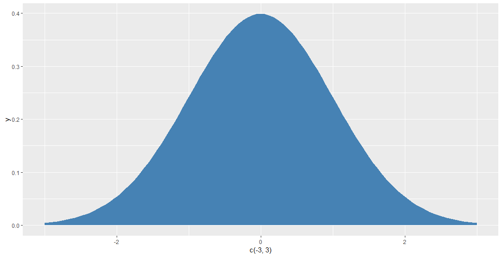
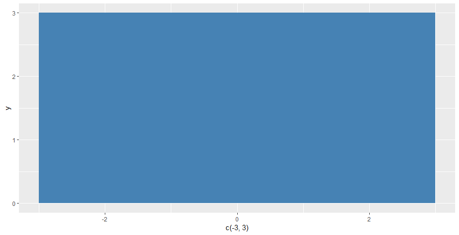
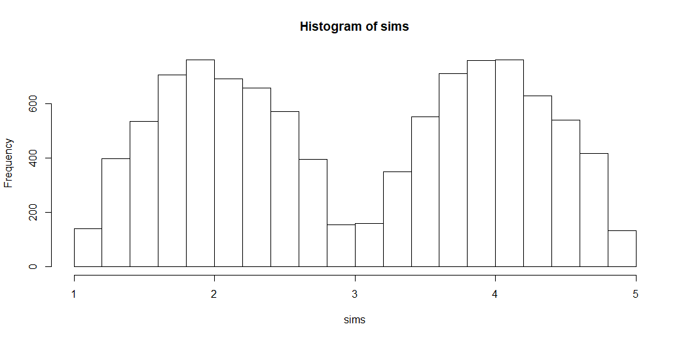
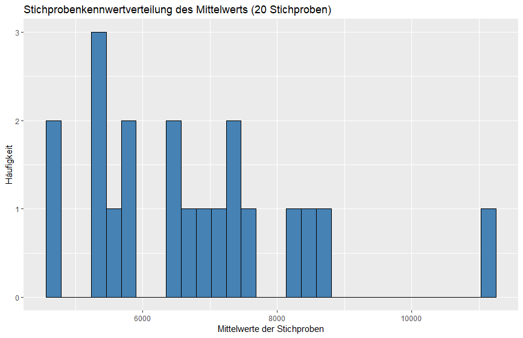
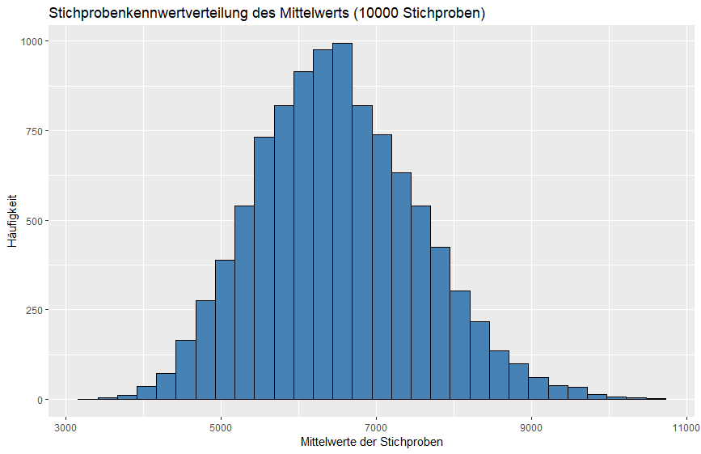
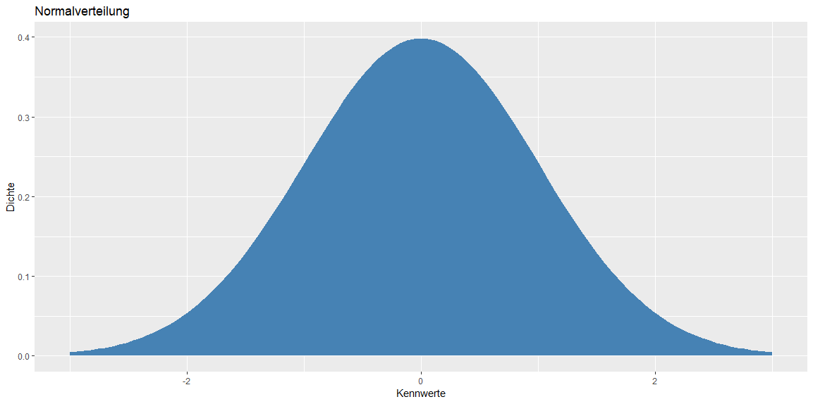
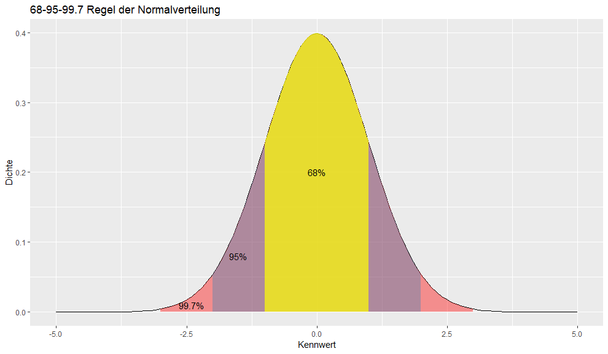
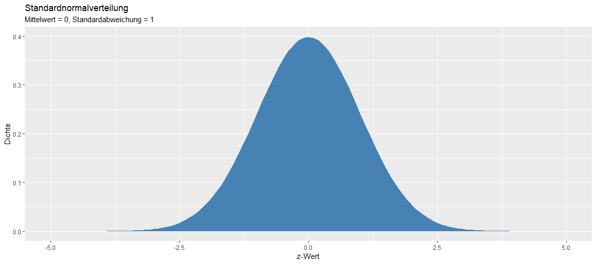
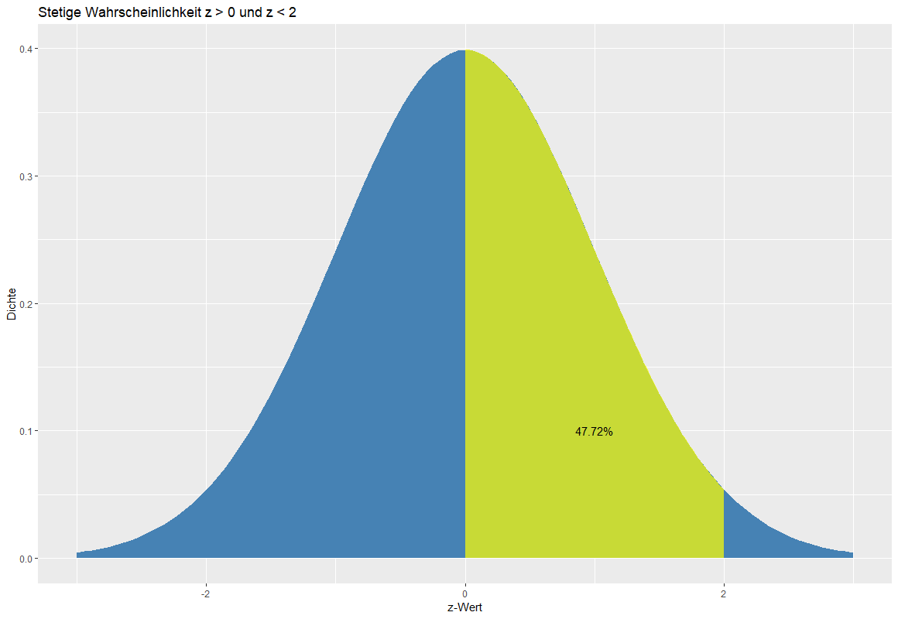

# Stichprobenkennwertverteilungen

## Konzeptuelles Verständnis

Wir haben im letzten Kapitel häufiger davon gesprochen, dass wir die Nullhypothese verwerfen, wenn der Fehler des kompakten Modells, durch das erweiterte Modell substantiell verkleinert wird. Nur was bedeutet es, einen Fehler substantiell verkleinert zu verkleinern?  Um diese Frage beantworten zu können, verwenden wir **Stichprobenkennwertverteilungen**. Das Wort Stichprobenkennwertverteilung gibt uns bereits einige Hinweise, um zu verstehen, was dieses Wort bedeutet.

1. Stichprobe
2. Kennwert
3. Verteilung

### Stichprobe

Eine Stichprobe ist eine Teilmenge aus einer Grundgesamtheit. Wahlvorhersagen werden auf Grundlage von Stichproben gezogen, da es mühselig wäre, alle Menschen eines Landes (die Grundgesamtheit) zu befragen. Daher erheben wir immer nur einen kleinen Anteil der Population und versuchen auf Grundlage dieser Stichprobe auf die Population zu schließen.

### Kennwert

Statistische Kennwerte fassen mehrere Datenpunkte zusammen. Du kennst bereits mehrere dieser Kennwerte: Der Mittelwert, der z-Wert, die Standardabweichung oder die Varianz. Jeder dieser Kennwerte fasst Daten zusammen. Der Mittelwert gibt den typischen Wert einer Verteilung an, die Varianz gibt an, wie weit Werte um einen Mittelwert streuen. In den nächsten Wochen werden wir uns vor allem mit dem Mittelwert, PRE, dem t-Wert und dem F-Wert beschäftigen. All diese Werte sind statistische Kennwerte.

### Verteilung

Eine Verteilung ist eine grafische Darstellung des Auftretens einzelner Ausprägung einer Variable. Beispielsweise kennst du unimodale Verteilungen mit nur einem Gipfel:

<!-- ```
ggplot(NULL, aes(x = c(-3, 3))) +
  stat_function(fun = dnorm,
                geom = "area",
                fill = "steelblue")
``` -->



Oder eine stetige Verteilung



Oder eine bimodale Verteilung:

<!-- ```
nn <- 1e4
set.seed(1)
betas<-rbeta(nn,2,2)
sims <- c(betas[1:(nn/2)]*2+1,
          betas[(nn/2+1):nn]*2+3)


hist(sims)
``` -->




### Stichprobenkennwertverteilung revisited

Eine Stichprobenkennwertverteilung ist daher eine Verteilung von Kennwerten, die aus einer Stichprobe gewonnen werden. Beispielsweise:

* Die Verteilung von Mittelwerten, die aus mehreren Stichproben berechnet werden.
* Die Verteilung von Mittelwertsdifferenzen, die aus mehreren Stichproben berechnet werden.
* Die Verteilung von PRE, die aus mehreren Stichproben berechnet werden.
* Die Verteilung von Varianzen, die aus mehreren Stichproben berechnet werden.

## Simulation einer Stichprobenkennwertverteilung in R

Um Stichprobenkennwertverteilungen besser zu verstehen, hilft es, diese zu simulieren. Stellen wir uns erneut unsere Population als unsere fiktive Firma mit ihren 1470 Mitarbeitern vor. Versuchen wir im nächsten Schritt den Mittelwert des monatlichen Einkommens einer Stichprobe von 20 Personen zu berechnen:


```R
set.seed(453)
my_sample <- sample_n(human_resources, 20)
my_sample$monthly_income %>% mean # 5483.65
```

Diese Stichprobe verdient im Schnitt 5483.65 Dollar pro Monat. Dieser Mittelwert entspricht allerdings nicht dem Mittelwert der Population, welchen wir in der Regel nicht kennen. Da wir allerdings die Population kennen, können wir den Mittelwert berechnen:

```R
mean(human_resources$monthly_income) # 6502.931
```

Wir unterschätzen den Mittelwert der Stichprobe also erheblich durch unsere Stichprobe.

Um nun zu einer Stichprobenkennwertverteilung zu gelangen, benötigen wir sehr viele dieser Kennwerte aus sehr vielen Stichproben. Versuchen wir daher als nächstes die Mittelwerte von 20 Stichproben zu ziehen (den Code musst du an dieser Stelle nicht verstehen):

```R
(twenty_samples <- c(1:20) %>% 
  map_dbl(~ sample_n(human_resources, 20) %>% 
            {mean(.$monthly_income)}))
```

```
[1]  8147.30  5338.25  5379.75  5312.45  7260.05  6887.40  5726.00  8796.30 11089.40  8490.10
[11]  7251.15  4628.45  7050.95  6419.60  5824.75  5658.65  4635.70  6430.65  7647.00  6765.95
```

Erneut erhalten wir ganz unterschiedliche Mittelwerte. Versuchen wir diese Mittelwerte in einem Histogramm darzustellen:

```R
ggplot(NULL, aes(x = twenty_samples)) +
  geom_histogram(fill = "steelblue", color = "black") +
  labs(
    title = "Stichprobenkennwertverteilung des Mittelwerts",
    x = "Mittelwerte der Stichproben",
    y = "Häufigkeit"
  )
```



Die Stichprobenkennwertverteilung ist weder unimodal, noch stetig, noch bimodal. Was passiert, wenn wir anstatt 20 10.000 Stichproben ziehen?


```R
ten_thousand_samples <- c(1:10000) %>% 
    map_dbl(~ sample_n(human_resources, 20) %>% 
    {mean(.$monthly_income)})

    
ggplot(NULL, aes(x = ten_thousand_samples)) +
  geom_histogram(fill = "steelblue", color = "black") +
  labs(
    title = "Stichprobenkennwertverteilung des Mittelwerts (10000 Stichproben)",
    x = "Mittelwerte der Stichproben",
    y = "Häufigkeit"
  )
```



Nun erhalten wir eine unimodale Verteilung. Selten erhalten wir in einer Stichprobe einen Mittelwert von über 9000 und selten erhalten wir in einer Stichprobe einen Mittelwert unter 4000 Dollar.

> Stichprobenkennwertverteilungen zeigen an, wie wahrscheinlich bestimmte Kennwerte (z.B. PRE) auftreten, wenn wir von der Nullhypothese ausgehen. Wir können Stichprobenkennwertverteilung daher benutzen, um heraus zu finden, ob Fehler durch das erweiterte Modell substantielle reduziert werden.

## Eigenschaften von Stichprobenkennwertverteilungen

### Je größer die Stichprobe, desto kleiner die Standardabweichung der Normalverteilung

```R
twenty <- c(1:10000) %>% 
    map_dbl(~ sample(human_resources$monthly_income, 20) %>% mean)

fifty <- c(1:10000) %>% 
    map_dbl(~ sample(human_resources$monthly_income, 50) %>% mean)

hundred <- c(1:10000) %>% 
    map_dbl(~ sample(human_resources$monthly_income, 100) %>% mean)

tibble(
  twenty = twenty,
  fifty = fifty,
  hundred = hundred
) %>% 
  gather(sample, value) %>% 
  ggplot(aes(x = value, fill = sample)) +
  geom_density(aes(fill = sample), alpha = .5) +
  labs(
    title = "Stichprobenkennwertverteilungen bei unterschiedlichen Stichprobengrößen",
    fill = "Stichprobe",
    x = "Mittelwert des monatlichen Einkommens der Stichproben",
    y = "Dichte"
  )
```


Die rote Stichprobenkennwertverteilung zeigt eine Stichprobenkennwertverteilung an, die aus Stichproben mit 50 Mitarbeitern generiert wurde. Die blaue Stichprobenkennwertverteilung wurde anhand einer Stichprobengröße von 20 Mitarbeitern generiert. Die grüne Stichprobenkennwertverteilung wurde anhand einer Stichprobe von 100 Mitarbeitern generiert.

Du siehst, dass die Verteilung mit einer steigenden Stichprobengröße eine geringere Varianz aufweißt und *steiler* wird. Ein Grund hierfür ist, dass der Kennwert durch eine größere Stichprobe akkurater geschätzt wird. Stell dir das Extrem vor: Deine Stichproben sind fast so groß wie die ganze Population. Als Folge wirst du fasst immer Werte erhalten, die fast exakt dem Mittelwert entsprechen. Die Stichprobenkennwertverteilung wird daher sehr schmal sein. Bei einer geringen Stichprobegröße erhälst du den gegenteiligen Effekt. Deine Schätzungen des Kennwertes werden sehr variieren, daher ist deine Stichprobenkennwertverteilung breiter.

### Die Standardabweichung der Stichprobenkennwertverteilung des Mittelwertes nennt man Standardfehler

Jede Verteilung hat einen Mittelwert und eine Standardabweichung. Die Stichprobenkennwertverteilung ist keine Ausnahme. Auch sie hat eine Standardabweichung. Diese nennen wir **Standardfehler**. Der Standardfehler der Stichprobenverteilung des Mittelwerts können wir folgendermaßen folgendermaßen schätzen:

$$
SE = \frac{\sigma}{\sqrt{N}}
$$

$\sigma$ kennzeichnet die Standardabweichung der Stichprobe. $N$ kennzeichnet die Größe der Stichprobe.  Wir müssen den Standardfehler schätzen, da wir die Standardabweichung der Population in der Regel nicht kennen. Daher nehmen wir die Standardabweichung der Stichprobe, um den Standardfehler der Stichprobenkennwertverteilung zu schätzen.

Durch diese Formel lässt sich auch erklären, weshalb der Standardfehler bei einer größeren Stichprobe kleiner wird. Stell dir eine Stichprobe von 20 vor. Die Standardabweichung der Verteilung der Stichprobe ist 100:

$$
SE = \frac{100}{\sqrt{20}} = 5
$$

Hätten wir eine Stichprobe von 50 Personen bei einer gleichen Standardabweichung, wäre der Standardfehler:

$$
SE = \frac{100}{\sqrt{50}} = 2
$$


### Die Streuung in der Population ist immer größer als die Streuung in der Stichprobenkennwertverteilung

Der Grund für dieses Phänomen liegt darin, dass eine Stichprobe eines Kennwertes weniger wahrscheinlich extreme Werte einer Verteilung generiert als die tatsächlichen Werte. Stell dir vor, es gibt eine Mitarbeiterin mit einem monatlichen Einkommen von 10000 Dollar. Dies ist ein seltenes Ereignis. Da ein Kennwert immer eine Aggregierung mehrerer Werte ist, wird dieses hohe Einkommen zwar evtl. in den Kennwert einer Stichprobe mit hinein gerechnet, aber immer durch weniger extreme Werte angeglichen, da diese wahrscheinlicher gezogen werden. Hierduch ist die Streuung in der Population größer als in der Stichprobe.

### Der Mittelwert der Stichprobenkennwertverteilung ist der gleiche Mittelwert der Population

Zwar ist die Streuung der Stichprobenkennwertverteilung, deren Mittelwert ist allerdings der gleiche.

# Normalverteilung und Standardnormalverteilung

## Normalverteilung

Normalverteilungen sind besondere Verteilungen, die häufig in der Natur anzutreffen sind. Beispielsweise entspricht die Intelligenz von Personen in der Regel einer Normalverteilung. Ebenso entspricht die Größe von Personen oder der Blutdruck von Personen. 

Eine Normalverteilung sieht immer so aus:

<!-- ```R
ggplot(NULL, aes(x = c(-3, 3))) +
     stat_function(fun = dnorm,
                   geom = "area", fill = "steelblue") + 
      labs(title = "Normalverteilung", x = "Kennwerte", y = "Dichte")
``` -->



Normalverteilungen zeichen sich durch folgende Eigenschaften aus:

1. Sie sind unimodal. Es gibt nur einen Gipfel.
2. Sie sind symmetrisch vom Zentrum der Verteilung.
3. Der Mittelwert, der Modus und der Median sind gleich.
4. Die gesamte Fläche der Verteilung hat den Wert 1.

Zusätzlich hat die Normalverteilung einige wichtige statistische Eigenschaften:

* 68% der Werte fallen eine Standardabweichung vom Mittelwert.
* 95% der Werte fallen zwei Standardabweichungen vom Mittelwert.
* 99.7% der Werte fallen innerhalb von drei Standardabweichungen vom Mittelwert.

<!-- ```R
ggplot(NULL, aes(x = c(-3, 3))) +
  stat_function(fun = dnorm,
                geom = "line",
                xlim = c(-5, 5)) +
  stat_function(fun = dnorm,
                geom = "area",
                fill = "red",
                alpha = .4,
                xlim = c(-3, 3)) +
  stat_function(fun = dnorm,
                geom = "area",
                fill = "steelblue",
                alpha = .4,
                xlim = c(-2, 2)) +
  stat_function(fun = dnorm,
                geom = "area",
                fill = "yellow",
                alpha = .7,
                xlim = c(-1, 1)) +
  annotate("text", x = 0, y = 0.2, label = "68%") +
  annotate("text", x = -1.5, y = 0.08, label = "95%") +
  annotate("text", x = -2.4, y = 0.01, label = "97.5%") +
  xlim(-5, 5) +
  labs(
    title = "68-95-97.7 Regel der Normalverteilung",
    x = "Kennwert",
    y = "Dichte"
  )
``` -->



### Zusätzliche Informationen

* [Explaining the 68-95-99.7 rule for a normal distribution](https://towardsdatascience.com/understanding-the-68-95-99-7-rule-for-a-normal-distribution-b7b7cbf760c2)
* [Normal distributions - Statistics How To](https://www.statisticshowto.datasciencecentral.com/probability-and-statistics/normal-distributions/)


## Standardnormalverteilung

Die Standardnormalverteilung ist eine besondere Normalverteilung, für die folgendes gilt:

* Der Mittelwert der Standardnormalverteilung ist immer 0.
* Die Standardabweichung der Standardnormalverteilung ist immer 1.



Die Standardnormalverteilung wird auch **z-Verteilung** genannt, Kennwerte in der Standardnormalverteilung z-Werte darstellen. Zur Erinnerung, wir können Mittelwerte z-transformieren, indem wir diese vom Mittelwert abziehen und durch die Standardabweichung der Verteilung teilen. 

Um den Mittelwert der Normalverteilung auf 0 zu ziehen, verschieben wir die Verteilung um den Wert jedes Datenpunktes ($Y$) um den Mittelwert der Verteilung ($\mu$): $Y - \mu$. Im nächsten Schritt teilen wir diesen Wert durch die Standardabweichung ($\sigma$) und erhalten hierdurch eine Standardabweichung von 1:

$$
z = \frac{Y - \mu}{\sigma}
$$


## Zentrales Grenzwerttheorem

Die Stichprobenkennwertverteilung des Mittelwerts (und des Medians) hat eine besondere Eigenschaft. 

> Unabhängig davon, welche Verteilung (z.B. bimodel, unimodal, stetig) eine Population hat, die Stichprobenkennwertverteilung des Mittelwerts entspricht immer einer Normalverteilung.

Mehr Informationen [hier](https://www.statisticshowto.datasciencecentral.com/probability-and-statistics/normal-distributions/central-limit-theorem-definition-examples/).


# Grundlagen der Wahrscheinlichkeitsrechnung

## Axiome der Wahrscheinlichkeit (Kolmogorov)

Wir werden gleich Wahrscheinlichkeiten auf Grundlage von Stichprobenkennwertverteilung berechnen. Zuvor ist es nötig, dass wir zwei grundlegen Axiome der  Wahrscheinlichkeit wiederholen:

1. Die Wahrscheinlichkeit eines Ereignisses bewegt sich zwischen 0 und 1.
2. Die Wahrscheinlichkeit aller möglichen Ereignisse ist 1. Dies entspricht immer der Fläche der Stichprobenkennwertverteilungen.

Später werden wir die Fläche unter Stichprobenkennwertverteilungen berechnen. Unabhängig davon, ob es um eine Stichprobenkennwertverteilung des Mittelwerts (Standardnormalverteilung), der Stichprobenkennwertverteilung von PRE (später auch F), oder der Stichprobenkennwertverteilung von Mittelwertsunterschieden handelt, beträgt die Fläche dieser Verteilung immer 1. Dementsprechend können wir aus Stichprobenkennwertverteilungen berechnen, wie wahrscheinlich ein bestimmter Kennwert auftritt, wenn wir von der Nullhypothese ausgehen.

## Skalenniveaus

Daten liegen in folgenden Skalenniveaus vor:

* Nominalskalierte Daten: Kennzeichnent durch kategoriale Unterschiede. Z.B. Frau/Mann oder die Parteizugehörigkeit SPD/FDP/CDU. Es gibt keine Werte zwischen den einzelnen Werten.
* Ordinalskalierte Daten: Auch Rangskaliserte Daten. Beispielsweise sind die Schulabschlüsse ordinalskaliert: Werksrealschule < Realschule < Gymnasium.
* Intervallskalierte Daten: Kennzeichnent durch unendliche viele mögliche Werte, z.B. die Temperatur.
* Verhältnisskalierte Daten: Kennzeichnent durch einen natürlichen Nullpunkt. Die Länge einer Schnur beispielsweise ist verhältnisskaliert. Ebenso das Gewicht eines Objektes.

Nominalskalierte Daten liegen uns in Experimenten in der Regel durch verschiedene Experimentallgruppen vor. Metrisch skalierte Daten(Intervall- und Verhältnisskalierte Daten) liegen uns in der Regel als abhängige Variable vor, die wir prüfen möchten. Ebenso aber auch als unabhängige Variablen, die wir in unsere Modelle als Parameter einfügen.

## Diskrete und stetige Wahrscheinlichkeiten

Wahrscheinlichkeiten können sowohl diskret als auch stetig vorliegen. Diskrete Wahrscheinlichkeiten zeichen sich dadurch aus, dass sie auf Grundlage von nominalskalierten und ordinalskalierten Daten berechnet werden. Beispielsweise können wir die Wahrscheinlichkeit berechnen, beim Würfeln die Augenzahl 5 zu würfen (1/6). Die Augenzahl ist eine ordinalskalierte Variable. 

Im Unterschied dazu werden stetige Wahrscheinlichkeiten bei Variablen angegeben, die metrisch vorliegen. Beispielsweise können wir die Wahrscheinlichkeit berechnen, größer als 1,80 Meter zu sein. Die Wahrscheinlichkeit einzelner Ereignisse, z.B. die Größe 1,82331243433454 geht gegen Null, da es unendliche viele Ausprägungen zwischen Variablen gibt. Bei der Standardnormalverteilung berechnen wir beispielsweise die Wahrscheinlichkeit eines Ereignisses auf Grundlage des Integrals unter der Verteilung:

<!-- 
```R
ggplot(NULL, aes(x = c(-3, 3))) +
  stat_function(fun = dnorm,
                args = list(
                  mean = 0,
                  sd = 1
                ),
                geom = "area", fill = "steelblue") + 
  stat_function(fun = dnorm,
                geom = "area",
                fill = "yellow",
                alpha = .7,
                xlim = c(0, 2)) +
  annotate("text", x = 1, y = 0.1, label = "47.72%") +
  labs(
    title = "Stetige Wahrscheinlichkeit z > 0 und z < 2", 
    x = "z-Wert", 
    y = "Dichte")

pnorm(2) - pnorm(0)
``` -->



Die gelbe Fläche kennzeichnet die Wahrscheinlichkeit eines z-Wertes größer als 0 und kleiner als 2 zu sein: 47.72%.


#  Wahrscheinlichkeiten aus Stichprobenkennwertverteilungen berechnen

Stichprobenkennwertverteilungen können uns Auskunft darüber geben, wie wahrscheinlich ein Ereignis ist. Stellen wir uns erneut die Verteilung der Intelligenz von Personen vor. Der Intelligenzquotient in der Population hat immer einen Mittelwert von 100 und eine Standardabweichung von 15. Wie wahrscheinlich ist dann beispielsweise, einen Intelligenzquotienten von über 115 zu haben? Gehen wir das Problem Schritt für Schritt durch:

Zunächst berechnen wir den z-Wert dieses Intelligenzquotienten:

$$
z = \frac{115 - 100}{15} = 1
$$

Diesen z-Wert können wir in der Standardnormalverteilung abbilden. 

```
z_score <- (115 - 100) / 15

ggplot(NULL, aes(x = c(-3, 3))) +
  stat_function(
    fun = dnorm,
    geom = "area",
    fill = "steelblue",
  ) +
  geom_vline(xintercept = z_score,
             color = "red",
             size = 2) +
  annotate("text", x = z_score + 0.5,
           y = 0.3, label = "z-score der Person mit\neinem IQ von 115")
```


Wir hatten bereits erklärt, dass die Fläche von Stichprobenkennwertverteilungen immer 1 ist. Dieser Wert ist gleichzeitig die Wahrscheinlichkeit eines Ereignisses. Der blaue Bereich zeigt an, wie wahrscheinlich es ist, einen willkürlichen Intelligenzquotienten zu besitzen. Die Wahrscheinlichkeit liegt bei 100%.

Wie wahrscheinlich ist es, einen Intelligenzquotienten von über 100 zu besitzen? 50%. Warum? Da wir wissen, das die Standardnormalverteilung symmetrisch ist und der Mittelwert der Standardnormalverteilung dem standardisierten Mittelwert der Verteilung der Intelligenz entspricht. Im folgenden Bild sind diese 50% als Fläche dargestellt:

```
ggplot(NULL, aes(x = c(-3, 3))) +
  stat_function(
    fun = dnorm,
    geom = "area",
    fill = "steelblue",
  ) +
  stat_function(
    fun = dnorm,
    geom = "area",
    fill = "#b44682",
    xlim = c(0, 3)
  ) +
  labs(
    title = "Rot dargestellt die Wahrscheinlichkeit einen IQ von über 100 zu haben",
    x = "Intelligenz als z-Wert",
    y = "Dichte"
  )
```


In R können wir diese Wahrscheinlichkeit mit der Funktion [pnorm](https://stat.ethz.ch/R-manual/R-devel/library/stats/html/Normal.html) berechnen:

```R
pnorm(0, mean = 0, sd = 1) # 0.50
```

Der erste Argument der Funktion ist der Wert auf der x-Achse der Normalverteilung (hier der z-Wert). Das zweite Argument ist der Mittelwert der Verteilung (hier 0). Das dritte Argument ist die Standardabweichung der Verteilung (hier 1). Wir wissen also, dass 50% der Menschen einen Intelligenzquotienten über 100 haben. Wie viele Menschen haben nun einen Intelligenzquotienten von über 115? Schauen wir uns die Verteilung dieser Werte zunächst grafisch an:

```
z_score <- (115 - 100) / 15

ggplot(NULL, aes(x = c(-3, 3))) +
  stat_function(
    fun = dnorm,
    geom = "area",
    fill = "steelblue",
  ) +
  stat_function(
    fun = dnorm,
    geom = "area",
    fill = "#b44682",
    xlim = c(1, 3)
  ) +
  labs(
    title = "Wahrscheinlichkeit einen IQ über 15 zu haben",
    x = "Intelligenz als z-Wert",
    y = "Dichte"
  ) +
  geom_vline(xintercept = z_score,
             color = "red",
             size = 2) 
```


Die rote Fläche kennzeichnet nun die Wahrscheinlichkeit einen Intelligenzquotienten über 115 zu haben. Berechnen wir diese Wahrscheinlichkeit in R:

```R
1 - pnorm(1, mean = 0, sd = 1) # 0.1586553 -> 15.87%
```

Warum ziehen wir die Wahrscheinlichkeit von 1 ab? Da pnorm uns immer die Fläche links der Verteilung zurück gibt, in diesem Fall also die blaue Fläche. Da wir wissen, dass die Wahrscheinlichkeit einer Stichprobenkennwertverteilung immer 1 ist, können wir diese Wahrscheinlichkeit von 1 abziehen und erhalten dadurch den Komplement. Nur 15.87% der Menschen haben also einen Intelligenzquotienten von über 115. 

# Generalisierung der Wahrscheinlichkeitsberechnung aus Stichprobenkennwertverteilungen

## Die Wahrscheinlichkeit eines einzelnen Ereignisses ist bei stetigen Variablen immer gleich 0

Wie wahrscheinlich ist es, einen Intelligenzquotienten von 98,564 zu haben? Diese Frage muss bei stetigen Verteilungen wie der Intelligenz, in der es unendlich viele Zwischenwerte gibt immer mit 0 beantwortet werden. Einzelne Ereignisse sind so unwahrscheinlich, da stetige Variablen unendliche genau sein können. Es wird keine zwei Personen geben, die einen Intelligenzquotienten von genau 98,564 haben. Was wir aber berechnen können ist die Wahrscheinlichkeit mindestens höchsten ein Ereignis zu haben, zu berechnen. Genausogut können wir die Wahrscheinlichkeit zwischen zwei Ereignissen berechnen. Beispielsweise, wie wahrscheinlich ist es, einen IQ von über 90 und von unter 105 zu haben? 


```
z_score_90 <- (90 - 100) / 15
z_score_105 <- (105 - 100) / 15

ggplot(NULL, aes(x = c(-3, 3))) +
  stat_function(
    fun = dnorm,
    geom = "area",
    fill = "steelblue",
  ) +
  stat_function(
    fun = dnorm,
    geom = "area",
    fill = "#b44682",
    xlim = c(z_score_90, z_score_105)
  ) +
  labs(
    title = "Wahrscheinlichkeit einen IQ über über 90 und unter 105 zu haben",
    x = "Intelligenz als z-Wert",
    y = "Dichte"
  ) +
  annotate("text", x = -0.3,
           y = 0.2, label = "37.8%")
```


Die Wahrscheinlichkeit einen IQ über 90 und unter 105 zu haben, ist in der Grafik rot dargestellt. Erneut können wir diese Wahrscheinlichkeit in R berechnen:

```R
pnorm(z_score_105) - pnorm(z_score_90) # 0.3780661
```

# Statistisches Hypothesentesten auf Grundlage von Stichprobenkennwertverteilungen


# Stichprobenkennwertverteilung von PRE

