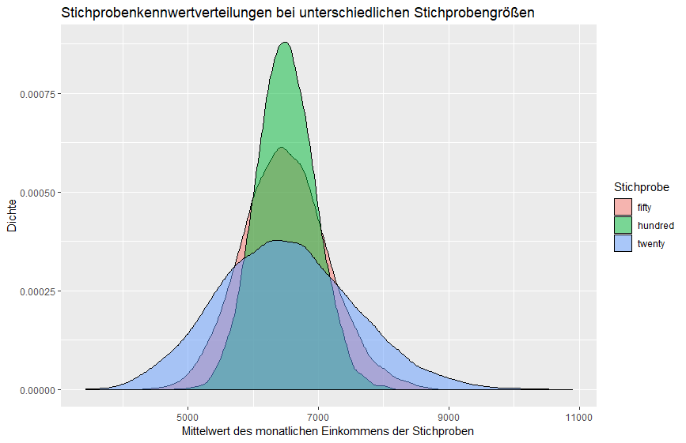

# Stichprobenkennwertverteilungen

## Konzeptuelles Verständnis

Wir haben im letzten Kapitel häufiger davon gesprochen, dass wir die Nullhypothese verwerfen, wenn der Fehler des kompakten Modells, durch das erweiterte Modell substantiell verkleinert wird. Nur was bedeutet es, einen Fehler substantiell verkleinert zu verkleinern?  Um diese Frage beantworten zu können, verwenden wir **Stichprobenkennwertverteilungen**. Das Wort Stichprobenkennwertverteilung gibt uns bereits einige Hinweise, um zu verstehen, was dieses Wort bedeutet.

1. Stichprobe
2. Kennwert
3. Verteilung

### Stichprobe

Eine Stichprobe ist eine Teilmenge aus einer Grundgesamtheit. Wahlvorhersagen werden auf Grundlage von Stichproben gezogen, da es mühselig wäre, alle Menschen eines Landes (die Grundgesamtheit) zu befragen. Daher erheben wir immer nur einen kleinen Anteil der Population und versuchen auf Grundlage dieser Stichprobe auf die Population zu schließen.

### Kennwert

Statistische Kennwerte fassen mehrere Datenpunkte zusammen. Du kennst bereits mehrere dieser Kennwerte: Der Mittelwert, der z-Wert, die Standardabweichung oder die Varianz. Jeder dieser Kennwerte fasst Daten zusammen. Der Mittelwert gibt den typischen Wert einer Verteilung an, die Varianz gibt an, wie weit Werte um einen Mittelwert streuen. In den nächsten Wochen werden wir uns vor allem mit dem Mittelwert, PRE, dem t-Wert und dem F-Wert beschäftigen. All diese Werte sind statistische Kennwerte.

### Verteilung

Eine Verteilung ist eine grafische Darstellung des Auftretens einzelner Ausprägung einer Variable. Beispielsweise kennst du unimodale Verteilungen mit nur einem Gipfel:

<!-- ```
ggplot(NULL, aes(x = c(-3, 3))) +
  stat_function(fun = dnorm,
                geom = "area",
                fill = "steelblue")
``` -->


Oder eine stetige Verteilung


Oder eine bimodale Verteilung:

<!-- ```
nn <- 1e4
set.seed(1)
betas<-rbeta(nn,2,2)
sims <- c(betas[1:(nn/2)]*2+1,
          betas[(nn/2+1):nn]*2+3)


hist(sims)
``` -->


### Stichprobenkennwertverteilung revisited

Eine Stichprobenkennwertverteilung ist daher eine Verteilung von Kennwerten, die aus einer Stichprobe gewonnen werden. Beispielsweise:

* Die Verteilung von Mittelwerten, die aus mehreren Stichproben berechnet werden.
* Die Verteilung von Mittelwertsdifferenzen, die aus mehreren Stichproben berechnet werden.
* Die Verteilung von PRE, die aus mehreren Stichproben berechnet werden.
* Die Verteilung von Varianzen, die aus mehreren Stichproben berechnet werden.

## Simulation einer Stichprobenkennwertverteilung in R

Um Stichprobenkennwertverteilungen besser zu verstehen, hilft es, diese zu simulieren. Stellen wir uns erneut unsere Population als unsere fiktive Firma mit ihren 1470 Mitarbeitern vor. Versuchen wir im nächsten Schritt den Mittelwert des monatlichen Einkommens einer Stichprobe von 20 Personen zu berechnen:


```R
set.seed(453)
my_sample <- sample_n(human_resources, 20)
my_sample$monthly_income %>% mean # 5483.65
```

Diese Stichprobe verdient im Schnitt 5483.65 Dollar pro Monat. Dieser Mittelwert entspricht allerdings nicht dem Mittelwert der Population, welchen wir in der Regel nicht kennen. Da wir allerdings die Population kennen, können wir den Mittelwert berechnen:

```R
mean(human_resources$monthly_income) # 6502.931
```

Wir unterschätzen den Mittelwert der Stichprobe also erheblich durch unsere Stichprobe.

Um nun zu einer Stichprobenkennwertverteilung zu gelangen, benötigen wir sehr viele dieser Kennwerte aus sehr vielen Stichproben. Versuchen wir daher als nächstes die Mittelwerte von 20 Stichproben zu ziehen (den Code musst du an dieser Stelle nicht verstehen):

```R
(twenty_samples <- c(1:20) %>% 
  map_dbl(~ sample_n(human_resources, 20) %>% 
            {mean(.$monthly_income)}))
```

```
[1]  8147.30  5338.25  5379.75  5312.45  7260.05  6887.40  5726.00  8796.30 11089.40  8490.10
[11]  7251.15  4628.45  7050.95  6419.60  5824.75  5658.65  4635.70  6430.65  7647.00  6765.95
```

Erneut erhalten wir ganz unterschiedliche Mittelwerte. Versuchen wir diese Mittelwerte in einem Histogramm darzustellen:

```R
ggplot(NULL, aes(x = twenty_samples)) +
  geom_histogram(fill = "steelblue", color = "black") +
  labs(
    title = "Stichprobenkennwertverteilung des Mittelwerts",
    x = "Mittelwerte der Stichproben",
    y = "Häufigkeit"
  )
```


Die Stichprobenkennwertverteilung ist weder unimodal, noch stetig, noch bimodal. Was passiert, wenn wir anstatt 20 10.000 Stichproben ziehen?


```R
ten_thousand_samples <- c(1:10000) %>% 
    map_dbl(~ sample_n(human_resources, 20) %>% 
    {mean(.$monthly_income)})

    
ggplot(NULL, aes(x = ten_thousand_samples)) +
  geom_histogram(fill = "steelblue", color = "black") +
  labs(
    title = "Stichprobenkennwertverteilung des Mittelwerts (10000 Stichproben)",
    x = "Mittelwerte der Stichproben",
    y = "Häufigkeit"
  )
```


Nun erhalten wir eine unimodale Verteilung. Selten erhalten wir in einer Stichprobe einen Mittelwert von über 9000 und selten erhalten wir in einer Stichprobe einen Mittelwert unter 4000 Dollar.

> Stichprobenkennwertverteilungen zeigen an, wie wahrscheinlich bestimmte Kennwerte (z.B. PRE) auftreten, wenn wir von der Nullhypothese ausgehen. Wir können Stichprobenkennwertverteilung daher benutzen, um heraus zu finden, ob Fehler durch das erweiterte Modell substantielle reduziert werden.

## Eigenschaften von Stichprobenkennwertverteilungen

### Je größer die Stichprobe, desto kleiner die Standardabweichung der Normalverteilung

```R
twenty <- c(1:10000) %>% 
    map_dbl(~ sample(human_resources$monthly_income, 20) %>% mean)

fifty <- c(1:10000) %>% 
    map_dbl(~ sample(human_resources$monthly_income, 50) %>% mean)

hundred <- c(1:10000) %>% 
    map_dbl(~ sample(human_resources$monthly_income, 100) %>% mean)

tibble(
  twenty = twenty,
  fifty = fifty,
  hundred = hundred
) %>% 
  gather(sample, value) %>% 
  ggplot(aes(x = value, fill = sample)) +
  geom_density(aes(fill = sample), alpha = .5) +
  labs(
    title = "Stichprobenkennwertverteilungen bei unterschiedlichen Stichprobengrößen",
    fill = "Stichprobe",
    x = "Mittelwert des monatlichen Einkommens der Stichproben",
    y = "Dichte"
  )
```



Die rote Stichprobenkennwertverteilung zeigt eine Stichprobenkennwertverteilung an, die aus Stichproben mit 50 Mitarbeitern generiert wurde. Die blaue Stichprobenkennwertverteilung wurde anhand einer Stichprobengröße von 20 Mitarbeitern generiert. Die grüne Stichprobenkennwertverteilung wurde anhand einer Stichprobe von 100 Mitarbeitern generiert.

Du siehst, dass die Verteilung mit einer steigenden Stichprobengröße eine geringere Varianz aufweißt und *steiler* wird. Ein Grund hierfür ist, dass der Kennwert durch eine größere Stichprobe akkurater geschätzt wird. Stell dir das Extrem vor: Deine Stichproben sind fast so groß wie die ganze Population. Als Folge wirst du fasst immer Werte erhalten, die fast exakt dem Mittelwert entsprechen. Die Stichprobenkennwertverteilung wird daher sehr schmal sein. Bei einer geringen Stichprobegröße erhälst du den gegenteiligen Effekt. Deine Schätzungen des Kennwertes werden sehr variieren, daher ist deine Stichprobenkennwertverteilung breiter.

### Die Standardabweichung der Stichprobenkennwertverteilung des Mittelwertes nennt man Standardfehler

Jede Verteilung hat einen Mittelwert und eine Standardabweichung. Die Stichprobenkennwertverteilung ist keine Ausnahme. Auch sie hat eine Standardabweichung. Diese nennen wir **Standardfehler**. Der Standardfehler der Stichprobenverteilung des Mittelwerts können wir folgendermaßen folgendermaßen schätzen:

$$
SE = \frac{\sigma}{\sqrt{N}}
$$

$\sigma$ kennzeichnet die Standardabweichung der Stichprobe. $N$ kennzeichnet die Größe der Stichprobe.  Wir müssen den Standardfehler schätzen, da wir die Standardabweichung der Population in der Regel nicht kennen. Daher nehmen wir die Standardabweichung der Stichprobe, um den Standardfehler der Stichprobenkennwertverteilung zu schätzen.

Durch diese Formel lässt sich auch erklären, weshalb der Standardfehler bei einer größeren Stichprobe kleiner wird. Stell dir eine Stichprobe von 20 vor. Die Standardabweichung der Verteilung der Stichprobe ist 100:

$$
SE = \frac{100}{\sqrt{20}} = 5
$$

Hätten wir eine Stichprobe von 50 Personen bei einer gleichen Standardabweichung, wäre der Standardfehler:

$$
SE = \frac{100}{\sqrt{50}} = 2
$$


### Die Streuung in der Population ist immer größer als die Streuung in der Stichprobenkennwertverteilung

Der Grund für dieses Phänomen liegt darin, dass eine Stichprobe eines Kennwertes weniger wahrscheinlich extreme Werte einer Verteilung generiert als die tatsächlichen Werte. Stell dir vor, es gibt eine Mitarbeiterin mit einem monatlichen Einkommen von 10000 Dollar. Dies ist ein seltenes Ereignis. Da ein Kennwert immer eine Aggregierung mehrerer Werte ist, wird dieses hohe Einkommen zwar evtl. in den Kennwert einer Stichprobe mit hinein gerechnet, aber immer durch weniger extreme Werte angeglichen, da diese wahrscheinlicher gezogen werden. Hierduch ist die Streuung in der Population größer als in der Stichprobe.

### Der Mittelwert der Stichprobenkennwertverteilung ist der gleiche Mittelwert der Population

Zwar ist die Streuung der Stichprobenkennwertverteilung, deren Mittelwert ist allerdings der gleiche.

# Normalverteilung und Standardnormalverteilung

## Normalverteilung

Normalverteilungen sind besondere Verteilungen, die häufig in der Natur anzutreffen sind. Beispielsweise entspricht die Intelligenz von Personen in der Regel einer Normalverteilung. Ebenso entspricht die Größe von Personen oder der Blutdruck von Personen. 

Eine Normalverteilung sieht immer so aus:

<!-- ```R
ggplot(NULL, aes(x = c(-3, 3))) +
     stat_function(fun = dnorm,
                   geom = "area", fill = "steelblue") + 
      labs(title = "Normalverteilung", x = "Kennwerte", y = "Dichte")
``` -->


Normalverteilungen zeichen sich durch folgende Eigenschaften aus:

1. Sie sind unimodal. Es gibt nur einen Gipfel.
2. Sie sind symmetrisch vom Zentrum der Verteilung.
3. Der Mittelwert, der Modus und der Median sind gleich.
4. Die gesamte Fläche der Verteilung hat den Wert 1.

Zusätzlich hat die Normalverteilung einige wichtige statistische Eigenschaften:

* 68% der Werte fallen eine Standardabweichung vom Mittelwert.
* 95% der Werte fallen zwei Standardabweichungen vom Mittelwert.
* 99.7% der Werte fallen innerhalb von drei Standardabweichungen vom Mittelwert.

<!-- ```R
ggplot(NULL, aes(x = c(-3, 3))) +
  stat_function(fun = dnorm,
                geom = "line",
                xlim = c(-5, 5)) +
  stat_function(fun = dnorm,
                geom = "area",
                fill = "red",
                alpha = .4,
                xlim = c(-3, 3)) +
  stat_function(fun = dnorm,
                geom = "area",
                fill = "steelblue",
                alpha = .4,
                xlim = c(-2, 2)) +
  stat_function(fun = dnorm,
                geom = "area",
                fill = "yellow",
                alpha = .7,
                xlim = c(-1, 1)) +
  annotate("text", x = 0, y = 0.2, label = "68%") +
  annotate("text", x = -1.5, y = 0.08, label = "95%") +
  annotate("text", x = -2.4, y = 0.01, label = "97.5%") +
  xlim(-5, 5) +
  labs(
    title = "68-95-97.7 Regel der Normalverteilung",
    x = "Kennwert",
    y = "Dichte"
  )
``` -->


### Zusätzliche Informationen

* [Explaining the 68-95-99.7 rule for a normal distribution](https://towardsdatascience.com/understanding-the-68-95-99-7-rule-for-a-normal-distribution-b7b7cbf760c2)
* [Normal distributions - Statistics How To](https://www.statisticshowto.datasciencecentral.com/probability-and-statistics/normal-distributions/)


## Standardnormalverteilung

Die Standardnormalverteilung ist eine besondere Normalverteilung, für die folgendes gilt:

* Der Mittelwert der Standardnormalverteilung ist immer 0.
* Die Standardabweichung der Standardnormalverteilung ist immer 1.


Die Standardnormalverteilung wird auch **z-Verteilung** genannt, Kennwerte in der Standardnormalverteilung z-Werte darstellen. Zur Erinnerung, wir können Mittelwerte z-transformieren, indem wir diese vom Mittelwert abziehen und durch die Standardabweichung der Verteilung teilen. 

Um den Mittelwert der Normalverteilung auf 0 zu ziehen, verschieben wir die Verteilung um den Wert jedes Datenpunktes ($Y$) um den Mittelwert der Verteilung ($\mu$): $Y - \mu$. Im nächsten Schritt teilen wir diesen Wert durch die Standardabweichung ($\sigma$) und erhalten hierdurch eine Standardabweichung von 1:

$$
z = \frac{Y - \mu}{\sigma}
$$


## Zentrales Grenzwerttheorem

Die Stichprobenkennwertverteilung des Mittelwerts (und des Medians) hat eine besondere Eigenschaft. 

> Unabhängig davon, welche Verteilung (z.B. bimodel, unimodal, stetig) eine Population hat, die Stichprobenkennwertverteilung des Mittelwerts entspricht immer einer Normalverteilung.

Mehr Informationen [hier](https://www.statisticshowto.datasciencecentral.com/probability-and-statistics/normal-distributions/central-limit-theorem-definition-examples/).


# Grundlagen der Wahrscheinlichkeitsrechnung

## Axiome der Wahrscheinlichkeit (Kolmogorov)

Wir werden gleich Wahrscheinlichkeiten auf Grundlage von Stichprobenkennwertverteilung berechnen. Zuvor ist es nötig, dass wir zwei grundlegen Axiome der  Wahrscheinlichkeit wiederholen:

1. Die Wahrscheinlichkeit eines Ereignisses bewegt sich zwischen 0 und 1.
2. Die Wahrscheinlichkeit aller möglichen Ereignisse ist 1. Dies entspricht immer der Fläche der Stichprobenkennwertverteilungen.

Später werden wir die Fläche unter Stichprobenkennwertverteilungen berechnen. Unabhängig davon, ob es um eine Stichprobenkennwertverteilung des Mittelwerts (Standardnormalverteilung), der Stichprobenkennwertverteilung von PRE (später auch F), oder der Stichprobenkennwertverteilung von Mittelwertsunterschieden handelt, beträgt die Fläche dieser Verteilung immer 1. Dementsprechend können wir aus Stichprobenkennwertverteilungen berechnen, wie wahrscheinlich ein bestimmter Kennwert auftritt, wenn wir von der Nullhypothese ausgehen.

## Skalenniveaus

Daten liegen in folgenden Skalenniveaus vor:

* Nominalskalierte Daten: Kennzeichnent durch kategoriale Unterschiede. Z.B. Frau/Mann oder die Parteizugehörigkeit SPD/FDP/CDU. Es gibt keine Werte zwischen den einzelnen Werten.
* Ordinalskalierte Daten: Auch Rangskaliserte Daten. Beispielsweise sind die Schulabschlüsse ordinalskaliert: Werksrealschule < Realschule < Gymnasium.
* Intervallskalierte Daten: Kennzeichnent durch unendliche viele mögliche Werte, z.B. die Temperatur.
* Verhältnisskalierte Daten: Kennzeichnent durch einen natürlichen Nullpunkt. Die Länge einer Schnur beispielsweise ist verhältnisskaliert. Ebenso das Gewicht eines Objektes.

Nominalskalierte Daten liegen uns in Experimenten in der Regel durch verschiedene Experimentallgruppen vor. Metrisch skalierte Daten(Intervall- und Verhältnisskalierte Daten) liegen uns in der Regel als abhängige Variable vor, die wir prüfen möchten. Ebenso aber auch als unabhängige Variablen, die wir in unsere Modelle als Parameter einfügen.

## Diskrete und stetige Wahrscheinlichkeiten

Wahrscheinlichkeiten können sowohl diskret als auch stetig vorliegen. Diskrete Wahrscheinlichkeiten zeichen sich dadurch aus, dass sie auf Grundlage von nominalskalierten und ordinalskalierten Daten berechnet werden. Beispielsweise können wir die Wahrscheinlichkeit berechnen, beim Würfeln die Augenzahl 5 zu würfen (1/6). Die Augenzahl ist eine ordinalskalierte Variable. 

Im Unterschied dazu werden stetige Wahrscheinlichkeiten bei Variablen angegeben, die metrisch vorliegen. Beispielsweise können wir die Wahrscheinlichkeit berechnen, größer als 1,80 Meter zu sein. Die Wahrscheinlichkeit einzelner Ereignisse, z.B. die Größe 1,82331243433454 geht gegen Null, da es unendliche viele Ausprägungen zwischen Variablen gibt. Bei der Standardnormalverteilung berechnen wir beispielsweise die Wahrscheinlichkeit eines Ereignisses auf Grundlage des Integrals unter der Verteilung:

<!-- 
```R
ggplot(NULL, aes(x = c(-3, 3))) +
  stat_function(fun = dnorm,
                args = list(
                  mean = 0,
                  sd = 1
                ),
                geom = "area", fill = "steelblue") + 
  stat_function(fun = dnorm,
                geom = "area",
                fill = "yellow",
                alpha = .7,
                xlim = c(0, 2)) +
  annotate("text", x = 1, y = 0.1, label = "47.72%") +
  labs(
    title = "Stetige Wahrscheinlichkeit z > 0 und z < 2", 
    x = "z-Wert", 
    y = "Dichte")

pnorm(2) - pnorm(0)
``` -->


Die gelbe Fläche kennzeichnet die Wahrscheinlichkeit eines z-Wertes größer als 0 und kleiner als 2 zu sein: 47.72%.


# Wahrscheinlichkeiten und Stichprobenkennwertverteilungen

##  Ein Beispiel zur Berechnung der Wahrscheinlichkeit aus einer Stichprobenkennwertverteilung

Stichprobenkennwertverteilungen können uns Auskunft darüber geben, wie wahrscheinlich ein bestimmter Kennwert auftritt. Beispielsweise könnten wir uns fragen, wie wahrscheinlich es ist, eine Stichprobe zu erhalten, die im Schnitt mehr als 9000 Dollar monatlich verdient. Da das monatliche Gehalt eine metrisch skaliserte Variable ist, können wir diese Frage anhand einer stetigen Verteilung prüfen. Als stetige Verteilung eignet sich die Standardnormalverteilung, schließlich wissen wir durch das Zentrale Grenztwerttheorem, dass die Verteilung von Stichprobenmittelwerten einer Normalverteilung entsprechen.

Da die Standardnormalverteilung z-Werte als Kennwerte annimmt, müssen wir zunächst den Z-Wert berechnen, der auftritt, wenn der Mittelwert einer Stichprobe 9000 Dollar beträgt:

$$
z = \frac{\bar{X} - \mu}{\sigma} = \frac{9000 - 6502.931}{4707.957} = 0.5303933
$$

$\bar{X}$ steht für den Mittelwert der Stichprobe, $\mu$ für den tatsächlichen Mittelwert der Population für die abhängige Variable und $\sigma$ für die Standardabweichung der abhängigen Variable. 

Ein mittleres Einkommen von 9000 Dollar hat demnach einen z-Wert von 0.5, dies bedeutet, Menschen die 9000 Euro verdienen, verdienen eine halbe Standardabweichung mehr als der Durchschnitt der Mitarbeiter. 


Diesen z-Wert können wir in der Standardnormalverteilung abbilden: 

```
z_score <- (9000 - mean(human_resources$monthly_income)) / sd(human_resources$monthly_income)

ggplot(NULL, aes(x = c(-3, 3))) +
  stat_function(
    fun = dnorm,
    geom = "area",
    fill = "steelblue",
  ) +
  geom_vline(xintercept = z_score,
             color = "red",
             size = 2) +
  annotate("text", x = z_score + 0.5,
           y = 0.3, label = "z-score der Person mit\neinem IQ von 115")
```


Aus der Visualisierung können wir bereits erkennen, dass die Wahrscheinlichkeit unter 50% liegt, da die die Fläche rechts vom Mittelwert der Verteilung 50% entspricht und der z-Wert weiter rechts des Mittelwertes liegt. Zeigen wir die Wahrscheinlichkeit grafisch an:

```R
ggplot(NULL, aes(x = c(-3, 3))) +
  stat_function(
    fun = dnorm,
    geom = "area",
    fill = "steelblue",
  ) +
  stat_function(
    fun = dnorm,
    geom = "area",
    fill = "#b44682",
    xlim = c(z_score, 3)
  ) +
  labs(
    title = "Wahrscheinlichkeit, eine Stichprobe zu ziehen, die über 9000 Euro pro Monat verdient",
    x = "z-score",
    y = "Dichte"
  )
```


Die Wahrscheinlichkeit entspricht 29,8%:

```R
1 - pnorm(z_score)  # 0.2979196
```

## Wahrscheinlichkeiten und stetige Stichprobenkennwertverteilungen

### Die Wahrscheinlichkeit eines einzelnen Ereignisses ist bei stetigen Variablen immer gleich 0

Wie wahrscheinlich ist es, genau 5678,43234343 Dollar pro Monat zu verdienen? Diese Frage muss bei stetigen Verteilungen, in der es unendlich viele Zwischenwerte gibt immer mit 0 beantwortet werden. Einzelne Ereignisse sind so unwahrscheinlich, da stetige Variablen unendlich genau sein können. 

### Wahrscheinlichkeiten sind bei stetigen Variablen das Integral zwischen zwei Werten

Wir können allerdings berechnen, wie wahrscheinlich es ist, mindestens oder höchstens einen bestimmten Kennwert zu erhalten. Genausogut können wir die Wahrscheinlichkeit zwischen zwei Ereignissen berechnen. Mathematisch nehmen wir das Integral einer Funktion über zwei Werte:


$$
P(x_1 \leq x_2) \int_{x_1}^{x_2} f(x) dx
$$


Das Integral entspricht der Wahrscheinlichkeit, da die Fläche der Stichprobenkennwertverteilungen 1 entspricht und für Omega, sprich den gesamten Ereignisraums entspricht. Beispielsweise können wir berechnen wie wahrscheinlich ist es, zwischen 5000 und 6000 Dollar pro Monat zu verdienen?

```R
z_score_6000 <- (6000 - mean(human_resources$monthly_income)) / sd(human_resources$monthly_income)
z_score_5000 <- (5000 - mean(human_resources$monthly_income)) / sd(human_resources$monthly_income)

ggplot(NULL, aes(x = c(-3, 3))) +
  stat_function(
    fun = dnorm,
    geom = "area",
    fill = "steelblue",
  ) +
  stat_function(
    fun = dnorm,
    geom = "area",
    fill = "#b44682",
    xlim = c(z_score_5000, z_score_6000)
  ) +
  labs(
    title = "Wahrscheinlichkeit zwischen 5000 und 6000 Euro pro Monat zu verdienen",
    x = "Monatlicher Verdienst als z-Wert",
    y = "Dichte"
  ) +
  annotate("text", x = -0.3,
           y = 0.2, label = "8,3%")
```


$$
P(5000 \leq 6000) \int_{5000}^{6000} f(x) dx
$$


Ein anderes Beispiel: Wie wahrscheinlich ist es, weniger als 2000 Dollar monatlich zu verdienen?

$$
P(-\infty \geq 2000) \int_{-\infty}^{2000} f(x) dx
$$


```R
z_score_2000 <- (2000 - mean(human_resources$monthly_income)) / sd(human_resources$monthly_income)

ggplot(NULL, aes(x = c(-3, 3))) +
  stat_function(
    fun = dnorm,
    geom = "area",
    fill = "steelblue",
  ) +
  stat_function(
    fun = dnorm,
    geom = "area",
    fill = "#b44682",
    xlim = c(-3, z_score_2000)
  ) +
  labs(
    title = "Wahrscheinlichkeit weniger als 2000 Dollar monatlich zu verdienen",
    x = "Monatlicher Verdienst als z-Wert",
    y = "Dichte"
  ) 
```


```R
pnorm(z_score_2000) # 0.1694221
```

Die Wahrscheinlichkeit liegt bei 16,9%.

## Generalisierung der Wahrscheinlichkeitsberechnung aus Stichprobenkennwertverteilungen


### Ein Beispiel 

Eine logische Frage, die sich nun ergibt, ist: Warum müssen wir Wahrscheinlichkeiten aus Stichprobenkennewrtverteilungen berechnen? Die Antwort lautet, um Hypothesen zu testen. Stell dir folgendes Szenario vor: Deine Freundin behauptet, dass Mitarbeiter in dem Unternehmen im Schnitt 3000 Dollar verdienen. Du glaubst deiner Freundin nicht und bist dir sicher, dass die Mitarbeiter deutlich mehr als 3000 Dollar pro Monat verdienen. Wie könnt ihr prüfen, wer recht hat? 

Zunächst stellen wir eine Nullhypothese auf. Wir gehen davon aus, dass deine Freundin tatsächlich recht hat. Was würde passieren, wenn deine Freundin falsch läge und das tatsächliche Gehalt deutlich höher liegt? Dann würde der Mittelwert der Stichprobe, die du aus der Population (hier das Unternehmen) erhebst, deutlich höher liegen als 3000 Dollar. Du hättest damit nicht bewiesen, dass deine Freundin recht hat, es wäre allerdings äußerst unwahrscheinlich, dass deine Stichprobe so groß ausfällt, sollte die Nullhypothese stimmen. 

Ihr befragt also 50 Mitarbeiter im Unternehmen nach ihrem monatlichen Gehalt. Folgenden Mittelwert erhaltet ihr:

<!-- ```R
set.seed(899)
my_sample <- sample_n(human_resources, 50)
mean(my_sample$monthly_income) # 6063.02
```

Eure Stichprobe verdient 6063.02 Dollar im Schnitt monatlich. Versuchen wir all diese Informationen grafisch darzustellen:

```R
ggplot(NULL, aes(x = c(0, 10000))) +
  # Nullhypothese
  stat_function(
    fun = dnorm,
    geom = "area",
    fill = "steelblue",
    args = list(
      mean = 3000,
      sd = sd(human_resources$monthly_income) / sqrt(50)
    )
  ) +
  stat_function(
    fun = dnorm,
    geom = "area",
    fill = "orange",
    alpha = .6,
    args = list(
      mean = mean(human_resources$monthly_income),
      sd = sd(human_resources$monthly_income) / sqrt(50)
    )
  ) +
  geom_vline(xintercept = 3000,
             color = "blue",
             size = 1) +
  geom_vline(xintercept = 6063.02,
             size = 1) +
  geom_vline(xintercept = mean(human_resources$monthly_income),
             color = "yellow",
             size = 1) +
  annotate("text", x = 3000 - 800,
           color = "blue",
           hjust = 0,
           y = 0.0005, label = "Nullhypothese der Freundin") +
  annotate("text", x = 6063.02 - 800,
           color = "black",
           hjust = 0,
           y = 0.0005, label = "Mittelwert der Stichprobe") +
  annotate("text", x = mean(human_resources$monthly_income) - 800,
           color = "yellow",
           hjust = 0,
           y = 0.0004, label = "Mittelwert der Population") +
  # annotate("segment", x = 3000, xend = mean(human_resources$monthly_income), 
  #              y = 0.0003, yend = 0.0003, color = "black",
  #          linetype = 2) +
  # annotate("segment", x = 6063.02, xend = mean(human_resources$monthly_income), 
  #          y = 0.00001, yend = 0.00001, color = "grey",
  #          linetype = 2) +
  # annotate("rect", xmin = 2000, xmax = 6800, ymin = 0.000005, ymax = 0.000025,
  #          alpha = .2) +
  labs(
    title = "Darstellung der Null- und Alternativhypothese der Freundeswette",
    x = "Monatlicher Verdienst in Dollar",
    y = "Dichte"
  ) 
``` -->


Gelb markiert ist die wirkliche Stichprobenkennwertverteilung. Blau markiert ist die Stichprobenkennwertverteilung hätte deine Freundin recht bzw. würde die Nullhypothese gelten. Die farbigen Striche kennzeichnen die Mittelwerte der Stichprobenkennwertverteilungen bzw. den Mittelwert der Stichprobe. 


Wir können aus der Grafik mehrere Informationen entnehmen:

* Sollte deine Freundin recht haben, ist es fasst unmöglich einen so hohen Stichprobenmittelwert zu erhalten. Die Wahrscheinlichkeit geht gar gegen 0, da der schwarze Stichprobenmittelwert nicht einmal die Stichprobenkennwertverteilung der Nullhypothese schneidet. Hätte deine Freundin recht, würden wir vielmehr erwarten, dass die Mittelwerte um den Wert 3000 streuen.
* Die Fehler in kompakten Modell (sprich der Nullhypothese) sind deutlich größer als in deiner Alternativhypothese, dass das Gehalt größer ist. In anderen Worten, der Abstand der tatsächlichen Werte zu den Werten deines Modells (hier der Mittelwert deiner Stichprobe) sind deutlich kleiner als bei deiner Freundin: $e = Y - \hat{Y}$. Wir können daher davon ausgehen, dass wir ein relativ hohes PRE durch diese beiden Hypothesen erhalten. Dein erweitertes Modell reduziert die Fehler des kompakten Modells deutlich.
* Der Stichprobenmittelwert entspricht nicht dem Populationsmittelwert. Dies ist allerdings zu erwarten, da wir durch eine Stichprobe immer willkürliche Fluktuationen im Mittelwert erhalten. Genau deswegen haben wir eine Stichprobenkennwertverteilung.


### Generalisierung

* Stichprobenkennwertverteilungen (z.B. z-Werte, PRE) dienen der Überprüfung von Hypothesen.
* Hypothesen umfassen immer eine Null- und eine Alternativhypothese.
* Die Nullhypothese wird verworfen, wenn das Auftreten eines Kennwertes äußerst unwahrscheinlich ist, unter der Annahme, dass die Nullhypothese gilt.
* Hypothesen können nicht bestätigt werden, wir lehnen lediglich die Nullhypothese ab oder behalten diese vorläufig.
* Dass ein Ereignis unwahrscheinlich gegeben einer Nullhypothese ist, bedeutet **nicht**, dass man einen großen Effekt gefunden hat.

> Stichprobenkennwertverteilungen zeigen uns, ob ein Ereignis oder ein Kennwert unwahrscheinlich ist, unter der Annahme, dass die Nullhypothese gilt. Je unwahrscheinlich ein Ereignis unter der Nullhypothese, desto höher ist PRE.


# Stichprobenkennwertverteilung PRE

## Analogie z-Wert und PRE

In diesem Modul haben wir bereits viel über die Standardnormalverteilung geredet. Mittelwerte von Stichproben konnten wir durch eine z-Transformation als Kennwert in einer Standardnormalverteilung abtragen. Im nächsten Schritt haben wir heraus gefunden, wie wir die Wahrscheinlichkeit von Ereignissen auf Grundlage dieser Verteilungen bestimmen könnnen. Wir werden am Ende dieser Einheit einen inferenzstatistischen Test (z-Test) kennen lernen, welcher die Standardnormalverteilung zur Überprüfung von Hypothesen verwendet. Nächste Woche werden wir den t-Test kennen lernen, welcher zur Prüfung von Hypothesen eine T-Verteilung annimmt. 

Unklar ist an dieser Stelle vielleicht, inwieweit die der z-Wert mit PRE zusammen hängt? Klären wir nochmal, was diese beiden Kennwerte für eine Bedeutung haben? 

* **z-Wert**: Der z-Wert gibt an, wie viele Standardabweichungen zwei Werte/Mittelwerte auseinander liegen. Er ist demnach ein Maß, um zu überprüfen, ob sich Mittelwerte voneinander unterscheiden. Die Stichprobenkennwertverteilung des z-Wertes nennen wir Standardnormalverteilung bzw. z-Verteilung. 
* **PRE**: PRE ist ein Kennwert, der angibt, um wie viel Prozent ein erweitertes Modell den Fehler eines kompakten Models reduziert. Die Stichprobenkennwertverteilung von PRE nennen wir PRE-Verteilung.

Die Gemeinsamkeiten sind:

* Für beide Kennwerte können wir Stichprobenkennwertverteilungen generieren.
* Die Stichprobenkennwertverteilungen nutzen wir, um zu überprüfen, ob ein Ergebniss (z.B. der empirische z-Wert, oder der empirische PRE) einer Studie ungewöhnlich sind, unter der Bedingung, dass wir die Nullhypothese annehmen.
* Ist ein Ereignis ungewöhnlich unter Annahme der Nullhypothese verwerfen wir die Nullhypothese zu Gunsten der Alternativhypothese (z.B. indem wir nun davon ausgehen, dass das Gehalt der Mitarbeiter größer als 3000 Euro ist)

Unterschiede der beiden Kennwerte sind:

* z-Werte und PRE liefern unterschiedliche Stichprobenkennwertverteilungen. z-Werte liefern eine unimodale Standardnormalverteilung, während PRE-Kennwerte eine rechtsschiefe Verteilung generieren.
* z-Werte können negativ sein, PRE-Werte sind immer positiv (da wir bei SSR quadrieren, können keine negativen Werte entstehen).

