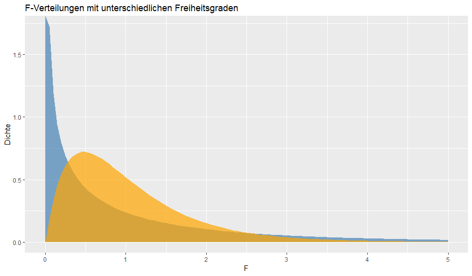
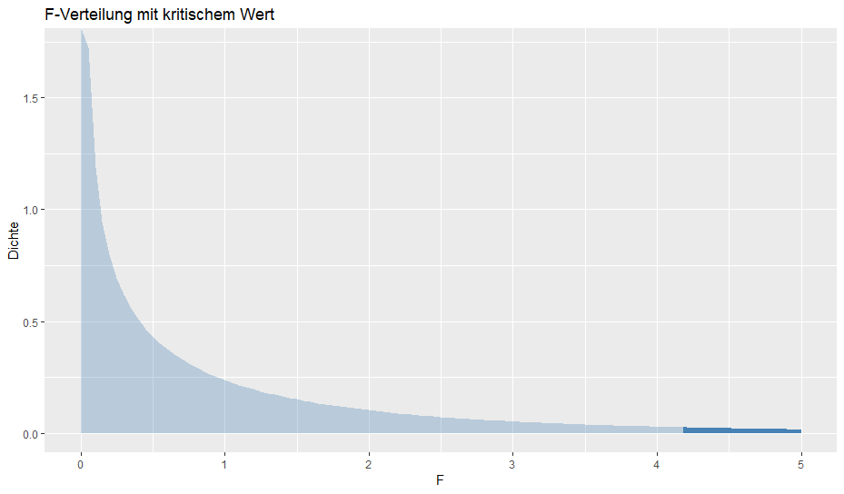
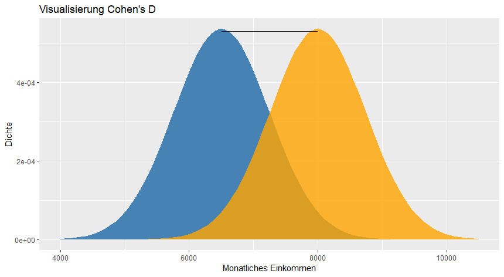
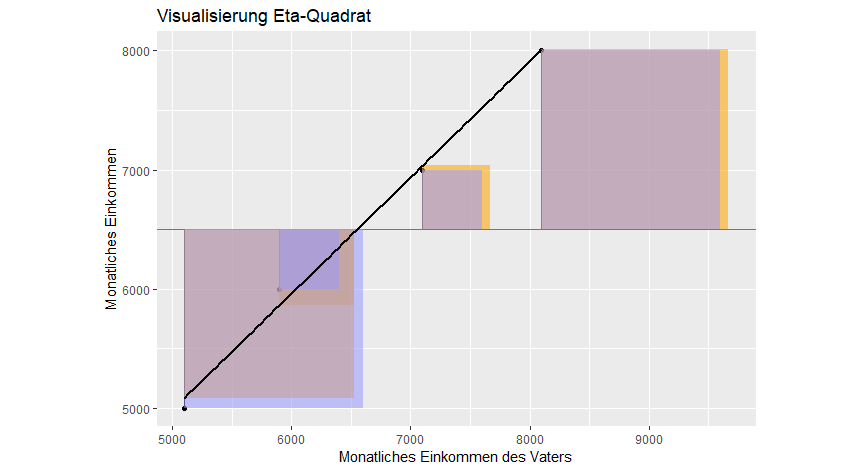
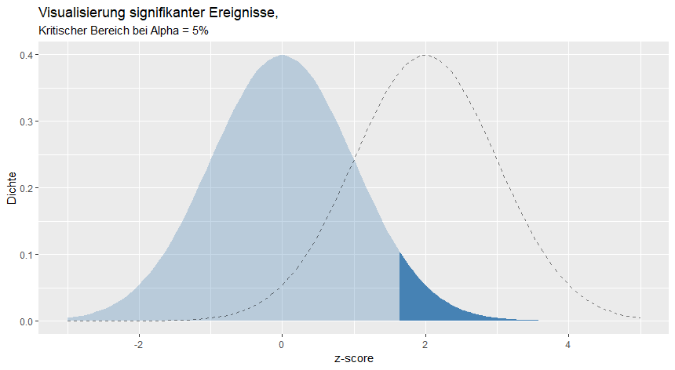
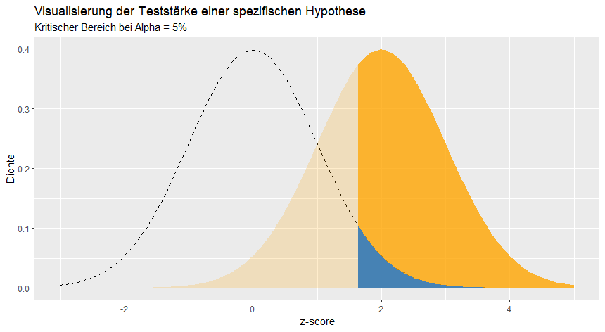
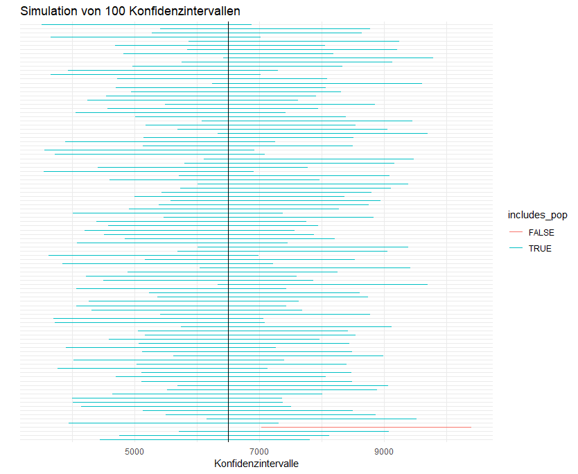
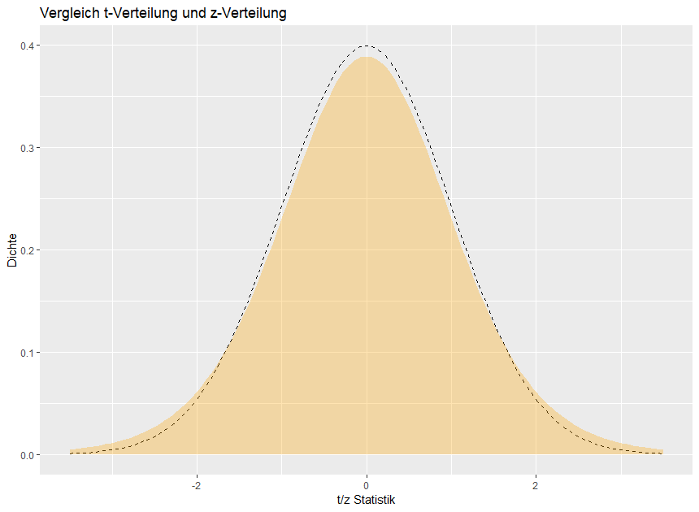
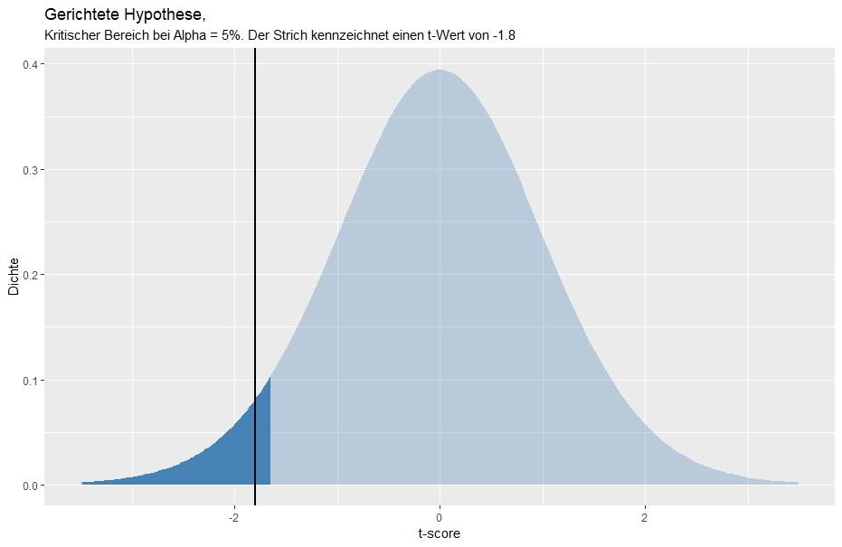
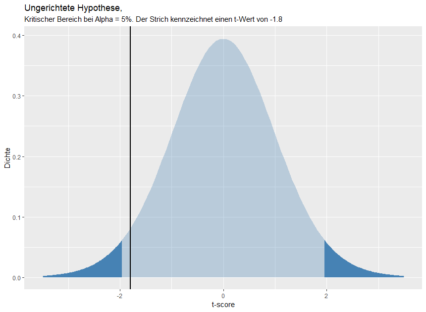

# F-Verteilung und F-Wert

## Konzeptuelles Verständnis

PRE findet man selten in statistischen Büchern. Viel häufiger sind F-Werte, ein Kennwert, der PRE sehr nahe steht. F hat den Vorteil, dass wir durch F die Reduktion des Fehlers für *jeden zusätzlichen Parameter* des erweiterten Modells berechnen können. 

> Ein F-Wert ist das Verhältnis zwischen dem Fehler, welcher durch Parameter des erweiterten Modells reduziert werden und dem Fehler, welcher durch einen willkürlichen weiteren Parameter reduziert werden könnte.

F ist daher ein Kennwert, welcher uns anzeigt wie viel besser bestimmte Parameter im Vergleich zu willkürlichen Parametern in dem erweiterten Modell sind.

* Ein F-Wert von 1 bedeutet beispielsweise, dass die Parameter im erweiterten Modell genausoviele Fehler des kompakten Modells reduziert wie man es bei einem willkürlich hinzugefügten Parameter erwarten würde. Werte von 1 führen daher nicht zu einer statistischen Signifikanz.
* Werte unter 1 bedeuten, dass die Parameter des erweiterten Modells den Fehler des kompakten Modells *geringer* reduzieren als ein willkürlicher Parameter. Auch in diesem Fall nehmen wir weiterhin die Nullhypothese an. 
* F-Werte über 1 bedeuten, dass die Parameter des erweiterten Modells mehr Fehler reduzieren als ein willkürlicher Parameter. Bei einem hohen F-Wert (z.B. über 5) sprechen wir daher von einem statistisch Signifikanten Ereignis.

### Ein Beispiel

Stell dir beispielsweise vor, dein kompaktes Modell schätzt das Gehalt einer Mitarbeiterin auf 6000 Dollar. Dieses Modell hat keinen Parameter, da es kein $b$ umfasst:

$$
\hat{Y} = 6000 + e = 6000
$$

Dein erweitertes Modell wiederum schätzt das Gehalt einer Person auf Grundlage des Mittelwertes der Stichprobe und hat daher einen Parameter ($b_0$):

$$
\hat{Y} = b_0 + e = \bar{X}
$$

Ein F-Wert würde nun für $b_0$ kennzeichnen, wie viel mehr Fehler durch diesen Parameter reduziert werden als man durch einen willkürlichen Parameter annehmen könnte. Beispielsweise hätten wir genausogut das Gehalt einer Person auf Grundlage der mittleren Schuhgröße der Stichprobe oder dem Abstand der Personen vom Wohnort berechnen können.


## F berechnen

F berechnet sich folgendermaßen:

$$
F = \frac{PRE / (PA - PC)}{(1 - PRE) / (n-PA)}
$$

### Der Zähler

Im Zähler berechnen wir die proportionale Reduktion des Fehlers in Abängigkeit bestimmter Parameter unseres erweiterten Modells: $PRE / (PA - PC)$. Momentan beschäftigen wir uns noch mit Modellen mit nur einem Parameter (z.B. $b_0$). Später werden wir mehrere Parameter in unseren Modellen haben. Zum Beispiel: $\hat{Y} = b_0 + X_1 * b_1 + X_2 * b_2$. Der Zähler gibt daher an, wie viel Fehler durch diesen einzelnen Parameter reduziert werden. 

Stell dir erneut vor, dein kompaktes Modell schätzt das Gehalt einer Mitarbeiterin auf 6000 Dollar. Dieses Modell hat keinen Parameter, da es kein $b$ umfasst. Dein erweitertes Modell wiederum schätzt das Gehalt einer Person auf Grundlage des Mittelwertes der Stichprobe und hat daher einen Parameter ($b_0$): Dein Zähler wäre daher:

$$
PRE / (1 - 0)
$$

Der Zähler gibt daher an, dass durch diesen einen weiteren Parameter der Fehler um einen bestimmten Anteil reduziert wird.

### Der Nenner

Im Nenner kennzeichnen wir wie viel Prozent der Fehler, welche wir durch die weiteren Parameter des erweiterten Modells nicht erklären können ($1 - PRE$), durch einen willkürlichen weiteren Parameter ($n - PA$) erklärt werden könnte. Wir können immer nur so viele Parameter in ein Modell aufnehmen, wie wir Datenpunkte besitzen. Die maximale Anzahl an Parametern ist daher $n$. Da wir allerdings bereits ein paar Parameter für $PA$ verwendet haben, bleiben uns nur noch $n - PA$ Parameter übrig.

### Freiheitsgrade

In der statistischen Literatur spricht bei $PA - PC$ und $n - PA$ von Freiheitsgraden. Diese werden für jedes inferenzstatistische Verfahren verwendet. Die Freiheitsgrade des Zählers kennzeichnen, wie viel mehr Parameter das erweiterte Modell im Vergleich zum kompakten Modell haben. Die Freiheitsgrade des Nenners kennzeichnen, wie viel Parameter in das erweiterte Modell noch hinzugefügt werden können, wenn man die bestehenden Parameter des erweiterten Modells abzieht.

### Eine weitere Definition

F wird häufig nicht anhand von PRE berechnet, sondern durch die SSR und SSE(A), welche wir bereits kennen gelernt haben:

$$
F = \frac{SSR / (PA - PC)}{SSE(A) / (n-PA)}
$$

SSR kennzeichnet daher den quadrierten Abstand der vorhergesagten Werte des kompakten von den vorhergesagten Werten des erweiterten Modells. SSR ist daher kleiner, wenn beide Modelle ähnliche Vorhersagen treffen. Je größer SSR, desto unterschiedlichere Vorhersagen treffen beide Modelle.

$$
SSR = SSE(C) - SSE(A) = \sum_{i=1}^{n} (\hat{Y_{iC}} - \hat{Y_{iA}})^2
$$

SSE(A) kennzeichnet die Fehler, welche trotz des erweiterten Modells noch übrig bleiben. Je kleiner SSE(A), desto genauer und daher besser ist unser erweitertes Modell. 

$$
SSE(A) = \sum_{i = 1}^n (Y_i - \hat{Y}_i)^2
$$


#### Der Zähler

$$
SSR / (PA - PC)
$$

Der Zähler ist daher ein relatives Maß der Vohersageunterschiede beider Modelle in Abhängigkeit der jeweiligen Parameter des erweiterten Modells. Je größer der Zähler, desto unterschiedlichere Vorhersagen liefern beide Modelle anhand bestimmter Parameter.

#### Der Nenner

Der Nenner kennzeichnet erneut den Anteil der Fehler, welcher durch einen weiteren willkürlichen Parameter reduziert werden könnte.

## Die F-Verteilung

Da der F-Wert ebenso ein Kennwert wie z oder PRE darstellt, hat F ebenso eine Stichprobenkennwertverteilung. Wir werden an dieser Stelle darauf verzichten, die Stichprobenkennwertverteilung zu simulieren. 

Im Unterschied zur z-Verteilung und zur PRE-Verteilung umfasst die F-Verteilung verschiedene Parameter, welche das Aussehen dieser Verteilung ändern. Genauer muss man beide Freiheitsgrade angeben, um bestimmte F-Verteilungen zu erhalten. Dies bedeutet, dass es sehr viele F-Verteilungen abhängig der Freiheitsgrade gibt. Schauen wir uns eine F-Verteilung an, die wir im nächsten Beispiel verwenden werden, um eine Hypothese zu prüfen:

<!-- ```R
ggplot(NULL, aes(x = c(0, 5))) +
  stat_function(
    fun = df,
    geom = "area",
    alpha = .7,
    fill = "steelblue",
    args = list(
      df1 = 1,
      df2 = 27
    )
  ) +
  stat_function(
    fun = df,
    geom = "area",
    alpha = .7,
    fill = "orange",
    args = list(
      df1 = 4,
      df2 = 47
    )
  ) +
  # geom_vline(xintercept = z_value,
  #            color = "black",
  #            size = 1) +
  labs(
    title = "F-Verteilungen mit unterschiedlichen Freiheitsgraden",
    x = "F",
    y = "Dichte"
  ) +
  scale_x_continuous(limits = c(0, 5))
``` -->



Hier siehst du zwei F-Verteilungen. Die blaue F-Verteilung hat die Freiheitsgrade df1 = 1, und df2 = 27 und die orangene F-Verteilung hat die Freiheitsgrade df1 = 4 und df2 = 47. 

Wir können ebenso die kritischen Werte der blauen F-Verteilung betrachten:

<!-- ```R
critical_value <- qf(0.95, 1 - 0, 30 - 1)

ggplot(NULL, aes(x = c(0, 5))) +
  stat_function(
    fun = df,
    geom = "area",
    alpha = .3,
    fill = "steelblue",
    args = list(
      df1 = 1,
      df2 = 27
    )
  ) +
  stat_function(
    fun = df,
    geom = "area",
    fill = "steelblue",
    args = list(
      df1 = 1,
      df2 = 27
    ),
    xlim = c(critical_value, 5)
  ) +
  # geom_vline(xintercept = z_value,
  #            color = "black",
  #            size = 1) +
  labs(
    title = "F-Verteilung mit kritischem Wert",
    x = "F",
    y = "Dichte"
  ) +
  scale_x_continuous(limits = c(0, 5))
``` -->



Alle empirischen F-Werte, welche in den dunkelblauen Bereich fallen führen zu einem signifikanten Ergebnis. Dies bedeutet, dass die Parameter der erweiterten Modelle die Fehler deutlich stärker reduzieren als man annehmen würde, sollte die Nullhypothese gelten.


## Ein Beispiel

> Ziel: Den F-Wert in R berechnen und konzeptuell verstehen

Stell dir folgende Hypothese vor: Deine Nullhypothese lautet, dass die Mitarbeiter 6000 Dollar monatlich verdienen. Deine Alternativhypothese lautet, dass der Mittelwert der Stichprobe, welcher ein proximaler Wert für den Mittelwert der Population ist ein besseres Modell zur Vorhersage des monatlichen Verdienstes der Mitarbeiter ist. Deine Modelle lauten daher:

$$
Y_c = 6000 + e
$$

und 

$$
Y_A = b_0 + e = \bar{X} + e
$$

Dein kompaktes Modell hat keinen Parameter, dein erweitertes Modell hat einen Parameter. 

Zunächst ziehen wir eine Stichprobe aus der Population mit einem N von 30:

```R
set.seed(99)
my_sample <- human_resources %>% 
  sample_n(30)
```

Berechnen wir im nächsten Schritt die Komponenten PRE, SSR und SSE(A), welche wir für beiden Formeln brauchen:

```R
mean_sample <- mean(my_sample$monthly_income) # Mittelwert der Stichprobe
errors <- my_sample %>% 
    mutate(
      compact_model = 6000,
      augmented_model = mean_sample,
      res_compact   = (monthly_income - compact_model)**2,
      res_augmented = (monthly_income - augmented_model)**2
    )


(sse_c <- sum(errors$res_compact))   # 201206027
(sse_a <- sum(errors$res_augmented)) # 173820441
(ssr <- sse_c - sse_a)               # 27385586

# PRE berechnen
(pre <- ssr / sse_c) # 0.1361072
```

Anschließend können wir F berechnen:

```R
# F berechnen (erste Formel)
(F <- (pre / (1 - 0)) / ((1 - pre) / (30 - 1))) # 4.568979

# F berechnen (zweite Formel)
(F <- (ssr / (1 - 0)) / (sse_a / (30 - 1)))     # 4.568979
```

Unsere Berechnungen zeigen, dass beide Formeln zum gleichen Ergebnis kommen. Wir können die Daten folgendermaßen interpretieren:

> Der zusätzliche Parameter $b_0$ reduziert die Fehler des kompakten Modells 4.5 mal stärker als ein willkürlicher Parameter. Wir haben daher Grund zu der Annahme, dass dieser Parameter den Fehler des Modells substantiell reduziert.

Um diese Behauptung zu prüfen, müssen wir als nächstes die Wahrscheinlichkeit eines solchen F-Wertes unter der Nullhypothese berechnen:

```R
1 - pf(F, df1 = 1 - 0, df2 = 30 - 1) # 0.04111498
```

Dieses Ergebnis bedeutet, dass ein solcher F-Wert oder größer gegeben der Nullhypothese nur 4.11% oft vorkommt. Da unser Alphaniveau bei 5% liegt, sprechen wir daher von einem signifikanten Ereignis. Um dies noch einmal zu prüfen, können wir den kritischen F-Wert berechnen:

```R
qf(0.95, df1 = 1 - 0, df2 = 30 - 1) # 4.182964
```

Unser empirischer F-Wert ist größer als der kritische F-Wert, daher haben wir ein signifikantes Ereignis vorliegen.

Zusammenfassend würden wir dieses Ergebnis folgendermaßen in einem Forschungsartikel berichten:

> Das mittlere Einkommen der Mitarbeiter kann durch den Mittelwert der Stichprobe signifikant genauer berechnet werden als die willkürliche Annahme eines Einkommens von 6000 Dollar, *F*(1, 27) = 4.57, *p* = .04. 

Jeder F-Test wird gleich aufgebaut:

* *F*(df1, df2): Zunächst werden die Freiheitsgrade benannt.
* $4.57$: Anschließend wird der F-Wert berichtet.
* *p* = .04: Danach wird der p-Wert angegeben.

# Effektstärke

## Konzeptuelles Verständnis

Statistische Signifikanz und die Effektstärke einer Intervention werden häufig verwechseln. Statistische Signifikanz sagt uns im Prinzip lediglich, welches statistisches Modell akkurater ist, um unsere abhängige Variable zu bestimmen. Beispielsweise können wir auf Grundlage eines Experiments sagen, dass der Mittelwert als erweitertes Modell die Fehler stärker reduziert als ein willkürliche Prognosse des Gehalts der Mitarbeiter von 6000 Dollar monatlich.

Auf Grundlage der Signifikanz können wir allerdings nicht sagen, **wie groß** dieser Unterschied ist. Es ist durchaus möglich signifikante Ereignisse zu erzielen, ohne, dass ein wesentlicher Unterschied zwischen Gruppen besteht. Beispielsweise ist es mathematisch ohne weiteres möglich zu belegen, dass der Meeresspiegel signifikant steigt, wenn ein Tropfen Regen auf das Meer prasselt. Demnach ist statistische Signifikanz nicht mit der praktischen Bedeutsamkeit einer Intervention gleichzusetzen.

*  [Cohen's d](https://www.statisticshowto.datasciencecentral.com/cohens-d/): Wird zur Bestimmung der Effektstärke bei einer z und t-Tests verwendet.
* $r$: Wird zur Bestimmung der Effektstärke einer Korrelation verwenden.
* $\eta^2$: Wird zur Bestimmung der Effektstärke eines F-Tests verwendet


## Cohen's d

Stell dir vor, du untersuchst, ob Manager ein signifikant höheres Einkommen erhalten als alle anderen Mitarbeiter. Du erhebst von 40 Managern ihr Gehalt und von 40 regulären Mitarbeitern. Der Mittelwert der Mitarbeiter beträgt 6500 Dollar, der Mittelwert der Manager beträgt 8000 Dollar. Diesen Unterschied können wir anhand einer nicht-z-standardisierte Stichprobenkennwertverteilung visualisieren:

<!-- ```R
ggplot(NULL, aes(x = c(4000, 8000))) +
  stat_function(
    fun = dnorm,
    geom = "area",
    fill = "steelblue",
    args = list(
      mean = mean(human_resources$monthly_income),
      sd = sd(human_resources$monthly_income) / sqrt(40)
    )
  ) +
  stat_function(
    fun = dnorm,
    geom = "area",
    fill = "orange",
    alpha = .8,
    args = list(
      mean = 8000,
      sd = sd(human_resources$monthly_income) / sqrt(40)
    )
  ) +
  annotate("segment", x = mean(human_resources$monthly_income), 
           xend = 8000, y = 0.00053, yend = 0.00053) +
  labs(
    title = "Visualisierung Cohen's D",
    x = "Monatliches Einkommen",
    y = "Dichte"
  ) +
  scale_x_continuous(limits = c(4000, 10500))


cohens_d <- (8000 - mean(human_resources$monthly_income)) / 
  sd(human_resources$monthly_income)
``` -->




Die orangene Verteilung kennzeichnet die Stichprobenkennwertverteilung der Alternativhypothese. Die blaue Verteilung kennzeichnet die Stichprobenkennwertverteilung deiner Nullhypothese.

Um Cohen's D zu bestimmen, berechnen wir zunächst den Mittelwertsunterschied beider Stichproben:

$$
8000 - 6500 = 1500
$$

Manager verdienen also 1500 Dollar mehr als der Rest der Mitarbeiter. Man könnte es dabei belassen, die Effektstärke in Dollar als Mittelwertsunterschied anzugeben. Dies würde allerdings dazu führen, dass diese Mittelwertsunterschiede nicht mehr vergleichbar sind. Stell dir vor, ein ähnliches Experiment wird in einem anderen Land mit einer anderen Währung, z.B. dem Yen, umgesetzt. Ein Vergleich wäre nicht mehr möglich. Cohen's D standardisiert daher diesen Mittelwertsunterschied, indem dieser durch die gepoolte Standardabweichung der Stichproben berechnet wird:

$$
d = \frac{M_A - M_C}{sd_{pooled}}
$$

Die gepoolte Standardabweichung erhalten wir, indem wir beide Standardabweichungen quadrieren, summieren, von 2 abzielen und die Wurzel daraus berechnen:

$$
sd_{pooled} = \sqrt{\frac{sd_1^2 + sd_2^2}{2}}
$$

Die Effektstärke für unser Experiment lautet daher:

$$
d = \frac{8000 - 1500}{4707} = 0.32
$$

### Interpretation von Cohen's d

Allgemein werden Effektstärken als klein, mittel und groß beschrieben. Cohen nimmt folgende Unterscheidung an:

* $0 - 0.2$: kein Effekt
* $0.2 - 0.5$: kleiner Effekt
* $0.5 - 0.8$: mittlerer Effekt
* $> 0.8$: großer Effekt

Je größer Cohen's d ist, desto weiter liegen die Mittelwerte zweier Verteilungen auseinander.

### Weitere Informationen

* [Interpreting Cohen's d effect size](https://rpsychologist.com/d3/cohend/)

## Eta-Quadrat

Zur Berechnung der Effektstärke von F-Verteilungen wird $\eta^2$ (eta-squared) berechnet:

$$
\eta^2 = \frac{SSR}{SS_{total}}
$$

Ausgesprochen bedeutet $\eta^2$ folgendes: $\eta^2$ beschreibt, wie viel Prozent der Varianz in der abhängigen Variable durch das erweiterte Modell erklärt werden kann. $\eta^2$ kann Werte von 0 bis 1 erhalten. 0 bedeutet, dass das erweiterte Modell (mit einem Parameter) keine Varianz in der abhängigen Variable aufklärt und damit sogut wie nutzlos ist. $\eta^2$ von 1 bedeutet, dass das erweiterte Modell die komplette Varianz der abhängigen Variable aufklärt und wir daher keine Fehlervarianz mehr existiert (SSE(A) wäre in diesem Fall 0).

Stell dir vor, du hast eine Stichprobe von 4 Mitarbeitern. Das Gehalt der Mitarbeiter beträgt 1000, 2000, 3000, und 4000 Dollar. Wir nehmen zusätzlich an, dass das Gehalt des Vaters dieser Personen 1100, 2100, 3100 und 4100 Dollar ist. Wir vergleichen als nächstes zwei Modelle: Das kompakte Modell, welches den Mittelwert zur Berechnung der abhängigen Variable annimmt und ein erweitertes Modell, welches eine lineare Regression (mehr dazu nächste Woche) aus dem Gehalt des Vaters berechnet:

<!-- ```R
my_artificial_sample <- tibble(
  id = c(1000, 2000, 3000, 4000),
  income  = c(5000, 6000, 7000, 8000),
  income_father = c(5100, 5900, 7100, 8100)
)

model <- lm(income ~ income_father, data = my_artificial_sample)

mean_income <-  mean(my_artificial_sample$income)
ggplot(my_artificial_sample, aes(x = income_father, y = income)) + 
  geom_point() +
  geom_hline(yintercept = mean_income, color = "steelblue") +
  geom_segment(
    aes(x = income_father,
        xend = income_father,
        y = income,
        yend = mean_income
    )
  ) +
  geom_rect(aes(xmin = income_father,
                xmax = income_father + (abs(-21.0957 + 0.9987 * income_father - mean_income)),
                ymin = 112.8107 + 0.9751 * income_father,
                ymax = mean_income,
                alpha = .05),
            fill = "orange") + 
  geom_rect(aes(xmin = income_father,
                xmax = income_father + (abs(income - mean_income)),
                ymin = income,
                ymax = mean_income,
                alpha = .05),
            fill = "#9999ff") +
  geom_smooth(method = "lm", se = FALSE, color = "black") +
  guides(alpha = FALSE) +
  labs(
    title = "Visualisierung Eta-Quadrat",
    x = "Monatliches Einkommen des Vaters",
    y = "Monatliches Einkommen"
  ) +
  coord_fixed()
``` -->

<!-- ```R
my_artificial_sample <- tibble(
id = c(1000, 2000, 3000, 4000),
income  = c(5000, 6000, 7000, 8000)
)

mean_income <-  mean(my_artificial_sample$income)
ggplot(my_artificial_sample, aes(x = id, y = income)) + 
geom_point() +
geom_text(aes(label = id), nudge_x = .1) +
geom_hline(yintercept = mean_income, color = "steelblue") +
geom_segment(
  aes(x = id,
      xend = id,
      y = income,
      yend = mean_income
  )
) +
geom_rect(aes(xmin = id,
              xmax = id + (abs(income - mean_income)),
              ymin = income,
              ymax = mean_income,
              alpha = .05),
          fill = "#9999ff") +
guides(alpha = FALSE) +
labs(
  title = "Visualisierung der gesamten Fehlervarianz SS_Total",
  x = "ID der Mitarbeiter",
  y = "Monatliches Einkommen"
) +
coord_fixed()
``` -->



Der horizontale vertikale Strich kennzeichnet das kompakte Modell. Die schwarze Linie kennzeichnet das erweiterte Modell. Die blauen Quadrate kennzeichnen $SS_{total}$, die orangenen Quadrate kennzeichnen $SSR$. Eta-Quadrat ist in diesem Fall das Verhältnis der orangenen Quadrate zu den blauen Quadraten. Da die Fläche der Quadrate der beiden Modelle ähnlich ist, erhalten wir ein Eta-Quadrat von $0.99$. Übersetzt können wir demnach sagen, dass Eta-Quadrat angibt, wie genau unser alternatives Modell die abhängigen Werte prognostiziert. Je höher $\eta^2$, desto genauer ist die Vorhersage.

<!-- ```R
sum_of_squares <- my_artificial_sample %>% 
  mutate(
    ss_total = (income - mean(income))^2,
    ssr      = ((112.8107 + 0.9751 * income_father) - mean(income))^2
  )
  
eta_squared <- sum(sum_of_squares$ssr) / sum(sum_of_squares$ss_total)
``` -->

## Partielles Eta-Quadrat

$\eta^2$ ist nur eine sinnvolle Effektstärke, wenn das erweiterte Modell nur einen Parameter mehr hat als das kompakte Modell. Ähnlich wie bei der Signifikanz, möchten wir die Effektstärke für *jeden weiteren Parameter* des erweiterten Modells berechnen. Im Unterschied zu $\eta^2$ teilen wir nicht durch $SS_{total}$, sondern durch $SSR + SSE(A)$.

$$
\eta_p^2 = \frac{SSR}{SSR + SSE(A)}
$$

# Statistische Power

## Konzeptuelles Verständnis

Bei der Bewertung statistischer Signifikanz gehen wir davon aus, dass die Nullhypothese gilt und geben auf Grundlage dieser Annahme an, ob ein Ereignis äußerst unwahrscheinlich ist.

Bei der Power oder Teststärke eines inferenzstatistischen Tests gehen wir davon aus, dass die Alternativhypothese gilt und bestimmen, wie wahrscheinlich es ist, ein signifikantes Ergebnis zu erzielen.

### Visualisierung signifkanter Ereignisse

Statistische Power können wir ähnlich wie den Alpha- und den Beta-Fehler grafisch visualisieren. Hier siehst du erneut den Alpha-Fehler (Entscheidung der Alternativhypothese bei Richtigkeit der Nullhypothese):

<!-- ```R
ggplot(NULL, aes(x = c(-3, 5))) +
  stat_function(
    fun = dnorm,
    geom = "area",
    fill = "steelblue",
    alpha = .3,
  ) +
  stat_function(
    fun = dnorm,
    geom = "area",
    fill = "steelblue",
    xlim = c(qnorm(.95), 4)
  ) +
  stat_function(
    fun = dnorm,
    geom = "line",
    linetype = 2,
    fill = "steelblue",
    alpha = .5,
    args = list(
      mean = 2
    )
  ) +
  labs(
    title = "Visualisierung signifikanter Ereignisse,",
    subtitle = "Kritischer Bereich bei Alpha = 5%",
    x = "z-score",
    y = "Dichte"
  ) +
  scale_x_continuous(limits = c(-3, 5))
``` -->



In der Grafik siehst du den Bereich signifikanter Ereignisse bei einer z-Verteilung mit einem Alpha-Niveau von 5%. Jeder empirischer z-Wert, der in den dunkelblauen Bereich fällt, führt zu einem signifikanten Ergebnis. Signifikant, da dieses Ereignis unwahrscheinlich ist, wenn die Nullhypothese angenommen wird. Gestrichelt gekennzeichnet siehst du eine spezifische Alternativhypothese.


### Visualisierung der Power

Power wird auf Grundlage der Annahme der Richtigkeit der Alternativhypothese berechnet. Wir gehen davon aus, dass es Parameter eines Modells den Fehler signifikant reduzieren. Daher ist in der folgenden Grafik die Stichprobenkennwertverteilung der Nullhypothese gestrichelt gekennzeichnet und die Stichprobenkennwertverteilung der Alternativhypothese orange dargestellt.

<!-- ```R
ggplot(NULL, aes(x = c(-3, 5))) +
  stat_function(
    fun = dnorm,
    geom = "line",
    linetype = 2,
  ) +
  stat_function(
    fun = dnorm,
    geom = "area",
    fill = "orange",
    alpha = .8,
    args = list(
      mean = 2
    ),
    xlim = c(qnorm(.95), 5)
  ) +
  stat_function(
    fun = dnorm,
    geom = "area",
    fill = "steelblue",
    xlim = c(qnorm(.95), 4)
  ) +
  stat_function(
    fun = dnorm,
    geom = "area",
    linetype = 2,
    fill = "orange",
    alpha = .2,
    args = list(
      mean = 2
    ),
    xlim = c(-2, qnorm(.95))
  ) +
  labs(
    title = "Visualisierung der Teststärke einer spezifischen Hypothese",
    subtitle = "Kritischer Bereich bei Alpha = 5%",
    x = "z-score",
    y = "Dichte"
  ) +
  scale_x_continuous(limits = c(-3, 5))
``` -->



Blau gekennzeichnet ist der kritische Bereich, welcher zu einem signifikanten Ergebnis führt. Dunkelorange gekennzeichnet ist die Teststärke oder statistische Power.

Zur Bestimmung der Power müssen wir die Grafik folgendermaßen lesen: Unter der Annahme, dass unsere Alternativhypothese stimmt, erhalten wir zu 63.9% ein statistisch signifikantes Ergebnis. Unsere Power oder Teststärke liegt daher bei 63,9%. Der Wert 63,9% ist gleichzusetzen mit der dunkelorangenen Fläche der Stichprobenkennwertverteilung der Alternativhypothese:

```R
1 - pnorm(qnorm(.95), mean = 2) # 0.63876
```

## Power allgemein

Poweranalysen werden häufig vor einem Experiment berechnet, um heraus zu finden, wie groß eine Stichprobe sein muss, um einen bestimmten Effekt zu erzielen (z.B. $d = 0.3$). Eine Power von .8 bedeutet beispielsweise, dass wir die Wahrscheinlichkeit eines signifikanten Ergebnisses bei etwa 80% liegt.

Beispielsweise kannst du mit Hilfe der Software [G-Power](http://www.psychologie.hhu.de/arbeitsgruppen/allgemeine-psychologie-und-arbeitspsychologie/gpower.html) berechnen, dass du bei einem z-Test mit einer Effektstärke von $d = 0.4$ (kleiner Effekt) mindestens 64 Probanden brauchst, um eine Power von 80% zu erhalten. Würdest du lediglich 32 Probanden erheben, sinkt bei der Effektstärke deine Power auf 53.7%. Ob du ein signifikantes Ergebnis erzielst ist daher einem Münzwurf gleichzusetzen.

Ähnliche Berechnungen lassen sich ebenso mit dem [pwr Paket](https://www.statmethods.net/stats/power.html) in R berechnen.

## Einflüsse auf die statistische Power

Power ist kein Kriterium eines Experiments, die wir lediglich annehmen, wir können durch unseren Versuchsaufbau die Power eines Experiments verändern. Die wohl beliebteste Methode ist es, die Stichprobengröße zu erhöhen. 

Im folgenden Bild siehst du die Power eines t-Tests (den wir gleich kennen lernen werden). Bei einer Stichprobengröße von 32 Personen und einem $d = 0.3$ erhalten wir eine Power von 53,7%. 


Erhöhen wir hingegen die Stichprobengröße auf 64, steigt die Power auf 80% an:


Warum? Da ein erhöhtes N die Stichprobenkennwertverteilung verändert. Je größer das N, desto steiler wird die z-Verteilung. Als Folge wird die Fläche $1 - \beta$ größer und die Power steigt.

# Konfidenzintervalle

## Konzeptuelles Verständnis

Bisher haben wir die statistische Signifikanz bestimmt, indem wir geschaut haben, ob ein empirischer Kennwert (z.B. z) im kritischen Bereich der Nullhypothese liegt. Statistische Signifikanz lässt sich ebenso anhand von Konfidenzintervallen bestimmen.

Ein Konfidenzintervall zeigt uns an, wie unsicher unsere Schätzung eines bestimmten Parameters in einem Modell ist. Beispielsweise umfasst unser erweitertes Modell den Parameter $b_0$. Dieser Parameter ist nie $\beta_0$, da wir lediglich Stichproben aus der Population erheben. Durch Konfidenzintervalle können wir allerdings schätzen, in welchen Bereich $B_0$ wahrscheinlich fallen wird.

In der Regel sprechen wir von einem 95%-tigen Konfidenzintervall. Diese Intervalle definieren wir folgendermaßen:

> Bei einem Konfidenzintervall von 95% liegt der Populationsparameter $B$ in 95 von 100 Fällen innerhalb des Konfidenzintervalls.

Das Konfidenzintervall bestimmt daher **nicht** die Wahrscheinlichkeit, dass $\beta$ innerhalb des Intervalls liegt. Diese Wahrscheinlichkeit ist 0 oder 100%, da $\beta$ entweder im Intervall liegt oder nicht.

## Konfidenzintervalle berechnen

### Konfidenzintervall z-Test

Konfidenzintervalle lassen sich unterschiedlich berechnen. Auf Grundlage eines z-Tests lassen sich Konfidenzintervalle folgendermaßen bestimmen:

$$
CI_{upper/lower} = b \pm z * se = b \pm z * \frac{s}{\sqrt{n}}
$$

* $z$ kennzeichnet den kritischen z-Wert, welcher zu einem signifkanten Ergebnis führt. Bei einer gerichteten Hypothese beispielsweise führt ein empirischer z-Wert über dem kritischem z-WErt zu einem signifikanten Ergebnis.
* $\frac{s}{\sqrt{n}}$ bzw. $se$ kennzeichnet den Standardfehler, welcher auf Grundlage der Stichprobenstandardabweichung berechnet wird.
* $b \pm$ bestimmt das obere und untere Ende des Konfidenzintervalls. Anstatt $b$ könnten wir auch den Mittelwert einer Verteilung angeben: $\bar{X}$.

### Konfidenzintervall t-Test

Die Berechnung eines Konfidenzintervalls eines t-Tests ist ähnlich, nur dass wir die T-Verteilung als Stichprobenkennwertverteilung annehmen:

$$
CI_{upper/lower} = b \pm t * se = b \pm z * \frac{s}{\sqrt{n}}
$$

### Konfidenzintervall F-Test

Äquivalent berechnen wir das Konfidenzintervalls eines Parameters bei einem F-Test folgendermaßen:

$$
CI_{upper/lower} = b \pm t * \sqrt{\frac{F_{crit} * MSE}{n}}
$$

* $MSE$ steht für Mean Squared Errors und bezeichnet die standardisierte Fehlervarianz eines Parameters: $MSE = s^2 = SSE/(n - 1)$. 
* $F$ steht für den kritischen F-Wert, welcher zu einem signifikanten Ergebnis führt.
* $n$ steht für die Stichprobengröße.

## Ein Beispiel

Untersuchen wir erneut eine Fragestellung, die wir uns bereits mehrmals gestellt haben. Verdienen Manager mehr Geld monatlich als der Durschschnitt der Bevölkerung?

Zunächst ziehen wir zwei Stichproben: Eine Stichprobe umfasst die 50 Mitarbeiter, die andere Stichprobe umfasst 50 Manager:

```R
set.seed(25)
manager <- human_resources %>% 
    filter(job_role == "Manager") %>% 
    sample_n(25) %>% 
    select(id, monthly_income)

set.seed(28)
mitarbeiter <- human_resources %>% 
    filter(job_role != "Manager") %>% 
    sample_n(25) %>% 
    select(id, monthly_income)
```

Die zentralen Kennwerte der beiden Stichproben lauten:

```R
mean_manager <- mean(manager$monthly_income) # 16862.66
sd_manager <- sd(manager$monthly_income) # 2475.088

mean_mitarbeiter <- mean(mitarbeiter$monthly_income) # 5273.8
sd_mitarbeiter <- sd(mitarbeiter$monthly_income) # 3719.213
```

Der Standardfehler beider Stichproben lautet:

```R
se_manager <- sd_manager / sqrt(50) # 350.0303
se_mitarbeiter <- sd_mitarbeiter / sqrt(50) # 525.9762
```

Um das Konfidenzintervall zu berechnen, müssen wir angeben wie groß dieses Konfidenzintervall sein soll. Da wir eine gerichtete Hypothese bei einem Alpha-Niveau von 5% annehmen, können wir ein 90%-tiges Konfidenzintervall berechnen. Hierdurch endet das Konfidenzintervall rechtsseitig an der 5% Grenze:

```R
z_value <- qnorm(.95) # 1.644854
```

Als nächstes berechnen wir das 95%-tige Konfidenzintervalle der Stichprobe der Mitarbeiter:

```R
(ci_upper <- mean_mitarbeiter + z_value * se_mitarbeiter) # 6138.954
(ci_lower <- mean_mitarbeiter - z_value * se_mitarbeiter) # 4408.646
```

Das Konfidenzintervall besagt nun, dass in 90 von 100 Fällen der tatsächliche Populationsmittelwert der Variable monatliches Einkommen bei den Mitarbeitern innerhalb dieses Intervalls liegen wird. Jeder empirischer Mittelwert der Manager über 6138.95 führt daher zu einem signifikanten Ergebnis. Der Wert 6139.95 ist daher auch der kritische Wert.

Dies können wir prüfen, indem wir diesen Wert in einen z-Wert umwandeln:

```R
ci_upper / sd_mitarbeiter # 1.650606
```

Dieser Wert ist äquivalent zum kritischen z-Wert (mit geringen Rundungsfehlern):

```R
z_value <- qnorm(.95) # 1.644854
```

Gleiches gilt für das Konfidenzintervall der Stichprobe der Manager:

```R
(ci_upper_manager <- mean_manager + z_value * se_manager) # 17438.41
(ci_lower_manager <- mean_manager - z_value * se_manager) # 16286.91
```

Der *wahre* Populationsmittelwert der Manager bewegt sich daher ziemlich sicher in dem Bereich zwischen 16286 und 17438 Dollar. Tatsächlich beläuft sich der Populationsmittelwert auf 17181.68 und ist innerhalb des Intervalls.

## Konfidenzintervalle in R simulieren

> Die R-Befehle dieser Simulation müsst du für den Kurs nicht verstehen. Es genügt, wenn du der Logik folgst.

Ich hatte behauptet, dass der wahre Populationsmittelwert bei einem 95%-tigen Konfidenzintervall in 95 von 100 Fällen innerhalb des Konfidenzintervals liegt. Prüfen wir diese Behauptung als nächstes.

Zunächst ziehen wir 100 Stichproben aus der Population:

```R
set.seed(124)
samples <- c(1:100) %>% 
  map(~ human_resources %>% 
        sample_n(30))
```

Als nächstes schreiben wir eine Funktion, mit Hilfe derer, wir die Konfidenzintervalle der Stichproben berechnen:

```R
conf_function <- function(current_sample) {
  mean_sample <- mean(current_sample$monthly_income)
  sd_sample <- sd(current_sample$monthly_income)
  se_sample <- sd / sqrt(30)
  z_value <- qnorm(.975)
  
  list(
    conf_upper = mean_sample + z_value * se_sample,
    conf_lower = mean_sample - z_value * se_sample
  )
}
```

Als nächstes berechnen wir alle Konfidenzintervalle für die 100 Stichproben:

```R
confis <- samples %>% map_df(~ conf_function(.)) %>% 
  rownames_to_column(var = "id") %>% 
  mutate(
    includes_pop = conf_lower < mean(human_resources$monthly_income) &
      conf_upper > mean(human_resources$monthly_income)
  )
```

```
# A tibble: 100 x 4
   id    conf_upper conf_lower includes_pop
   <chr>      <dbl>      <dbl> <lgl>       
 1 1          7818.      4448. TRUE        
 2 2          8891.      5522. TRUE        
 3 3          8445.      5075. TRUE        
 4 4          8744.      5375. TRUE        
 5 5          9062.      5692. TRUE        
 6 6          8762.      5392. TRUE        
 7 7          9486.      6116. TRUE        
 8 8          7426.      4056. TRUE        
 9 9          8338.      4969. TRUE        
10 10         8131.      4762. TRUE        
# ... with 90 more rows
```

Abschließend visualisieren wir diese Konfidenzintervalle zusammen mit dem wahren Populationsmittelwert:

```R
ggplot(confis) + 
  geom_segment(aes(x = conf_lower, xend = conf_upper,
                   y = id, yend = id, color = includes_pop)) +
  theme_minimal() +
  geom_vline(xintercept = mean(human_resources$monthly_income)) +
  labs(
    x = "Gehalt der Mitarbeiter",
    title = "Simulation von 100 Konfidenzintervallen",
    y = ""
  ) +
  theme(
    axis.text.y = element_blank()
  )
```



Blau markiert sind alle Konfidenzintervalle, die den Populationsmittelwert umfassen. Rot markiert sind diejenigen Konfidenzintervalle, die den Populationsmittelwert nicht umfassen. In dieser Simulation enthalten 99 von 100 Konfidenzintervalle den wahren Populationsmittelwert. Würden wir anstatt 100 5000 Stichproben erheben, wäre in 95% der Fälle der wahre Populationsmittelwert in den Konfidenzintervallen:

```R
samples <- c(1:5000) %>% 
  map(~ human_resources %>% 
        sample_n(30))

confis <- samples %>% map_df(~ conf_function(.)) %>% 
  rownames_to_column(var = "id") %>% 
  mutate(
    includes_pop = conf_lower < mean(human_resources$monthly_income) &
      conf_upper > mean(human_resources$monthly_income)
  )

table(confis$includes_pop)
```

```
FALSE  TRUE 
  212  4788 
```

Dies ergibt folgende Prozentangaben:

```R
4788 / (4788 + 212) # 0.9576
```

Dies entspricht 95,76%. Je mehr Stichproben wir nehmen, desto näher kommen wir an die 95% ran.


# One Sample T-Test

## Modelle z-Test und F-Test bei einer Stichprobe

Auf Grundlage des bisherigen Inhalts dieses Kurses können wir folgende Fragestellung beantworten:

> Unterschiedet sich der Mittelwert einer Variable von einem vorgegebenen Mittelwert?

Beispielsweise:

* Verdienen Manager mehr als 6000 Dollar pro Monat?
* Verdienen Manager weniger als 18000 Dollar pro Monat?
* Ist die Distanz zum Arbeitsort seit dem letzten drei Jahren gesunken?

Diese Hypothesen testen folgende beiden Modelle:

Kompaktes Modell:

$$
Y_i = {vorgegebener Mittelwert} + e_{i}
$$

Erweitertes Modell:

$$
Y_i = b_0 + e_{i}
$$

Um diese Modelle zu testen, haben wir in dem letzten Modul den z-Test kennen gelernt. Bei dem z-Test wird für $b_0$ der empirische z-Wert berechnet und überprüft, ob dieser in den kritischen Bereich der Standardnormalverteilung bzw. z-Verteilung fällt. Der z-Test wird normalerweise berechnet, wenn die Standardabweichung der abhängigen Variable bekannt ist und die Stichprobengröße über 30 beträgt.

Alternativ können wir anstatt eines z-Tests immer einen F-Test berechnen. Beide Tests führen zu gleichen Ergebnissen. Der Unterschied der beiden Tests liegt in den verschiedenen Stichprobenkennwertverteilungen, die verwendet werden.

## Äquivalenz z-Test / F-Test

> In diesem Abschnitt zeigen wir, dass der z-Test für eine Stichprobe und der F-Test zu gleichen Ergebnissen führen.

Im letzten Modul haben wir uns gefragt, ob Manager, signifikant näher am Wohnort wohnen als der Rest der Mitarbeiter. Wir wissen, das die Mitarbeiter im Schnitt eine Distanz von 9.2 Kilometer zum Arbeitsort zurück legen müssen. Ziehen wir zunächst eine Stichprobe von 25 Managern:

```R
set.seed(25)
(my_sample <- human_resources %>% 
  filter(job_role == "Manager") %>% 
  sample_n(25) %>% 
  select(id, distance_from_home))
```

Der Mittelwert der Manager liegt bei 10.24 Kilometer. Unsere Modelle lauten daher:


Kompaktes Modell:

$$
Y_i = 9.2 + e_{i}
$$

Erweitertes Modell:

$$
Y_i = 10.24 + e_{i}
$$

### z-Test

z-Tests werden genutzt, um Mittelwertsunterschiede zu testen, unter der Bedingung, dass wir die Standardabweichung der Population kennen. In diesem Beispiel nehmen wir an, dass wir diese kennen.

Um auf Grundlage eines z-Tests die Hypothese zu prüfen, müssen wir zunächst den empirischen z-Wert der Stichprobe berechnen:

```R
sd_pop <- human_resources %>% 
    filter(job_role == "Manager") %>% 
    {sd(.$distance_from_home)}

z_value <- (mean(my_sample$distance_from_home) - 9.2) / 
            (sd_pop / sqrt(25)) # 0.6206017
```

Da wir eine gerichtete Hypothese haben, die annimmt, dass die Manager *näher* am Arbeitsort leben als der Rest der Mitarbeiter beläuft sich die Wahrscheinlichkeit für das empirische Ereignis auf:

```R
p_value <- pnorm(z_value) # 0.7325692
```

Diese Wahrscheinlichkeit umfasst die linke Seite der z-Verteilung, schließlich haben wir eine negativ gerichtete Hypothese. Auf Grundlage der Prozentangabe können wir schließen, dass das Ergebnis nicht signifikant ist und wir gehen von der Nullhypothese aus. Manager wohnen genauso weit von dem Arbeitsort weg wie der Rest der Mitarbeiter.

### F-Test

Ein äquivalentes, jedoch ungewöhnlichs Verfahren, diese Hypothese zu beantworten, ist der F-Test. Bei einem F-Test berechnen wir zunächst den empirischen F-Wert des Parameters (hier $b_0$):

```R
mean_sample <- mean(my_sample$distance_from_home) 
errors <- my_sample %>% 
    mutate(
      compact_model = 9.2,
      augmented_model = mean_sample,
      res_compact   = (distance_from_home - compact_model)**2,
      res_augmented = (distance_from_home - augmented_model)**2
    )


(sse_c <- sum(errors$res_compact)) 
(sse_a <- sum(errors$res_augmented))
(ssr <- sse_c - sse_a) 

(F <- (ssr / (1 - 0)) / (sse_a / (30 - 1))) # 0.3779886
```

Die Wahrscheinlichkeit für ein solches Ereignis oder größer beträgt:


```R
(p_ftest <- 1 - pf(F, df1 = 1 - 0, df2 = 25 - 1)) # 0.5444672
```

Im Vergleich zu unserem z-Test unterscheidet sich diese Wahrscheinlichkeit. Allerdings erst auf den ersten Blick. Da unsere Hypothese gerichtet ist und gerichtete Hypothesen nur bei z-Tests möglich sind, müssen wir die Wahrscheinlichkeit, welche wir durch den F-Test erhalten haben durch zwei teilen. Zudem müssen wir die Wahrscheinlichkeit von 1 abziehen, da unsere Hypothese negativ gerichtet ist (**näher am Arbeitsort**). Schließlich erhalten wir eine fast identische Wahrscheinlichkeit wie beim z-Test:

```R
1 - (p_ftest / 2)  # 0.7277664
#      1 - X, da wir davon ausgehen dass Mitarbeiter, NÄHER am
#      Arbeitsort leben als andere Mitarbeiter
p_value            # 0.7325692
```

Wir konnten daher zeigen, dass der z-Test für eine Stichprobe und der F-Test äquivalent zueinander sind und sich nur in der Art der verwendeten Stichprobenkennwertverteilung unterscheiden.


## t-Test für eine Stichprobe

Wir hatten gesagt, dass der z-Test nur für Hypothesen verwendet wird, bei denen wir die Standardverteilung der Population kennen. Meistens ist uns diese Standardverteilung nicht bekannt. In diesen Fällen verwenden wir  einen t-Test. In diesem Modul lernen wir den t-Test für eine Stichprobe kennen, in den nächsten Modulen lernst du zudem den t-Test für zwei unabhängige Stichproben kennen.

Die t-Statistik wird folgendermaßen berechnet:

$$
t_{n - 1} = \frac{\bar{X} - B_0}{sd / \sqrt{n}} = \frac{\sqrt{n} * (\bar{X} - B_0)}{sd}
$$

* $\bar{X}$ steht für den Mittelwert der Stichprobe
* $B_0$ steht für den vorgegebenen Mittelwert des kompakten Modells
* $sd$ steht für die Standardabweichung der Stichprobe
* $n$ steht für die Größe der Stichprobe

Der t-Test für eine Stichprobe ist fast identisch zum z-Test für eine Stichprobe:

$$
z = \frac{\bar{X} - B_0}{sd / \sqrt{n}} = \frac{\sqrt{n} * (\bar{X} - B_0)}{sd}
$$

Der Unterschied der beiden Formeln liegt zum einen in der unterschiedlichen Standardabweichung. Der z-Test nimmt die Standardabweichung der Population an, der t-Test die Standardabweichung der Stichprobe. Zudem unterscheiden sich beide Tests in der zu Grunde liegenden Verteilung, auf Grundlage derer wir die Hypothese des Mittelwertsunterschieds testen. Hierfür müssen wir als nächstes die t-Verteilung kennen lernen.

## t-Verteilung

Die t-Verteilung ist sehr nah verwandt zur z- oder Standardnormalverteilung. Je größer die Stichprobe, desto stärker nähert sich die t-Verteilung der Standardnormalverteilung an. Hier ein Beispiel. In der folgenden Grafik siehst du eine t-Verteilung mit einem Freiheitsgrad von 10 und eine Standardnormalverteilung:

<!-- ```R
ggplot(NULL, aes(x = c(-3, 3))) +
  stat_function(
    fun = dnorm,
    geom = "line",
    color = "black",
    linetype = 2
  ) +
  stat_function(
    fun = dt,
    geom = "area",
    fill = "orange",
    alpha = .3,
    args = list(
      df = 10
    )
  ) +
  labs(
    title = "Vergleich t-Verteilung und z-Verteilung",
    x = "t/z Statistik",
    y = "Dichte"
  ) +
  scale_x_continuous(limits = c(-3.5, 3.5))
``` -->



Die gestrichelte Linie kennzeichnet die Standardnormalverteilung, die gelbe Verteilung die t-Verteilung mit einem Freiheitsgrad von 10. Mehrere Dinge werden aus der Grafik deutlich:

* Ein gleicher z-Wert bzw. t-Wert werden unterschiedliche Wahrscheinlichkeiten angeben. Beispielsweise umfasst die Fläche rechts des Kennwertes zwei bei der z-Verteilung 2,3%, während die Fläche bei der t-Verteilung (mit df = 10) 3,7% beträgt. Die Wahl der Verteilung kann daher Einfluss auf die statistische Signifikanz eines Kennwertes haben.
* Die z-Verteilung ist steiler als die t-Verteilung. Ab einer Stichprobengröße über 40 Personen sind die Verteilungen allerdings praktisch identisch.
* Die Höhe der Freiheitsgrade ändert das Aussehen der t-Verteilung. Der Freiheitsgrad berechnet sich aus der Stichprobengröße - 1 ($n - 1$). Je höher der Freiheitsgrad, desto stärker nähert sich die t-Verteilung der Standardnormalverteilung an.

Um die Verteilungen besser zu verstehen, kannst du diese [Webseite](https://christian-burkhart.shinyapps.io/T-Distribution/) verwenden.

## Beispiel t-Test für eine Stichprobe

Wiederholen wir unsere Hypothese, die wir bereits durch den z-Test und den F-Test geprüft hatten: Wohnen Manager signifikant näher am Wohnort als der Rest der Mitarbeiter? Wir wissen, dass die Mitarbeiter im Schnitt 9,2 Kilometer vom Wohnort entfernt wohnen. Ziehen wir erneut die gleiche Stichprobe, wie aus dem vorherigen Beispiel:

```R
set.seed(25)
(my_sample <- human_resources %>% 
  filter(job_role == "Manager") %>% 
  sample_n(25) %>% 
  select(id, distance_from_home))
```

Der Mittelwert der Manager liegt bei 10.24 Kilometer. Die Standardabweichung der abhängigen Variable liegt bei 9.297311 (`my_sample$distance_from_home %>% sd`). Unsere Modelle lauten:

Kompaktes Modell:

$$
Y_i = 9.2 + e_{i}
$$

Erweitertes Modell:

$$
Y_i = 10.24 + e_{i}
$$

Um diese Fragestellung anhand des t-Tests zu prüfen, müssen wir zunächst den t-Wert bestimmen. die Formel lautet:

$$
t_{n - 1} = \frac{\bar{X} - B_0}{sd / \sqrt{n}} = \frac{\sqrt{n} * (\bar{X} - B_0)}{sd}
$$

Daraus folgt, dass:

$$
t_{24} = \frac{10.25 - 9.2}{9.297311 / \sqrt{25}} = 0.5646794
$$

Die Wahrscheinlichkeit eines solchen Kennwertes unter der Nullhypothese ist:

```R
(p_value_t_test <- pt(0.5646794, df = 24)) # 0.7112339
```

Einen solchen Kennwert zu erzielen, ist sehr wahrscheinlich (71,1%). Der Mittelwertsunterschied ist daher nicht signifikant.

> In einem empirischen Artikel würden wir diese Hypothese folgendermaßen berichten: Ein t-Test für eine Stichprobe ergab keinen signifikanten Unterschied zwischen der Distanz der Manager vom Wohnort im Vergleich zu den restlichen Mitarbeitern, *t*(24) = 0.56, *p* = .71.

### Berechnung in Jamovi

Wir werden im Verlaufe des Kurses nicht jeden Test händisch berechnen. Hierfür gibt es Pakete wie beispielsweise Jamovi. Versuchen wir also als nächstes unsere Hypothese in Jamovi zu testen. 

Zunächst müssen wir unseren gereinigten Datensatz in den Ordner daten/export exportieren. 

```R
# Vorab das richtige Arbeitsverzeichnis bestimmen
#   Strg + Umschalt + H
write_csv(my_sample, "data/export/cleaned_data.csv")
```

Als nächstes liest du den Datensatz in Jamovi ein:


Den t-Test für eine Stichprobe findest du unter T-Tests > One Sample T-Test:


Im Anschluss gibst du deine abhängige Variable an (hier `distance_from_home`). Zudem musst du für diese Hypothese den Populationsmittelwert angeben, den du mit dem Stichprobenmittelwert vergleichst (9.2). Da deine Hypothese negativ gerichtet ist, gibst du zudem *< Test Value* an. Damit wird die Fläche auf der linken Seite der Verteilung zur Berechnung der Wahrscheinlichkeit verwendet.


Das Ergebnis deines Tests zeigt an, dass sich die Mittelwerte nicht voneinander unterscheiden, bzw. dass dein erweitertes Modell nicht besser ist als das kompakte Modell:


Das Ergebnis ist fast identisch mit den Werten, die wir vorhin berechnet hatten: *t*(24) = 0.56, *p* = .71. Die kleinen Unterschiede in der Wahrscheinlichkeit ergeben sich durch Rundungsfehler.

Im nächsten Schritt möchten wir das Ergebnis in R einfügen um unsere Hypothese dort zu dokumentieren:


Das Ergebnis kopieren wir und fügen es in R ein:


Achte darauf, dass du den Namen des Datensatzes änderst, ansonsten erhältst du einen Fehler:


## Äquivalenz zum F-Test

Der t-Test für eine Stichprobe und der F-Test sind eng miteinander verwandt. Schauen wir uns nochmal die Formel zur Berechnung der t-Statistik an:

$$
t_{n - 1} = \frac{\bar{X} - B_0}{sd / \sqrt{n}} = \frac{\sqrt{n} * (\bar{X} - B_0)}{sd}
$$

Im Vergleich die Formel zur Berechnung der F-Statistik:

$$
F = \frac{\sum_{i=1}^{n} (\hat{Y_{iC}} - \hat{Y_{iA}})^2 / (PA - PC)}{SSE(A) / (n-PA)}
$$

Die Freiheitsgrade dieser Hypothese sind 1 bei einem t-Test mit einer Stichprobe für den Zähler und 24 für den Nenner:

$$
F = \frac{\sum_{i=1}^{n} (\hat{Y_{iC}} - \hat{Y_{iA}})^2}{SSE(A) / 24}
$$

Der Nenner ist folglich nichts anderes als die Varianz der abhängigen Variable der Stichprobe:

$$
F = \frac{\sum_{i=1}^{n} (\hat{Y_{iC}} - \hat{Y_{iA}})^2}{sd^2}
$$

Den Zähler können wir mathematisch umformulieren, da $\hat{Y_{iC}}$ und $\hat{Y_{iA}}$ nichts anderes ist als die Modelle des kompakten und erweiterten Modells:

$$
F = \frac{n * (\bar{X} - B_0)^2}{sd^2}
$$

Daher ist der F-Wert lediglich das Quadrat des t-Wertes bzw. der t-Wert ist die Wurzel aus dem F-Wert:

$$
\sqrt{F} = t_{n - 1} = \frac{\sqrt{n} * (\bar{X} - B_0)}{sd}
$$


Zum Beweis: Vorhin hatten wir einen F-Wert von 0.3779886 berechnet. Die Wurzel hiervon ist 0.6148078. Jamovi hat für die t-Statistik 0.59 berechnet. Abgesehen von den Rundungsfehlern ist die Statistik daher gleich.

> Die t-Statstik ist nur eine besondere Form der F-Statistik. Die Möglichkeiten des t-Tests sind allerdings beschränkt, da durch diesen Test lediglich zwei Mittelwerte miteinander verglichen werden können. Durch F-Tests können wir später weitere Parameter miteinander vergleichen.


## Gerichtete und ungerichtete Hypothesen

In dieser Einheit hatten wir eine Hypothese getestet, bei der wir annahmen, dass Manager **näher** am Arbeitsort wohnen als der Rest der Mitarbeiter. Diese Hypothese hat sich als falsch erwiesen. Es handelt sich bei der Hypothese um eine *gerichtete* Hypothese, da wir die Richtung des Unterschieds formuliert haben. Hätten wir eine ungerichtete Hypothese angenommen, hätten wir gesagt, dass es lediglich einen Unterschied zwischen diesen beiden Gruppen gibt.

Bei der Überprüfung von Hypothesen durch t-Tests ist es wichtig, zu wissen, ob eine gerichtete Hypothese oder eine ungerichtete Hypothese vorliegt, da dies Auswirkung auf die Signifikanz des Tests hat.

Schau dir beispielsweise den kritischen Bereich bei einer negativ gerichteten Hypothese an:

<!-- ```R
ggplot(NULL, aes(x = c(-3, 5))) +
  stat_function(
    fun = dt,
    geom = "area",
    fill = "steelblue",
    alpha = .3,
    args = list(
      df = 24
    )
  ) +
  stat_function(
    fun = dt,
    geom = "area",
    fill = "steelblue",
    xlim = c(-4, qnorm(.05)),
    args = list(
      df = 24
    )
  ) +
  geom_vline(xintercept = -1.8,
             color = "black",
             size = 1) +
  labs(
    title = "Gerichtete Hypothese,",
    subtitle = "Kritischer Bereich bei Alpha = 5%. Der Strich kennzeichnet einen t-Wert von -1.8",
    x = "t-score",
    y = "Dichte"
  ) +
  scale_x_continuous(limits = c(-3.5, 3.5))
``` -->



Ein t-Wert von -1.8 führt bei dieser Hypothese zu einem signifikanten Ereignis. Würden wir eine ungerichtete Hypothese annehmen, müssten wir bei gleichem Alpha-Niveau, den kritischen Bereich links- und rechtsseitig aufteilen:

<!-- ```R
ggplot(NULL, aes(x = c(-3, 5))) +
  stat_function(
    fun = dt,
    geom = "area",
    fill = "steelblue",
    alpha = .3,
    args = list(
      df = 24
    )
  ) +
  stat_function(
    fun = dt,
    geom = "area",
    fill = "steelblue",
    xlim = c(-4, qnorm(.025)),
    args = list(
      df = 24
    )
  ) +
  stat_function(
    fun = dt,
    geom = "area",
    fill = "steelblue",
    xlim = c(qnorm(.975), 4),
    args = list(
      df = 24
    )
  ) +
  geom_vline(xintercept = -1.8,
             color = "black",
             size = 1) +
  labs(
    title = "Ungerichtete Hypothese,",
    subtitle = "Kritischer Bereich bei Alpha = 5%. Der Strich kennzeichnet einen t-Wert von -1.8",
    x = "t-score",
    y = "Dichte"
  ) +
  scale_x_continuous(limits = c(-3.5, 3.5))
``` -->



Diesmal erhalten wir beim gleichen t-Wert kein signifikantes Ergebnis. Die Wahl der Hypothese ist daher teils für die Interpretation des Ergebnisses ausschlagebend.  

In Jamovi gibst du diesen Unterschied folgendermaßen an:


Jamovi nimmt immer zuerst an, dass du eine ungerichtete Hypothese hast. Gerichtete Hypothesen können durch die Buttons *>* oder *<* angegeben werden.

# Modeling Example


```R
library(tidyverse)
library(jmv)


human_resources <- read_csv("C:/Users/ChristianEZW/repositories/statistik_2_online_kurs/data/markdown/hr_cleaned.csv")

# Ziel: Sind die Mitarbeiter im Schnitt älter als 30 Jahre?
set.seed(543)
my_sample <- human_resources %>% 
    sample_n(35)

# Mittelwert Alter
mean(my_sample$age)
sd(my_sample$age)

# Histogram des Alters der Probanden
ggplot(my_sample, aes(x = age)) + 
  geom_histogram(fill = "royalblue1", 
                 color = "black",
                 binwidth = 5) +
  labs(
    title = "Histogram des Alters der Stichprobe",
    x = "Alter",
    y = "Häufigkeit"
  )

# Boxplot des Alters der Probanen
ggplot(my_sample, aes(x = 1, y = age, group = 1)) + 
  geom_boxplot(fill = "royalblue1", 
                 color = "black", alpha = .2) +
  geom_jitter() +
  labs(
    title = "Boxplot des Alters der Stichprobe",
    x = "",
    y = "Alter"
  ) +
  theme(
    axis.text.x = element_blank(),
    axis.ticks.x = element_blank()
  )

# *************** Händische Berechnung ****************************
# t-Test
t_value <- (mean(my_sample$age) - 30) / (sd(my_sample$age) / sqrt(35))
1 - pt(t_value, df = 34)
cohens_d <- (mean(my_sample$age) - 30) /sd(my_sample$age)

# t-Verteilung
ggplot(NULL, aes(x = c(-4, 4))) +
  stat_function(
    fun = dt,
    geom = "area",
    fill = "steelblue",
    alpha = .3,
    args = list(
      df = 34
    )
  ) +
  stat_function(
    fun = dt,
    geom = "area",
    fill = "steelblue",
    xlim = c(qnorm(.95), 4),
    args = list(
      df = 34
    )
  ) +
  geom_vline(xintercept = t_value,
             color = "black",
             size = 1) +
  labs(
    title = "T-Test für eine Stichprobe",
    x = "t-score",
    y = "Dichte"
  ) 

# *************** Berechnung Jamovi ****************************

# Strg + Umschalt + H
write_csv(my_sample, "sample_age.csv")


# One-Sample t-Test
# AV (abhängige Variable):   Alter der Mitarbeiter
# UV (unabhängige Variable): Mittelwert des Alters der Stichprobe
jmv::ttestOneS(
  data = my_sample,
  vars = age,
  testValue = 30,
  hypothesis = "gt",
  effectSize = TRUE,
  desc = TRUE)

# Die Mitarbeiter sind signifikant älter als 30 Jahre, 
# t(34), p < .001, d = 0.88 (großer Effekt).
```