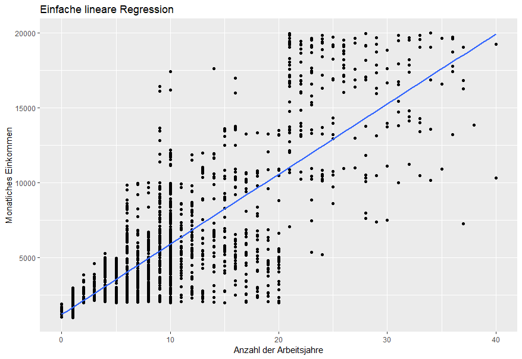
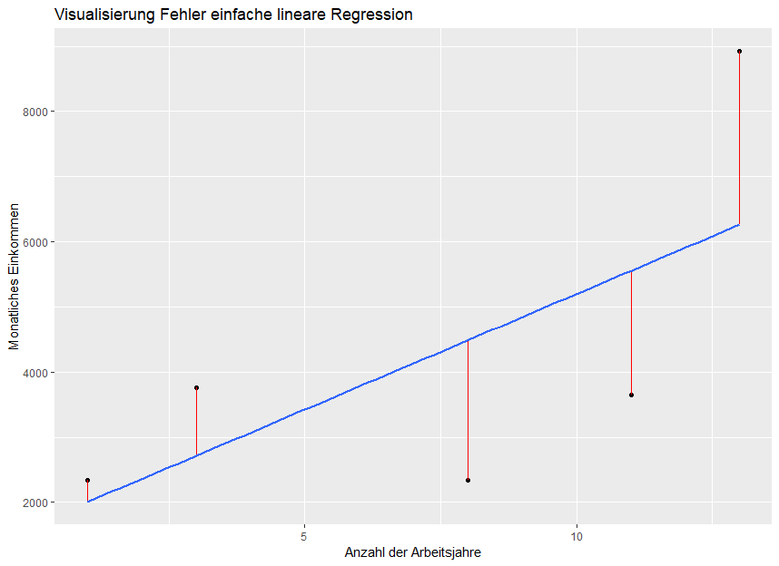
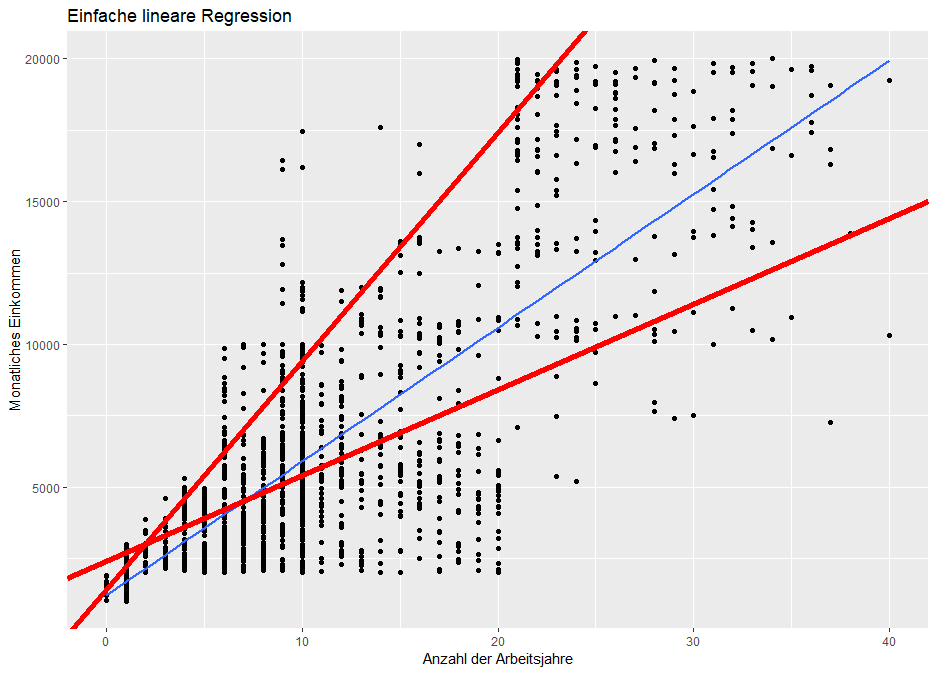
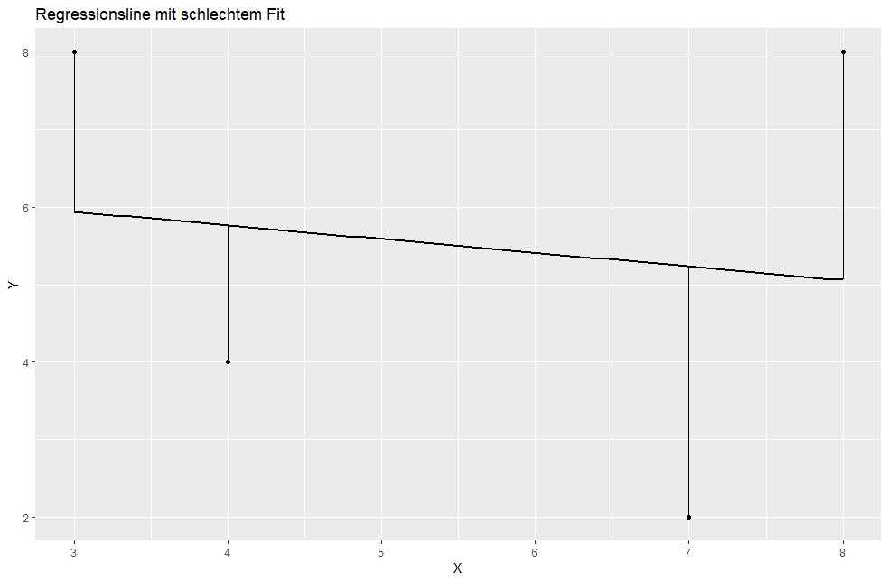

# Modelle

## Fragestellungen der einfachen linearen Regression

Bisher konnten wir Hypothesen testen, die Unterschiede zwischen einem vorgegebenen Mittelwert und dem Mittelwert einer Stichprobe testen. Unsere Modelle hierfür sahen folgendermaßen aus:

Kompaktes Modell:

$$
Y_i = B_0 + e_{i}
$$

Erweitertes Modell:

$$
Y_i = b_0 + e_{i}
$$

Solche einfachen Modelle werden allerdings in der Sozialforschung selten verwendet. In diesem Modul werden wir das Modelle der einfachen linearen Regression kennen lernen, durch die wir spezifischere Fragestellungen testen können:

* Gibt es einen signifikanten Zusammenhang zwischen der Anzahl der gelesenen Bücher und der Intelligenz?
* Gibt es einen signifikanten Zusammenhang zwischen der Mathematiknote und der Englischnote im Abitur?
* Gibt es einen signifikanten Zusammenhang zwischen der Klassengröße und dem Lernerfolg der Schüler\*innen?

## Das zwei-Parameter Modell

Um die gerade genannten Hypothesen zu testen, müssen wir ein erweitertes Modell mit zwei Parametern und einer intervallskalierten Variable aufstellen. Stell dir beispielsweise vor, wir möchten die Hypothese prüfen, ob es einen signifikanten Zusammenhang zwischen dem monatlichen Einkommen der Mitarbeiter und der Anzahl der Arbeitsjahre der Mitarbeiter gibt. Man sollte annehmen, dass Mitarbeiter mehr verdienen, je länger sie arbeiten. Das erweiterte Modell, welches wir finden möchten, sähe folgendermaßen aus:

$$
Y_i = \beta_0 + \beta_1 * X_1 + e_i
$$

<!-- ```R
ggplot(human_resources, aes(x = total_working_years, y = monthly_income)) +
geom_point() +
geom_smooth(method = "lm", se = FALSE) +
labs(
  title = "Einfache lineare Regression",
  x = "Anzahl der Arbeitsjahre",
  y = "Monatliches Einkommen"
)
``` -->



Das Modell ist als blaue Linie dargestellt. $Y_i$ steht für das monatliche Gehalt eines einzelnen Mitarbeiters. In der Visualisierung erkennen wir diese Werte anhand der Y-Achsenwerte der einzelnen Punkte. $\beta_0$ steht für den Punkt, an dem die Regressionsgerade die Y-Achse schneidet (hier ist dieser Wert 1227,9). $\beta_1$ steht für die Steigung der Geraden. Wäre die Steigung 0, würde die Regressionsgerade parallel zur X-Achse verlaufen. $X_1$ steht für die Anzahl der Arbeitsjahre der Mitarbeiter. In der Visualisierung erkennen wir diese WErte anhand der X-Achsenwerte der einzelnen Punkte.

Auf Grundlage dieser Visualisierung können wir bereits einige Dinge erkennen: Je mehr Arbeitsjahre eine Mitarbeiterin hat, desto mehr verdient diese Mitarbeiterin. Dies können wir daran erkennen, dass die Steigung der Geraden positiv ist. Unser Modell erklärt nicht die ganze Varianz des Gehalts. Viele Punkte sind weit von der Regressionsgeraden entfernt. Dies bedeutet, dass andere Faktoren als die Arbeitsjahre darüber entscheiden wie viel eine Mitarbeiterin verdient. Beispielsweise kann die Rolle des Jobs (z.B. Manager) einen Einfluss auf das Gehalt der Mitarbeiterin haben (dies werden wir in späteren Modellen testen). Manager sollten mehr verdienen als Sekretärinnen.

Die Regressionsgerade in der Visualisierunghat folgende Formel (mehr dazu später):

$$
Y_i = 1227.9 + 467.7 * X_1 + e_i
$$

$\beta_0$ gibt uns an, welches Gehalt wir annehmen würden, hätte eine Person noch keine Arbeitserfahrung:

$$
Y_i = 1227.9 + 467.7 * 0 + e_i = 1227.9 + e_i
$$

$\beta_1$ können wir folgendermaßen interpretieren: Mit jedem weiteren Arbeitsjahr verdient eine Mitarbeiterin 467,7 Dollar mehr:

$$
Y_i = 1227.9 + 467.7 * 1 + e_i = 1227.9 + 467.7 + e_i = 1695.6
$$

Wenn unsere Mitarbeiterin daher ein ganzes Jahr arbeitet, sollte sie laut unserem Modell anstatt 1227,9 1695,6 Dollar verdienen.

Wir können durch $\beta_1$ auch erkennen, dass es einen positiven Zusammenhang zwischen den Arbeitsjahren und dem monatlichen Gehalt gibt. Wäre $\beta_1$ negativ, hätten wir einen negativen Zusammenhang.

Die Regressionsgerade erlaubt uns daher genauere Vorhersagen als das einfache Modell $Y_i = b_0 + e_i$. Beispielsweise können wir das Gehalt einer Mitarbeiterin schätzen, die bereits 20 Jahre arbeitet:

$$
\hat{Y}_i = 1227.9 + 467.7 * 20 = 10581.9
$$

## Rückschluss DATA = MODEL + ERROR

Zu Beginn unseres Kurses hatten wir statistische Modelle durch die Formel DATA = MODEL + ERROR beschrieben. Unser Modell ist bei der einfachen linearen Regression daher:

$$
\beta_0 + \beta_1 * X_1
$$

Da wir allerdings die Population nicht kennen und daher $\beta_0$ und $\beta_1$ schätzen müssen, berechnen wir $b$-Koeffizienten auf Grundlage unserer Stichprobe:

$$
\hat{Y}_i = b_0 + b_1 * X_1
$$

Der Fehler ergibt sich durch:

$$
e_i = Y_i - \hat{Y}_i = Y_i - (b_0 + b_1*X_1)
$$

Wenn beispielsweise eine Person in Wirklichkeit 3646 Dollar verdient, wir allerdings auf Grundlage unseres Modells 2713 Dollar schätzen, beläuft sich der Fehler auf $3646 - 2713 = 933$.

<!-- ```R
set.seed(154)
s <- human_resources %>% 
  sample_n(5)
m <- lm(monthly_income ~ total_working_years, data = s)
s <- s %>% add_predictions(m)

ggplot(s, aes(x = total_working_years, y = monthly_income)) +
  geom_point() +
  geom_segment(aes(xend = total_working_years,
                   yend = pred),color = "red") +
  # annotate("segment", x = 3, xend = 3, y = 2712.945, yend = 3760,
  #         color = "red") +
  geom_smooth(method = "lm", se = FALSE) +
  labs(
    title = "Visualisierung Fehler einfache lineare Regression",
    x = "Anzahl der Arbeitsjahre",
    y = "Monatliches Einkommen"
  )
``` -->

Grafisch dargestellt sind diese Fehler der Abstand der tatsächlichen Werte des monatlichen Gehalts $Y_i$ und den regredierten Werte $\hat{Y}_i$:



Statistische Modelle werden fast nie identische Werte für $Y_i$ und $\hat{Y}_i$ liefern, da es sich um einen probabilistischen Zusammenhang und keinen deterministischen Zusammenhang handelt. Am Ende des Moduls werden wir testen, wie gut dieser Zusammenhang ist.

<!-- ## z-standardisierte Regression

Du kennst bereits den Korrelationskoeffizienten zweier Variablen. Der Koeffizent gibt uns an, wie stark zwei Variablen miteinander korrelieren. Eine Korrelation von 1 bedeutet, dass alle Punkte auf der Regressionsgeraden liegen und wir daher $Y_i$ exakt durch unseren Parameter $X_1$ hervor sagen können.

Mit Hilfe der z-Standardisierung können wir unser Modell auf ein Parameter vereinfachen:

$$
\hat{Y}_i = b_1 * X_1
$$

Eine Möglichkeit das Modell zu vereinfachen ist die z-Standardisierung  -->


# Berechnung Regressionsgerade

## Konzeptuelles Verständnis

Wir haben einen wichtigen Schritt übergangen: Wie berechnet man die Regressionsgerade? Wir müssen für unser Modell $\hat{Y}_i = b_0 + b_1 * X_1$ die Koeffizienten $b_0$ und $b_1$ berechnen. 

Wir hatten gerade die Regressionsgerade in einem Streudiagram als blaue Regressionsgerade visualisiert:


Im Prinzip könnte man unendlich viele Regressionsgeraden annehmen:

<!-- ```R
ggplot(human_resources, aes(x = total_working_years, y = monthly_income)) +
  geom_point() +
  geom_smooth(method = "lm", se = FALSE) +
  geom_abline(intercept = 1400, slope = 800, color = "red", size = 2) +
  geom_abline(intercept = 2400, slope = 300, color = "red", size = 2) +
  labs(
    title = "Einfache lineare Regression",
    x = "Anzahl der Arbeitsjahre",
    y = "Monatliches Einkommen"
  )
``` -->



Diese roten Regressionslinien erfüllen allerdings eine Eigenschaft nicht, die die blaue Regressionslinie hat:

> Die Regresssionsgerade minimiert die **quadrierten Abweichungen** der einzelnen Punkte von der Regressionsgerade.


$$
\min {\sum_{i=1}^N{(Y_i - \hat{Y}_i)}^2} 
$$

Die Regressionsgerade, welche diese Bedingung erfüllt, stellt durch diese Eigenschaft, diejenige Gerade wieder, die die geringsten Fehler macht. Dass diese Gerade daher die Fehler maximal reduziert bedeutet nicht gleichzeitig, dass sie die Daten akkurat beschreibt:

<!-- ```R
my_artificial_sample <- tibble(
  income  = c(4, 8, 2, 8),
  income_father = c(4, 3, 7, 8)
)

model <- lm(income ~ income_father, data = my_artificial_sample)

my_artificial_sample <- my_artificial_sample %>% 
  add_predictions(model)

ggplot(my_artificial_sample, aes(x = income_father, y = income)) + 
  geom_point() +
  geom_segment(
    aes(x = income_father,
        xend = income_father,
        y = income,
        yend = pred
    )
  ) +
  geom_smooth(method = "lm", se = FALSE, color = "black") +
  guides(alpha = FALSE) +
  labs(
    title = "Regressionsline mit schlechtem Fit",
    x = "X",
    y = "Y"
  )
``` -->



In diesem Fall siehst du zwar die *beste Gerade*, diese ist allerdings ein schlechtes Modell, um die Daten zu erklären. Wir würden bei dieser Geraden annehmen, dass sie nicht besser als ein kompaktes Modell ist.


## Matrixalgebra

> Dieser Teil geht über die Inhalte des Kurses hinaus und ist nicht prüfungsrelevant.

Die allgemeinste Art, die Regressionsgerade zu berechnen ist durch lineare Algebra möglich. Wer mehr darüber erfahren möchte, kann sich [diese Webseite](https://medium.com/@andrew.chamberlain/the-linear-algebra-view-of-least-squares-regression-f67044b7f39b) anschauen. Für eine Vertiefung in lineare Algebra ist [dieser Kurs](https://ocw.mit.edu/courses/mathematics/18-06-linear-algebra-spring-2010/) zu empfehlen. An dieser Stelle werden wir nur die Formel aufstellen und berechnen, ohne in die Details zu gehen.


Das Ziel ist es, die Regressionskoeffizienten für eine einfache lineare Regression zu berchnen, welche auf Grundlage der Anzahl der Arbeitsjahre das Einkommen der Personen schätzt:

$$
\hat{Y} = b_0 + b_1 * X_1
$$

In der linearen Algebra können wir dieses Problem durch folgende Formel lösen:

$$ (A^{T} A)^{-1} A^{T} b $$

$A$ steht für eine Matrix der unabhängigen Variablen (X_1). $b$ steht für $Y$. 

Zunächst verfassen wir A:

```R
rows <- nrow(human_resources)
A <- matrix(
  c(rep(1, rows), human_resources$total_working_years), 
  nrow = rows)
b <- matrix(human_resources$monthly_income, nrow = rows)
solve(t(A) %*% A) %*% t(A) %*% b
```

```
          [,1]
[1,] 1227.9353
[2,]  467.6584
```

Der Output entpricht exakt der Regressionsgerade:

$$
Y_i = 1227.9 + 467.7 * X_1 + e_i
$$


## Weitere Methoden zur Berechnung der Regressionsgeraden

### Die lm-Funktion

Die einfachste Methode zur Berechnung der Regressionsgerade in R ist die Funktion [lm](https://stat.ethz.ch/R-manual/R-devel/library/stats/html/lm.html):

```R
lm(monthly_income ~ total_working_years, data = human_resources)
```

```
Call:
lm(formula = monthly_income ~ total_working_years, data = human_resources)

Coefficients:
        (Intercept)  total_working_years  
             1227.9                467.7 
```

Das erste Argument der Funktion ist die Formel des linearen Modells, welches wir aufstellen möchten. Hier haben wir eine abhängige Variable `monthly_income` und eine metrisch skalierte unabhängige Variable `total_working_years`. Das zweite Argument ist der Datensatz (`data = human_resources`). Die abhängige und die unabhängige Variable werden durch eine Tilde `~` getrennt.

### Berechnung auf Grundlage der Korrelation, Standardabweichung und Mittelwert

Eine weitere Möglichkeit zur Berechnung der Koeffizienten liefern folgende Formeln:

$$ b_1 = r * \frac{s_{y}}{s_{x}} $$

$$ b_0 = \bar{Y} - b_1 * \bar{X} $$


```R
(b_1 <- cor(human_resources$monthly_income, 
            human_resources$total_working_years) *
            (sd(human_resources$monthly_income) /
        sd(human_resources$total_working_years))) # [1] 467.6584

(b_0 <- mean(human_resources$monthly_income) - b_1 * 
        mean(human_resources$total_working_years)) # 1227.935
```


# Statistische Inferenz

## Konzeptuelles Verständnis

Bei der einfachen linearen Regression möchten wir in der Regel testen, ob eine Variable $X$ ein guter Prediktor für die abhängige Variable $Y$ ist. Sollte dies der Fall sein, müssten wir annhemen, dass Ausprägungen von $X$ zu Veränderungen in $Y$ führen. Beispielsweise indem wir zeigen, dass mehr Arbeitsjahre zu einem größeren Gehalt führen. Um diese Beziehung zu testen, vergleichen wir unser erweitertes Modell mit einem kompakten Modell, bei dem $\beta_0$ auf 0 gesetzt wird:

$$
MODEL\ A = Y_i = \beta_0 + \beta_1 * X_1 + \epsilon_i
$$

$$
\begin{aligned}
MODEL\ C = Y_i &= \beta_0 + B_1 * X_1 + \epsilon_i \\
               &= \beta_0 + 0 * X_1 + \epsilon_i \\
               &= \beta_0 + \epsilon_i
\end{aligned}
$$

Unsere Hypothese lautet daher: $H_0: \beta_1 = 0$. Im Grunde testen wir erneut einen t-Test für eine Stichprobe, nur dass wir lediglich einen Parameter testen. Diese Hypothese kann man sowohl mit einen F-Test als auch mit einem t-Test prüfen. Ein signifikantes Ergebnis bedeutet, dass das Hinzufügen der Variable X dazu führt, dass die Fehler substantielle reduziert werden und somit das erweiterte Modell die Daten akkurater darstellt.

Achte darauf, dass unser kompaktes Modell nun das erweiterte Modell ist, welches wir im letzten Modul bestimmt haben. Dieses kompakte Modell dieses Moduls werden wir häufiger verwenden, um später Hypothesen zu testen. Im Grunde fragen wir uns immer, ob unser erweitertes Modell besser ist als ein Model, welches lediglich den Mittelwert der abhängigen annimmt.

## F-Test

Um unsere Hypothese $H_0: \beta_1 = 0$ berechnen wir einen F-Test, der prüft, ob das Hinzufügen des Parameters $X_1$ zu einer substantiellen Reduzierung der Fehler im Vergleich zum kompakten Modell führt. Unsere Modelle lauten:

$$
\begin{aligned}
MODEL\ A = \hat{Y}_i &= 1227.935 + 467.6584 * X_1 \\
MODEL\ C =  \hat{Y}_i &= 6502.931 + B_1 * X_1  \\
               &= 6502.931 + 0 * X_1  \\
               &= 6502.931 
\end{aligned}
$$

Wie immer stellen wir die Hypothese auf Grundlage einer Stichprobe auf. Daher ziehen wir zunächst eine Stichprobe von 40 Personen aus dem Datensatz:

```R
set.seed(987)
my_sample <- human_resources %>% 
  sample_n(40)
```

Als nächstes berechnen wir die Parameter unsere einfachen linearen Regression:

```R
lm(monthly_income ~ total_working_years, data = my_sample)
```

```
Call:
lm(formula = monthly_income ~ total_working_years, data = my_sample)

Coefficients:
        (Intercept)  total_working_years  
             1022.5                469.6 
```

Nun können wir $SSR$ und $SSE(A)$ berechnen:


```R
mean_sample <- mean(my_sample$monthly_income) # Mittelwert der Stichprobe
errors <- my_sample %>% 
  mutate(
    compact_model = mean_sample,
    augmented_model = 1022.5158 + 469.5602 * total_working_years,
    res_compact   = (monthly_income - compact_model)**2,
    res_augmented = (monthly_income - augmented_model)**2
  )


(sse_c <- sum(errors$res_compact)) # 1050123877
(sse_a <- sum(errors$res_augmented)) # 566574246
(ssr <- sse_c - sse_a) # 483549631
```

Für PRE ergibt sich dann:

```R
(pre <- ssr / sse_c) # 0.4604691
```

Der F-Wert ist folgendermaßen:


$$
F = \frac{SSR / (PA - PC)}{SSE(A) / (n - PA)}
$$

* $PC$: Das kompakte Modell hat einen Parameter $b_0$.
* $PA$: Das erweiterte Modell hat zwei Parameter: $b_1$ und $b_1$.
* $n$: Insgesamt gibt es 1470 Personen in dem Datensatz.


```R
(F <- (ssr / (2 - 1)) / (sse_a / (40 - 2))) # 32.43155
```

Wir können daher sagen, dass unser erweitertes Modell die Fehler des kompakten Modells um 46% reduziert. Zudem gibt uns der F-Wert an, dass unsere abhängige Variable der Anzahl der Arbeitsjahre die Fehler 32-fach stärker reduziert als wir durch eine willkürliche Variable annehmen würden. Dies führt sicher zu einem signifikanten Ergebnis:

```R
1 - pf(F, df1 = 1, df2 = 40 - 2) # 1.49266e-06
```

In der Tat, dieses Ergebnis ist äußerst signifkant:

| Source      |     SS     | df | MS        | F     | p      | PRE / $R^2$  |
|-------------|:----------:|---:|-----------|-------|--------|------|
| Reduction   |  483549631 |  1 | 483549631 | 32.43 | < .001 | 0.46 |
| Error       |  566574246 | 38 | 14909849  |       |        |      |
| Total Error | 1050123877 | 39 |           |       |        |      |

Achte darauf, dass bei einer linearen Regression PRE meist als $R^2$ bezeichnet wird. Die Wurzel von $R^2$ ist bei der einfachen linearen Regression nichts anderes als die Korrelation der beiden Variablen:

```R
cor(my_sample$monthly_income, my_sample$total_working_years) # 0.6785788
sqrt(pre) # 0.6785788
```

## t-Test

Da der Freiheitsgrad unseres F-Tests 1 ist, können wir genausogut einen t-Test rechnen, um unsere Hypothese zu prüfen. Unser Ergebnis des F-Tests war:

| Source      |     SS     | df | MS        | F     | p      | PRE / $R^2$  |
|-------------|:----------:|---:|-----------|-------|--------|------|
| Reduction   |  483549631 |  1 | 483549631 | 32.43 | < .001 | 0.46 |
| Error       |  566574246 | 38 | 14909849  |       |        |      |
| Total Error | 1050123877 | 39 |           |       |        |      |

### t-Wert auf Grundlage von F berechnen

Wir wissen, dass der t-Wert nichts anderes ist als die Wurzel des F-Wertes, daher können wir sagen, dass:

$$
t_{n-2} = \sqrt{F} = \sqrt{32.43} = 5.695
$$

### t-Wert auf Grundlage der herkömmlichen Formel berechnen

Den t-Wert können wir ebenso durch unsere herkömmliche Formel berechnen.

$$
t_{n - 2} = \frac{\bar{X} - B_0}{se} 
$$

Die oberen Parameter kennen wir bereits:

$$
t_{40 - 2} = \frac{469.56 - 0}{se} 
$$

Wir benötigen allerdings noch den Standardfehler ($se$), welcher anders berechnet wird als bei dem kompakten Modell. Der Standardfehler der einfachen linearen Regression gibt den mittleren Abstand der einzelnen Punkte von der Regressionsliege an. Je kleiner der Standardfehler ist, desto näher liegen die Punkte an der Regressionslinie (mehr Informationen [hier](https://www.statisticshowto.datasciencecentral.com/find-standard-error-regression-slope/)).

Die Formel hierzu lautet:

$$
se_{regression} = \frac{\sqrt{\sum{(Y_i - \hat{Y}_i)^2} / (n - PA)}}{\sqrt{\sum{(X_i - \bar{X})^2}}}
$$

Diese Formel ist äußerst kompliziert und musst du nicht lernen. An dieser Stelle geht es vielmehr darum, dass du siehst, wie der t-Wert noch ausgerechnet werden kann. Berechnen wir den t-Wert also in R:

```R
sum_y <- sum((errors$augmented_model - errors$monthly_income)^2)
sum_x <- sum((errors$total_working_years - mean(errors$total_working_years))^2)

(se <- sqrt(sum_y / 38) / sqrt(sum_x)) # 82.45318

(t <- (469.56 - 0) / se) # 5.694868
```

### t-Wert auf Grundlage der Korrelation berechnen

Wir können den t-Wert ebenso durch folgende Formel berechnen:

$$
t_{n-2} = \frac{r}{\sqrt{\frac{1 - r^2}{n - 2}}}
$$

In R wäre dies:

```R
(t <- correlation / sqrt((1 - correlation^2) / (40 - 2))) # 5.694871
```

Zum Schluss müssen wir die Wahrscheinlichkeit eines solchen Ereignisses anhand der t-Verteilung bestimmen:

```R
1 - pt(t, df = 38) # 7.46329e-07
```

Erneut handelt es sich um ein hochsignifikantes Ergebnis. Wir können daher darauf schließen, dass es sich um eine signifikante Korrelation handelt und der Parameter die Fehler des kompakten Modells substantiel reduziert.

Die Ergebnisse können wir erneut in einer Tabelle darstellen:


| Predictor           | Estimate |    SE | t    | p      |
|---------------------|:--------:|------:|------|--------|
| Intercept           |  1022.52 |       |      |        |
| total_working_years |  469.56  | 82.45 | 5.69 |< .001  |

Wir könnten die gleiche Berechnung für den Intercept durchführen, dieser Interessiert uns allerdings weniger.


## Jamovi

## SPSS

## Einfache Regression berichten

> Bei Berichten einer einfachen linearen Regression wird PRE als $R^2$ berichtet.

## Konfidenzintervalle beta

## Beispiel

# Modeling Example
