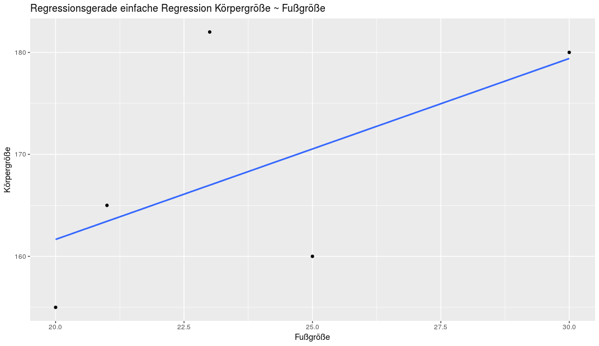

Bei der einfachen linearen Regression haben wir zwei Parameter. Den Y-Achsenabschnitt oder Intercept ($\beta_0$) und einen stetigen Parameter ($\beta_1$). Die multiple Regression erweitert dieses Modell um weitere Parameter:

$
Y_i = \beta_0 + \beta_1 * X_{i1} + \beta_2 * X_{i2} + \beta_n * X_{i,p-n} + ... + \epsilon_i
$

## Wiederholung einfache Regression

Betrachten wir zunächst eine einfache Regression:


$
Y_i = \beta_0 + \beta_1 * X_{i1} + \epsilon_i
$

Wir könnten zum Beispiel die Größe einer Person ($Y_i$) mit Hilfe der Fußgröße derselben Person ($X_i$) hervorsagen:

```python
library(tidyverse)

person_data <- tibble(
  height   = c(182, 155, 165, 160, 180),
  footsize = c(23, 20, 21, 25, 30)
)

lm(height ~ footsize, data = person_data) 

ggplot(person_data, aes(x = footsize, y = height)) +
  geom_point() +
  geom_smooth(method = "lm", se = FALSE) +
  labs(
    x = "Fußgröße",
    y = "Körpergröße",
    title = "Regressionsgerade einfache Regression Körpergröße ~ Fußgröße"
  )
```

```
Call:
lm(formula = height ~ footsize, data = person_data)

Coefficients:
(Intercept)     footsize  
    126.182        1.774  
```




Die Regressionsgerade lautet also: 


$
\hat{Y}_i = 126.182 + 1.774 * X_{i1}
$

Bei einer Person, die eine Fußgröße von 30 Zentimenter hat, würden wir daher annehmen, dass sie eine Körpergröße von 179.40 hat: 

$
\hat{Y}_i = 126.182 + 1.774 * 30 = 179.40
$

## Unterschied Multiple Regression

Bei einer multiplen Regression versuchen wir $Y_i$ durch weitere Parameter hervorzusagen. Zum Beispiel könnten wir als weiteren Parameter die Größe des Vaters hinzunehmen:


```python
person_data <- tibble(
  height   = c(182, 155, 165, 160, 180),
  footsize = c(23, 20, 21, 25, 30),
  height_father = c(181, 167, 180, 170, 183)
)

lm(height ~ footsize + height_father, data = person_data) 
```

```
Call:
lm(formula = height ~ footsize + height_father, data = person_data)

Coefficients:
  (Intercept)       footsize  height_father  
      -78.545          0.615          1.318  
```

Unser Modell würde dementsprechend so aussehen:

$
\hat{Y}_i = -78.545 + 0.615 * X_{i1} + 1.318 * X_{i2}
$

Bei einer Person mit einer Fußgröße von 30 und deren Vater 180 groß ist, würden wir annehmen, dass sie 177.15cm groß ist.

$
\hat{Y}_i = -78.545 + 0.615 * 30 + 1.318 * 180 = 177.15
$

Wir könnten unendlich viele Parameter in das Modell aufnehmen. Erinner dich aber daran, dass wir als Regel so wenige Parameter wie möglich und so viele wie nötig in das Modell integrieren wollen. Mit jedem Parameter den wir hinzunehmen, reduziert sich der Fehler zum kompakten Modell. Für uns entscheidend ist, ob der Fehler groß genug ist, um zu rechtfertigen, den Parameter in das Modell hinzu zu nehmen, oder ob nicht das kompakte Modell die Körpergröße gut genug erklärt. 