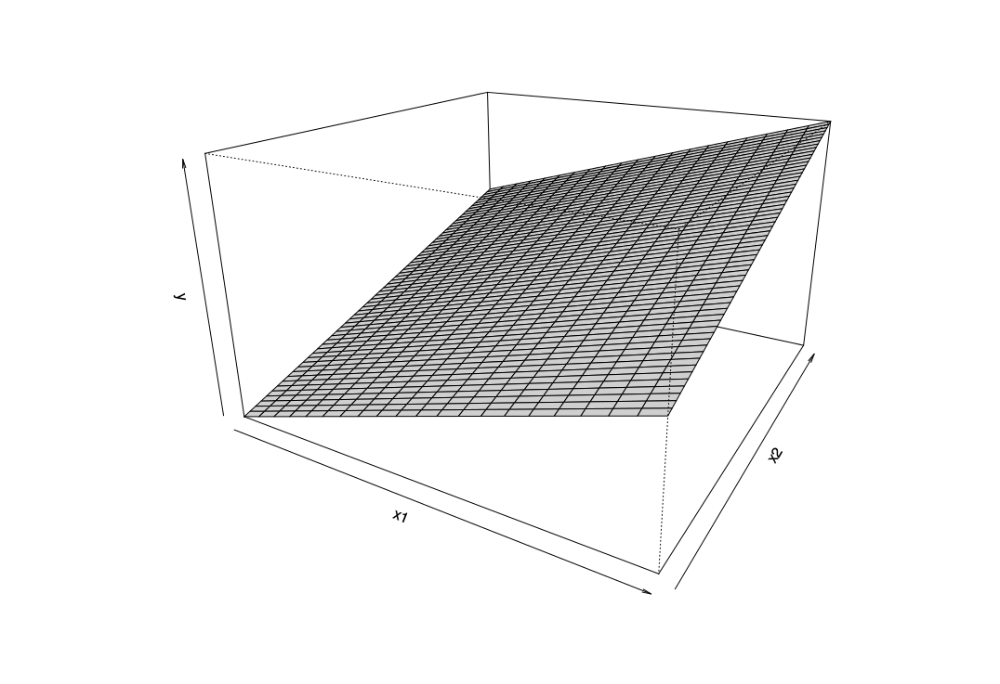

In diesem Kurs verzichten wir, die Regressionskoeffizienten mathematisch zu berechnen, wichtig ist, wie sie konzeptionell berechnet werden. Bei unserem einfachen Modell hatten wir gesagt, dass das Model einem Punkt entspricht. Für jeden Wert schätzen wir das gleiche $\hat{Y}$. Bei der einfachen Regression hatten wir gesagt, dass unser Modell einer Geraden entspricht. Die Gerade wird aus einem Modell mit zwei Koeffizienten berechnet: Dem Y-Achsenabschnitt und der Steigung der Geraden. 

Das Modell der multiplen Regression ist weder ein Punkt, noch eine Gerade. Visuell vorstellen können wir das Modell lediglich, wenn wir zwei Prädiktoren annehmen. Bei zwei Prädiktoren ist unser Modell eine Fläche:

<!-- ## Load data

http://rstudio-pubs-static.s3.amazonaws.com/9141_4d05657f39d6401884f9e84aa36dc9d8.html

dat <- read.table(header = TRUE, text = "
y   x1  x2
12.37   2.23    9.66
12.66   2.57    8.94
12  3.87    4.4
11.93   3.1 6.64
11.06   3.39    4.91
13.03   2.83    8.52
13.13   3.02    8.04
11.44   2.14    9.05
12.86   3.04    7.71
10.84   3.26    5.11
11.2    3.39    5.05
11.56   2.35    8.51
10.83   2.76    6.59
12.63   3.9 4.9
12.46   3.16    6.96
")

## Fit a linear regression
lmFit <- lm(y ~ x1 + x2, data = dat)

## Create x1, x2 values to predict y for
x1 <- seq(from = 2, to =  4, by = 0.1)
x2 <- seq(from = 4, to = 10, by = 0.1)

## Predict y
y <- outer(X = x1, Y = x2, FUN = function(x1, x2) {
  
  predict(lmFit, newdata = data.frame(x1 = x1, x2 = x2))
})

## Regression plane
persp(x = x1,
      y = x2,
      z = y,
      theta = 30, phi = 20, expand = 0.6, shade = 0.3) -->

Aber welche Fläche? Wir könnten im Prinzip unendliche viele Flächen überlegen. Das Modell, welches am besten ist, reduziert den Fehler maximal. Oder anders ausgedrückt, SSE sollte bei diesem Modell am kleinsten sein. Oder im Bilde unserer Grafik gesprochen, sollte der Abstand der Einzelpunkte so klein wie möglich von der Fläche sein. 

$
SSE = \sum (Y_i - \hat{Y}_i)^2
$

In der Gleichung gesprochen müssen wir das Modell finden, welches den kleinsten quadrierten Abstand zwischen den realen Werten $Y_i$ und den hervorgesagten Werten $\hat{Y}_i$ erzeugt. 

Eine mathematische Erklärung, wie dieser Fehler minimiert werden kann, findest du [hier](https://medium.com/@andrew.chamberlain/the-linear-algebra-view-of-least-squares-regression-f67044b7f39b).