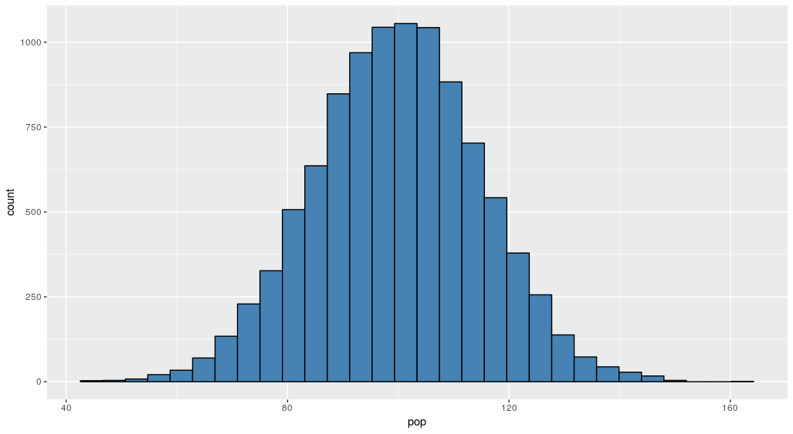

In den nächsten Lerneinheiten wirst du manchmal eigene Populationen erstellen, daher solltest du rechtzeitig lernen, wie wir das in R simulieren. Stelle zunächst sicher, dass du immer am Anfang deines R-Skripts das Paket tidyverse lädst:

```python
library(tidyverse)
```

Als Population bezeichnen wir die Gesamtheit aller Untersuchungsobjekte. Beispielsweise wären dies alle Menschen auf der Erde, alle Studierende, alle Deutschen, alle Menschen, die Sport treiben. Wichtig ist, dass wir fast nie die Populationen erheben können. Wir simulieren in den nächsten Wochen lediglich ein paar Populationen um die statistischen Konzepte dieses Kurses besser zu verstehen. 

Um eine Population zu simulieren, verwenden wir in der Regel die Funktion [rnorm](https://stat.ethz.ch/R-manual/R-patched/library/stats/html/Normal.html). Mit Hilfe von `rnorm` können wir willkürlich viele Untersuchungsobjekte mit einem bestimmten Mittelwert und einer bestimmten Standardabweichung erhalten. Hier ein Beispiel:

```python
pop <- rnorm(n = 10000, mean = 100, sd = 15)
```

Die Funktion hat drei Attribute:

* *n* steht für die Anzahl der Untersuchungsobjekte, die wir simulieren möchten.
* Mit *mean* definieren wir den Mittelwert der Variable in der Population
* Mit *sd* definieren wir die Standardabweichung der Variable in der Population

Visualisiert würde diese Population folgendermaßen als Histogram aussehen:

```python
ggplot(NULL, aes(x = pop)) +
  geom_histogram(fill = "steelblue", color = "black")
```

