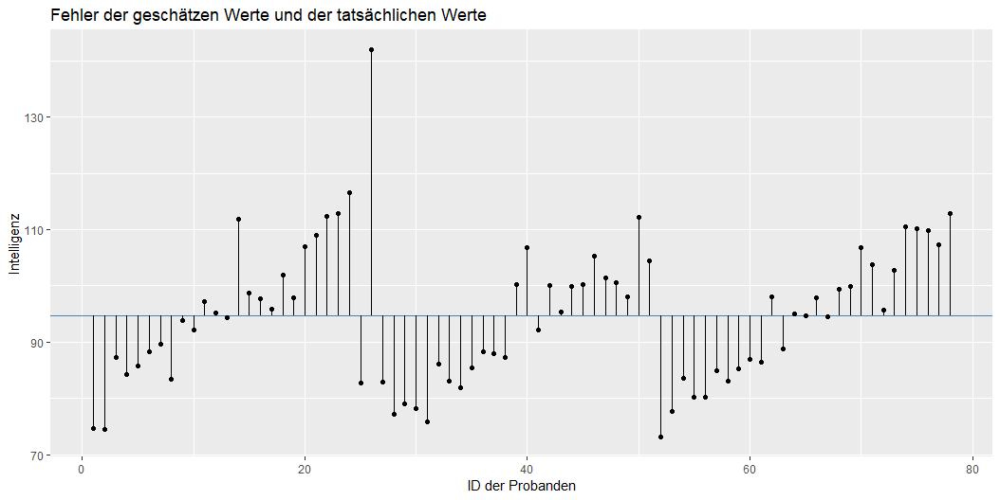

# Dateset for first chapters

```
data <- read_delim("C:/Users/ChristianEZW/repositories/statistik_2_online_kurs/data/markdown/daten_intelligenz.csv", ";", escape_double = FALSE, trim_ws = TRUE)


new_data <- data %>% 
  mutate(
    intelligence_pre = (intelligence_pre / 72.52) * 100,
    intelligence_post = (intelligence_post / 72.52) * 100,
    books_per_year = ((books_per_year / 171) * 10) %>% floor
  ) %>% 
  rename(id = person)


new_data %>% 
  group_by(group) %>% 
  summarise(
    mean_pre = mean(intelligence_pre),
    mean_post = mean(intelligence_post)
  ) %>% 
  gather(variable, value, - group) %>% 
  ggplot(aes(x = variable, y = value, group = group)) +
    geom_line()

```

# Data = Model + Error

Der ganze Inhalt dieses Kurses lässt sich in einer Gleichung zusammen fassen:

$$
DATA = MODEL + ERROR
$$

## DATA 

*DATA* sind die Werte, welche wir empirisch erheben. Beispielsweise untersuchen wir, wie gut Lernende in einem Test abschneiden oder wir möchten wissen, wie hoch die Intelligenz von Personen ist. In der Statistik wird *DATA* häufig auch als *abhängige Variable* bezeichnet.

Als Beispiel können wir die Intelligenz einer Person nehmen. Der Intelligenzquotient einer Person ist *DATA*, also die Punktzahl der Intelligenz, die wir in einem Test von einer Person erhalten. Unser Ziel ist es, ein mathematisches Modell zu bilden, welches diesen Wert gut hervorsagt. Diese Modelle werden wir in diesem Kurs ausführlich behandeln.

## MODEL

*MODEL* bezeichnet ein mathematisches Modell, welches wir benutzen, um *DATA* hervorzusagen. In der Regel versuchen wir eine Vielzahl an Daten in einer verständlichen Form zusammen zu fassen. In einem Zeitungsbericht findest du selten lange Tabellen mit allen Daten eines Experiments. Vielmehr werden in der Regel einzelne Kennwerte vermittelt: 70% der Personen stimmten für Politiker X; Menschen haben im Schnitt einen Intelligenzquotienten von 100. Diese Werte sind nichts anderes als statistische Modelle, auch wenn diese sehr einfach sind. Das einfachste statistische Modell ist der Mittelwert einer Variable.

## ERROR

Allerdings wird dieser geschätze Wert durch den Mittelwert nicht DATA entsprechen. Diese Abweichungen nennen wir ERROR oder auch *Residuen*. Stellen Sie sich vor, eine Person hat einen Intelligenzquotienten von 110, wir schätzen allerdings die Intelligenz dieser Person anhand des Mittelwertes auf 100. In diesem Fall hätten wir eine Abweichung von 10 Punkten und dementsprechend einen ERROR von 10 Punkten.

# Ein Beispiel

Stell dir vor, du hast die Intelligenz von 78 Probanden durch einen Intelligenztest erhoben. Jeder Proband hat eine ID erhalten. Hier siehst du die Intelligenzwerte dieser 78 Probanden:

```R
ggplot(new_data, aes(x = intelligence_pre, y = reorder(id, intelligence_pre))) + 
  geom_point() +
  labs(
    x = "Intelligenz",
    y = "Probanden-ID",
    title = "Einzelne Intelligenzwerte der Probanden"
  ) +
  theme_light()
```


Proband 52 beispielsweise hat den geringsten Intelligenzquotienten von eta 73, während Proband 26 den höchsten Intelligenzquotienten hat. 

Diese Werte nennen wir **DATA**, da sie die realen Werte Probanen sind. 

Wir können **DATA** ebenso in einem Histogram darstellen:

```R
ggplot(new_data, aes(x = intelligence_pre)) + 
  geom_histogram(color = "black", fill = "#cccccc", binwidth = 3) +
  labs(
    x = "Intelligenz",
    y = "Häufigkeit",
    title = "Histogram der Intelligenz der Probanden"
  )
```


Wir hatten vorhin beispielsweise den Mittelwert als ein einfaches Modell angenommen. Diesen Wert können wir im Histogram abtragen:

```R
ggplot(new_data, aes(x = intelligence_pre)) + 
  geom_histogram(color = "black", fill = "#cccccc", binwidth = 3) +
  geom_vline(
    xintercept = mean(new_data$intelligence_pre),
    color = "steelblue",
    size = 2
  ) +
  labs(
    x = "Intelligenz",
    y = "Häufigkeit",
    title = "Histogram der Intelligenz der Probanden"
  )
```


Dieser Mittelwert wäre nun ein Beispiel für ein **Model**. Anhand des Histograms kannst du bereits erkennen, dass der Mittelwert kein gutes Modell ist, um die einzelnen Werte zu bestimmen. Beispielsweise liegt die Person 26 über 40 Intelligenzpunkte über dem Mittelwert. Ebenso ist die Person mit dem geringsten Intelligenzquotienten über 25 Punkte unter dem Mittelwert. Wenngleich das Modell nicht in der Lage ist, die einzelnen Werte gut hervorzusagen, ist es Model, welches unserer Gleichung entspricht:

$$
DATA = MODEL + ERROR
$$

Wir werden gleich im nächsten Abschnitt **ERROR** genauer bestimmen. Vorab müssen wir nochmal über die Modelle sprechen.


# Kurzfrage

Stell dir folgendes Szenario vor: Du schätzt, wie alt Menschen in Deutschland werden, die im Jahr 2015 geboren sind. Du schätzt, dass Personen, die im Jahr 2015 geboren sind, im Schnitt 86 Jahre alt werden (dein Modell). Nach 105 Jahren liegen Daten zu deiner Schätzung vor. Mareike, welche im Jahr 2015 geboren ist, wurde 84 Jahre alt.

```
- question: Wie groß ist der Fehler für Mareike? 
  answers:
    - answer: "-2"
      correct: True
      hint: Sehr gut. Der Fehler ist ERROR = DATA - MODEL. Also ERROR = 84 - 86 = -2
    - answer: "2"
      correct: False
      hint: Nicht ganz. Erinnere dich daran das der Fehler ERROR = DATA - MODEL ist
    - answer: "19"
      correct: False
      hint: Nicht ganz. Erinnere dich daran das der Fehler ERROR = DATA - MODEL ist
    - answer: "-19"
      correct: False
      hint: Nicht ganz. Erinnere dich daran das der Fehler ERROR = DATA - MODEL ist
    - answer: "4"
      correct: False
      hint: Nicht ganz. Erinnere dich daran das der Fehler ERROR = DATA - MODEL ist
```

# Frage 2


```
- question: Welches dieser Beispiele ist kein statistisches Modell?
  hint: Überlege dir, welches dieser Kennwerte mehrere Daten nicht zusammen fasst. 
  answers:
    - answer: Der Mittelwert einer Verteilung
      correct: False
    - answer: Der Modus einer Verteilung
      correct: False
    - answer: Die Einzelwerte einer Verteilung
      correct: True
    - answer: Die Standardabweichung einer Verteilung
      correct: False
```

# Ziele von Modellen

Ein gutes statistisches Modell ist ein Modell, welches die Fehler klein hält und gleichzeitig nicht zu komplex ist. In der Sozialforschung haben wir fast nie Modelle, bei denen wir Fehler von 0 erhalten. Dennoch möchten wir versuchen, diesen Fehler so klein wie möglich zu halten.

Es ist offensichtlich, dass ein einfaches Modell wie der Mittelwert einer Verteilung in der Regel denkbar schlecht ist, um den Fehler klein zu halten. Schauen wir nochmal die Verteilung von gerade eben an:


Offensichtlich brauchen wir mehr Informationen als den Mittelwert, um zu berechnen, was der Intelligenzquotient einer Person ist. Man könnte sich zum Beispiel vorstellen, dass die Anzahl der gelesenen Bücher pro Jahr ein guter Parameter ist, um die Intelligenz einer Person genauer hervorzusagen.

# Wie kann der Fehler reduzuiert werden?

Es gibt verschiedene Möglichkeiten, den Fehler bei statistischen Modellen zu reduzieren:

## Qualität der Daten verbessern

Zunächst können wir dafür sorgen, dass die Daten ohne Fehler erhoben und eingetragen wurden. Manche Menschen machen Fehler, wenn sie Daten in Excel-Tabellen eintragen, manchmal ist ein Verfahren aber auch unreliabel und zeigt inkonsistente Werte an. Beispielsweise kann eine Waage unreliabel sein, wenn sie beim gleichen Gewicht schwankende Werte angibt. 

## Hinzufügen von mehr Parametern

Je mehr Parameter man in ein statistisches Modell hinzufügt, desto geringer wird der Fehler. Wir könnten bei unserem Modell zur Intelligenz beispielsweise den Parameter Hochschulabschluss hinzunehmen: 

* Bei Menschen, die einen Hochschulabschluss haben, schätzen wir die Intelligenz anhand des Mittelwertes der Intelligenz aller Personen, die einen Hochschullabschluss haben
* Bei Menschen die keinen Hochschullabschluss haben, schätzen wir die Intelligenz anhand des Mittelwerts Intelligenz aller Personen, die keinen Hochschullabschluss haben

$$
Y_i = \beta_{0} + \beta_{1} * X_{1} + ERROR
$$

* $\beta_{0}$ repräsentiert in diesem Fall den Mittelwert von Personen ohne Hochschullabschluss
* $X_{1}$ ist entweder 0 oder 1. 0, wenn eine Person keinen Hochschullabschluss hat, 1, wenn die Person einen Hochschulabschluss hat. 
* $\beta_{1}$ repräsentiert den Unterschied des Intelligenzquotienten zwischen Personen, die einen Hochschullabschluss haben und Personen, die keinen Hochschullabschluss haben.

Hypothetisch könnten wir uns folgendes Modell ausdenken:

$$
Y_i = 100 + 10 * X_{1} + ERROR
$$

Das Modell würde in diesem Fall für Menschen, die keinen Hochschullabschluss haben, einen Intelligenzquotienten von 100 vorschlagen und bei Menschen die einen Hochschullabschluss haben, einen Intelligenzquotienten von 110 vorschlagen. Durch das Hinzufügen dieses Parameters haben wir nun die Hervorsagen von DATA abhängig von einer anderen Variable (hier Hochschullabschluss) gemacht. 

## Die Gefahr beim Hinzufügen von Parametern

Wir könnten noch weitere Parameter hinzufügen (z.B. Anzahl der Bücher im Haus, Intelligenz der Mutter). Schließlich wird der Fehler kleiner, je mehr Parameter im Modell sind. Das wäre allerdings ein Fehler. Im Extremfall würde unser Modell aus so vielen Parametern wie Datenpunkten bestehen. Das Modell würde so aussehen: Jede Person erhält den tatsächlichen Wert, den die Person hat: *Wenn die Person Hans ist, gebe ihr einen IQ von 103.4*. Das wäre widersinnig, da ich dadurch gar keine Werte zusammen gefasst hätte. Zudem wäre so ein Modell langweilig, schließlich werden nur Werte kopiert. 

> Unser Ziel muss es vielmehr sein, so wenige Parameter wie möglich zu verwenden und den Fehler so klein wie möglich zu halten. 

Als Folge haben wir ein Problem: Einerseits sollen die Fehler klein gehalten werden, andererseits sollen so wenig Parameter wie möglich verwendet werden!? Deine Aufgabe als statistisch arbeitenden Menschen ist es, die richtige **Balance** der beiden Ansprüche zu finden. Für jeden Parameter müssen wir uns daher die Frage stellen, ob der Parameter *gut genug ist*, um den Fehler substantiell zu reduzieren. Ein Parameter in unserem Beispiel, der vermutlich den Fehler nicht reduzieren würde, wäre die Lieblingsfarbe einer Person. Wir haben keine theoretischen Begründungen, weshalb jemand der die Farbe *grün* mag, eine höhere Intelligenz haben sollte als jemand, der die Farbe *blau* mag.

# Kurzfrage

Stell dir vor, du möchtest ein statistisches Modell erstellen, um die Größe von Personen hervorzusagen. 

```
- question: Welche der folgenden Parameter würde den Fehler vermutlich substantiell reduzieren und wären es daher Wert, in das Modell aufgenommen zu werden?
  hint: Denke nochmal genauer nach. Überlege dir, was ein schlechter Parameter wäre. Sind die vorliegenden Parameter schlecht? 
  answers:
    - answer: Die Größe des Vaters
      correct: True
    - answer: Der ethnische Hintergrund einer Person
      correct: True
    - answer: Unterernährung während der Kinder- und Jugendzeit
      correct: True
```

# Kompaktes und erweitertes Modell

Wir hatten gerade gesagt, dass wir den Fehler reduzieren möchten und gleichzeitig Parameter in das Modell aufnehmen möchten, die es wert sind, aufgenommen zu werden, sprich, die den Fehler substantiell reduzieren. Wie können wir allerdings bestimmen, ob ein Parameter nun *gut genug ist*, um aufgenommen zu werden? 

> Um die Güte von Parameter einzuschätzen, vergleichen wir zwei Modelle miteinander, das kompakte Modell (C - compact) und das erweiterte Modell (A - augmented). 

## Das kompakte Modell (C)

Das kompakte Modell ist in der Regel das einfachste Modell, welches wir uns vorstellen können. Wir haben bereits kompakte Modelle kennen gelernt: z.B. den Mittelwert einer Verteilung. 

> Das kompakte Model nehmen wir immer als **Referenz**, um heraus zu finden, ob Parameter gut genug sind, um den Fehler substantiell zu reduzieren.

## Das erweiterte Modell (A)

Das erweiterte Modell hat immer mehr Parameter als das kompakte Modell; daher erweitert. Wir wissen, dass der Fehler eines Modells kleiner wird, je mehr Parameter wir in ein Modell hinzu nehmen. Daher gilt:

$$
ERROR(A) \leq ERROR(C)
$$


# Null- und Alternativhypothese

In Statistikbüchern liest man selten von kompakten und erweiterten Modellen. Viel gebräuchlicher sind die Begriffe Null- und Alternativhypothese:

* Nullhypothese = kompaktes Modell
* Alternativhypothese = erweitertes Modell

Genauer müssten wir sagen, dass die Nullhypothese das Modell ist, bei welchem alle Parameter, die zusätzlich in dem erweiterten Modell sind, auf Null gesetzt werden. Deswegen heißt das kompakte Modell auch Nullyhypothese.

HIER BEISPIEL EINFÜGEN

<!-- Hier ein Beispiel: Meine Nullhypothese ist, dass die Intelligenz von Menschen im Schnitt ist 100:

$$
Y_i = \beta_{0} + \epsilon_{i} = 100 + \epsilon_{i}
$$

$$
Y_i = 100 + \epsilon_{i}
$$

Meine Alternativehypothese hat einen weiteren Parameter ($\beta_{1}$), nämlich wie stark die Intelligenz der Mutter von 100 abweicht. Der Wert -10 würde zum Beispiel bedeuten, dass die Mutter 10 Intelligenzpunkte weniger hat als 100, also 90 (die Werte sind frei ausgedacht, wie man zu diesen Werten kommt, lernst du später):

$$
Y_i = \beta_{0} + \beta_{1} * X_1 + \epsilon_{i}
$$

$$
Y_i = 100 + 0.8 * X_1 + \epsilon_{i}
$$

Statt 100 wie bei der Nullyhypothese würde ich nun $100 + 0.8 * -10 = 92$ als Intelligenzquotienten für die Person hervor sagen. -->

## Statistisches Hypothesentesten

Wenn nun mein erweitertes Modell den Fehler des kompakten Modells substantiell minimiert (wir kommen später im Kurs darauf, was das bedeutet), *lehne ich die Nullhypothese zu Gunsten der Alternativhypothese ab*. Ist der Fehler *nicht* substantiell kleiner als in der Nullhypothese, gehe ich weiter von der Nullhypothese aus, sage also, dass die Nullhypothese das beste und sparsamste Modell ist, um meine abhängige Variable hervorzusagen.

# Kurzfrage

```
- question: Warum ist der Fehler beim erweiterten Modell kleiner als beim kompakten Modell? 
  answers:
    - answer: Da jeder weitere Parameter DATA besser erklären kann, unabhängig von der Größe des Einflusses.
      hint: Sehr gut. Das ist richtig.
      correct: True
    - answer: Da das erweiterte Modell Parameter hat, die Fehler stärker reduzieren als beim kompakten Modell
      hint: Nicht ganz. Es ist möglich, dass der Mittelwert beim kompakten Modell den Fehler bereits sehr klein hält und ein weiterer Parameter den Fehler nur minimal verkleinert.
      correct: False
    - answer: Da die Parameter im erweiterten Modell den Fehler substantiell reduzieren.
      hint: Nein. Die Größe der Fehlerreduzierung ist irrelevant für die Frage. Entscheidend ist, warum der Fehler beim erweiterten Modell immer kleiner ist. 
      correct: False
```

# PRE berechnen

Um entscheiden zu können, ob die Reduzierung des Fehlers durch das erweiterte Modell groß genug ist, müssen wir einen Weg finden, die Reduzierung des Fehlers zu bestimmen. Wir werden im Verlaufe des Kurses zwei dieser Wege aufzeichnen: *PRE* und *F*. Zunächst beschäftigen wir uns aber mit *PRE*. 

> PRE lässt sich wie folgt definieren: Wie viel Prozent des Fehlers im kompakten Model wird durch das erweiterte Modell reduziert? 

Beispielsweise könnte PRE den Wert .80 annehmen. Das würde bedeutet, dass das erweiterte Modell 80% der Fehler des kompakten Modells reduziert. Berechnet wird PRE folgendermaßen:

$$
PRE = \frac{ERROR(C) - ERROR(A)}{ERROR(C)}
$$

Zwei Dinge sind hierbei wichtig: 

1. Wir müssen ERROR(A) von ERROR(A) abziehen und nicht umgekehrt, da wir wissen, dass der Fehler des erweiterten Modells immer kleiner ist als der Fehler des kompakten Modells. Ansonsten würden wir einen negativen Wert erhalten. 
2. Wir teilen das Resultat aus der Subtraktion von ERROR(C) - ERROR(A), um ein *relatives* Maß zu erhalten. Relativ abhängig vom kompakten Modell. 

Eine alternative Schreibweise für PRE ist: 

$$
PRE = 1 - \frac{ERROR(A)}{ERROR(C)}
$$

# Beispiel PRE in R

Nehmen wir an, du entwickest ein kompaktes Modell mit einem Fehler von 30 und ein erweitertes Modell mit einem Fehler von 10. Wie groß wäre die prozentualle Reduzierung des Fehlers abhängig des kompakten Modells? 

$$
PRE = \frac{ERROR(C) - ERROR(A)}{ERROR(C)}
$$


```R
(pre <- (30 - 10) / 30) # 0.6666667
# ODER
(pre <- 1 - (10 / 30)) # 0.6666667
```

Durch die Klammer wird der Output der Variable direkt in R angezeigt. Alternativ können man schreiben:

```R
pre <- (30 - 10) / 30
pre
```

Das erweiterte Modell reduziert also den Fehler des kompakten Modells um 67% Prozent.


# Übung PRE

Dein kompaktes Modell hat einen Fehler von 80. Dein erweitertes Modell hat einen Fehler von 60. Wie groß ist PRE in diesem Fall? 

TODO: Hier Aufgabenformat für exakte Fragen einfügen. Auf zwei Nachkommastelle runden! 
-> Antwort: .33.

# Werte von PRE

Nicht jedes PRE ist gleich beeindruckend. Nehmen wir an, du erhältst ein PRE von .02. Das erweiterte Modell hat fünf Parameter mehr als das kompakte Modell. Welches Modell ist nun besser? Wir gehen davon aus, dass das Modell, welches mit den *wenigsten* Parametern ähnliche Ergebnisse erzielt und daher *sparsamer* ist, besser ist. Aus diesem Grund würden wir in diesem Beispiel sagen, dass das kompakte Modell besser ist, schließlich hat es weniger Parameter als das erweitertes Modell und ein geringes PRE.

Die Werte von PRE können zwischen 0 und 1 annehmen. 1 würde bedeuten, dass das erweiterte Modell alle Fehler des kompakten Modells erklärt. Je höher PRE ist, desto eher sollten wir die zusätzlichen Parameter in ein Modell einfügen, um eine abhängige Variable hervorzusagen. Je kleiner PRE ist, desto eher sollten wir das kompakte Modell behalten. 

Nur, ab welchem Wert ist PRE groß genug oder klein genug? Dies hängt von mehreren Faktoren ab. Wenn PRE substantiell durch nur einen Parameter reduziert wird, ist dies besser, als wenn PRE durch mehrere Parameter reduziert wird. Schließlich suchen wir sparsame Modelle mit wenigen Parametern. 


# Notation

Wir werden in den nächsten Wochen immer wieder statistische Modelle anschauen und analysieren. Um zu wissen, wovon wir sprechen, ist es wichtig, dass wir die Notation der Begriffe vorab definieren:

* $Y_i$ steht für den Einzelwert von *DATA*, den Werten, welche wir hervorsagen, beziehungsweise den Werte unserer abhängigen Variable. Das kleine $i$ steht für das Untersuchungsobjekt, welches wir gerade betrachten. In der Regel sind das einzelne Menschen. 
* $\hat{Y}_i$ steht für unseren auf Grundlage des Modells hervorgesagten Werte. Der reale Wert setzt sich aus der Schätzung und dem Fehler zusammen.: $Y_i = \hat{Y}_i + e_i$
* $X_{ij}$ steht für die Variablen, welche wir in unser Modell hinzufügen. $i$ steht für das Untersuchungsobject, $j$ steht für die Nummer der Variable (wir werden später mehrere dieser Variablen haben)
* $\beta_{0}, \beta_{1}, ...$ steht für die Parameter unseres Modells, welche wir finden möchten. Wir werden diese Werte allerdings **nie** exakt bestimmen können, da wir nie Daten von ganzen Populationen haben. Als Faustregel gilt: Sobald ein $\epsilon$ in der Gleichung enthalten ist, spreche ich von Parametern, die in der Population gelten (z.B. $\beta_{0}$). 
* $b_0, b_1, ...$ stehen für die Parameter, welche ich auf Grundlage meiner Daten geschätzt habe. Beispielsweise schätze ich den Mittelwert der Population auf Grundlage des Mittelwerts meiner Stichprobe. $b$ wird immer in Kombination mit $\hat{Y}$ verwendet.
* $e_0, e_1, ...$ stehen für die Fehler, die wir aus dem Modell berechnen, welches wir berechnet haben. $e$ wird also immer in Zusammenhang mit $b$ verwendet und nie mit $\beta$. 

## Ein Beispiel

Du untersuchst, ob ein erweitertes Modell, welches die Tatsache einberechnet, ob jemand krank ist, die Temperatur von Personen besser hervorsagen kann als ein Modell, dass lediglich annimmt, dass alle Personen die gleiche Körpertemperatur haben.

### Nullhypothese

Deine Nullyhpothese lautet:

$$
Y_i = \beta_{0} + \epsilon_{i}
$$

Die einzelnen Werte dieser Nullhypothese schätzt du mit folgender Formel:

$$
\hat{Y}_i = b_0
$$

$$
\hat{Y}_i = 37 
$$

### Alternativhypothese

Bei deiner Alternativhypothese gehst du zusätzlich davon aus, dass die Tatsache, ob jemand eine Erklärung hat oder nicht, einen Einfluss auf die Körpertemperatur hat. Du erhältst dadurch einen weiteren Parameter. Deine Alternativhypothese lautet also:

$$
Y_i = \beta_{0} + \beta_{1} * X_{i} + \epsilon_{i}
$$

Die Körpertemperatur deiner Stichprobe ist im Schnitt 37.2°. Wenn jemand eine Erlkältung hat, sagt dein Modell heraus, dass die Körpertemperatur um 0.6° steigt ($X_1 = 1$). Ohne Erkältung schätzt du die Körpertemperatur auf 37.2° ($X_1 = 0$) Die einzelnen Werte dieser Alternativhypothese schtzt du mit folgender Formel:

$$
\hat{Y}_i = b_0 + b_1 * X_1
$$

$$
\hat{Y}_i = 37.2 + 0.6 * X_1
$$


# Einfache Modelle mit einem Prädiktor

Beginnen wir mit dem einfachsten Modell, dass wir erstellen können:

$$
Y_i = b_0 + \epsilon_{i}
$$

Stell dir erneut vor, du möchtest die Intelligenz einer Person hervorsagen. Da du nicht alle Personen einer Population testen kannst, holst du dir 20 Personen in das Labor und erhebst durch einen Test ihren Intelligenzquotienten. Anschließend berechnest du den Mittelwert dieser Stichprobe:

```R
set.seed(234)
sample <- rnorm(20, mean = 100, sd = 15)
mean(sample) # 98.81
```

Dieser Mittelwert wird nie dem Mittelwert der Population entsprechen. $b$ kann daher nie $\beta$ sein. 

Wir erhalten also:

$$
Y_i = 98.81 + \epsilon_i
$$

Auf Grundlage dieser Formel würden wir für jede Person, die gleiche Intelligenz hervorsagen:

$$
\hat{Y}_i = b_0
$$

$$
\hat{Y}_i = 98.81
$$

Grafisch können wir uns dieses Modell als eine Line vorstellen, die für jede Person die gleiche Intelligenz annimmt:


# Lineare und quadrierte Fehler

Wir wissen, dass ein Mittelwert nie die tatsächlichen Werte einer Person repräsentiert. Kaum eine Person wird einen Intelligenzquotienten von 98.81 haben. Die größe des Fehlers können wir auf Grundlage folgender Formel berechnen:

$$
Y_i = b_0 + \epsilon_{i}
$$

Daraus ergibt sich, dass:

$$
\epsilon_{i} = Y_i - b_0
$$

Oder:

$$
e_{i} = Y_i - \hat{Y}_i
$$

Stellen wir uns eine Person mit einem Intelligenzquotienten von 102 vor. Der Fehler für diese Person wäre daher:

$$
e_{i} = 102 - 98.81 = 3.19
$$

Grafisch können wir uns den Fehler folgendermaßen vorstellen:

<!-- ```
set.seed(40)
intelligence <- rnorm(1000, mean = 100, sd = 15)
five_people <- sample(intelligence, 5)


five_people_dataframe <- tibble(x = c(1:5),
                                y = five_people)

ggplot(five_people_dataframe, aes(x, y)) +
  geom_point(size = 2) +
  geom_hline(yintercept = mean(five_people)) +
  geom_segment(
    aes(x = x,
        xend = x,
        y = y,
        yend = mean(five_people)),
    size = 1,
    data = five_people_dataframe
  ) +
  # geom_rect(aes(xmin = x, 
  #               xmax = x + (abs(y - mean(five_people))),   
  #               ymin = y, 
  #               ymax = mean(five_people), 
  #               alpha = .1), 
  #           fill = "#9999ff",
  #           data = five_people_dataframe) +
  xlab("Personen ID") +
  ylab("Intelligenz") +
  theme_bw() +
  # coord_fixed() +
  guides(alpha = FALSE, fill = FALSE)
``` -->



Der Fehler ist der Abstand zwischen unserem vorhergesagtem Wert (hier die horizontale Linie) und dem tatsächlichen Wert (hier der Punkt in der Grafik). Wir werden später im Kurs den Fehler allerdings nicht mehr durch eine Linie bestimmen, sondern durch die Quadrierung dieses Fehlers:


Die Quadrierung der Fehler hat gewissen mathematische Vorteile, die wir in diesem Kurs nicht besprechen werden. Ein Grund liegt darin, dass die Wahl des Fehlers entscheidet, welches einfachste Modell den Fehler am stärksten reduziert. Würden wir beispielsweise den Fehler als die lineare Abweichung zwischen dem tatsächlichen Wert und dem vorhergesagtem Wert berechnen, wäre der Median das Modell, welches die Fehler maximal reduziert. Nehmen wir den Mittelwert als einfachtes Modell, sind die quadrierten Abweichungen das mathematisch korrekteste Modell. 


# Aggregierung der Fehler

Um zu beschreiben, wie hoch die Fehler sowohl in unserem kompakten Modell als auch in unserem erweiterten Modell sind, müssen wir diese Fehler aggregieren. Es gibt hierfür verschiedene Wege, beispielsweise die linearen Fehler zu summieren. Wir werden in diesem Kurs die Fehler aggregieren, indem die quadrierten Abweichungen der einzelnen Fehler summiert werden. 

Im Bilde gesprochen rechnen wir die Summe der Fläche der Quadrate zusammen:


Mathematisch ausgesprochen ist die Summe der quadrierten Abweichungen oder **Sum of Squared Errors** (SSE) also:

$$
SSE = \sum_{i = 1}^n (Y_i - b_0)^2
$$

# Standardisierung des quadrierten Fehlers

Die Aggregierung der Fehler ist abhängig von der Anzahl der Beobachtungspunkte. Beispielsweise ist die Aggregierung des Fehlers von 5 Personen in der Regel deutlich kleiner als die Aggregierung des Fehlers von 20 Personen. Es ist daher sinnvoll, den aggregierten Fehler zu standardisieren, um Fehler miteinander zu vergleichen. Dies schaffen wir, indem wir den aggregierten Fehler durch die Anzahl der Beobachtungspunkte (Probanden) - 1 teilen. Diese Standardisierung des Fehlers nennen wir **Means Squared Error (MSE)**.

$$
MSE = \frac{SSE}{n - 1} = \frac{\sum_{i = 1}^n (Y_i - b_0)^2}{n - 1}
$$

Du wirst feststellen, dass MSE nichts anderes ist als die Varianz einer Verteilung: 

$$
Varianz = s^2 =  \frac{\sum_{i = 1}^n (x_i - \bar{x})^2}{n - 1}
$$

Dementsprechend ist die Wurzel von MSE nichts anderes als die Standardabweichung:

$$
s = \sqrt{MSE} = \sqrt{\frac{\sum_{i = 1}^n (Y_i - b_0)^2}{n - 1}}
$$


# R-Übung

