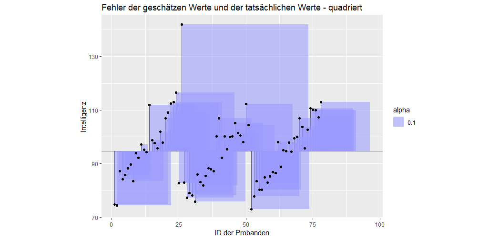
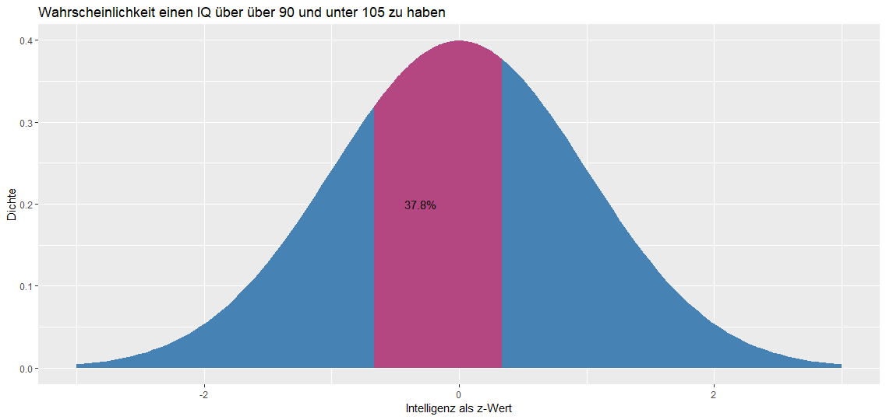

# Dataset for first chapters

```
data <- read_delim("C:/Users/ChristianEZW/repositories/statistik_2_online_kurs/data/markdown/daten_intelligenz.csv", ";", escape_double = FALSE, trim_ws = TRUE)


new_data <- data %>% 
  mutate(
    intelligence_pre = (intelligence_pre / 72.52) * 100,
    intelligence_post = (intelligence_post / 72.52) * 100,
    books_per_year = ((books_per_year / 171) * 10) %>% floor
  ) %>% 
  rename(id = person)


new_data %>% 
  group_by(group) %>% 
  summarise(
    mean_pre = mean(intelligence_pre),
    mean_post = mean(intelligence_post)
  ) %>% 
  gather(variable, value, - group) %>% 
  ggplot(aes(x = variable, y = value, group = group)) +
    geom_line()

```

# Data = Model + Error

Der ganze Inhalt dieses Kurses lässt sich in einer Gleichung zusammen fassen:

$$
DATA = MODEL + ERROR
$$

## DATA 

*DATA* sind die Werte, welche wir empirisch erheben. Beispielsweise untersuchen wir, wie gut Lernende in einem Test abschneiden oder wir erheben wie Personen einen Kurs bewerten. In der Statistik wird *DATA* häufig auch als *abhängige Variable* bezeichnet.

Als Beispiel können wir die Intelligenz einer Person nehmen. Der Intelligenzquotient einer Person ist *DATA*, also die Punktzahl der Intelligenz, die wir in einem Test von einer Person erhalten. Unser Ziel ist es, ein mathematisches Modell zu bilden, welches diesen Wert wirklichkeitsgetreu hervorsagt. Solche Modelle werden wir in diesem Kurs ausführlich behandeln.

## MODEL

*MODEL* bezeichnet ein mathematisches Modell, welches wir benutzen, um *DATA* hervorzusagen. In der Regel versuchen wir eine Vielzahl an Daten in einer verständlichen Form zusammen zu fassen. In einem Zeitungsbericht findest du selten lange Tabellen mit allen Daten eines Experiments. Vielmehr werden in der Regel einzelne Kennwerte vermittelt: 70% der Personen stimmten für Politiker X; Menschen haben im Schnitt einen Intelligenzquotienten von 100. Diese Werte sind nichts anderes als statistische Modelle, auch wenn diese sehr einfach sind. Das einfachste statistische Modell ist beispielsweise der Mittelwert einer Variable. Modelle werden wir in diesem Kurs anhand von Gleichungen darstellen. Beispielsweise nehmen wir in folgendem Modell an, dass der Intelligenzquotient jeder Person gleich 100 ist:

$$
\hat{Y} = 100
$$

## ERROR

Die Werte, welche unsere Modelle schätzen werden in der Regel nicht DATA entsprechen. Die Abweichungen zwischen dem tatsächlichen Wert (DATA) und dem geschätzem Wert nennen wir ERROR oder auch *Residuum*. Stell dir vor, eine Person hat einen Intelligenzquotienten von 110, wir schätzen allerdings die Intelligenz dieser Person anhand des Mittelwertes auf 100. In diesem Fall hätten wir eine Abweichung von 10 Punkten und dementsprechend einen ERROR von 10 Punkten.

# Ein Beispiel

Stell dir vor, du hast die Intelligenz von 78 Probanden durch einen Intelligenztest erhoben. Jeder Proband hat eine ID erhalten. Hier siehst du die Intelligenzwerte dieser 78 Probanden:

```R
ggplot(new_data, aes(x = intelligence_pre, y = reorder(id, intelligence_pre))) + 
  geom_point() +
  labs(
    x = "Intelligenz",
    y = "Probanden-ID",
    title = "Einzelne Intelligenzwerte der Probanden"
  ) +
  theme_light()
```


Proband 52 beispielsweise (siehe Y-Achse) hat den geringsten Intelligenzquotienten von eta 73, während Proband 26 den höchsten Intelligenzquotienten hat. 

Diese Werte nennen wir **DATA**, da sie die tatsächlichen Werte der Probanden sind.

Wir können **DATA** ebenso in einem Histogram darstellen:

```R
ggplot(new_data, aes(x = intelligence_pre)) + 
  geom_histogram(color = "black", fill = "#cccccc", binwidth = 3) +
  labs(
    x = "Intelligenz",
    y = "Häufigkeit",
    title = "Histogram der Intelligenz der Probanden"
  )
```


Auf der X-Achse siehst du die Intelligenz der Personen, auf der Y-Achse die Häufigkeit dieser Werte.

Wir hatten gerade den Mittelwert als ein einfaches Modell angenommen. Diesen Wert können wir im Histogram abtragen:

```R
ggplot(new_data, aes(x = intelligence_pre)) + 
  geom_histogram(color = "black", fill = "#cccccc", binwidth = 3) +
  geom_vline(
    xintercept = mean(new_data$intelligence_pre),
    color = "steelblue",
    size = 2
  ) +
  labs(
    x = "Intelligenz",
    y = "Häufigkeit",
    title = "Histogram der Intelligenz der Probanden"
  )
```


Der Mittelwert wäre nun ein Beispiel für ein **Model**. Anhand des Histograms kannst du bereits erkennen, dass der Mittelwert kein gutes Modell ist, um die einzelnen Werte zu bestimmen. Beispielsweise liegt die Person 26 über 40 Intelligenzpunkte über dem Mittelwert. Ebenso ist die Person mit dem geringsten Intelligenzquotienten über 25 Punkte unter dem Mittelwert. Wenngleich das Modell nicht in der Lage ist, die einzelnen Werte gut hervorzusagen, ist es ein Modell, welches DATA hervorsagt und dabei Fehler macht:

$$
DATA = MODEL + ERROR
$$

Der Fehler wäre:

$$
ERROR = DATA - MODEL
$$

Schätzen wir daher den Intelligenzquotienten einer Person auf 100 und liegt der Intelligenzquotient dieser Person bei 110, hätten wir einen Fehler von +10.

Wir werden im nächsten Abschnitt **ERROR** genauer bestimmen. Vorab müssen wir nochmal über die Modelle sprechen.


# Kurzfrage

Stell dir folgendes Szenario vor: Du schätzt, wie alt Menschen in Deutschland werden, die im Jahr 2015 geboren sind. Du schätzt, dass Personen, die im Jahr 2015 geboren sind, im Schnitt 86 Jahre alt werden (dein Modell). Nach 105 Jahren liegen Daten zu deiner Schätzung vor. Mareike, welche im Jahr 2015 geboren ist, wurde 84 Jahre alt.

```
- question: Wie groß ist der Fehler (ERROR) für Mareike? 
  answers:
    - answer: "-2"
      correct: True
      hint: Sehr gut. Der Fehler ist ERROR = DATA - MODEL. Also ERROR = 84 - 86 = -2
    - answer: "2"
      correct: False
      hint: Nicht ganz. Erinnere dich daran das der Fehler ERROR = DATA - MODEL ist
    - answer: "19"
      correct: False
      hint: Nicht ganz. Erinnere dich daran das der Fehler ERROR = DATA - MODEL ist
    - answer: "-19"
      correct: False
      hint: Nicht ganz. Erinnere dich daran das der Fehler ERROR = DATA - MODEL ist
    - answer: "4"
      correct: False
      hint: Nicht ganz. Erinnere dich daran das der Fehler ERROR = DATA - MODEL ist
```

# Frage 2

```
- question: Welches dieser Beispiele ist kein statistisches Modell? Eine Antwort ist richtig.
  hint: Überlege dir, welches dieser Kennwerte mehrere Daten nicht zusammen fasst. 
  answers:
    - answer: Der Mittelwert einer Verteilung
      correct: False
    - answer: Der Modus einer Verteilung
      correct: False
    - answer: Die Einzelwerte einer Verteilung
      correct: True
    - answer: Die Standardabweichung einer Verteilung
      correct: False
```

# Ziele von Modellen

Ein gutes statistisches Modell ist ein Modell, welches die Fehler (ERROR) klein hält und gleichzeitig nicht zu komplex ist. In der Sozialforschung haben wir fast nie Modelle, bei denen wir Fehler von 0 erhalten. Dennoch möchten wir versuchen, diesen Fehler so klein wie möglich zu halten.

Es ist offensichtlich, dass ein einfaches Modell wie der Mittelwert einer Verteilung in der Regel denkbar schlecht ist, um den Fehler klein zu halten. Schauen wir nochmal die Verteilung von gerade eben an:


Offensichtlich brauchen wir mehr Informationen als den Mittelwert, um zu berechnen, wie hoch der Intelligenzquotient einer Person ist. Man könnte sich zum Beispiel vorstellen, dass die Anzahl der gelesenen Bücher pro Jahr ein guter Parameter sind, um die Intelligenz einer Person genauer hervorzusagen.

# Wie kann der Fehler reduzuiert werden?

Es gibt verschiedene Möglichkeiten, den Fehler bei statistischen Modellen zu reduzieren:

## Qualität der Daten verbessern

Zunächst können wir dafür sorgen, dass die Daten ohne Fehler erhoben und eingetragen wurden. Manche Menschen machen Fehler, wenn sie Daten in Excel-Tabellen eintragen, manchmal ist ein Verfahren aber auch unreliabel und zeigt inkonsistente Werte an. Beispielsweise kann eine Waage unreliabel sein, wenn sie beim gleichen Gewicht schwankende Werte angibt.

## Hinzufügen von mehr Parametern

Je mehr Parameter man in ein statistisches Modell hinzufügt, desto geringer wird der Fehler. Wir könnten bei unserem Modell zur Intelligenz beispielsweise folgende Parameter hinzunehmen:

* die Anzahl der Bücher, die eine Person liest
* die Intelligenz der Eltern
* den höchsten akademischen Abschluss einer Person

Mit jedem Paramater reduziert sich der Fehler. Man könnte daher intuitiv annehmen, dass es sinnvoll wäre, möglichst viele Parameter in ein Modell hinzuzunehmen. Dem ist allerdings nicht so.


## Die Gefahr beim Hinzufügen von Parametern

Ein Modell um unendlich viele Parameter zu erweitern ist nicht sinvoll, da nicht Daten perfekt hervorsagen möchten, sondern wissen möchten, welche Parameter eine Variable substantiell gut erklären. Die Intelligenz der Eltern beispielsweise erklärt die Intelligenz einer Person deutlich besser als die Anzahl der Filme, die eine Person pro Jahr ansieht. 

> Unser Ziel muss es vielmehr sein, so wenige Parameter wie möglich zu verwenden und den Fehler so klein wie möglich zu halten.

Als Folge haben wir ein Problem: Einerseits sollen die Fehler klein gehalten werden, andererseits sollen so wenig Parameter wie möglich verwendet werden!? Deine Aufgabe ist es, die richtige **Balance** der beiden Ansprüche zu finden. Für jeden Parameter müssen wir uns daher die Frage stellen, ob der Parameter *gut genug ist*, um den Fehler substantiell zu reduzieren. Ein Parameter in unserem Beispiel, der vermutlich den Fehler nicht reduzieren würde, wären die Anzahl der Filme, die eine Person pro Jahr ansieht. Wir haben keine theoretischen Begründungen, weshalb diese Variable den Fehler substantiell reduzieren sollte.

# Kurzfrage

Stell dir vor, du möchtest ein statistisches Modell erstellen, um die Größe von Personen hervorzusagen. 

```
- question: Welche der folgenden Parameter würde den Fehler vermutlich substantiell reduzieren und wären es daher Wert, in das Modell aufgenommen zu werden?
  hint: Denke nochmal genauer nach. Überlege dir, was ein schlechter Parameter wäre. Sind die vorliegenden Parameter schlecht? 
  answers:
    - answer: Die Größe des Vaters
      correct: True
    - answer: Die Größe der Partnerin/des Partners
      correct: False
    - answer: Unterernährung während der Kinder- und Jugendzeit
      correct: True
```

# Kompaktes und erweitertes Modell

Wir hatten gerade gesagt, dass wir den Fehler reduzieren möchten und gleichzeitig Parameter in das Modell aufnehmen möchten, die es wert sind, aufgenommen zu werden, sprich, die den Fehler substantiell reduzieren. Wie können wir allerdings bestimmen, ob ein Parameter nun *gut genug ist*, um aufgenommen zu werden? 

> Um die Güte von Parameter einzuschätzen, vergleichen wir zwei Modelle miteinander, das kompakte Modell (C - compact) und das erweiterte Modell (A - augmented). 

## Das kompakte Modell (C)

Das kompakte Modell ist in der Regel das einfachste Modell, welches wir uns vorstellen können. Wir haben bereits kompakte Modelle kennen gelernt: z.B. den Mittelwert einer Verteilung.

> Das kompakte Model nehmen wir immer als **Referenz**, um heraus zu finden, ob Parameter gut genug sind, um den Fehler substantiell zu reduzieren.

## Das erweiterte Modell (A)

Das erweiterte Modell hat immer mehr Parameter als das kompakte Modell; daher erweitert. Wir wissen, dass der Fehler eines Modells kleiner wird, je mehr Parameter wir in ein Modell hinzu nehmen. Daher gilt:

$$
ERROR(A) \leq ERROR(C)
$$


# Null- und Alternativhypothese

In Statistikbüchern liest man selten von kompakten und erweiterten Modellen. Viel gebräuchlicher sind die Begriffe Null- und Alternativhypothese:

* Nullhypothese = kompaktes Modell
* Alternativhypothese = erweitertes Modell

Genauer müssten wir sagen, dass die Nullhypothese das Modell ist, bei welchem alle Parameter, die zusätzlich in dem erweiterten Modell sind, auf Null gesetzt werden. Deswegen heißt das kompakte Modell auch Nullyhypothese. Oder anders gesagt gehen wir bei einer Nullhypothese davon aus, dass es keine Unterschiede zwischen Gruppen gibt. Beispielsweise, indem wir annehmen, dass der Intelligenzquotient von Personen immer gleich ist, egal ob Personen ein bestimmtes Training bekommen oder nicht.


<!-- Hier ein Beispiel: Meine Nullhypothese ist, dass die Intelligenz von Menschen im Schnitt ist 100:

$$
Y_i = \beta_{0} + \epsilon_{i} = 100 + \epsilon_{i}
$$

$$
Y_i = 100 + \epsilon_{i}
$$

Meine Alternativehypothese hat einen weiteren Parameter ($\beta_{1}$), nämlich wie stark die Intelligenz der Mutter von 100 abweicht. Der Wert -10 würde zum Beispiel bedeuten, dass die Mutter 10 Intelligenzpunkte weniger hat als 100, also 90 (die Werte sind frei ausgedacht, wie man zu diesen Werten kommt, lernst du später):

$$
Y_i = \beta_{0} + \beta_{1} * X_1 + \epsilon_{i}
$$

$$
Y_i = 100 + 0.8 * X_1 + \epsilon_{i}
$$

Statt 100 wie bei der Nullyhypothese würde ich nun $100 + 0.8 * -10 = 92$ als Intelligenzquotienten für die Person hervor sagen. -->

## Statistisches Hypothesentesten

Wenn nun mein erweitertes Modell den Fehler des kompakten Modells substantiell minimiert (wir kommen später im Kurs darauf, was das bedeutet), *lehne ich die Nullhypothese zu Gunsten der Alternativhypothese ab*. Ist der Fehler *nicht* substantiell kleiner als in der Nullhypothese, gehe ich weiter von der Nullhypothese aus, sage also, dass die Nullhypothese das beste und sparsamste Modell ist, um meine abhängige Variable hervorzusagen.

# Kurzfrage

```
- question: Warum ist der Fehler beim erweiterten Modell kleiner als beim kompakten Modell? 
  answers:
    - answer: Da jeder weitere Parameter DATA besser erklären kann, unabhängig von der Größe des Einflusses.
      hint: Sehr gut. Das ist richtig.
      correct: True
    - answer: Da das erweiterte Modell Parameter hat, die Fehler stärker reduzieren als beim kompakten Modell.
      hint: Nicht ganz. Es ist möglich, dass der Mittelwert beim kompakten Modell den Fehler bereits sehr klein hält und ein weiterer Parameter den Fehler nur minimal verkleinert.
      correct: False
    - answer: Da die Parameter im erweiterten Modell den Fehler substantiell reduzieren.
      hint: Nein. Die Größe der Fehlerreduzierung ist irrelevant für die Frage. Entscheidend ist, warum der Fehler beim erweiterten Modell immer kleiner ist, da er mehrere Parameter hat.
      correct: False
```

# PRE berechnen

Um entscheiden zu können, ob die Reduzierung des Fehlers durch das erweiterte Modell groß genug ist, müssen wir einen Weg finden, die Reduzierung des Fehlers zu bestimmen. Wir werden im Verlaufe des Kurses mehrere dieser Wege aufzeichnen: Unter anderem *PRE* und *F*. Zunächst beschäftigen wir uns mit *PRE*.

> PRE lässt sich wie folgt definieren: Wie viel Prozent des Fehlers im kompakten Model wird durch das erweiterte Modell reduziert?

Beispielsweise könnte PRE den Wert .80 annehmen. Das würde bedeutet, dass das erweiterte Modell 80% der Fehler des kompakten Modells reduziert. Berechnet wird PRE folgendermaßen:

$$
PRE = \frac{ERROR(C) - ERROR(A)}{ERROR(C)}
$$

Zwei Dinge sind hierbei wichtig:

1. Wir müssen ERROR(A) von ERROR(A) abziehen und nicht umgekehrt, da wir wissen, dass der Fehler des erweiterten Modells immer kleiner ist als der Fehler des kompakten Modells. Ansonsten würden wir einen negativen Wert erhalten.
2. Wir teilen das Resultat aus der Subtraktion von ERROR(C) - ERROR(A), um ein *relatives* Maß zu erhalten. Relativ abhängig vom kompakten Modell.

Eine alternative Schreibweise für PRE ist:

$$
PRE = 1 - \frac{ERROR(A)}{ERROR(C)}
$$

# Beispiel PRE in R

Nehmen wir an, du entwickest ein kompaktes Modell mit einem Fehler von 30 und ein erweitertes Modell mit einem Fehler von 10. Wie groß wäre die prozentualle Reduzierung des Fehlers abhängig des kompakten Modells?

$$
PRE = \frac{ERROR(C) - ERROR(A)}{ERROR(C)}
$$


```R
(pre <- (30 - 10) / 30) # 0.6666667
# ODER
(pre <- 1 - (10 / 30)) # 0.6666667
```
Mit `pre` geben wir an, dass wir das Ergebnis der Gleichung `(30 - 10) / 30` in einer Variable speichern. Durch die Klammer um den Befehl wird der Output der Variable direkt in R angezeigt. Alternativ können man schreiben:

```R
pre <- (30 - 10) / 30
pre # 0.6666667
```

Das erweiterte Modell reduziert also den Fehler des kompakten Modells um 67% Prozent.

# Übung PRE

Dein kompaktes Modell hat einen Fehler von 80. Dein erweitertes Modell hat einen Fehler von 60. Wie groß ist PRE in diesem Fall? 

TODO: Hier Aufgabenformat für exakte Fragen einfügen. Auf zwei Nachkommastelle runden! 
-> Antwort: .33.

# Werte von PRE

Nicht jedes PRE ist gleich beeindruckend. Nehmen wir an, du erhältst ein PRE von .02. Das erweiterte Modell hat fünf Parameter mehr als das kompakte Modell. Welches Modell ist nun besser? Wir gehen davon aus, dass das Modell, welches mit den *wenigsten* Parametern ähnliche Ergebnisse erzielt und daher *sparsamer* ist, besser ist. Aus diesem Grund würden wir in diesem Beispiel sagen, dass das kompakte Modell besser ist, schließlich hat es weniger Parameter als das erweitertes Modell und ein geringes PRE.

Die Werte von PRE können zwischen 0 und 1 annehmen. 1 würde bedeuten, dass das erweiterte Modell alle Fehler des kompakten Modells erklärt. Je höher PRE ist, desto eher sollten wir die zusätzlichen Parameter in ein Modell einfügen, um eine abhängige Variable hervorzusagen. Je kleiner PRE ist, desto eher sollten wir das kompakte Modell behalten.

Nur, ab welchem Wert ist PRE groß genug oder klein genug? Dies hängt von mehreren Faktoren ab. Wenn PRE substantiell durch nur einen Parameter reduziert wird, ist dies besser, als wenn PRE durch mehrere Parameter reduziert wird. Schließlich suchen wir sparsame Modelle mit wenigen Parametern.

# Notation

Wir werden in den nächsten Wochen immer wieder statistische Modelle anschauen und analysieren. Um zu wissen, wovon wir sprechen, ist es wichtig, dass wir die Notation der Begriffe vorab definieren:

* $Y_i$ steht für den Einzelwert von *DATA*, den Werten, welche wir hervorsagen, beziehungsweise den Werte unserer abhängigen Variable. Das kleine $i$ steht für das Untersuchungsobjekt, welches wir gerade betrachten. In der Regel sind das einzelne Menschen.
* $\hat{Y}_i$ steht für unseren auf Grundlage des Modells hervorgesagten Werte. Der reale Wert setzt sich aus der Schätzung und dem Fehler zusammen: $Y_i = \hat{Y}_i + e_i$
* $X_{ij}$ steht für die Variablen, welche wir in unser Modell hinzufügen. $i$ steht für das Untersuchungsobject, $j$ steht für die Nummer der Variable (wir werden später mehrere dieser Variablen in unseren Modellen haben)
* $\beta_{0}, \beta_{1}, ...$ steht für die Parameter unseres Modells, welche wir finden möchten. Wir werden diese Werte allerdings **nie** exakt bestimmen können, da wir nie Daten von ganzen Populationen haben. Als Faustregel gilt: Sobald ein $\epsilon$ in der Gleichung enthalten ist, spreche ich von Parametern, die in der Population gelten (z.B. $\beta_{0}$). 
* $b_0, b_1, ...$ stehen für die Parameter, welche ich auf Grundlage der Daten geschätzt habe. Beispielsweise schätze ich den Mittelwert der Population auf Grundlage des Mittelwerts meiner Stichprobe. $b$ wird immer in Kombination mit $\hat{Y}$ verwendet.
* $e_0, e_1, ...$ stehen für die Fehler, die wir aus dem Modell berechnen, welches wir berechnet haben. $e$ wird also immer in Zusammenhang mit $b$ verwendet und nie mit $\beta$.
* $\epsilon_i$ steht für Fehler der sich ergibt, wenn wir $\beta_i$ kennen. Da sich $\beta$ von $b$ unterscheidet, wird sich auch $e$ von $\epsilon$ unterschieden.

# Ein Beispiel einer Null- und Alternativhypothese mit PRE

Nehmen wir an, du möchtest die Intelligenz einer Person auf Grundlage der Anzahl der gelesenen Bücher pro Jahr und dem Alter einer Person hervorsagen.

Da du zwei stetige, das heißt intervallskalierte Werte hast, möchtest du folgendes Modell berechnen:

$$
\hat{Y} = b_0 + b_1 * X_1 + b_2 * X_2
$$

$X_1$ steht für die Anzahl der Bücher pro Jahr, $X_2$ steht für das Alter einer Person. Der Parameter $b_1$ bedeutet, dass Pro Buch, dass eine Person pro Jahr liest, der Intelligenzquotient um $b_1$ Punkte nach oben oder unten geschätzt wird. $b_2$ bedeutet, dass mit jedem Lebensjahr mehr, die Intelligenz der Person um $b_2$ Punkte nach oben oder unten geschätzt wird.

Du erhälst aus diesen beiden Parameter folgendes Modell (wie wir diese Parameter erhalten, wird später erklärt):

$$
\hat{Y} = 68.72 + 2.81 * X_1 - 0.02 * X_2
$$

Mit jedem Buch, dass eine Person liest, steigt daher der Intelligenzquotient laut unserem Modell um 2.81 Punkte. Das Alter scheint die Intelligenz weniger zu beeinflussen, da mit jedem Lebensjahr die Intelligenz um -0.02 Punkte sinkt.

## Nullhypothese

Du möchtest nun heraus finden, ob dieses erweiterte Modell oder deine Alternativhypothese besser ist als ein einfacheres Modell, sprich deine Nullhypothese. Als Nullhypothese nimmst du an, dass jede Person den gleichen Intelligenzquotienten hat:

$$
\hat{Y}_i = b_{0}
$$

Der Mittelwert der Intelligenz der Personen, die du erhebst ist 94.71, also:

$$
\hat{Y}_i = 94.71
$$

## Alternativhypothese

Deine Alternativhypothese besagt, dass die Intelligenz einer Person auf Grundlage der Anzahl der gelesenen Bücher und dem Alter der Person bestimmbar ist:

$$
\hat{Y} = 68.72 + 2.81 * X_1 - 0.02 * X_2
$$

## Berechnung von PRE

Nehmen wir nun an, dass der Fehler des kompakten Modells bei $149.5$ liegt und der Fehler des erweiterten Modells bei $145.40$ liegt. PRE ist daher:

$$
PRE = \frac{149.5 - 145.40}{145.5} = 0.027
$$

Dies entspricht einer Reduzierung des Fehlers um 2.7%. Ist unser erweitertes Modell also substantiell besser den Fehler zu reduzieren als das kompakte Modell? Vermutlich nicht, da der Fehler nur minimal reduziert wird. Im Verlaufe des Kurses werden wir erklären, wie wir eine Entscheidung treffen, ob diese Fehlerreduzierung substantiell genug ist.

# Einfache Modelle mit einem Prädiktor

Beginnen wir mit dem einfachsten Modell, dass wir erstellen können:

$$
Y_i = b_0 + \epsilon_{i}
$$

Stell dir erneut vor, du möchtest die Intelligenz einer Person hervorsagen. Da du nicht alle Personen einer Population testen kannst, holst du dir 78 Personen in das Labor und erhebst durch einen Test ihren Intelligenzquotienten. Anschließend berechnest du den Mittelwert dieser Stichprobe und erhältst den Wert $94.71$.

Da wir die Daten aus einer Stichprobe erheben wird dieser Mittelwert nie dem Mittelwert der Population entsprechen. $b$ kann daher nie $\beta$ sein.

Wir erhalten also:

$$
Y_i = 94.71 + e_i
$$

Auf Grundlage dieser Formel würden wir für jede Person, die gleiche Intelligenz hervorsagen:

$$
\hat{Y}_i = b_0
$$

$$
\hat{Y}_i = 94.71
$$

Grafisch können wir uns dieses Modell als eine Line vorstellen, die für jede Person die gleiche Intelligenz annimmt:

```
ggplot(intelligence, aes(x = reorder(id, intelligence_pre), y = intelligence_pre)) + 
  geom_hline(yintercept = 94.70, color = "steelblue") +
  geom_point() +
  labs(
    x = "ID der Probanden",
    y = "Intelligenz",
    title = "Einzelne Intelligenzwerte der Probanden mit Mittelwert"
  ) 
```


Auf der X-Achse siehst du die ID der einzelnen Probanden, auf der Y-Achse deren Intelligenzquotienten.

# Lineare und quadrierte Fehler

Wir wissen, dass ein Mittelwert nie die tatsächlichen Werte einer Person repräsentiert. Kaum eine Person wird einen Intelligenzquotienten von 94.71 haben. Die größe des Fehlers können wir auf Grundlage folgender Formel berechnen:

$$
Y_i = b_0 + e_{i}
$$

Daraus ergibt sich, dass:

$$
e_{i} = Y_i - b_0
$$

Oder:

$$
e_{i} = Y_i - \hat{Y}_i
$$

Stellen wir uns eine Person mit einem Intelligenzquotienten von 102 vor. Der Fehler für diese Person wäre daher:

$$
e_{i} = 102 - 94.71 = 7.29
$$

Grafisch können wir uns diese Fehler folgendermaßen vorstellen:

<!-- ```
intelligence %>% 
  mutate(
    id = id %>% as.double
  ) %>% 
ggplot(aes(x = id, y = intelligence_pre)) + 
  geom_hline(yintercept = 94.70, color = "steelblue") +
  geom_segment(
    aes(x = id,
        xend = id,
        y = intelligence_pre,
        yend = mean(intelligence_pre)
        )
  ) +
  geom_rect(aes(xmin = id,
                xmax = id + (abs(intelligence_pre - mean(intelligence_pre))),
                ymin = intelligence_pre,
                ymax = mean(intelligence_pre),
                alpha = .1),
            fill = "#9999ff") +
  geom_point() +
  coord_fixed() +
  labs(
    x = "ID der Probanden",
    y = "Intelligenz",
    title = "Fehler der geschätzen Werte und der tatsächlichen Werte - quadriert"
  ) 

``` -->


Der Fehler ist der Abstand zwischen unserem vorhergesagtem Wert (hier die horizontale Linie) und dem tatsächlichen Wert (hier der Punkt in der Grafik). Wir werden später im Kurs den Fehler allerdings nicht mehr durch eine Linie bestimmen, sondern durch die Quadrierung dieses Fehlers:



Die Quadrierung der Fehler hat gewissen mathematische Vorteile, die wir in diesem Kurs nicht besprechen werden. Ein Grund liegt darin, dass die Wahl des Fehlers entscheidet, welches einfachste Modell den Fehler am stärksten reduziert. Würden wir beispielsweise den Fehler als die lineare Abweichung zwischen dem tatsächlichen Wert und dem vorhergesagtem Wert berechnen, wäre der Median das Modell, welches die Fehler maximal reduziert. Nehmen wir den Mittelwert als einfachtes Modell, sind die quadrierten Abweichungen das mathematisch korrekteste Modell. 

# Aggregierung der Fehler

Um zu beschreiben, wie hoch die Fehler sowohl in unserem kompakten Modell als auch in unserem erweiterten Modell sind, müssen wir diese Fehler aggregieren. Es gibt hierfür verschiedene Wege, beispielsweise können wir die linearen Fehler summieren. Wir werden in diesem Kurs die Fehler aggregieren, indem die quadrierten Abweichungen der einzelnen Fehler summiert werden.

Im Bilde gesprochen rechnen wir die Summe der Fläche dieser Quadrate zusammen:


Mathematisch ausgesprochen ist die Summe der quadrierten Abweichungen oder **Sum of Squared Errors** (SSE) also:

$$
SSE = \sum_{i = 1}^n (Y_i - b_0)^2
$$

$Y_i$ entspricht dem tatsächlichen Wert (hier die einzelnen Punkte), $b_0$ entspricht unserem Modell (hier der Mittelwert, blauer Strich). Diese beiden Werte substrahieren wir voneinander und quadrieren diese Differenz (blaue Quadrate). Die Summe dieser Quadrate ergibt SSE oder Sum of Squared Errors.

# Standardisierung des quadrierten Fehlers

Die Aggregierung der Fehler ist abhängig von der Anzahl der Beobachtungspunkte. Beispielsweise ist die Aggregierung des Fehlers von 5 Personen in der Regel deutlich kleiner als die Aggregierung des Fehlers von 20 Personen. Es ist daher sinnvoll, den aggregierten Fehler zu standardisieren, um Fehler miteinander zu vergleichen. Dies schaffen wir, indem wir den aggregierten Fehler durch die Anzahl der Beobachtungspunkte (Probanden) - 1 teilen. Diese Standardisierung des Fehlers nennen wir **Means Squared Error (MSE)**.

$$
MSE = \frac{SSE}{n - 1} = \frac{\sum_{i = 1}^n (Y_i - b_0)^2}{n - 1}
$$

Du wirst feststellen, dass MSE nichts anderes ist als die Varianz einer Verteilung: 

$$
Varianz = s^2 =  \frac{\sum_{i = 1}^n (x_i - \bar{x})^2}{n - 1}
$$

Dementsprechend ist die Wurzel von MSE nichts anderes als die Standardabweichung der standardisierten Fehler:

$$
s = \sqrt{MSE} = \sqrt{\frac{\sum_{i = 1}^n (Y_i - b_0)^2}{n - 1}}
$$


# R-Übung

> Ziel der Übung: PRE auf Grundlage des eben beschriebenen erweiterten Modells und des kompakten Modells hervorzusagen.

Lade dir für diese Übung den Datensatz von folgendem Link (TODO) herunter. Benenne den Datensatz mit der Variable `intelligence`. 


Zunächst laden wir wie immer das Paket tidyverse:

```
library(tidyverse)
```

Zu Beginn ist es immer sinnvoll, sich den Datensatz anzuschauen:

```
glimpse(intelligence)
```

```
Observations: 78
Variables: 7
$ id                <dbl> 25, 26, 1, 2, 3, 4, 5, 6, 7, 8, 9, 10, 11, 12, 13, 14, 27, 28, 29, 30, 31, 32, 33, 34, 35, 36...
$ gender            <chr> "male", "male", "male", "male", "male", "male", "male", "male", "male", "male", "male", "male...
$ age               <dbl> 41, 32, 22, 46, 55, 33, 50, 50, 37, 28, 28, 45, 60, 48, 41, 37, 44, 37, 41, 43, 20, 51, 31, 5...
$ books_per_year    <dbl> 10, 10, 9, 11, 9, 10, 9, 11, 10, 10, 9, 9, 10, 9, 9, 9, 10, 10, 9, 10, 9, 10, 9, 10, 9, 9, 9,...
$ intelligence_post <dbl> 82.73580, 142.02978, 79.97794, 82.73580, 88.25152, 88.25152, 89.63045, 91.00938, 92.38831, 95...
$ group             <dbl> 2, 2, 1, 1, 1, 1, 1, 1, 1, 1, 1, 1, 1, 1, 1, 1, 2, 2, 2, 2, 2, 2, 2, 2, 2, 2, 2, 2, 2, 2, 3, ...
$ intelligence_pre  <dbl> 82.73580, 142.02978, 74.73800, 74.46222, 87.28627, 84.25262, 85.76944, 88.25152, 89.63045, 83...
```

Der Datensatz hat 7 Variablen. Uns interessieren die Variablen `intelligence_pre`, `books_per_year` und `age`. Beachte, dass das Modell, welches wir gleich erstellen erst später in diesem Kurs erklärt wird. Bei diesem Modell handelt es sich um ein Regressionsmodell mit zwei Prädiktoren. Dieses erweiterte Modell hatten wir vorhin folgendermaßen beschrieben:


$$
\hat{Y} = 68.72 + 2.81 * X_1 - 0.02 * X_2
$$

Das kompakte Modell war:


$$
\hat{Y}_i = 94.71
$$


Wie wir das erweiterte Modell berechnen, erfahren wir später im Kurs. Jetzt genügt es zu wissen, dass wir ein erweitertes Modell mit zwei Parametern berechnet haben.

Im nächsten Schritt möchten wir die quadrierten Abweichungen der tatsächlichen Werte und den geschätzen Werten beider Modelle berechnen:

```
(errors <- intelligence %>% 
  mutate(
    compact       = mean(intelligence_pre),
    augmented     = predict(model, newdata = .),
    res_compact   = (compact - intelligence_pre)^2,
    res_augmented = (augmented - intelligence_pre)^2
  ))
``` 

```
# A tibble: 78 x 11
      id gender   age books_per_year intelligence_post group intelligence_pre compact augmented res_compact res_augmented
   <dbl> <chr>  <dbl>          <dbl>             <dbl> <dbl>            <dbl>   <dbl>     <dbl>       <dbl>         <dbl>
 1    25 male      41             10              82.7     2             82.7    94.7      96.0       143.          175. 
 2    26 male      32             10             142.      2            142.     94.7      96.2      2240.         2104. 
 3     1 male      22              9              80.0     1             74.7    94.7      93.6       399.          354. 
 4     2 male      46             11              82.7     1             74.5    94.7      98.7       410.          586. 
 5     3 male      55              9              88.3     1             87.3    94.7      92.9        55.1          31.0
 6     4 male      33             10              88.3     1             84.3    94.7      96.1       109.          141. 
 7     5 male      50              9              89.6     1             85.8    94.7      93.0        79.9          51.7
 8     6 male      50             11              91.0     1             88.3    94.7      98.6        41.7         107. 
 9     7 male      37             10              92.4     1             89.6    94.7      96.0        25.8          41.2
10     8 male      28             10              95.1     1             83.4    94.7      96.2       127.          164. 
# ... with 68 more rows
```

Du siehst, dass wir nun vier weitere Variablen an den Datensatz angefügt haben. Mit `mutate` haben wir diese Variablen berechnet. Die Variable `res_compact` bezeichnet den quadrierten Fehler des kompakten Modells für jeden Probanden, `res_augmented` bezeichnet den quadrierten Fehler des erweiterten Modells für jeden Probanden. 

Um PRE zu berechnen, müssen wir diese Fehler zunächst aggregieren:


$$
SSE = \sum_{i = 1}^n (Y_i - b_0)^2
$$

Wir speichern daher unseren neuen Datensatz in einer Variable und berechnen die Summe dieser beiden Variablen:

```
sum(errors$res_compact)   # 11661.2
sum(errors$res_augmented) # 11341.38
```

Zuletzt können wir aus diesen Fehlern PRE berechnen:

```
(pre <- (11661.2 - 11341.38) / 11661.2) # 0.02742599
```

Erneut erhalten wir einen Fehler von 2.7%. Das erweiterte Modell ist demnach in der Lage die Fehler des kompakten Modells um 2.7% zu reduzieren. Um nun zu bestimmen, ob diese Reduzierung gut genug ist, um das erweiterte Modell bzw. die Alternativhypothese anzunehmen, müssen wir als nächstes verstehen, wie wir bestimmen können, ob ein Fehler substantiell reduziert wird. Mehr dazu im nächsten Teil.


 

# Stichprobenkennwertverteilungen

Wir haben im letzten Kapitel häufiger davon gesprochen, dass wir die Nullhypothese verwerfen, wenn der Fehler des kompakten Modells, durch das erweiterte Modell substantiell verkleinert wird. Aber was bedeutet es, dass ein Fehler substantiell verkleinert wird?  Um diese Frage beantworten zu können, verwenden wir **Stichprobenkennwertverteilungen**. Das Wort Stichprobenkennwertverteilung gibt uns bereits einige Hinweise, um zu verstehen, was dieses Wort bedeutet.

1. Stichprobe
2. Kennwert
3. Verteilung

## Stichprobe

Eine Stichprobe ist eine Teilmenge aus einer Grundgesamtheit. Wahlvorhersagen werden auf Grundlage von Stichproben gezogen, da es mühselig wäre, alle Menschen eines Landes (die Grundgesamtheit) zu befragen. Daher erheben wir immer nur einen kleinen Anteil der Population und versuchen auf Grundlage dieser Stichprobe auf die Population zu schließen.

## Kennwert

Statistische Kennwerte fassen mehrere Datenpunkte zusammen. Du kennst bereits mehrere dieser Kennwerte: Der Mittelwert, der z-Wert, die Standardabweichung oder die Varianz. Jeder dieser Kennwerte fasst Daten zusammen. Der Mittelwert gibt den typischen Wert einer Verteilung an, die Varianz gibt an, wie weit Werte um einen Mittelwert streuen. In den nächsten Wochen werden wir uns vor allem mit dem Mittelwert, PRE, dem t-Wert und dem F-Wert beschäftigen. All diese Werte sind statistische Kennwerte.

## Verteilung

Eine Verteilung ist eine grafische Darstellung des Auftretens einzelner Ausprägung einer Variable. Beispielsweise kennst du unimodale Verteilungen mit nur einem Gipfel:

```
ggplot(NULL, aes(x = c(-3, 3))) +
  stat_function(fun = dnorm,
                geom = "area",
                fill = "steelblue")
```


Oder eine stetige Verteilung


Oder eine bimodale Verteilung:

```
nn <- 1e4
set.seed(1)
betas<-rbeta(nn,2,2)
sims <- c(betas[1:(nn/2)]*2+1,
          betas[(nn/2+1):nn]*2+3)


hist(sims)
```


## Stichprobenkennwertverteilung revisited

Eine Stichprobenkennwertverteilung ist daher eine Verteilung von Kennwerten, die aus einer Stichprobe gewonnen werden. Beispielsweise:

* Die Verteilung von Mittelwerten, die aus mehreren Stichproben berechnet werden.
* Die Verteilung von PRE, die aus mehreren Stichproben berechnet werden.
* Die Verteilung von Varianzen, die aus mehreren Stichproben berechnet werden.

# Simulation einer Stichprobenkennwertverteilung in R

Um Stichprobenkennwertverteilungen besser zu verstehen, hilft es, diese zu simulieren. Stell dir vor, es gibt eine Population von 200.000 Menschen. Jede dieser Personen hat einen bestimmten Intelligenzquotienten, den wir allerdings nicht kennen:

Simulieren wir diese Population in R:

```
set.seed(123)
population <- rnorm(200000, mean = 100, sd = 15)
head(population) # 91.59287  96.54734 123.38062 101.05763 101.93932 125.72597
```

* Durch die [set.seed Funktion](https://www.rdocumentation.org/packages/simEd/versions/1.0.3/topics/set.seed) sorgen wir dafür, dass immer die gleichen Werte erzeugt werden, wenn wir willkürliche Daten generieren. In diesem Fall generieren wir eine Populuation von 200.000 Menschen.
* Die Funktion [rnorm](https://stat.ethz.ch/R-manual/R-devel/library/stats/html/Normal.html) erzeugt willkürliche Werte aus einer Normalverteilung. Die Funktion hat mehrere Argumente. Das erste Argument ist die Anzahl der Werte (hier 200000), das zweite Argument ist der Mittelwert der Normalverteilung (hier 100), das dritte Argument ist die Standardabweichung dieser Verteilung (hier 15). Bedenke, dass wir als Wissenschaftler diese Werte nie kennen. Würden wir sie kennen, müssten wir keine Inferenzstatistik betreiben, um auf diese Population zu schließen.

Nehmen wir nun an, dass wir 20 Personen aus dieser Stichprobe ziehen:

```
set.seed(456)
(my_sample <- sample(population, 20)) 
# [1]  72.24937  96.89288 116.28088  99.45451 101.94466 100.62200 113.09027 103.94516  68.33457  94.44999  85.76780 106.95938
# [13]  99.19620  91.27975  69.54343  97.14558 122.12985 109.88017 105.40160 103.11018
``` 

* Mit der Funktion [sample](https://stat.ethz.ch/R-manual/R-devel/library/base/html/sample.html) können wir n-beliebige Werte aus unserer Population ziehen.
* Durch die Klammer um die Variable `my_sample` sagen wir R, dass die Werte, welchein `my_sample` gespeichert sind, direkt ausgegeben werden.

Nun können wir den Mittelwert dieser Stichprobe berechnen:

```
mean(my_sample) # 97.88391
```

Unser Mittelwert ist 97.88. Der Mittelwert entspricht nicht ganz dem tatsächlichen Mittelwert von 100, da wir die Daten simuliert haben.

Um nun eine Stichprobenkennwertverteilung zu generieren, benötigen wir *sehr viele* dieser Stichprobenkennwerte. Versuchen wir einmal 10 solcher Mittelwerte aus der Population zu berechnen (den R-Code musst du an dieser Stelle nicht verstehen, er dient eher zur Generierung der Werte):

```
(five_samples <- c(1:5) %>% map_dbl(~ sample(population, 20) %>% mean))
ggplot(NULL, aes(x = five_samples)) +
  geom_histogram(fill = "steelblue", color = "black") +
  labs(
    x = "Intelligenz",
    y = "Häufigkeit",
    title = "Stichprobenkennwertverteilung 5 Personen"
  )
```


Die Stichprobenkennwerteverteilung bei 5 Stichproben sieht noch ziemlich unimodal aus. Was passiert, wenn wir 100 Stichproben aus der Population ziehen und die Mittelwerte anhand einer Verteilung darstellen:

```
(hundred_samples <- c(1:100) %>% map_dbl(~ sample(population, 20) %>% mean))
ggplot(NULL, aes(x = hundred_samples)) +
  geom_histogram(fill = "steelblue", color = "black") +
  labs(
    x = "Intelligenz",
    y = "Häufigkeit",
    title = "Stichprobenkennwertverteilung 100 Personen"
  )
```


Mittlerweile ist ein grobes Muster zu erkennen. Es scheint selten der Fall zu sein, dass eine Stichprobe einen Mittelwert von über 105 erhält, ebensowenig scheint es häufig der Fall zu sein, dass eine Stichprobe einen Mittelwert unter 94 erhält. 

Was passiert, wenn wir plötzlich 10.000 Stichproben ziehen?

```
(tenthousand_samples <- c(1:10000) %>% map_dbl(~ sample(population, 20) %>% mean))
ggplot(NULL, aes(x = tenthousand_samples)) +
  geom_histogram(fill = "steelblue", color = "black") +
  labs(
    x = "Intelligenz",
    y = "Häufigkeit",
    title = "Stichprobenkennwertverteilung 10.000 Personen"
  )
```


Nun erhalten wir eine unimodale Verteilung. Selten haben Stichproben einen Mittelwert von unter 93, selten haben Stichproben einen Mittelwert von über 103. Diese Werte sind ungewöhnliche Ereignisse. Was du siehst ist eine Stichprobenkennwertverteilung des Mittelwerts.

# Eigenschaften von Stichprobenkennwertverteilungen

## Je größer die Stichprobe, desto kleiner die Standardabweichung der Normalverteilung

```R
(twenty <- c(1:10000) %>% 
    map_dbl(~ sample(population, 20) %>% mean))

(fivty <- c(1:10000) %>% 
    map_dbl(~ sample(population, 50) %>% mean))

(hundred <- c(1:10000) %>% 
    map_dbl(~ sample(population, 100) %>% mean))

tibble(
  twenty = twenty,
  fivty = fivty,
  hundred = hundred
) %>% 
  gather(sample, value) %>% 
  ggplot(aes(x = value, fill = sample)) +
  geom_density(aes(fill = sample), alpha = .7) +
  labs(
    title = "Stichprobenkennwertverteilungen bei unterschiedlichen Stichprobengrößen",
    fill = "Stichprobe",
    x = "Mittelwert der Intelligenz",
    y = "Dichte"
  )
```


Die rote Stichprobenkennwertverteilung zeigt eine Stichprobenkennwertverteilung an, die aus Stichproben mit 50 Personen generiert wurde. Die blaue Stichprobenkennwertverteilung wurde anhand einer Stichprobengröße von 20 Personen generiert. Die grüne Stichprobenkennwertverteilung wurde anhand einer Stichprobe von 100 Personen generiert. 

Du siehst, dass die Verteilung mit einer steigenden Stichprobengröße eine geringe Varianz aufweißt und *steiler* wird. Ein Grund hierfür ist, dass der Kennwert durch eine größere Stichprobe akkurater geschätzt wird. Stell dir das Extrem vor: Deine Stichproben sind fast so groß wie die ganze Population. Als Folge wirst du fasst immer Werte erhalten, die fast exakt dem Mittelwert entsprechen. Die Stichprobenkennwertverteilung wird daher sehr schmal sein. Bei einer geringen Stichprobe erhälst du den gegenteiligen Effekt. Deine Schätzungen des Kennwertes werden sehr variieren, daher ist deine Stichprobenkennwertverteilung breiter.

## Die Standardabweichung der Stichprobenkennwertverteilung nennt man Standardfehler

Jede Verteilung hat einen Mittelwert und eine Standardabweichung. Die Stichprobenkennwertverteilung ist keine Ausnahme. Auch sie hat eine Standardabweichung. Diese nennen wir **Standardfehler**. Der Standardfehler der Stichprobenverteilung des Mittelwerts können wir folgendermaßen folgendermaßen schätzen:

$$
SE = \frac{\sigma}{sqrt{N}}
$$

Wir müssen den Standardfehler schätzen, da wir die Standardabweichung der Population in der Regel nicht kennen. Daher nehmen wir die Standardabweichung der Stichprobe, um den Standardfehler der Stichprobenkennwertverteilung zu schätzen.

Durch diese Formel lässt sich auch erklären, weshalb der Standardfehler bei einer größeren Stichprobe kleiner wird. Stell dir eine Stichprobe von 20 vor. Die Standardabweichung der Verteilung der Stichprobe ist 100:

$$
SE = \frac{100}{sqrt{20}} = 5
$$

Hätten wir eine Stichprobe von 50 Personen bei einer gleichen Standardabweichung, wäre der Standardfehler:

$$
SE = \frac{100}{sqrt{50}} = 2
$$


## Die Streuung in der Population ist immer größer als die Streuung in der Stichprobenkennwertverteilung

Der Grund für dieses Phänomen liegt darin, dass eine Stichprobe eines Kennwertes weniger wahrscheinlich extreme Werte einer Verteilung generiert als die tatsächlichen Werte. Stell dir vor, es gibt eine Person mit einem Intelligenzquotienten von 140. Dies ist ein seltenes Ereignis. Da ein Kennwert immer eine Aggregierung mehrerer Werte ist, wird dieser hohe Intelligenzquotient zwar mit hinein gerechnet, aber immer durch weniger extreme Werte angeglichen. Hierduch ist die Streuung in der Population größer als in der Stichprobe.

## Der Mittelwert der Stichprobenkennwertverteilung ist der gleiche Mittelwert der Population

Zwar ist die Streuung der Stichprobenkennwertverteilung, deren Mittelwert ist allerdings der gleiche.


# Normalverteilung

Normalverteilungen sind besondere Verteilungen, die häufig in der Natur anzutreffen sind. Beispielsweise entspricht die Intelligenz von Personen in der Regel einer Normalverteilung. Ebenso entspricht die Größe von Personen oder der Blutdruck von Personen. 

Eine Normalverteilung sieht immer so aus:

```R
ggplot(NULL, aes(x = c(-3, 3))) +
     stat_function(fun = dnorm,
                   geom = "area", fill = "steelblue") + 
      labs(title = "Normalverteilung", x = "Kennwerte", y = "Dichte")
```


Normalverteilungen zeichen sich durch folgende Eigenschaften aus:

1. Sie ist unimodal. Es gibt nur einen Gipfel.
2. Sie ist symmetrisch vom Zentrum der Verteilung.
3. Der Mittelwert, der Modus und der Median sind gleich.
4. Die gesamte Fläche der Verteilung hat den Wert 1.

Zusätzlich hat die Normalverteilung einige wichtige statistiche Eigenschaften:

* 68% der Werte fallen eine Standardabweichung vom Mittelwert.
* 95% der Werte fallen zwei Standardabweichungen vom Mittelwert.
* 99.7% der Werte fallen innerhalb von drei Standardabweichungen vom Mittelwert.

```R
ggplot(NULL, aes(x = c(-3, 3))) +
  stat_function(fun = dnorm,
                geom = "line",
                xlim = c(-5, 5)) +
  stat_function(fun = dnorm,
                geom = "area",
                fill = "red",
                alpha = .4,
                xlim = c(-3, 3)) +
  stat_function(fun = dnorm,
                geom = "area",
                fill = "steelblue",
                alpha = .4,
                xlim = c(-2, 2)) +
  stat_function(fun = dnorm,
                geom = "area",
                fill = "yellow",
                alpha = .7,
                xlim = c(-1, 1)) +
  annotate("text", x = 0, y = 0.2, label = "68%") +
  annotate("text", x = -1.5, y = 0.08, label = "95%") +
  annotate("text", x = -2.4, y = 0.01, label = "97.5%") +
  xlim(-5, 5) +
  labs(
    title = "68-95-97.7 Regel der Normalverteilung",
    x = "Kennwert",
    y = "Dichte"
  )
```


## Zusätzliche Informationen

* [Explaining the 68-95-99.7 rule for a normal distribution](https://towardsdatascience.com/understanding-the-68-95-99-7-rule-for-a-normal-distribution-b7b7cbf760c2)
* [Normal distributions - Statistics How To](https://www.statisticshowto.datasciencecentral.com/probability-and-statistics/normal-distributions/)


# Standardnormalverteilung

Die Standardnormalverteilung ist eine besondere Normalverteilung, für die folgendes gilt:

* Der Mittelwert der Standardnormalverteilung ist immer 0.
* Die Standardabweichung der Standardnormalverteilung ist immer 1.


# Zentrales Grenzwerttheorem

Die Stichprobenkennwertverteilung des Mittelwerts (und des Medians) hat eine besondere Eigenschaft. 

> Unabhängig davon, welche Verteilung (z.B. bimodel, unimodal, stetig) eine Population hat, die Stichprobenkennwertverteilung des Mittelwerts entspricht immer einer Normalverteilung. 


# z-Transformation

Um aus einer Normalverteilung eine Standardnormalverteilung zu erhalten, kann man die Normalverteilung durch eine z-Transformation in eine Standardnormalverteilung überführen.

Um den Mittelwert der Normalverteilung auf 0 zu siehen, verschieben wir die Verteilung um den Wert jedes Datenpunktes ($Y$) um den Mittelwert der Verteilung ($\mu$): $Y - \mu$. Im nächsten Schritt teilen wir diesen Wert durch die Standardabweichung ($\sigma$) und erhalten hierdurch eine Standardabweichung von 1:

$$
z = \frac{Y - \mu}{\sigma}
$$


#  Wahrscheinlichkeiten aus Stichprobenkennwertverteilungen berechnen

Stichprobenkennwertverteilungen können uns Auskunft darüber geben, wie wahrscheinlich ein Ereignis ist. Stellen wir uns erneut die Verteilung der Intelligenz von Personen vor. Der Intelligenzquotient in der Population hat immer einen Mittelwert von 100 und eine Standardabweichung von 15. Wie wahrscheinlich ist dann beispielsweise, einen Intelligenzquotienten von über 115 zu haben? Gehen wir das Problem Schritt für Schritt durch:

Zunächst berechnen wir den z-Wert dieses Intelligenzquotienten:

$$
z = \frac{115 - 100}{15} = 1
$$

Diesen z-Wert können wir in der Standardnormalverteilung abbilden. 

```
z_score <- (115 - 100) / 15

ggplot(NULL, aes(x = c(-3, 3))) +
  stat_function(
    fun = dnorm,
    geom = "area",
    fill = "steelblue",
  ) +
  geom_vline(xintercept = z_score,
             color = "red",
             size = 2) +
  annotate("text", x = z_score + 0.5,
           y = 0.3, label = "z-score der Person mit\neinem IQ von 115")
```


Wir hatten bereits erklärt, dass die Fläche von Stichprobenkennwertverteilungen immer 1 ist. Dieser Wert ist gleichzeitig die Wahrscheinlichkeit eines Ereignisses. Der blaue Bereich zeigt an, wie wahrscheinlich es ist, einen willkürlichen Intelligenzquotienten zu besitzen. Die Wahrscheinlichkeit liegt bei 100%.

Wie wahrscheinlich ist es, einen Intelligenzquotienten von über 100 zu besitzen? 50%. Warum? Da wir wissen, das die Standardnormalverteilung symmetrisch ist und der Mittelwert der Standardnormalverteilung dem standardisierten Mittelwert der Verteilung der Intelligenz entspricht. Im folgenden Bild sind diese 50% als Fläche dargestellt:

```
ggplot(NULL, aes(x = c(-3, 3))) +
  stat_function(
    fun = dnorm,
    geom = "area",
    fill = "steelblue",
  ) +
  stat_function(
    fun = dnorm,
    geom = "area",
    fill = "#b44682",
    xlim = c(0, 3)
  ) +
  labs(
    title = "Rot dargestellt die Wahrscheinlichkeit einen IQ von über 100 zu haben",
    x = "Intelligenz als z-Wert",
    y = "Dichte"
  )
```


In R können wir diese Wahrscheinlichkeit mit der Funktion [pnorm](https://stat.ethz.ch/R-manual/R-devel/library/stats/html/Normal.html) berechnen:

```R
pnorm(0, mean = 0, sd = 1) # 0.50
```

Der erste Argument der Funktion ist der Wert auf der x-Achse der Normalverteilung (hier der z-Wert). Das zweite Argument ist der Mittelwert der Verteilung (hier 0). Das dritte Argument ist die Standardabweichung der Verteilung (hier 1). Wir wissen also, dass 50% der Menschen einen Intelligenzquotienten über 100 haben. Wie viele Menschen haben nun einen Intelligenzquotienten von über 115? Schauen wir uns die Verteilung dieser Werte zunächst grafisch an:

```
z_score <- (115 - 100) / 15

ggplot(NULL, aes(x = c(-3, 3))) +
  stat_function(
    fun = dnorm,
    geom = "area",
    fill = "steelblue",
  ) +
  stat_function(
    fun = dnorm,
    geom = "area",
    fill = "#b44682",
    xlim = c(1, 3)
  ) +
  labs(
    title = "Wahrscheinlichkeit einen IQ über 15 zu haben",
    x = "Intelligenz als z-Wert",
    y = "Dichte"
  ) +
  geom_vline(xintercept = z_score,
             color = "red",
             size = 2) 
```


Die rote Fläche kennzeichnet nun die Wahrscheinlichkeit einen Intelligenzquotienten über 115 zu haben. Berechnen wir diese Wahrscheinlichkeit in R:

```R
1 - pnorm(1, mean = 0, sd = 1) # 0.1586553 -> 15.87%
```

Warum ziehen wir die Wahrscheinlichkeit von 1 ab? Da pnorm uns immer die Fläche links der Verteilung zurück gibt, in diesem Fall also die blaue Fläche. Da wir wissen, dass die Wahrscheinlichkeit einer Stichprobenkennwertverteilung immer 1 ist, können wir diese Wahrscheinlichkeit von 1 abziehen und erhalten dadurch den Komplement. Nur 15.87% der Menschen haben also einen Intelligenzquotienten von über 115. 

# Generalisierung der Wahrscheinlichkeitsberechnung aus Stichprobenkennwertverteilungen

## Die Wahrscheinlichkeit eines einzelnen Ereignisses ist bei stetigen Variablen immer gleich 0

Wie wahrscheinlich ist es, einen Intelligenzquotienten von 98,564 zu haben? Diese Frage muss bei stetigen Verteilungen wie der Intelligenz, in der es unendlich viele Zwischenwerte gibt immer mit 0 beantwortet werden. Einzelne Ereignisse sind so unwahrscheinlich, da stetige Variablen unendliche genau sein können. Es wird keine zwei Personen geben, die einen Intelligenzquotienten von genau 98,564 haben. Was wir aber berechnen können ist die Wahrscheinlichkeit mindestens höchsten ein Ereignis zu haben, zu berechnen. Genausogut können wir die Wahrscheinlichkeit zwischen zwei Ereignissen berechnen. Beispielsweise, wie wahrscheinlich ist es, einen IQ von über 90 und von unter 105 zu haben? 


```
z_score_90 <- (90 - 100) / 15
z_score_105 <- (105 - 100) / 15

ggplot(NULL, aes(x = c(-3, 3))) +
  stat_function(
    fun = dnorm,
    geom = "area",
    fill = "steelblue",
  ) +
  stat_function(
    fun = dnorm,
    geom = "area",
    fill = "#b44682",
    xlim = c(z_score_90, z_score_105)
  ) +
  labs(
    title = "Wahrscheinlichkeit einen IQ über über 90 und unter 105 zu haben",
    x = "Intelligenz als z-Wert",
    y = "Dichte"
  ) +
  annotate("text", x = -0.3,
           y = 0.2, label = "37.8%")
```




Die Wahrscheinlichkeit einen IQ über 90 und unter 105 zu haben, ist in der Grafik rot dargestellt. Erneut können wir diese Wahrscheinlichkeit in R berechnen:

```R
pnorm(z_score_105) - pnorm(z_score_90) # 0.3780661
```

# Statistisches Hypothesentesten auf Grundlage von Stichprobenkennwertverteilungen


# Stichprobenkennwertverteilung von PRE


